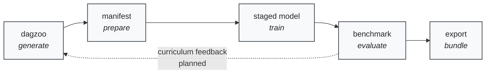
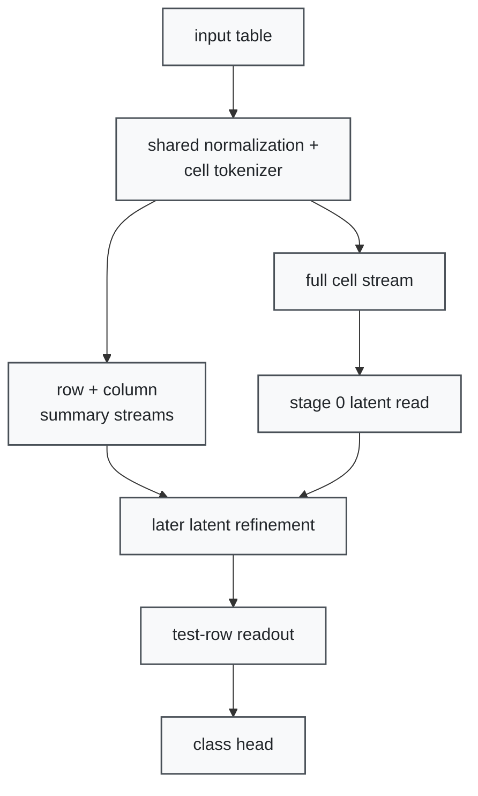

# tab-foundry

A tabular foundation model that generates the data it learns from.

[](https://github.com/bensonlee5/tab-foundry/blob/main/LICENSE)
[](https://www.python.org/downloads/)
[](https://bensonlee5.github.io/tab-foundry/)

Most tabular foundation models learn from a fixed corpus and stop. You get a
`.predict()` call and a benchmark number, but no control over the data the
model trained on, the architecture it uses, or the training loop that produced
it.

**tab-foundry** takes a different approach. It uses
[dagzoo](https://github.com/bensonlee5/dagzoo) to generate synthetic tabular
datasets, trains a modular staged model on them, benchmarks against real-world
tasks, and exports inference bundles you can deploy. You control the full
pipeline: what data gets generated, which architecture stages are active, how
training runs, and what gets exported.

## How It Works



1. **Generate** synthetic tabular datasets with dagzoo, or bring your own
   real-data manifests
1. **Train** a modular staged foundation model with swappable architecture
   components
1. **Benchmark** against pinned OpenML evaluation bundles with tracked
   baselines
1. **Export** inference bundles for downstream deployment
1. **(Planned)** Close the loop: the model tells dagzoo what harder data it
   needs next

## Quick Start

```bash
# Clone and bootstrap
git clone https://github.com/bensonlee5/tab-foundry.git
cd tab-foundry
./scripts/dev bootstrap

# Run a smoke training loop
tab-foundry train run experiment=cls_smoke

# Evaluate the checkpoint
tab-foundry eval checkpoint \
  --checkpoint outputs/cls_smoke/checkpoints/best.pt \
  experiment=cls_smoke
```

For full setup details, see [docs/getting-started.md](docs/getting-started.md).

Python `3.14` is the pinned runtime for this repo, and the standard local setup
assumes a repo-local `.venv`.

## Workflow Surfaces

`tab-foundry` is the canonical packaged CLI. Use `./scripts/dev` as the fast
repo-local path for bootstrap, verification, and Iris smoke; keep
`scripts/bench/` reserved for narrow internal benchmark helper workflows.

Manifest build, inspect, and read ownership lives upstream in
`tab-realdata-hub`. In this repo, the parquet manifest is treated as the
stable index layer and the richer per-dataset semantics live in
`metadata.ndjson`; `tab-foundry` consumes that contract and does not define a
parallel manifest parser.

| Surface | Use it for |
| --- | --- |
| `tab-foundry` | Canonical packaged CLI for data, training, evaluation, export, benchmark, and research workflows. |
| `./scripts/dev` | Fast repo-local bootstrap, doctor, review, verification, and Iris smoke flows. |
| `scripts/bench/` | Standalone internal benchmark helper entrypoints that stay outside the packaged CLI. |

Use `--help` in this order:

1. `tab-foundry --help`
1. `tab-foundry <group> --help`
1. `tab-foundry <group> <command> --help`

| Namespace | Purpose | Read next |
| --- | --- | --- |
| `data` | Corpus recipes, corpus materialization, and manifest inspection. | `docs/workflows.md` |
| `dev` | Fast inspection and verification surfaces for local development. | `docs/ml-engineering.md` |
| `train`, `eval`, `export` | Manifest-backed training, checkpoint evaluation, and inference-bundle workflows. | `docs/ml-engineering.md` |
| `bench` | Smoke harnesses, benchmark comparisons, and baseline-registry flows. | `docs/ml-engineering.md` |
| `research` | Sweep queues, inspection, execution, and sweep-aware corpus materialization. | `docs/research-contributors.md` |

For the canonical leaf-command inventory, use
`docs/development/codebase-navigation.md`.

## What Makes This Different

- **Full pipeline control.** Data generation, architecture selection, training,
  benchmarking, and export are all in one repo. You own the entire stack, not
  just the prediction API.

- **Synthetic data engine.** Dagzoo generates tabular datasets with controlled
  shape, complexity, and regime coverage. You decide what the model trains on
  rather than hoping a fixed corpus covers your use case.

- **Modular staged architecture.** The model is built from explicit stages: cell
  blocks, row pooling, column encoding, context encoding, and class heads. Swap
  any subsystem independently and measure the effect in isolation.

## What Works Today

- **Staged row-first architecture** inspired by TabICL v2, with a frozen
  nanoTabPFN control lane for trusted comparison
- **Dagzoo integration** for synthetic corpus generation, manifests, and
  materialization
- **OpenML benchmarking** against pinned binary and multiclass evaluation
  bundles with a tracked benchmark registry
- **Research sweep framework** for systematic architecture and data-surface
  experiments with full attribution
- **Export pipeline** for packaging inference bundles
- **Evidence-backed decisions** every architecture choice has a pinned
  benchmark, sweep result, and research card

## What We're Building

- **Active learning loop** where the model requests harder synthetic data from
  dagzoo based on its weaknesses
- **Pluggable data sources** with a unified interface for synthetic and real
  datasets
- **Curriculum control** so users can design training progressions instead of
  filtering data
- **Distributed training** across checkpoints contributed by different users
- **Perpetually evolving model** that improves as the community contributes
  compute and data

## Architecture at a Glance

The active development family (`tabfoundry_sandwich`) is a fixed-latent hybrid
full-cell / summary-stream Perceiver classifier:



A frozen nanoTabPFN control lane (`tabfoundry_simple`) preserves benchmark
comparability, and `tabfoundry_staged` remains loadable as the historical
reference family. For the full architecture reference, see
[docs/development/model-architecture.md](docs/development/model-architecture.md).

## Find Your Path

| If you want to... | Start here | Then go deeper |
| --- | --- | --- |
| Understand what this repo does | [What is tab-foundry?](docs/what-is-tab-foundry.md) | [Getting started](docs/getting-started.md) |
| Run research sweeps | [Research contributors](docs/research-contributors.md) | [Research program](program.md) |
| Work on artifacts or infra | [ML engineering](docs/ml-engineering.md) | [Inference & export](docs/inference.md) |

## Resources

- [Published docs site](https://bensonlee5.github.io/tab-foundry/) for the
  fastest route to workflows, architecture, and research context
- [Roadmap](docs/development/roadmap.md) for what's active, planned, and
  completed
- [Architecture reference](docs/development/model-architecture.md) for the full
  model surface
- [Workflows](docs/workflows.md) for exact command syntax and artifact
  expectations
- [Glossary](docs/glossary.md) for shared vocabulary

## License and Contributing

tab-foundry is released under the [Apache License 2.0](LICENSE).

Contributions are welcome. See [CONTRIBUTING.md](CONTRIBUTING.md) for the
development workflow, code standards, and how to run the test suite.
