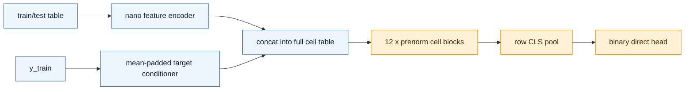
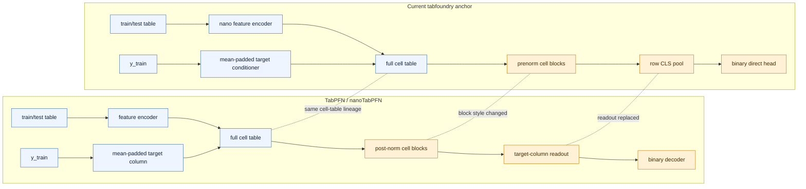
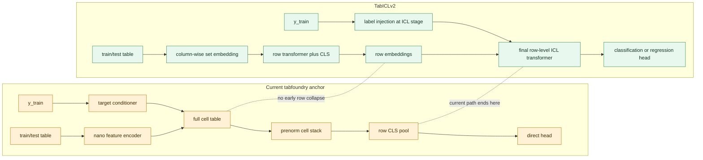
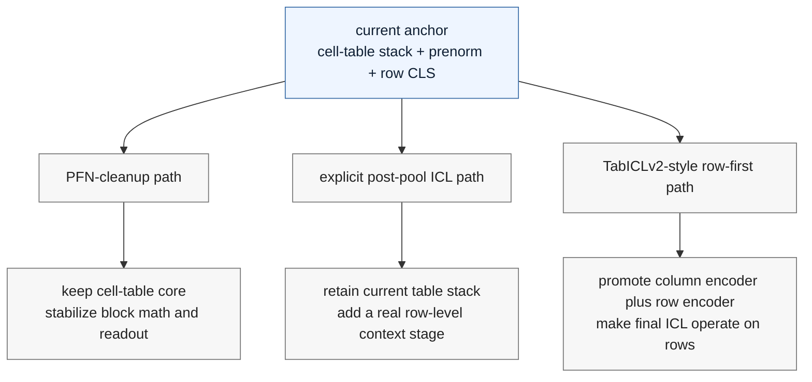

# Architecture Deltas

This document compares the current benchmark-facing `tab-foundry` anchor to two
external reference points:

- `nanoTabPFN` / TabPFN-style cell-table encoder
- TabICLv2's row-first architecture

The goal is not to restate every implementation detail. It is to make the
structural deltas visible enough that future anchor work can choose a direction
deliberately instead of living in a hybrid middle state.

## Scope

The "current anchor" here means the active large-CUDA benchmark-facing surface
under investigation in
`reference/system_delta_sweeps/cuda_stability_followup/queue.yaml` row `1`:

- `stage=nano_exact`
- `module_overrides.table_block_style=prenorm`
- `module_overrides.row_pool=row_cls`
- `d_icl=512`
- `tficl_n_layers=12`
- `head_hidden_dim=1024`

Code landing zones:

- frozen TabPFN-like anchor:
  `src/tab_foundry/model/architectures/tabfoundry_simple.py`
- current staged anchor wiring:
  `src/tab_foundry/model/architectures/tabfoundry_staged/forward_common.py`
- current staged block and pooling implementations:
  `src/tab_foundry/model/architectures/tabfoundry_staged/subsystems.py`
- staged recipe and override surface:
  `src/tab_foundry/model/architectures/tabfoundry_staged/recipes.py`
  and `src/tab_foundry/model/architectures/tabfoundry_staged/resolved.py`
- parked TabICL-flavored reusable components:
  `src/tab_foundry/model/components/blocks.py` and
  `src/tab_foundry/model/components/qass.py`

## Current Anchor At A Glance

The important point is that the current anchor still keeps the full cell table
alive through the main stack. It has changed the block math and the readout, but
it has not yet switched to a row-embedding-then-ICL architecture.

## Delta Vs TabPFN

Shared backbone traits:

- one feature value maps to one cell embedding on the exact path
- target values are conditioned into a target column before the main stack
- the main stack alternates feature-wise and row-wise interaction over the full
  cell table
- prediction still happens in one forward pass over train and test rows

Key structural deltas:

- TabPFN uses a post-norm cell block; the current anchor uses a prenorm cell
  block
- TabPFN reads predictions from the target column; the current anchor first
  collapses each row with `row_cls`
- TabPFN is architecturally monolithic; the current anchor lives inside a staged
  resolved surface with overrideable subsystems

### What This Means

Relative to TabPFN, the current anchor is still in the same architectural
family. The main design question is therefore not "should it become more like a
transformer for tables?" It already is. The real question is whether the anchor
should stay on the cell-table path and become a cleaner TabPFN-derived model, or
stop paying cell-table costs and move to a row-first design.

## Delta Vs TabICLv2

TabICLv2's defining move is to compress the table into row embeddings before the
final ICL stage. The current anchor does not do that.

Key structural deltas:

- TabICLv2 has an explicit column-wise embedding stage based on set-style /
  induced attention; the current anchor does not use that on the live path
- TabICLv2 has a distinct row-interaction stage before final ICL; the current
  anchor keeps one main cell-table stack instead
- TabICLv2 performs the last stage of in-context learning on row embeddings and
  uses QASS-family attention there; the current anchor's live path has no active
  context encoder
- TabICLv2 is designed for classification and regression; the current anchor is
  still a binary direct benchmark surface

### What This Means

Relative to TabICLv2, the current anchor is still missing the architectural move
that makes TabICLv2 scalable: "embed rows first, then do ICL on rows." The repo
does contain some ingredients for that direction in reusable components:

- `TFColEncoder` in `src/tab_foundry/model/components/blocks.py`
- `TFRowEncoder` in `src/tab_foundry/model/components/blocks.py`
- `QASSTransformerEncoder` in `src/tab_foundry/model/components/qass.py`

But those pieces are not yet the default live anchor path.

## Directional Read

The least coherent long-term state is to keep `row_cls` as a readout tweak while
still treating the full cell-table stack as the main architecture. That is a
hybrid worth benchmarking, but probably not a strong destination.
