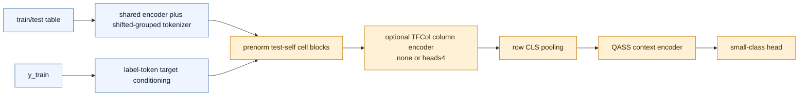
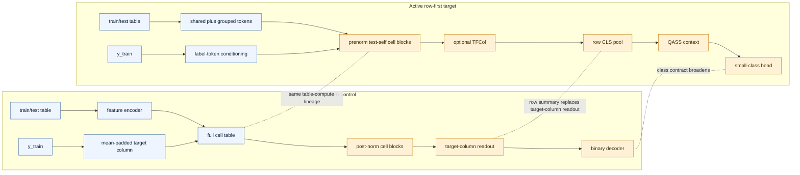
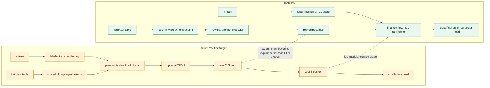
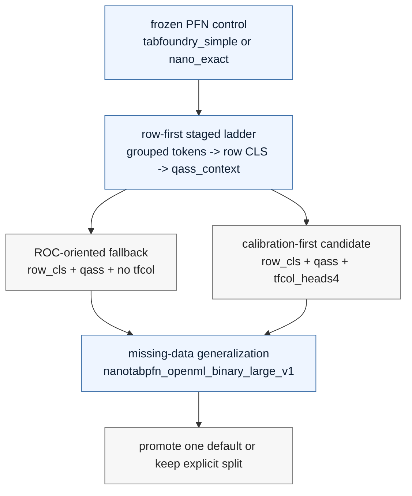

# Architecture Deltas

This document compares the active row-first promotion target in `tab-foundry`
to two external reference points:

- `nanoTabPFN` / TabPFN-style cell-table encoder as the frozen PFN control
  lineage
- TabICLv2's row-first architecture as the main external directional reference

The goal is not to restate every implementation detail. It is to make the
decision-relevant structural deltas visible enough that `TF-RD-008` can settle
one coherent row-first classification target without confusing historical
diagnostic sweeps for the current normative direction.

## Scope

Roadmap-first framing:

- `docs/development/roadmap.md` is the canonical planning source of truth.
- The normative architecture target is now the staged row-first line reached
  through `grouped_tokens -> row_cls_pool -> column_set -> qass_context`.
- The open `TF-RD-008` choice is not whether the repo should stay on the old
  large-CUDA diagnostic surface. It is whether the promoted default should be
  `row_cls + qass + no tfcol` or `row_cls + qass + tfcol_heads4`.
- The default remains unsettled until the missing-data generalization check on
  `src/tab_foundry/bench/nanotabpfn_openml_binary_large_v1.json` lands.
- Older sweep matrices, including the large-CUDA diagnostic surfaces, remain
  valid research evidence, but they are historical or diagnostic surfaces, not
  the architecture target described here.

Code landing zones:

- frozen PFN-style control:
  `src/tab_foundry/model/architectures/tabfoundry_simple.py`
- staged target wiring:
  `src/tab_foundry/model/architectures/tabfoundry_staged/forward_common.py`
- staged block, pooling, column, and context implementations:
  `src/tab_foundry/model/architectures/tabfoundry_staged/subsystems.py`
- staged recipe and override surface:
  `src/tab_foundry/model/architectures/tabfoundry_staged/recipes.py`
  and `src/tab_foundry/model/architectures/tabfoundry_staged/resolved.py`
- reusable TFCol and QASS components:
  `src/tab_foundry/model/components/blocks.py` and
  `src/tab_foundry/model/components/qass.py`

## Active Row-First Target At A Glance

This target is already beyond the old readout-only hybrid. The staged ladder has
accepted grouped tokens, row-CLS pooling, and QASS-backed row-level context as
the live promotion surface. The remaining default-choice question is whether the
column-set encoder stays off by default for ROC-oriented work or stays on in the
validated `tfcol_heads4` calibration-first line.

## Delta Vs TabPFN

Shared backbone traits:

- prediction still happens in one forward pass over train and test rows
- labels enter the model before the final prediction head
- table blocks still matter before the model collapses to a row-level summary
- the frozen PFN control lane remains available through `tabfoundry_simple` and
  `stage=nano_exact`

Key structural deltas:

- the active target uses the shared feature-encoding and normalization surface,
  not the exact nano-internal normalization path
- label-token target conditioning replaces the direct mean-padded target-column
  contract
- shifted grouped tokens replace scalar-per-feature tokenization
- row-CLS pooling replaces target-column readout
- QASS is active after row pooling
- column-set reasoning is modular and still the open default choice:
  `none` for the ROC-oriented fallback versus `tfcol_heads4` for the
  calibration-first candidate
- the staged target uses the small-class head rather than the frozen
  binary-only direct head

### What This Means

Relative to TabPFN, the repo is no longer deciding whether row-level reasoning
should enter the target line at all. That ladder step is already accepted. The
remaining `TF-RD-008` question is whether the promoted default keeps no TFCol as
the safer ROC-oriented path or keeps `tfcol_heads4` because its calibration win
survives the missing-data bundle.

## Delta Vs TabICLv2

TabICLv2 remains the main external reference for the row-first direction. The
active staged target is much closer to that direction than the older
large-CUDA diagnostic surfaces were, but it is still not a literal TabICLv2
copy.

Key structural deltas:

- the staged target still reaches row-level reasoning through a staged
  cell-table trunk instead of presenting one monolithic row-first stack from
  the start
- TFCol and QASS remain modular staged choices rather than mandatory features
  of every model family surface
- the open promotion question is specifically whether column-set modeling stays
  on the default row-first path
- the repo remains classification-first; many-class extends the same ladder and
  regression is still deferred

### What This Means

Relative to TabICLv2, the repo no longer needs to ask whether it should pursue a
row-first target in principle. It already has one. The real open question is
how much column-set machinery belongs on the promoted default line once
missing-data robustness is measured on the final pending bundle.

## Directional Read

The least coherent state now is not "keep benchmarking row-first ideas." That
work already happened. The least coherent state is to keep describing the older
large-CUDA diagnostic surface as the current anchor after the roadmap has
already moved the decision to the row-first `TF-RD-008` settlement.
