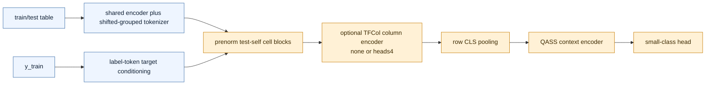
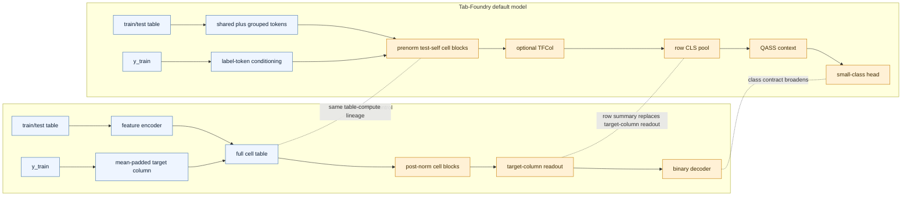
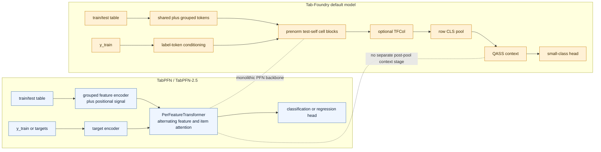
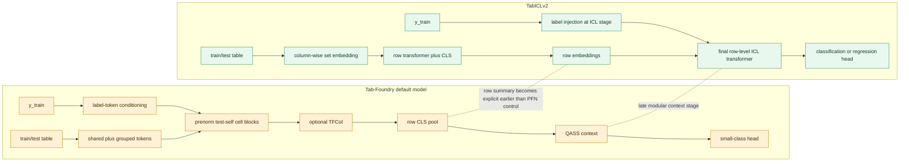
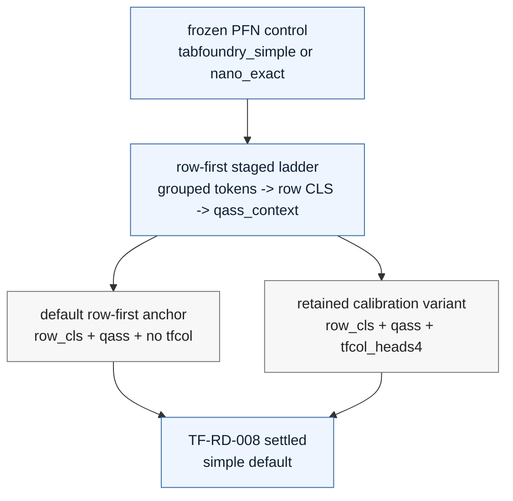

# Architecture Deltas

Use this comparison when you need to explain how the settled row-first
architecture differs from the frozen PFN control and the main external
reference lines in `tab-foundry`.

It compares the current target to four reference points:

- `nanoTabPFN` as the frozen PFN control lineage
- `nanotabicl` as the concrete minimal TabICLv2 implementation
- TabPFN / TabPFN-2.5 as the broader official PFN architecture lineage
- TabICLv2's paper/full-repo row-first architecture as the main external
  directional reference

The goal is to make the decision-relevant structural deltas visible without
blurring historical diagnostic sweeps into the current normative direction.

## Scope

Roadmap-first framing:

- `docs/development/roadmap.md` is the canonical planning source of truth.
- The normative architecture target is now the staged row-first line reached
  through `grouped_tokens -> row_cls_pool -> column_set -> qass_context`.
- TF-RD-008 is now closed with an explicit split:
  `row_cls + qass + no tfcol` is the default row-first anchor, while
  `row_cls + qass + tfcol_heads4` remains the retained calibration-oriented
  alternative.
- The decisive missing-permitting benchmark surface was
  `src/tab_foundry/bench/nanotabpfn_openml_binary_large_v1.json`, where the
  TFCol row improved final Brier and ROC AUC but missed the final log-loss
  promotion rule by a very small margin.
- Older sweep matrices, including the large-CUDA diagnostic surfaces, remain
  valid research evidence, but they are historical or diagnostic surfaces, not
  the architecture target described here.
- This doc intentionally separates `nanotabicl` from TabICLv2 itself:
  `nanotabicl` is the concrete minimal implementation comparison, while the
  TabICLv2 section is the broader row-first architecture-direction read.

Code landing zones:

- frozen PFN-style control:
  `src/tab_foundry/model/architectures/tabfoundry_simple.py`
- staged target wiring:
  `src/tab_foundry/model/architectures/tabfoundry_staged/forward_common.py`
- staged block, pooling, column, and context implementations:
  `src/tab_foundry/model/architectures/tabfoundry_staged/subsystems.py`
- staged recipe and override surface:
  `src/tab_foundry/model/architectures/tabfoundry_staged/recipes.py`
  and `src/tab_foundry/model/architectures/tabfoundry_staged/resolved.py`
- reusable TFCol and QASS components:
  `src/tab_foundry/model/components/blocks.py` and
  `src/tab_foundry/model/components/qass.py`

## Tab-Foundry Default Model At A Glance


```mermaid
flowchart LR
    x[train/test table] --> tok[shared encoder plus shifted-grouped tokenizer]
    y[y_train] --> tc[label-token target conditioning]
    tok --> blk[prenorm test-self cell blocks]
    tc --> blk
    blk --> col[optional TFCol column encoder<br/>none or heads4]
    col --> pool[row CLS pooling]
    pool --> ctx[QASS context encoder]
    ctx --> head[small-class head]

    classDef base fill:#eef5ff,stroke:#3b6ea8,color:#0f1f33;
    classDef delta fill:#fff1d6,stroke:#c67a00,color:#3d2a00;
    class blk,col,pool,ctx,head delta;
    class x,tok,y,tc base;
```

This target is already beyond the old readout-only hybrid. The staged ladder has
accepted grouped tokens, row-CLS pooling, and QASS-backed row-level context as
the live architecture surface. The settled default keeps the column-set encoder
off by default and treats the validated `tfcol_heads4` line as a retained
alternative rather than the canonical parent.

## Delta Vs NanoTabPFN

Shared backbone traits:

- prediction still happens in one forward pass over train and test rows
- labels enter the model before the final prediction head
- table blocks still matter before the model collapses to a row-level summary
- the frozen PFN control lane remains available through `tabfoundry_simple` and
  `stage=nano_exact`

Key structural deltas:

- the active target uses the shared feature-encoding and normalization surface,
  not the exact nano-internal normalization path
- label-token target conditioning replaces the direct mean-padded target-column
  contract
- shifted grouped tokens replace scalar-per-feature tokenization
- row-CLS pooling replaces target-column readout
- QASS is active after row pooling
- column-set reasoning is modular and no longer the default:
  `none` is the settled default, while `tfcol_heads4` is retained as the
  calibration-oriented alternative
- the staged target uses the small-class head rather than the frozen
  binary-only direct head


```mermaid
flowchart LR
    subgraph TP[nanoTabPFN control]
        tp_x[train/test table] --> tp_fe[feature encoder]
        tp_y[y_train] --> tp_tc[mean-padded target column]
        tp_fe --> tp_cat[full cell table]
        tp_tc --> tp_cat
        tp_cat --> tp_blk[post-norm cell blocks]
        tp_blk --> tp_read[target-column readout]
        tp_read --> tp_head[binary decoder]
    end

    subgraph TA[Tab-Foundry default model]
        ta_x[train/test table] --> ta_tok[shared plus grouped tokens]
        ta_y[y_train] --> ta_tc[label-token conditioning]
        ta_tok --> ta_blk[prenorm test-self cell blocks]
        ta_tc --> ta_blk
        ta_blk --> ta_col[optional TFCol]
        ta_col --> ta_pool[row CLS pool]
        ta_pool --> ta_ctx[QASS context]
        ta_ctx --> ta_head[small-class head]
    end

    tp_cat -. same table-compute lineage .- ta_blk
    tp_read -. row summary replaces target-column readout .- ta_pool
    tp_head -. class contract broadens .- ta_head

    classDef shared fill:#eef5ff,stroke:#3b6ea8,color:#0f1f33;
    classDef delta fill:#fff1d6,stroke:#c67a00,color:#3d2a00;
    class tp_x,tp_fe,tp_y,tp_tc,tp_cat,ta_x,ta_tok,ta_y,ta_tc shared;
    class tp_blk,tp_read,tp_head,ta_blk,ta_col,ta_pool,ta_ctx,ta_head delta;
```

### What This Means

Relative to `nanoTabPFN`, the repo is no longer deciding whether row-level
reasoning should enter the target line at all. That ladder step is already
accepted. The TF-RD-008 settlement now says the promoted default keeps no
TFCol as the canonical parent, while `tfcol_heads4` survives only as an
explicit calibration-oriented alternative.

## Delta Vs TabPFN / TabPFN-2.5

Reference points for this section:

- [Accurate predictions on small data with a tabular foundation model
  (TabPFN v2, Nature 2024)](https://www.nature.com/articles/s41586-024-08328-6)
- [TabPFN-2.5 official model card](https://huggingface.co/Prior-Labs/tabpfn_2_5)
- the official `TabPFN` implementation, especially
  `tabpfn.architectures.base.transformer.PerFeatureTransformer` and
  `tabpfn.architectures.base.config.ModelConfig`

This reference column intentionally blends the official paper/model-card
lineage with the public base implementation defaults. It is a structural
comparison line, not a claim that every released checkpoint shares one
identical config.

Key structural deltas:

- the official TabPFN line keeps a single PerFeatureTransformer-style PFN
  backbone with grouped feature tokens and explicit feature positional signals,
  whereas the staged target exposes tokenization, row pooling, and row-context
  encoding as separate subsystems
- official TabPFN / TabPFN-2.5 uses alternating feature/item attention inside
  one backbone rather than a separate row-CLS pool followed by a distinct
  context encoder
- TabPFN / TabPFN-2.5 spans both classification and regression checkpoint
  families, while the active staged target is classification-only today
- the repo's exact benchmark/control parity target remains `nanoTabPFN`; the
  TabPFN / TabPFN-2.5 comparison is about architecture lineage, not the locked
  benchmark control bundle


```mermaid
flowchart LR
    subgraph TP[TabPFN / TabPFN-2.5]
        tp_x[train/test table] --> tp_tok[grouped feature encoder<br/>plus positional signal]
        tp_y[y_train or targets] --> tp_tc[target encoder]
        tp_tok --> tp_pf[PerFeatureTransformer<br/>alternating feature and item attention]
        tp_tc --> tp_pf
        tp_pf --> tp_head[classification or regression head]
    end

    subgraph TA[Tab-Foundry default model]
        ta_x[train/test table] --> ta_tok[shared plus grouped tokens]
        ta_y[y_train] --> ta_tc[label-token conditioning]
        ta_tok --> ta_blk[prenorm test-self cell blocks]
        ta_tc --> ta_blk
        ta_blk --> ta_col[optional TFCol]
        ta_col --> ta_pool[row CLS pool]
        ta_pool --> ta_ctx[QASS context]
        ta_ctx --> ta_head[small-class head]
    end

    tp_pf -. monolithic PFN backbone .- ta_blk
    tp_pf -. no separate post-pool context stage .- ta_ctx

    classDef pfn fill:#eef5ff,stroke:#3b6ea8,color:#0f1f33;
    classDef anchor fill:#fff1d6,stroke:#c67a00,color:#3d2a00;
    class tp_x,tp_tok,tp_y,tp_tc,tp_pf,tp_head pfn;
    class ta_x,ta_tok,ta_y,ta_tc,ta_blk,ta_col,ta_pool,ta_ctx,ta_head anchor;
```

### What This Means

Relative to official TabPFN, the settled row-first target is not just "a
smaller PFN". It breaks the PFN stack into explicit cell-table, row-pooling,
and row-context modules so the repo can attribute deltas and promote a default
surface deliberately. That makes the clean benchmark-control comparison
`nanoTabPFN`, while the TabPFN / TabPFN-2.5 comparison is the broader
architecture-lineage read.

## Delta Vs NanoTabICL

Reference points for this section:

- [`nanotabicl` README](https://github.com/soda-inria/nanotabicl/blob/main/README.md)
- [`nanotabicl/model.py`](https://github.com/soda-inria/nanotabicl/blob/main/model.py)

This section is about the concrete defaults in the minimal `nanotabicl`
implementation, not the full TabICLv2 family surface.

Key structural deltas:

- `nanotabicl` hard-wires `TF_col -> TF_row + CLS -> TF_icl`, whereas the
  settled repo default keeps TFCol off and only retains it as the
  calibration-oriented `tfcol_heads4` alternative
- `nanotabicl` uses `embed_dim=128` for the column/row stages and reaches
  `icl_dim=512` only after flattening 4 CLS tokens, whereas the settled target
  keeps `d_icl=512` through the active staged surface
- `nanotabicl` injects `y` twice: `y_embed_in` before the column/row stages and
  `y_embed_icl` before the final ICL stage; the settled target instead uses
  label-token conditioning plus context-stage label injection
- `nanotabicl` uses RoPE in the row stage and QASSMax in the column and ICL
  stages, whereas the repo keeps `TFRowEncoder` and `QASSTransformerEncoder`
  as separate staged subsystems
- `nanotabicl` supports both classification and regression outputs, while the
  active staged target remains classification-only today


```mermaid
flowchart LR
    subgraph NI[nanotabicl]
        ni_x["train/test table"] --> ni_norm["train-only x standardization"]
        ni_norm --> ni_tok["grouped feature shifts<br/>size 3, shifts 0 1 3"]
        ni_y["y_train"] --> ni_yin["y_embed_in"]
        ni_tok --> ni_xemb["x_embed Linear(3,128)"]
        ni_xemb --> ni_inj["train-row label injection"]
        ni_yin --> ni_inj
        ni_inj --> ni_col["TF_col induced attention<br/>3 blocks, 128 inducing rows, QASSMax"]
        ni_col --> ni_row["TF_row plus 4 CLS columns<br/>3 blocks, RoPE"]
        ni_row --> ni_flat["row LN plus flatten CLS<br/>icl_dim 512"]
        ni_y --> ni_yicl["y_embed_icl"]
        ni_flat --> ni_ctx["train-row ICL label injection"]
        ni_yicl --> ni_ctx
        ni_ctx --> ni_icl["TF_icl self-attention<br/>12 blocks, QASSMax"]
        ni_icl --> ni_head["MLP head<br/>classification or regression"]
    end

    subgraph TA[Tab-Foundry default model]
        ta_x["train/test table"] --> ta_tok["shared plus grouped tokens"]
        ta_y["y_train"] --> ta_tc["label-token conditioning"]
        ta_tok --> ta_blk["prenorm test-self cell blocks"]
        ta_tc --> ta_blk
        ta_blk --> ta_col["optional TFCol<br/>default off"]
        ta_col --> ta_pool["row CLS pool"]
        ta_pool --> ta_ctx["QASS context"]
        ta_ctx --> ta_head["small-class head"]
    end

    ni_col -. mandatory TF_col .- ta_col
    ni_row -. row summary via flattened CLS .- ta_pool
    ni_icl -. monolithic row-level context stage .- ta_ctx

    classDef nano fill:#e9f8ef,stroke:#2d8a57,color:#123322;
    classDef anchor fill:#fff1d6,stroke:#c67a00,color:#3d2a00;
    class ni_x,ni_norm,ni_tok,ni_y,ni_yin,ni_xemb,ni_inj,ni_col,ni_row,ni_flat,ni_yicl,ni_ctx,ni_icl,ni_head nano;
    class ta_x,ta_tok,ta_y,ta_tc,ta_blk,ta_col,ta_pool,ta_ctx,ta_head anchor;
```

### What This Means

Relative to `nanotabicl`, the repo is already on the same broad row-first
trajectory, but it still chooses a lighter default. The key difference is not
whether row-level reasoning exists; it is that the settled target keeps
column-set reasoning optional and keeps the 512-wide staged surface intact
instead of hard-wiring the minimal `TF_col -> TF_row -> TF_icl` stack.

## Component-Level Dimension Deltas

| Dimension | nanoTabPFN / tabfoundry_simple | TabPFN / TabPFN-2.5 reference | Tab-Foundry Default Model | NanoTabICL Reference |
|---|---|---|---|---|
| Feature tokenization | 1 scalar per feature | grouped per-feature PFN tokens plus feature positional embeddings | 3 shifted-grouped channels | grouped feature windows size 3 with shifts `(0, 1, 3)` |
| Main embedding width | `d_icl=512` | public base config `emsize=192` | `d_icl=512` | `embed_dim=128`, `icl_dim=512` after flattening 4 CLS tokens |
| Core backbone | post-norm cell-table blocks | PerFeatureTransformer with alternating feature/item attention | prenorm cell-table blocks plus separate row-context stage | `TF_col -> TF_row + CLS -> TF_icl` |
| Core stack depth | 12 blocks | model-card lineage: 18-24 alternating layers | 12 cell blocks plus 12 context layers | 3 column blocks + 3 row blocks + 12 ICL blocks |
| Separate column encoder | none | none as a separate module; feature reasoning stays in the PFN backbone | optional TFCol, default off | mandatory induced TF_col with `n_cls_rows=128` |
| Separate row pool | target-column readout | none as a separate stage | row CLS (4 tokens, 3 layers) | 4 CLS row tokens flattened into `icl_dim=512` |
| Separate context encoder | none | none as a separate stage | QASS (12 layers) | mandatory TF_icl row-level context stage |
| Attention heads | 8 | public base config `nhead=6` | 8 | 8 / 8 / 8 defaults |
| FFN hidden | 1024 | `nhid_factor=4 * emsize` in the public base config | 1024 in the table/head path | 256 in embed blocks; 1024 in ICL/head path |
| Output scope | binary classification only | classification and regression checkpoint families | classification only today | classification or regression |
| Label injection | mean-padded linear | target encoder inside the PFN backbone | label token plus learned test token, then row-context label injection | `y_embed_in` before TF_col/TF_row plus `y_embed_icl` before TF_icl |
| Positional signal | none beyond table layout | explicit feature positional embeddings | parameter-free feature shifts `(0, 1, 3)` | grouped feature shifts plus RoPE in TF_row |
| Norm layout | post-norm LayerNorm | LayerNorm inside the PFN backbone | pre-norm LayerNorm or RMSNorm | pre-norm LayerNorm |

Rationale notes:

- **`d_icl=512` vs the official TabPFN public base config**: The repo kept
  the wider nano-compatible control dimension because the cell-table trunk
  still carries both row and feature interaction load before pooling.
- **Single-width staged surface vs `nanotabicl`'s split widths**: The repo
  keeps one `d_icl=512` trunk through the active target, while `nanotabicl`
  uses `embed_dim=128` in the column/row stages and only reaches 512 after
  flattening the 4 CLS row tokens.
- **Shifted-grouped vs feature positional embeddings**: Official TabPFN keeps
  grouped feature tokens plus explicit positional signals. The staged target
  instead uses parameter-free feature shifts and keeps TFCol as an optional
  branch.
- **Modular row-first split vs `nanotabicl`'s mandatory stack**:
  `nanotabicl` hard-wires column, row, and ICL stages into one row-first
  pipeline. The staged target instead keeps row pooling and row-context
  encoding explicit, with TFCol remaining optional so the repo can attribute
  and promote deltas cleanly.
- **`nanotabicl` defaults vs broader TabICLv2 direction**: `nanotabicl` is a
  concise implementation of the TabICLv2 line, but it is not the whole
  reference surface. The TabICLv2 section below is intentionally about the
  paper/full-repo direction rather than one exact minimal-config snapshot.

See `docs/development/model-architecture.md` (Component Details, Default Build
Fields, and Settled Default Resolved Surface) for the full per-component shape
and resolved-runtime reference.

## Stage Delta Walkthrough

Each stage transition changes one or two subsystems relative to its
predecessor. The full component matrix is in
`docs/development/model-architecture.md` (Stage Ladder Component Matrix).

1. **nano_exact → label_token**: Target conditioner mean_padded_linear →
   label_token. Adds `Embedding(2, 512)` + learned test token. All other
   subsystems unchanged.
1. **label_token → shared_norm**: Feature encoder nano → shared. Norm mode
   internal → shared. `NanoFeatureEncoder(Linear(1,512))` replaced by
   `SharedLinearFeatureEncoder(Linear(1,512,bias=False))`.
1. **shared_norm → prenorm_block**: Table block nano_postnorm → prenorm.
   Norms move pre-attention. Explicit residual connections replace
   post-norm residual pattern.
1. **prenorm_block → small_class_head**: Head binary_direct → small_class.
   Output width 2 → many_class_base (10).
1. **small_class_head → test_self**: Row attention mask diagonal unmasked
   for test rows (`allow_test_self_attention=True`).
1. **test_self → grouped_tokens**: Tokenizer scalar_per_feature →
   shifted_grouped. Token dim 1 → 3; feature encoder input changes from
   `Linear(1, 512, bias=False)` to `Linear(3, 512, bias=False)`.
1. **grouped_tokens → row_cls_pool**: Row pool target_column → row_cls.
   Context encoder none → plain. Adds `TFRowEncoder` (4 CLS tokens,
   3 layers) + `SequenceContextEncoder` (use_qass=False) + context label
   `Embedding(many_class_base, d_icl)`.
1. **row_cls_pool → column_set**: Column encoder none → tfcol. Adds
   `TFColEncoder` (3 ISAB blocks, 128 inducing points, 8 heads).
1. **column_set → qass_context**: Context encoder plain → qass. Enables
   `QASSScaler` in the existing `SequenceContextEncoder`.
1. **qass_context → many_class**: Head small_class → many_class. Adds
   digit position embeddings `Embedding(max_mixed_radix_digits, d_icl)`.
   For `num_classes <= many_class_base`, the stage still returns direct-head
   logits. Once `num_classes > many_class_base`, the forward path switches to
   hierarchical tree traversal via `_forward_many_class`.

Source: `recipes.py:58-257`

## Delta Vs TabICLv2

TabICLv2 remains the main external reference for the row-first direction at the
paper/full-repo level. Unlike the `nanotabicl` section above, this section is
not trying to pin one exact code configuration. It describes the broader
row-first architecture direction that informs the staged target.

Key structural deltas:

- the staged target still reaches row-level reasoning through a staged
  cell-table trunk instead of presenting one monolithic row-first stack from
  the start
- the staged target decomposes the row-first flow into explicit tokenization,
  row pooling, and row-context subsystems so each step can be ablated and
  promoted independently
- TFCol and QASS remain modular staged choices rather than mandatory features
  of every model family surface
- column-set modeling is retained as an optional branch, not the default
  row-first path
- the repo remains classification-first; many-class extends the same ladder and
  regression is still deferred


```mermaid
flowchart LR
    subgraph TA[Tab-Foundry default model]
        ta_x[train/test table] --> ta_tok[shared plus grouped tokens]
        ta_y[y_train] --> ta_tc[label-token conditioning]
        ta_tok --> ta_blk[prenorm test-self cell blocks]
        ta_tc --> ta_blk
        ta_blk --> ta_col[optional TFCol]
        ta_col --> ta_pool[row CLS pool]
        ta_pool --> ta_ctx[QASS context]
        ta_ctx --> ta_head[small-class head]
    end

    subgraph TI[TabICLv2]
        ti_x[train/test table] --> ti_col[column-wise set embedding]
        ti_col --> ti_row[row transformer plus CLS]
        ti_row --> ti_rows[row embeddings]
        ti_y[y_train] --> ti_ctx[label injection at ICL stage]
        ti_rows --> ti_icl[final row-level ICL transformer]
        ti_ctx --> ti_icl
        ti_icl --> ti_head[classification or regression head]
    end

    ta_pool -. row summary becomes explicit earlier than PFN control .- ti_rows
    ta_ctx -. late modular context stage .- ti_icl

    classDef anchor fill:#fff1d6,stroke:#c67a00,color:#3d2a00;
    classDef tabicl fill:#e9f8ef,stroke:#2d8a57,color:#123322;
    class ta_x,ta_tok,ta_y,ta_tc,ta_blk,ta_col,ta_pool,ta_ctx,ta_head anchor;
    class ti_x,ti_col,ti_row,ti_rows,ti_y,ti_ctx,ti_icl,ti_head tabicl;
```

### What This Means

Relative to TabICLv2, the repo no longer needs to ask whether it should pursue a
row-first target in principle. It already has one. The relevant read now is
that the repo kept the simpler no-TFCol default after the missing-permitting
bundle produced a mixed result, instead of forcing the heavier TFCol branch into
the default path.

## Directional Read


```mermaid
flowchart TD
    ctrl[frozen PFN control<br/>tabfoundry_simple or nano_exact] --> ladder[row-first staged ladder<br/>grouped tokens -> row CLS -> qass_context]
    ladder --> def[default row-first anchor<br/>row_cls + qass + no tfcol]
    ladder --> cal[retained calibration variant<br/>row_cls + qass + tfcol_heads4]
    def --> settle[TF-RD-008 settled<br/>simple default]
    cal --> settle

    classDef neutral fill:#eef5ff,stroke:#3b6ea8,color:#0f1f33;
    classDef branch fill:#f7f7f7,stroke:#777,color:#222;
    class ctrl,ladder,settle neutral;
    class def,cal branch;
```

The least coherent state now is not "keep benchmarking row-first ideas." That
work already happened. The least coherent state would be to keep describing the
older large-CUDA diagnostic surface as the current anchor, or to keep treating
the TFCol branch as the implicit default after the roadmap already settled on
the simpler no-TFCol row-first line.

## System Delta Catalog Integration

The deltas described above correspond to entries in
`reference/system_delta_catalog.yaml`. Each catalog entry is an atomic,
testable change that maps to one or more `module_overrides` on the resolved
staged surface.

A catalog delta entry specifies:

- **description**: what the delta changes
- **expected_effect**: hypothesized metric impact
- **adequacy_knobs**: conditions that must hold for the delta to be
  evaluated fairly
- **applicability_guards**: prerequisites (e.g. binary-only)
- **default_effective_surface**: the concrete surface used to test the
  delta, including `model.module_overrides`

The `default_effective_surface.model.module_overrides` field maps directly
to the 12 `SUPPORTED_MODULE_OVERRIDE_KEYS` in `resolved.py`:

```
feature_encoder, post_encoder_norm, post_stack_norm,
target_conditioner, tokenizer, column_encoder, row_pool,
context_encoder, head, table_block_style,
table_block_residual_scale, allow_test_self_attention
```

For example, `delta_shared_feature_norm` applies:

```yaml
default_effective_surface:
  model:
    stage_label: delta_shared_feature_norm
    module_overrides:
      feature_encoder: shared
```

This tells the sweep execution flow to start from the base stage, override
`feature_encoder` to `shared`, and label the resulting run
`delta_shared_feature_norm` for tracking.

Delta sweeps execute as queue rows in `reference/system_delta_sweeps/`.
Each sweep directory contains a `queue.yaml` (one row per delta
configuration), a `sweep.yaml` (execution parameters), and a `matrix.md`
(result interpretation). Tracked metrics flow back into the catalog to
update delta status and inform the next stage of the research ladder.
