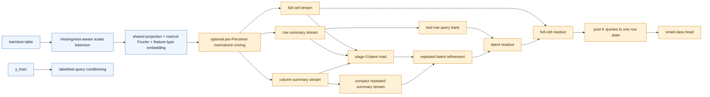
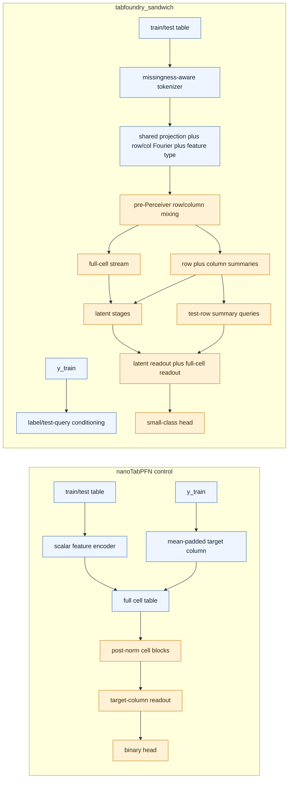
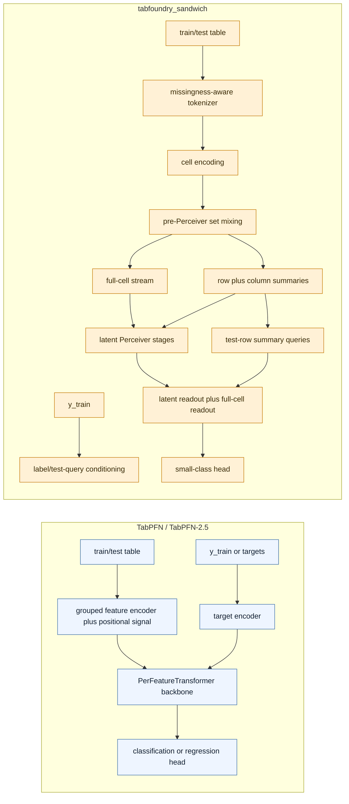
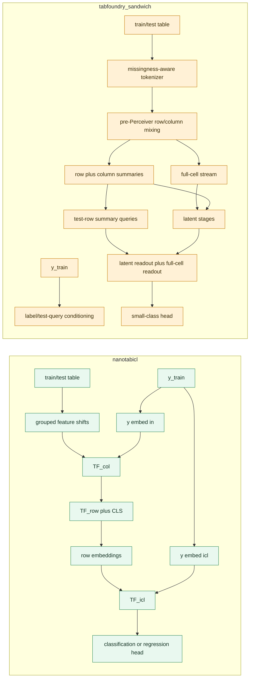
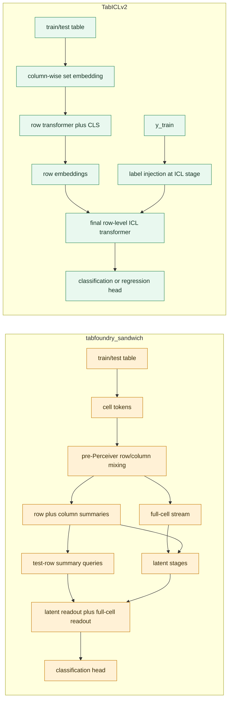
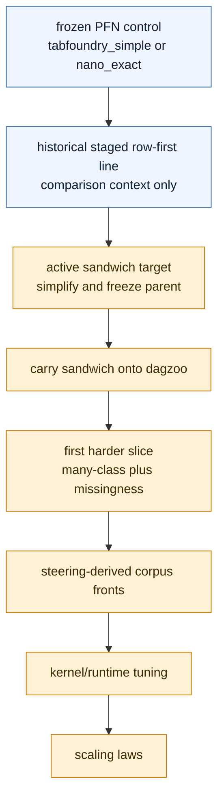

# Architecture Deltas

Use this comparison when you need to explain how the current sandwich target
differs from the frozen PFN control and the main external reference lines.

This doc now compares one active target:

- `tabfoundry_sandwich`

against four reference points:

- `nanoTabPFN` / `tabfoundry_simple` as the frozen PFN control lineage
- TabPFN / TabPFN-2.5 as the broader PFN architecture lineage
- `nanotabicl` as the concrete minimal TabICLv2 implementation
- TabICLv2 as the broader row-first directional reference

The goal is to make the decision-relevant sandwich deltas visible without
re-centering the older staged migration ladder.

## Scope

Roadmap-first framing:

- `docs/development/roadmap.md` is the canonical planning source of truth.
- The normative architecture target is now `tabfoundry_sandwich`.
- Older staged work is still useful historical evidence, but it is no longer
  the default target described here.
- The current sandwich target is still small-class classification only; later
  many-class, missingness, steering, runtime, and scaling work should extend
  this family rather than reopen the staged line.

Code landing zones:

- sandwich model:
  `src/tab_foundry/model/architectures/tabfoundry_sandwich/model.py`
- model spec and defaults:
  `src/tab_foundry/model/spec.py`
- feature/token primitives:
  `src/tab_foundry/model/components/tabular_primitives.py`
- normalization and attention helpers:
  `src/tab_foundry/model/components/normalization.py` and
  `src/tab_foundry/model/components/attention.py`
- frozen PFN-style control:
  `src/tab_foundry/model/architectures/tabfoundry_simple.py`

## Tab-Foundry Sandwich At A Glance

```mermaid
flowchart LR
    x[train/test table] --> tok[missingness-aware scalar tokenizer]
    tok --> enc[shared projection + row/col Fourier + feature-type embedding]
    y[y_train] --> cond[label/test-query conditioning]
    enc --> mix[optional pre-Perceiver row/column mixing]
    mix --> full[full-cell stream]
    mix --> rows[row summary stream]
    mix --> cols[column summary stream]
    full --> p0[stage 0 latent read]
    rows --> p0
    cols --> p0
    rows --> testq[test-row query bank]
    cols --> summary[compact repeated summary stream]
    p0 --> lat[repeated latent refinement]
    summary --> lat
    testq --> lread[latent readout]
    lat --> lread
    full --> cread[full-cell readout]
    lread --> cread
    cread --> pool[pool K queries to one row state]
    pool --> head[small-class head]

    classDef base fill:#eef5ff,stroke:#3b6ea8,color:#0f1f33;
    classDef delta fill:#fff1d6,stroke:#c67a00,color:#3d2a00;
    class x,tok,enc,y,cond base;
    class mix,full,rows,cols,p0,summary,lat,testq,lread,cread,pool,head delta;
```

The distinctive choices are:

- missingness-aware cell tokens instead of scalar-only inputs
- explicit row and column summary streams
- a fixed learned latent bank
- stage `0` reads from full cells plus summaries, later stages read summaries
  only
- test-row readout uses both latent memory and a full-cell bypass

## Delta Vs NanoTabPFN

Shared backbone traits:

- prediction still happens in one forward pass over train and test rows
- labels enter the model before the final prediction head
- the repo still keeps a frozen PFN-style control lane for trust

Key structural deltas:

- sandwich uses a missingness-aware tokenizer plus shared linear projection,
  not nanoTabPFN's scalar-only feature encoder
- sandwich adds explicit row Fourier positions, column Fourier positions, and
  feature-type embeddings to every cell token
- sandwich uses explicit pre-Perceiver row and column mixers before the latent
  stack
- sandwich replaces target-column readout with learned row and column summary
  streams plus a latent memory
- sandwich readout is two-step:
  test-row queries read final latents and then read the full-cell stream
- sandwich is small-class rather than binary-only, but it is not yet general
  many-class

```mermaid
flowchart LR
    subgraph TP[nanoTabPFN control]
        tp_x[train/test table] --> tp_fe[scalar feature encoder]
        tp_y[y_train] --> tp_tc[mean-padded target column]
        tp_fe --> tp_cat[full cell table]
        tp_tc --> tp_cat
        tp_cat --> tp_blk[post-norm cell blocks]
        tp_blk --> tp_read[target-column readout]
        tp_read --> tp_head[binary head]
    end

    subgraph TS[tabfoundry_sandwich]
        ts_x[train/test table] --> ts_tok[missingness-aware tokenizer]
        ts_tok --> ts_enc[shared projection plus row/col Fourier plus feature type]
        ts_y[y_train] --> ts_cond[label/test-query conditioning]
        ts_enc --> ts_mix[pre-Perceiver row/column mixing]
        ts_mix --> ts_full[full-cell stream]
        ts_mix --> ts_sum[row plus column summaries]
        ts_full --> ts_lat[latent stages]
        ts_sum --> ts_lat
        ts_sum --> ts_q[test-row summary queries]
        ts_q --> ts_read[latent readout plus full-cell readout]
        ts_lat --> ts_read
        ts_read --> ts_head[small-class head]
    end

    classDef shared fill:#eef5ff,stroke:#3b6ea8,color:#0f1f33;
    classDef delta fill:#fff1d6,stroke:#c67a00,color:#3d2a00;
    class tp_x,tp_fe,tp_y,tp_tc,tp_cat,ts_x,ts_tok,ts_enc,ts_y,ts_cond shared;
    class tp_blk,tp_read,tp_head,ts_mix,ts_full,ts_sum,ts_lat,ts_q,ts_read,ts_head delta;
```

### What This Means

Relative to `nanoTabPFN`, the sandwich family is no longer just modifying the
readout or swapping one block style. It changes the token contract, adds
explicit set-style summaries, introduces a fixed latent memory, and uses a
readout path that can look both through the latent bottleneck and back at the
raw cell stream.

## Delta Vs TabPFN / TabPFN-2.5

Reference points for this section:

- [Accurate predictions on small data with a tabular foundation model
  (TabPFN v2, Nature 2024)](https://www.nature.com/articles/s41586-024-08328-6)
- [TabPFN-2.5 official model card](https://huggingface.co/Prior-Labs/tabpfn_2_5)

Key structural deltas:

- official TabPFN keeps one monolithic PFN-style backbone, while sandwich
  separates:
  - cell encoding
  - pre-Perceiver set mixing
  - latent memory
  - summary construction
  - readout
- sandwich exposes row summaries and column summaries as explicit learned
  bottlenecks rather than relying only on alternating attention inside one
  backbone
- sandwich uses a small learned latent bank as a first-class architectural
  object
- sandwich remains classification-only and small-class today, while the broader
  TabPFN line spans broader task families

```mermaid
flowchart LR
    subgraph TP[TabPFN / TabPFN-2.5]
        tp_x[train/test table] --> tp_tok[grouped feature encoder plus positional signal]
        tp_y[y_train or targets] --> tp_tc[target encoder]
        tp_tok --> tp_pf[PerFeatureTransformer backbone]
        tp_tc --> tp_pf
        tp_pf --> tp_head[classification or regression head]
    end

    subgraph TS[tabfoundry_sandwich]
        ts_x[train/test table] --> ts_tok[missingness-aware tokenizer]
        ts_y[y_train] --> ts_tc[label/test-query conditioning]
        ts_tok --> ts_enc[cell encoding]
        ts_enc --> ts_mix[pre-Perceiver set mixing]
        ts_mix --> ts_full[full-cell stream]
        ts_mix --> ts_sum[row plus column summaries]
        ts_full --> ts_lat[latent Perceiver stages]
        ts_sum --> ts_lat
        ts_sum --> ts_q[test-row summary queries]
        ts_q --> ts_read[latent readout plus full-cell readout]
        ts_lat --> ts_read
        ts_read --> ts_head[small-class head]
    end

    classDef pfn fill:#eef5ff,stroke:#3b6ea8,color:#0f1f33;
    classDef sand fill:#fff1d6,stroke:#c67a00,color:#3d2a00;
    class tp_x,tp_tok,tp_y,tp_tc,tp_pf,tp_head pfn;
    class ts_x,ts_tok,ts_y,ts_tc,ts_enc,ts_mix,ts_full,ts_sum,ts_lat,ts_q,ts_read,ts_head sand;
```

### What This Means

Relative to official TabPFN, the sandwich target is not a lighter PFN clone.
It keeps the train/test-in-one-forward-pass idea, but restructures the model
around explicit summaries plus a latent memory so the repo can scale and ablate
those choices directly.

## Delta Vs NanoTabICL

Reference points for this section:

- [`nanotabicl` README](https://github.com/soda-inria/nanotabicl/blob/main/README.md)
- [`nanotabicl/model.py`](https://github.com/soda-inria/nanotabicl/blob/main/model.py)

Key structural deltas:

- `nanotabicl` hard-wires `TF_col -> TF_row -> TF_icl`, while sandwich builds a
  hybrid:
  - pre-Perceiver row/column mixing
  - row and column summaries
  - fixed latent stages
  - two-step test-row readout
- `nanotabicl` uses grouped feature shifts of size `3`; sandwich instead uses a
  missingness-aware scalar tokenizer and adds row/column Fourier positions
  after projection
- `nanotabicl` injects labels before the column/row stack and again before the
  final ICL stage; sandwich conditions both the full-cell stream and row-summary
  stream with label/test-query embeddings plus train/test role embeddings
- `nanotabicl` supports regression; sandwich does not yet

```mermaid
flowchart LR
    subgraph NI[nanotabicl]
        ni_x[train/test table] --> ni_tok[grouped feature shifts]
        ni_y[y_train] --> ni_yin[y embed in]
        ni_tok --> ni_col[TF_col]
        ni_yin --> ni_col
        ni_col --> ni_row[TF_row plus CLS]
        ni_row --> ni_rows[row embeddings]
        ni_y --> ni_yicl[y embed icl]
        ni_rows --> ni_icl[TF_icl]
        ni_yicl --> ni_icl
        ni_icl --> ni_head[classification or regression head]
    end

    subgraph TS[tabfoundry_sandwich]
        ts_x[train/test table] --> ts_tok[missingness-aware tokenizer]
        ts_y[y_train] --> ts_cond[label/test-query conditioning]
        ts_tok --> ts_mix[pre-Perceiver row/column mixing]
        ts_mix --> ts_sum[row plus column summaries]
        ts_mix --> ts_full[full-cell stream]
        ts_full --> ts_lat[latent stages]
        ts_sum --> ts_lat
        ts_sum --> ts_q[test-row summary queries]
        ts_q --> ts_read[latent readout plus full-cell readout]
        ts_lat --> ts_read
        ts_read --> ts_head[small-class head]
    end

    classDef nano fill:#e9f8ef,stroke:#2d8a57,color:#123322;
    classDef sand fill:#fff1d6,stroke:#c67a00,color:#3d2a00;
    class ni_x,ni_tok,ni_y,ni_yin,ni_col,ni_row,ni_rows,ni_yicl,ni_icl,ni_head nano;
    class ts_x,ts_tok,ts_y,ts_cond,ts_mix,ts_sum,ts_full,ts_lat,ts_q,ts_read,ts_head sand;
```

### What This Means

Relative to `nanotabicl`, the sandwich target is less a direct row-first stack
and more a hybrid set-summary-plus-latent-memory model. The similarity is that
both move away from the pure PFN cell-table control; the difference is where
the bottleneck and readout live.

## Delta Vs TabICLv2

TabICLv2 remains the main external directional reference for row-first
tabular modeling at the paper/full-repo level.

Key structural deltas:

- sandwich still reasons over full cells directly instead of moving entirely to
  row embeddings before the main contextual stage
- sandwich keeps column reasoning as an optional pre-Perceiver mixer plus an
  explicit column-summary stream rather than a mandatory first-class backbone
  stage
- sandwich's latent memory is explicit and fixed-width, which makes the summary
  bottleneck part of the intended design rather than an incidental byproduct
- the repo remains classification-first for this family

```mermaid
flowchart LR
    subgraph TS[tabfoundry_sandwich]
        ts_x[train/test table] --> ts_cells[cell tokens]
        ts_cells --> ts_mix[pre-Perceiver row/column mixing]
        ts_mix --> ts_sum[row plus column summaries]
        ts_mix --> ts_full[full-cell stream]
        ts_full --> ts_lat[latent stages]
        ts_sum --> ts_lat
        ts_sum --> ts_q[test-row summary queries]
        ts_q --> ts_read[latent readout plus full-cell readout]
        ts_lat --> ts_read
        ts_read --> ts_head[classification head]
    end

    subgraph TI[TabICLv2]
        ti_x[train/test table] --> ti_col[column-wise set embedding]
        ti_col --> ti_row[row transformer plus CLS]
        ti_row --> ti_rows[row embeddings]
        ti_y[y_train] --> ti_ctx[label injection at ICL stage]
        ti_rows --> ti_icl[final row-level ICL transformer]
        ti_ctx --> ti_icl
        ti_icl --> ti_head[classification or regression head]
    end

    classDef sand fill:#fff1d6,stroke:#c67a00,color:#3d2a00;
    classDef tabicl fill:#e9f8ef,stroke:#2d8a57,color:#123322;
    class ts_x,ts_cells,ts_mix,ts_sum,ts_full,ts_lat,ts_q,ts_read,ts_head sand;
    class ti_x,ti_col,ti_row,ti_rows,ti_y,ti_ctx,ti_icl,ti_head tabicl;
```

### What This Means

Relative to TabICLv2, the repo is still pursuing row-first and set-structured
reasoning, but the sandwich target gets there through a different decomposition:
explicit summaries and a latent bottleneck rather than a single monolithic
row-first stack.

## Component-Level Dimension Deltas

| Dimension | nanoTabPFN / `tabfoundry_simple` | TabPFN / TabPFN-2.5 reference | `tabfoundry_sandwich` | `nanotabicl` reference |
| --- | --- | --- | --- | --- |
| Feature tokenization | 1 scalar per feature | grouped per-feature PFN tokens plus positional signals | 4 missingness-aware scalar channels, then row/col Fourier plus feature-type embedding | grouped feature windows of size 3 |
| Main embedding width | `d_icl=512` | public base config around `emsize=192` | `d_icl=60` default | `embed_dim=128`, later `icl_dim=512` |
| Backbone core | post-norm cell-table blocks | monolithic PFN backbone | pre-Perceiver axial mixing plus latent Perceiver stages | `TF_col -> TF_row -> TF_icl` |
| Separate latent memory | none | none as a separate module | `24` learned latent slots by default | none as a separate latent bank |
| Separate summary bottleneck | target column only | implicit inside backbone | `K=4` learned row summaries per row and column summaries per column by default | CLS row tokens plus row-level context |
| Column reasoning | inside cell-table backbone | inside PFN backbone | optional pre-column ISAB mixer plus column-summary stream | mandatory TF_col |
| Readout | target-column readout | backbone state to head | test-row summary queries -> latent readout -> full-cell readout -> pooled row state | row embeddings into TF_icl then head |
| Label injection | mean-padded linear | target encoder inside backbone | label/test-query conditioning on full-cell and row-summary streams | `y_embed_in` and `y_embed_icl` |
| Attention heads | `8` | public base config `6` | `4` default | `8` defaults |
| FFN expansion | about `2x` at `d_icl=512` | broader PFN config-dependent | `2x` across sandwich blocks | mixed by stage |
| Output scope | binary classification only | classification and regression families | small-class classification only | classification or regression |
| Norm layout | post-norm LayerNorm | LayerNorm in one backbone | pre-norm LayerNorm only | pre-norm LayerNorm |

## Directional Read

```mermaid
flowchart TD
    ctrl[frozen PFN control<br/>tabfoundry_simple or nano_exact] --> hist[historical staged row-first line<br/>comparison context only]
    hist --> sand[active sandwich target<br/>simplify and freeze parent]
    sand --> dag[carry sandwich onto dagzoo]
    dag --> hard[first harder slice<br/>many-class plus missingness]
    hard --> steer[steering-derived corpus fronts]
    steer --> rt[kernel/runtime tuning]
    rt --> scale[scaling laws]

    classDef neutral fill:#eef5ff,stroke:#3b6ea8,color:#0f1f33;
    classDef active fill:#fff1d6,stroke:#c67a00,color:#3d2a00;
    class ctrl,hist neutral;
    class sand,dag,hard,steer,rt,scale active;
```

The important shift is that the repo is no longer choosing between multiple
row-first defaults. The active question is how to simplify, harden, and scale
the sandwich family while keeping the PFN control and the older staged line as
comparison context only.
