# Model Architecture

This document describes the current `tabfoundry` transformer family as it is
implemented in the repo today. It is an implementation reference for
maintainers, not a paper summary.

Related docs:

- `docs/development/model-config.md`

Related code paths:

- `src/tab_foundry/model/architectures/tabfoundry.py`
- `src/tab_foundry/model/components/blocks.py`
- `src/tab_foundry/model/components/qass.py`
- `src/tab_foundry/model/components/many_class.py`
- `src/tab_foundry/model/spec.py`
- `configs/model/default.yaml`

## High-Level Structure

The family is built from one shared backbone and two task heads:

- `TabFoundryClassifier`
- `TabFoundryRegressor`
- `_TabFoundryBackbone`

The backbone is a three-stage transformer stack:

1. Group raw features into typed feature-group tokens and project them into
   `d_col`.
1. Run a column-wise set encoder over rows.
1. Aggregate per-row feature tokens, then run a final in-context transformer
   over rows.

```mermaid
%%{init: {
  "theme": "base",
  "themeVariables": {
    "fontFamily": "IBM Plex Sans, sans-serif",
    "lineColor": "#5B6870",
    "primaryTextColor": "#1F2933",
    "clusterBkg": "#FAF7F1",
    "clusterBorder": "#C8B79B"
  },
  "flowchart": {
    "curve": "basis",
    "nodeSpacing": 28,
    "rankSpacing": 44
  }
}}%%
flowchart LR
    subgraph Inputs["Inputs"]
        batch["TaskBatch<br/>x_train, y_train,<br/>x_test, y_test"]
        targets["Train targets"]
    end

    subgraph Backbone["Shared Backbone"]
        norm["Normalize train/test features"]
        group["Feature grouping<br/>shifts [0, 1, 3]"]
        proj["group_linear<br/>e1 tokens"]
        col["Column encoder<br/>TFColEncoder / ISAB"]
        row["Row encoder<br/>TFRowEncoder + CLS"]
        icl["ICL encoder<br/>QASSTransformerEncoder"]
        slice["Test-row slice"]
    end

    subgraph Conditioning["Target Conditioning"]
        tae["embed_tae<br/>column-stage"]
        icl_embed["embed_icl<br/>ICL-stage"]
    end

    subgraph Heads["Task Heads"]
        cls["Classification head"]
        reg["Regression quantile head"]
    end

    batch --> norm --> group --> proj --> col --> row --> icl --> slice
    slice --> cls
    slice --> reg

    targets --> tae
    targets --> icl_embed
    tae -. add to train rows .-> col
    icl_embed -. add to train rows .-> icl

    classDef input fill:#F7F1E4,stroke:#A8834A,color:#2E2415,stroke-width:1.5px;
    classDef stage fill:#EAF1F7,stroke:#5B7FA3,color:#162536,stroke-width:1.5px;
    classDef conditioning fill:#EDF6EE,stroke:#5F8B6B,color:#183220,stroke-width:1.5px;
    classDef bridge fill:#F1EFFA,stroke:#746AA7,color:#27213D,stroke-width:1.5px;
    classDef head fill:#F8ECE8,stroke:#B06B5C,color:#391D17,stroke-width:1.5px;

    class batch,targets input;
    class norm,group,proj,col,row,icl stage;
    class tae,icl_embed conditioning;
    class slice bridge;
    class cls,reg head;
```

## Forward Pass And Tensor Shapes

Symbols used below:

- `N_train`: number of train rows in the task batch
- `N_test`: number of test rows
- `N = N_train + N_test`
- `M`: original feature count
- `G = ceil(M / feature_group_size)`: grouped token count

Default dimensions from `configs/model/default.yaml`:

- `d_col = 128`
- `d_icl = 512`
- `feature_group_size = 1`
- `tfcol_n_layers = 3`
- `tfrow_n_layers = 3`
- `tficl_n_layers = 12`

| Stage | Input shape | Output shape | Notes |
| ---- | ---- | ---- | ---- |
| Normalize + concat | `x_train [N_train, M]`, `x_test [N_test, M]` | `x_all [N, M]` | Uses train-only normalization statistics. |
| Feature grouping | `x_all [N, M]` | `grouped [N, G, 3 * feature_group_size]` | Shifted views use `group_shifts = [0, 1, 3]`. |
| Group projection | `grouped [N, G, group_in_dim]` | `e1 [N, G, d_col]` | `group_linear` is the first learned projection. |
| Column encoder | `e1 [N, G, d_col]` | `col_out [N, G, d_col]` | Internally permutes to `[G, N, d_col]`. |
| Row encoder | `col_out [N, G, d_col]` | `row_embed [N, d_icl]` | Prepends learned CLS tokens to each row. |
| ICL encoder | `row_embed [N, d_icl]` | `icl_out [N, d_icl]` | Internally runs on `[1, N, d_icl]`. |
| Test slice | `icl_out [N, d_icl]` | `test_out [N_test, d_icl]` | Only test rows are scored by the head. |

## Shared Backbone

### 1. Input Preparation

`_prepare_inputs()` is the common entrypoint for both tasks.

- It reads `batch.x_train` and `batch.x_test`.
- It applies `normalize_train_test_tensors()` using
  `input_normalization in {"none", "train_zscore", "train_zscore_clip"}`.
- It concatenates normalized train and test features into one row-major tensor.
- It builds `e1`, the first tokenized representation, and a one-dimensional
  `token_padding_mask` for feature groups.

### 2. Feature Grouping And Projection

`_group_features()` is the first major tabular-specific step.

- Raw columns are padded to a multiple of `feature_group_size`.
- Features are chunked into groups of size `feature_group_size`.
- Three rolled views of the padded feature matrix are created with shifts
  `0`, `1`, and `3`.
- The three views are concatenated, so each grouped token sees a local bundle
  of shifted feature neighborhoods.
- `token_padding_mask` marks feature groups that are fully padded.

This is one of the main implementation choices that controls compute and
inductive bias. The current default is paper-faithful one-token-per-feature
tokenization, while larger `feature_group_size` values enable grouped-token
experiments with fewer tokens.

### 3. Column Encoder

`_column_encode_from_e1()` handles column-stage conditioning and set encoding.

- Train rows receive a column-stage target embedding before attention:
  `e2[:n_train] += train_target_embed[:, None, :]`.
- The row-major tensor `[N, G, d_col]` is permuted to `[G, N, d_col]`, so each
  feature-group token becomes one set element observed across all rows.
- `TFColEncoder` applies a stack of `ISABBlock` layers.

Each `ISABBlock` contains:

- learned inducing tokens
- pre-norm residual structure
- one QASS-enabled attention from row tokens into inducing tokens
- one non-QASS attention from inducing tokens back into row tokens
- a GELU feedforward block

This stage is where the backbone exchanges information across rows while still
preserving a column-group-centric view of the table.

### 4. Row Encoder

`_row_encode()` converts per-feature-group embeddings into one row embedding.

- `TFRowEncoder` prepends `tfrow_cls_tokens` learned CLS tokens to every row.
- The token sequence per row is
  `[CLS_1, ..., CLS_k, feature_group_1, ..., feature_group_G]`.
- The encoder is PyTorch's `nn.TransformerEncoder` with:
  - `batch_first=True`
  - `norm_first=True`
  - GELU feedforwards
  - a final encoder norm
- If a feature-group mask exists, it is expanded across rows and concatenated
  after an all-false CLS mask.
- The final CLS outputs are flattened and projected through `self.out` into
  `d_icl`.

The output of this stage is one dense embedding per row.

### 5. ICL Encoder

`_icl_encode()` is the final transformer stage and the most direct in-context
learning component.

- Train rows receive a second target embedding:
  `seq[:n_train] += train_target_embed`.
- The row embedding tensor is expanded to batch shape `[1, N, d_icl]`.
- A boolean attention mask with shape `[1, 1, N, N]` is created.
- The mask allows every query row to attend to train rows only:
  `allowed_keys[:, :, :, :n_train] = True`.

Practical mask effect:

- train rows can attend to train rows
- test rows can attend to train rows
- no row can attend to test rows

This makes the final transformer a train-conditioned encoder rather than a
fully bidirectional transformer over mixed train and test rows.

The encoder itself is `QASSTransformerEncoder`:

- stacked pre-norm transformer layers
- QASS-enabled multi-head attention in every layer
- final layer norm after the stack

## QASS Usage

QASS is implemented in `src/tab_foundry/model/components/qass.py`.

- `QASSScaler` rescales query vectors using a learned function of `log(n_context)`
  and a query-dependent gate.
- `QASSMultiheadAttention` can enable or disable QASS per module, and can also
  override that choice at call time.
- In the column encoder:
  - row-to-inducing attention forces QASS on
  - inducing-to-row attention forces QASS off
- In the final ICL encoder:
  - QASS is enabled throughout the stack
  - `n_context` is the train-row count, not the total row count

The row encoder does not use QASS. It is a standard transformer encoder over
CLS and feature-group tokens.

## Task Heads

### Small-Class Classification

For `num_classes <= 10`:

- `embed_tae` and `embed_icl` are learned label embeddings with width `d_col`
  and `d_icl`.
- `_encode_from_e1()` runs the full backbone once.
- `test_out` is scored by a two-layer MLP head.
- The head width is fixed to `many_class_base`, and loss code slices logits back
  down to `num_classes`.

### Many-Class Classification

For `num_classes > 10`, classification switches to a hierarchical path.

Stage 1: mixed-radix views of train labels

- `balanced_bases()` chooses radix bases bounded by `many_class_base`.
- `encode_mixed_radix()` converts each train label into multiple digit views.
- Each digit view produces its own column-stage target embedding.
- Column outputs are averaged across digit views before row encoding.

Stage 2: hierarchical class tree

- `cached_build_balanced_class_tree()` builds a balanced class partition tree.
- Each node maps labels either to child groups or to local leaf positions.

Stage 3: train/eval branch split

- Training with `many_class_train_mode == "path_nll"` returns per-node logits
  and targets for hierarchical path loss.
- Evaluation, or `many_class_train_mode == "full_probs"`, recursively computes
  full class probabilities.
- Empty training nodes fall back to uniform probabilities or zero logits,
  depending on branch.

Auxiliary metrics record:

- `many_class_nodes_visited`
- `many_class_avg_path_depth` during path training
- `many_class_empty_nodes`

### Regression

Regression reuses the same backbone and swaps only the target encoders and the
final head.

- `embed_tae` becomes `Linear(1, d_col)`
- `embed_icl` becomes `Linear(1, d_icl)`
- the head outputs `999` quantiles
- `quantile_levels` is a non-persistent buffer containing the fixed quantile grid

## Configuration Surface

`ModelBuildSpec` is the canonical construction surface shared across training,
evaluation, export, and bundle loading.

High-signal parameters:

- Tokenization and input path:
  - `input_normalization`
  - `feature_group_size`
- Column encoder:
  - `tfcol_n_heads`
  - `tfcol_n_layers`
  - `tfcol_n_inducing`
- Row encoder:
  - `tfrow_n_heads`
  - `tfrow_n_layers`
  - `tfrow_cls_tokens`
- ICL encoder:
  - `tficl_n_heads`
  - `tficl_n_layers`
  - `tficl_ff_expansion`
- Classification head and many-class behavior:
  - `many_class_train_mode`
  - `max_mixed_radix_digits`
  - `many_class_base`
  - `head_hidden_dim`
- `use_digit_position_embed`

`configs/model/default.yaml` is the best single place to inspect the current
default architecture, and `docs/development/model-config.md` is the canonical
reference for field meanings and config-resolution rules.

## Implementation Deltas To Keep In Mind

These details matter when reading the code or comparing against paper-oriented
expectations:

- The family name is `tabfoundry`; `TabICLv2` is now only an external paper
  reference.
- Default tokenization is per-feature (`feature_group_size = 1`); grouped-token
  mode is a non-default scaling/throughput knob.
- The backbone has three distinct transformer stages with different roles:
  column set encoding, row aggregation, and final ICL encoding.
- QASS is real but localized. It is not used uniformly in every attention path.
- Large-class classification is structurally different from small-class
  classification because it routes through mixed-radix conditioning and a
  hierarchical class tree.
- Exported bundles persist the family id as `tabfoundry` and the schema version
  as `tab-foundry-export-v2`.

## Code Navigation Map

- `src/tab_foundry/model/architectures/tabfoundry.py`
  - backbone assembly
  - classifier and regressor heads
  - many-class branching
- `src/tab_foundry/model/components/blocks.py`
  - column encoder ISAB blocks
  - row encoder
- `src/tab_foundry/model/components/qass.py`
  - QASS scaler and transformer encoder
- `src/tab_foundry/model/components/many_class.py`
  - mixed-radix helpers
  - hierarchical class tree
- `src/tab_foundry/model/spec.py`
  - canonical build spec and defaulting

Use this document together with the source when changing tokenization,
conditioning, QASS behavior, or export-contract fields. Those changes tend to
cross multiple stages of the stack at once.
