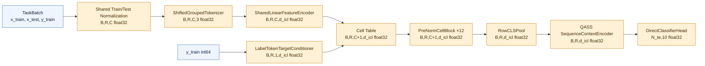

# Model Architecture

This document describes the current model surface in `tab-foundry`.

The repo now has one active architecture-development surface:

- `tabfoundry_staged`: the staged classification family used for new model work

It also keeps one frozen anchor:

- `tabfoundry_simple`: the exact nanoTabPFN-style binary compatibility path

The legacy `tabfoundry` family has been removed. Regression is also removed for
now and will be rebuilt later on top of `tabfoundry_staged`.

Related docs:

- `docs/development/model-config.md`
- `docs/development/architecture-deltas.md`
- `docs/inference.md`

Related code paths:

- `src/tab_foundry/model/architectures/tabfoundry_staged/`
- `src/tab_foundry/model/architectures/tabfoundry_simple.py`
- `src/tab_foundry/model/components/`
- `src/tab_foundry/model/spec.py`
- `src/tab_foundry/model/factory.py`

## High-Level Structure

`tabfoundry_staged` is a resolved-surface classifier. Construction starts from
`ModelBuildSpec`, resolves a public `stage` plus optional
`module_overrides`, then builds a concrete subsystem mix.

The forward path is organized as:

1. input preparation and train/test normalization
1. feature tokenization / feature encoding
1. target conditioning
1. table blocks over row-major cell tokens
1. optional column encoder
1. row pooling
1. optional context encoder
1. direct classification head or many-class head

The implementation is split across:

- `recipes.py`: the public staged recipe registry
- `resolved.py`: surface resolution from `stage` and `module_overrides`
- `builders.py`: subsystem construction
- `forward_common.py`: shared input prep, normalization, token building, and
  row/context helpers
- `direct_head.py`: small-class direct-head flow
- `many_class.py`: many-class hierarchical flow
- `subsystems.py`: reusable staged subsystem implementations
- `model.py`: the public `TabFoundryStagedClassifier` facade

### Forward-Pass Shape Trace

Shape trace through the settled default
(`stage=qass_context`, `module_overrides.column_encoder=none`).

The resolved surface owns normalization on the shared train/test path because
its feature encoder is `shared`, but the actual transform still comes from
`input_normalization`. The repo config default is `input_normalization=none`,
so this step is an identity unless a train-split normalization mode is
selected.


```mermaid
flowchart LR
    inp[TaskBatch<br/>x_train, x_test, y_train] --> norm[Shared Train/Test Normalization<br/>B,R,C float32]
    norm --> tok[ShiftedGroupedTokenizer<br/>B,R,C,3 float32]
    tok --> fe[SharedLinearFeatureEncoder<br/>B,R,C,d_icl float32]
    y[y_train int64] --> tc[LabelTokenTargetConditioner<br/>B,R,1,d_icl float32]
    fe --> cat[Cell Table<br/>B,R,C+1,d_icl float32]
    tc --> cat
    cat --> blk[PreNormCellBlock ×12<br/>B,R,C+1,d_icl float32]
    blk --> pool[RowCLSPool<br/>B,R,d_icl float32]
    pool --> ctx[QASS SequenceContextEncoder<br/>B,R,d_icl float32]
    ctx --> head[DirectClassifierHead<br/>N_te,10 float32]

    classDef base fill:#eef5ff,stroke:#3b6ea8,color:#0f1f33;
    classDef delta fill:#fff1d6,stroke:#c67a00,color:#3d2a00;
    class inp,y base;
    class norm,tok,fe,tc,cat,blk,pool,ctx,head delta;
```

| Component | Input Shape | Output Shape | DType | Notes |
|---|---|---|---|---|
| TaskBatch ingestion | `x_train [N_tr, C]`, `x_test [N_te, C]`, `y_train [N_tr]` | `x_all [1, R, C]`, `y_train [1, N_tr]` | x: float32, y: int64 | R = N_tr + N_te |
| Shared train/test normalization | `[B, R, C]` | `[B, R, C]` | float32 | resolved by the shared feature surface; actual transform depends on `input_normalization` (`none` by default, train-split statistics or transforms for other shared modes) |
| ShiftedGroupedTokenizer | `[B, R, C]` | `[B, R, C, 3]` | float32 | shifts (0, 1, 3) |
| SharedLinearFeatureEncoder | `[B, R, C, 3]` | `[B, R, C, d_icl]` | float32 | `Linear(3, 512, bias=False)` |
| LabelTokenTargetConditioner | `y_train [B, N_tr]` | `[B, R, 1, d_icl]` | int64 → float32 | train: `Embedding(10,512)`, test: learned token |
| Cell table assembly | features + target | `[B, R, C+1, d_icl]` | float32 | cat on dim=2 |
| PreNormCellBlock ×12 | `[B, R, C+1, d_icl]` | `[B, R, C+1, d_icl]` | float32 | feature attn → row attn → FFN |
| IdentityColumnEncoder | `[B, R, C+1, d_icl]` | `[B, R, C+1, d_icl]` | float32 | no-op for default |
| RowCLSPool | `[B*R, C+1, d_icl]` | `[B, R, d_icl]` | float32 | 4 CLS tokens, 3-layer TF, project 4×512→512 |
| QASS SequenceContextEncoder | `[B, R, d_icl]` | `[B, R, d_icl]` | float32 | 12-layer QASS, label inject on train rows |
| DirectClassifierHead | `[N_te, d_icl]` | `[N_te, 10]` | float32 | Linear(512,1024) → GELU → Linear(1024,10) |

B=1 for single-task; `forward_batched` supports B>1 only for direct-head
stages.

Source: `forward_common.py:16-23,46-59,90-107`, `states.py`

### Component Details

#### Tokenizers

- **`ScalarPerFeatureTokenizer`**: token_dim=1. Unsqueezes the last
  dimension. No learnable parameters.
- **`ScalarPerFeatureMissingnessTokenizer`**: token_dim=4. Channels:
  (filled_value, is_nan, is_posinf, is_neginf). No learnable parameters.
  Rationale: explicit non-finite channels let downstream layers learn
  missingness patterns.
- **`ShiftedGroupedTokenizer`**: token_dim=3. Shifts (0, 1, 3) applied via
  `roll` on the feature axis. No learnable parameters. Rationale:
  lightweight positional signal across columns without adding parameters.

Source: `subsystems.py:21-54`

#### Feature Encoders

- **`NanoFeatureEncoder`**: Internal z-score per feature (train stats) →
  clip to [-100, 100] → `Linear(1, d_icl)`. Init: Kaiming uniform (PyTorch
  default). Rationale: nanoTabPFN parity.
- **`SharedLinearFeatureEncoder`**: `Linear(token_dim, d_icl, bias=False)`.
  No bias because upstream shared normalization centers the data. Init:
  Kaiming uniform (PyTorch default). Rationale: decouples normalization
  from encoding.

Source: `subsystems.py:57-65`, `tabfoundry_simple.py:19-32`

#### Target Conditioners

- **`MeanPaddedLinearTargetConditioner`**: mean(y_train) padded to test
  rows → `Linear(1, d_icl)`. Init: Kaiming uniform. Rationale: nanoTabPFN
  parity.
- **`LabelTokenTargetConditioner`**: `Embedding(many_class_base, d_icl)` +
  test_token `Parameter(randn * 0.02)` shape `[1, 1, d_icl]`. Init:
  Embedding Normal(0,1); test token std 0.02. Rationale: discrete
  embeddings give cleaner label separation; small-init test token avoids
  dominating features.

Source: `subsystems.py:79-106`

#### Table Blocks

- **`NanoPostNormBlock`**: Post-norm. Feature attn `[B*R, C+1, d_icl]` →
  row attn `[B*(C+1), R, d_icl]` (train-only masking) → FFN → norms
  after each sublayer. Init: `MultiheadAttention` Xavier uniform.
  Rationale: nanoTabPFN parity.
- **`PreNormCellBlock`**: Pre-norm with explicit residuals. Feature attn →
  row attn (mask blocks test-to-test; diagonal optionally unmasked when
  `allow_test_self_attention=True`) → FFN
  `Linear(d_icl, head_hidden_dim) → GELU → Linear(head_hidden_dim, d_icl)`.
  Residual branch gain: `1.0` or `(3 · tficl_n_layers)^(-0.5)` when
  `table_block_residual_scale=depth_scaled`. Rationale: pre-norm trains
  more stably in deep stacks; test-self attention preserves per-test-row
  info without cross-test leakage.

Source: `subsystems.py:109-227`, `resolved.py:349-360`

#### Column Encoder

- **`IdentityColumnEncoder`**: No-op pass-through.
- **`SetColumnEncoder`** → `TFColEncoder`: Permute cells to
  `[B*C, R, d_icl]`, then `tfcol_n_layers` ISABBlocks (default 3). Each
  ISAB: inducing points `Parameter(randn * 0.02)` shape
  `[1, n_inducing, d_icl]` (default 128), two `QASSMultiheadAttention`
  (input→inducing with QASS, inducing→input without), one FFN. Rationale:
  ISAB avoids quadratic row cost; columns as batch axis let each column
  learn independently.

Source: `blocks.py:44-140`

#### Row Pooling

- **`TargetColumnPool`**: Extract `cells[:, :, -1, :]` →
  `[B, R, d_icl]`. No learnable parameters. Rationale: target column
  accumulates row signal through cell transformer.
- **`RowCLSPool`** → `TFRowEncoder`: CLS `Parameter(randn * 0.02)` shape
  `[1, cls_tokens, d_icl]` (default 4). Prepend to feature tokens, run
  `nn.TransformerEncoder` (tfrow_n_layers=3, pre-norm,
  tfrow_n_heads=8). Output `Linear(cls_tokens * d_icl, d_icl)`. Cloned
  layers re-initialized via `_reinitialize_transformer_encoder`. RMSNorm
  disables the TransformerEncoder fast path. Rationale: multiple CLS
  tokens + projection increase row summary capacity without scaling with
  feature count.

Source: `blocks.py:143-218`

#### Context Encoder

- **`SequenceContextEncoder`**: Adds label embeddings
  `Embedding(many_class_base, d_icl)` to training rows before encoding.
  Mask: train attends to all, test attends to train + optionally self.
  `QASSTransformerEncoder` (tficl_n_layers layers + final norm). Each
  layer: pre-norm → `QASSMultiheadAttention` → residual → pre-norm → FFN
  → residual. QASS scaling:
  `q * base(log n) * (1 + tanh(gate(q)))`. Base MLP:
  `Linear(1, 64) → GELU → Linear(64, n_heads*d_head)` (all bias=False).
  Gate MLP: `Linear(d_head, 64) → GELU → Linear(64, d_head)` — final
  layer zero-initialized so QASS starts as identity. All Q/K/V/Out:
  `Linear(d_icl, d_icl, bias=False)`. FFN:
  `Linear(d_icl, d_icl*ff_expansion) → GELU → Dropout → Linear → Dropout`
  (bias=False).

Source: `subsystems.py:320-385`, `qass.py:14-201`

#### Classification Heads

- **`NanoBinaryHead`**: `Linear(d_icl, head_hidden_dim) → GELU →
  Linear(head_hidden_dim, 2)`.
- **`DirectClassifierHead`**: `Linear(d_icl, head_hidden_dim) → GELU →
  Linear(head_hidden_dim, many_class_base)`.
- **Many-class**: Hierarchical mixed-radix decomposition, digit position
  embeddings `Embedding(max_mixed_radix_digits, d_icl)`, recursive tree
  traversal. `path_nll` vs `full_probs` training modes.

Source: `subsystems.py:388-414`

#### Normalization

- **`LayerNorm`**: `(x - E[x]) / sqrt(Var[x] + eps) * γ + β`. Weight
  init 1.0, bias init 0.0.
- **`RMSNorm`**: `x / sqrt(mean(x²) + eps) * weight`. Weight init 1.0,
  no bias, no mean centering. Rationale: cheaper than LayerNorm and
  experimentally sufficient.
- Factory: `build_norm(norm_type, dim)`.

Source: `normalization.py:1-39`

For a dimension-by-dimension comparison of these components across
nanoTabPFN, TabPFN / TabPFN-2.5, the settled row-first target, and TabICLv2,
see `docs/development/architecture-deltas.md`
(Component-Level Dimension Deltas).

### Default Build Fields

`ModelBuildSpec` defaults (from `spec.py:120-149`) include both live staged
runtime knobs and compatibility fields.

#### Active Staged Architecture / Runtime Knobs

```
d_icl               = 512          # main embedding dim
input_normalization = "none"       # actual train/test normalization transform
norm_type            = "layernorm"  # global norm type
tfcol_n_heads        = 8            # TFCol attention heads
tfcol_n_layers       = 3            # TFCol ISAB blocks
tfcol_n_inducing     = 128          # TFCol inducing points
tfrow_n_heads        = 8            # TFRow attention heads
tfrow_n_layers       = 3            # TFRow transformer layers
tfrow_cls_tokens     = 4            # TFRow CLS tokens
tfrow_norm           = "layernorm"  # TFRow norm type
tficl_n_heads        = 8            # context encoder heads
tficl_n_layers       = 12           # context encoder layers
tficl_ff_expansion   = 2            # context FFN expansion factor
many_class_base      = 10           # max classes for direct head
head_hidden_dim      = 1024         # head MLP hidden dim
use_digit_position_embed = True     # many-class digit embeddings
many_class_train_mode = "path_nll"  # many-class training mode
max_mixed_radix_digits = 64         # mixed-radix digit limit
staged_dropout       = 0.0          # staged subsystem dropout
pre_encoder_clip     = None         # optional feature clipping
```

#### Compatibility Or Currently Non-Driving Fields

These fields are still carried through config resolution, export metadata, and
checkpoint compatibility, but the current `tabfoundry_staged` builders do not
use them directly.

```
d_col               = 128          # retained for config/export/checkpoint compatibility; staged TFCol is currently sized from d_icl
feature_group_size  = 1            # retained for config/export/checkpoint compatibility; staged tokenizers/encoders do not currently consume it
```

### Storage and DType Policy

- Input features: cast to float32 (`forward_common.py:20`)
- Input labels: cast to int64 (`forward_common.py:21`)
- Model parameters: float32 by default
- Activation tracing: explicit float32 cast (`model.py:191`)
- bf16 / mixed precision: not enforced by model; left to training loop.
  QASS scaler adapts dtype automatically from query tensor.
- Embedding tables: float32

## Public Stage Surface

The supported public stages are:

- `nano_exact`
- `label_token`
- `shared_norm`
- `prenorm_block`
- `small_class_head`
- `test_self`
- `grouped_tokens`
- `row_cls_pool`
- `column_set`
- `qass_context`
- `many_class`

`model.stage` is still the stable public selector, but new research work should
prefer queue-managed `stage_label + module_overrides` so changes stay isolated
and attributable.

At a high level, the staged family evolves along these axes:

- feature encoder: `nano` vs `shared`
- target conditioner: mean-padded linear vs label token
- table block: nano-style postnorm vs prenorm
- tokenizer: scalar-per-feature vs shifted-grouped variants
- row pool: target-column vs row-CLS pooling
- column encoder: none vs `tfcol`
- context encoder: none vs plain vs QASS
- head: binary direct, small-class, or many-class

### Stage Ladder Component Matrix

Each public stage resolves to a fixed subsystem mix. Stages inherit from
predecessors, and `module_overrides` can mix-and-match individual components
across stage boundaries.

| Stage | Feature Enc | Target Cond | Tokenizer | Table Block | Row Pool | Col Enc | Context Enc | Head | Norm Mode |
|---|---|---|---|---|---|---|---|---|---|
| `nano_exact` | nano | mean_padded_linear | scalar_per_feature | nano_postnorm | target_column | none | none | binary_direct | internal |
| `label_token` | nano | label_token | scalar_per_feature | nano_postnorm | target_column | none | none | binary_direct | internal |
| `shared_norm` | shared | label_token | scalar_per_feature | nano_postnorm | target_column | none | none | binary_direct | shared |
| `prenorm_block` | shared | label_token | scalar_per_feature | prenorm | target_column | none | none | binary_direct | shared |
| `small_class_head` | shared | label_token | scalar_per_feature | prenorm | target_column | none | none | small_class | shared |
| `test_self` | shared | label_token | scalar_per_feature | prenorm_test_self | target_column | none | none | small_class | shared |
| `grouped_tokens` | shared | label_token | shifted_grouped | prenorm_test_self | target_column | none | none | small_class | shared |
| `row_cls_pool` | shared | label_token | shifted_grouped | prenorm_test_self | row_cls | none | plain | small_class | shared |
| `column_set` | shared | label_token | shifted_grouped | prenorm_test_self | row_cls | tfcol | plain | small_class | shared |
| `qass_context` | shared | label_token | shifted_grouped | prenorm_test_self | row_cls | tfcol | qass | small_class | shared |
| `many_class` | shared | label_token | shifted_grouped | prenorm_test_self | row_cls | tfcol | qass | many_class | shared |

Source: `recipes.py:58-257`

For a step-by-step walkthrough of what changes between each adjacent pair of
stages, see `docs/development/architecture-deltas.md` (Stage Delta
Walkthrough).

The public stage ladder does not exhaust every resolved-surface knob. The main
override-only axes worth tracking separately are:

- `post_encoder_norm`
- `post_stack_norm`
- `table_block_residual_scale`
- `allow_test_self_attention` (also set implicitly by `test_self` and later
  stages)

## Default Row-First Anchor

TF-RD-008 is now closed. The normative row-first classification default is the
`qass_context` staged surface with `module_overrides.column_encoder=none`, which
corresponds to `row_cls + qass + no tfcol`.

The settled default stack is:

- shared feature encoder on the shared normalization surface
- shifted-grouped tokenizer
- label-token target conditioning
- prenorm cell-table blocks with test-self attention enabled
- no column encoder by default
- row-CLS pooling
- QASS context encoder
- small-class direct classification head

This is the default because the final missing-permitting validator
`qass_tfcol_large_missing_validation_v1` produced a mixed result: the retained
TFCol variant improved final Brier and ROC AUC, but it did not beat the no-TFCol
line on final log loss. In that tie state, the repo now prefers the simpler and
lower-runtime line as the default row-first anchor.

## Settled Default Resolved Surface

`qass_context` by itself still resolves to the stage recipe with
`column_encoder=tfcol`. The settled default used throughout this document is
the explicit resolved surface:

```bash
.venv/bin/tab-foundry dev resolve-config --json model.stage=qass_context +model.module_overrides.column_encoder=none
```

Trimmed resolved excerpt:

```json
"module_selection": {
  "allow_test_self_attention": true,
  "column_encoder": "none",
  "context_encoder": "qass",
  "feature_encoder": "shared",
  "head": "small_class",
  "post_encoder_norm": "none",
  "post_stack_norm": "none",
  "row_pool": "row_cls",
  "table_block_residual_scale": "none",
  "table_block_style": "prenorm",
  "target_conditioner": "label_token",
  "tokenizer": "shifted_grouped"
}
```

```json
"module_hyperparameters": {
  "column_encoder": {
    "name": "none",
    "n_heads": null,
    "n_inducing": null,
    "n_layers": null,
    "norm_type": null
  },
  "context_encoder": {
    "allow_test_self_attention": true,
    "ff_expansion": 2,
    "n_heads": 8,
    "n_layers": 12,
    "name": "qass",
    "norm_type": "layernorm",
    "use_qass": true
  },
  "row_pool": {
    "cls_tokens": 4,
    "n_heads": 8,
    "n_layers": 3,
    "name": "row_cls",
    "norm_type": "layernorm"
  },
  "table_block": {
    "allow_test_self_attention": true,
    "mlp_hidden_dim": 1024,
    "n_heads": 8,
    "norm_type": "layernorm",
    "residual_branch_gain": 1.0,
    "residual_scale": "none",
    "style": "prenorm"
  }
}
```

```json
"task_contract": {
  "max_classes": 10,
  "min_classes": 2,
  "supports_many_class": false
}
```

At repo defaults, this resolved no-TFCol surface has `71,445,258` parameters.
For comparison, the unmodified stage recipe:

```bash
.venv/bin/tab-foundry dev resolve-config --json model.stage=qass_context
```

resolves to `column_encoder=tfcol` with `81,339,018` parameters. The settled
default therefore removes `9,893,760` parameters from the raw `qass_context`
stage recipe while keeping the same public stage label.

## Retained Alternative

The main retained alternative is `row_cls + qass + tfcol_heads4`, which is the
same `qass_context` staged surface with TFCol enabled at `tfcol_n_heads=4`.

That variant remains valid because it still improves calibration-oriented
metrics on the missing-permitting large bundle and was the only TFCol adequacy
winner worth carrying forward. It is not the default because:

- it missed the final log-loss promotion rule on the missing-permitting bundle
- it adds extra column-set machinery and runtime cost
- TF-RD-008 now treats the simpler no-TFCol line as the canonical parent for
  later post-008 work unless a calibration-oriented question explicitly calls
  for the TFCol branch

## Normalization And Tokenization

The staged family has two normalization regimes:

- `internal`: the nano-compatible path used by early benchmark-anchor stages
- `shared`: the repo-wide normalization path used by later staged surfaces

The normalization owner is resolved from the stage recipe rather than inferred
from CLI defaults.

Tokenization choices include:

- `scalar_per_feature`
- `scalar_per_feature_nan_mask`
- `shifted_grouped`

The non-finite-aware tokenizer keeps separate pre-embedding channels for:

- `NaN`
- `+inf`
- `-inf`

Finite-only clipping is applied before encoding when `pre_encoder_clip` is set.

## Heads And Class Coverage

The repo is classification-only today.

The staged family has two main head modes:

- direct heads for binary and ordinary small-class classification
- hierarchical many-class routing for larger class counts

The many-class path uses:

- mixed-radix conditioning
- optional digit-position embeddings
- hierarchical class routing
- `many_class_train_mode` of `path_nll` or `full_probs`

On the `many_class` stage, tasks with `num_classes <= many_class_base` still
use the direct head and return logits. Hierarchical mixed-radix routing only
activates once `num_classes > many_class_base`.

The staged many-class implementation is intentionally still single-task at the
`TaskBatch` level. Batched tensor fast paths exist for direct-head execution,
but `_forward_many_class()` now errors clearly if asked to process `B > 1`.

## `tabfoundry_simple`

`tabfoundry_simple` remains as the frozen exact binary anchor.

Its role is deliberately narrow:

- exact benchmark-anchor reproduction
- binary-only classification
- compatibility baseline for comparisons against `tabfoundry_staged`

It is not the place for new architecture work.

## Output Surface

Shared model outputs now live in `src/tab_foundry/model/outputs.py`.

Active output type:

- `ClassificationOutput`

There is no longer a repo-supported `RegressionOutput`.

## Code Navigation Map

- `src/tab_foundry/model/spec.py`
  - canonical build spec, supported arch/task/stage values, and checkpoint
    compatibility rules
- `src/tab_foundry/model/factory.py`
  - model construction for `tabfoundry_simple` and `tabfoundry_staged`
- `src/tab_foundry/model/architectures/tabfoundry_staged/model.py`
  - public staged classifier facade
- `src/tab_foundry/model/architectures/tabfoundry_staged/recipes.py`
  - public stage registry
- `src/tab_foundry/model/architectures/tabfoundry_staged/resolved.py`
  - resolved staged surface metadata
- `src/tab_foundry/model/architectures/tabfoundry_staged/subsystems.py`
  - staged subsystem implementations
- `src/tab_foundry/model/architectures/tabfoundry_staged/forward_common.py`
  - shared forward-path helpers
- `src/tab_foundry/model/architectures/tabfoundry_staged/direct_head.py`
  - direct-head execution path
- `src/tab_foundry/model/architectures/tabfoundry_staged/many_class.py`
  - many-class execution path
- `src/tab_foundry/model/architectures/tabfoundry_simple.py`
  - frozen exact binary anchor
- `src/tab_foundry/model/components/`
  - reusable QASS, many-class, non-finite, and normalization components

## Maintenance Notes

- `tabfoundry_staged` is the only model family that should absorb new feature
  work.
- `tabfoundry_simple` should change only for bug fixes or compatibility
  maintenance.
- Future regression support should be introduced as a staged-family extension,
  not by reviving the removed legacy `tabfoundry` family.
