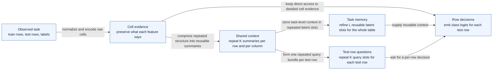

# Model Architecture

Use this reference when you need the live architecture surface, the active
model family, and the current sandwich forward path.

The repo now has one active architecture-development lane:

- `tabfoundry_sandwich`: the primary classification architecture target and
  scaling-prep family

It also keeps two comparison lanes:

- `tabfoundry_simple`: the frozen PFN-style control
- `tabfoundry_staged`: the historical row-first reference line and benchmark
  comparison surface

Regression is still deferred. The active model surface is classification-only.

Use these alongside this page:

- `docs/development/model-config.md`
- `docs/development/roadmap.md`
- `docs/inference.md`

Key code paths:

- `src/tab_foundry/model/architectures/tabfoundry_sandwich/model.py`
- `src/tab_foundry/model/components/tabular_primitives.py`
- `src/tab_foundry/model/components/attention.py`
- `src/tab_foundry/model/components/normalization.py`
- `src/tab_foundry/model/spec.py`
- `src/tab_foundry/model/factory.py`

## Architecture Roles

- `tabfoundry_sandwich` is the active model family.
  It owns the current simplification, dagzoo transfer, many-class plus
  missingness, runtime, and scaling work.
- `tabfoundry_simple` remains the frozen benchmark-trust lane.
  Use it when you need the exact nanoTabPFN-style control.
- `tabfoundry_staged` is still useful as a historical comparison surface, but
  it is no longer the center of the roadmap or architecture docs.

## Intent Map

This diagram summarizes the design intent behind the current sandwich architecture.

```mermaid
flowchart LR
    classDef state fill:#eef5ff,stroke:#3567a6,color:#10233a,stroke-width:1px;

    task["Observed task<br/>train rows, test rows, labels"]:::state
    evidence["Cell evidence<br/>preserve what each feature says"]:::state
    context["Shared context<br/>repeat K summaries per row and per column"]:::state
    memory["Task memory<br/>refine L reusable latent slots for the whole table"]:::state
    queries["Test-row questions<br/>repeat K query slots for each test row"]:::state
    logits["Row decisions<br/>emit class logits for each test row"]:::state

    task -->|normalize and encode raw cells| evidence
    evidence -->|compress repeated structure into reusable summaries| context
    context -->|store task-level context in repeated latent slots| memory
    context -->|form one repeated query bundle per test row| queries
    evidence -->|keep direct access to detailed cell evidence| logits
    memory -->|supply reusable context| logits
    queries -->|ask for a per-row decision| logits
```

## Sandwich Design Summary

`tabfoundry_sandwich` is the active small-class, classification-only
hybrid full-cell / summary-stream Perceiver-style classifier.

The live design combines:

- one shared train/test normalization path and a missingness-aware scalar
  tokenizer
- shared value projection followed by feature-type FiLM modulation, then row
  Fourier and column Fourier position enrichment
- an optional axial pre-Perceiver mixer with row-wise feature attention and
  column-wise ISAB row mixing
- two context surfaces built from the same encoded cell table:
  - a high-bandwidth full-cell stream over all observed cells
  - a compact repeated summary stream with $K$ learned summaries per row and
    per column
- a fixed latent bank where stage `0` reads the full cell stream plus
  summaries, and later stages refine against the summary stream only
- a dual-source readout where $K$ test-row queries read final latents first
  and then the full cell stream before the direct classifier head

Mental model:

- full-cell stream = high-bandwidth raw table evidence
- row and column summary streams = compact repeated context
- latent array = fixed-capacity memory and refinement state
- readout = test-row summary queries with both latent memory access and a
  full-cell bypass

## Sandwich Forward Path

The implementation lives in
`src/tab_foundry/model/architectures/tabfoundry_sandwich/model.py`.

Notation:

- $B$ = task batch size
- $N_{tr}$ = train-row count
- $N_{te}$ = test-row count
- $R = N_{tr} + N_{te}$
- $C$ = feature count
- $K$ = `sandwich_summary_tokens_per_axis`
- $L$ = `sandwich_latents`

```mermaid
flowchart TB
    classDef tensor fill:#eef5ff,stroke:#3567a6,color:#10233a,stroke-width:1px;
    classDef embed fill:#fff3db,stroke:#b87316,color:#3b2500,stroke-width:1px;
    classDef attn fill:#e9f7ef,stroke:#2e8b57,color:#123524,stroke-width:1px;
    classDef head fill:#f5ebff,stroke:#7a4db3,color:#2c1548,stroke-width:1px;

    xtrain["x_train<br/>[<i>B</i>, <i>N</i><sub>tr</sub>, <i>C</i>]"]:::tensor
    xtest["x_test<br/>[<i>B</i>, <i>N</i><sub>te</sub>, <i>C</i>]"]:::tensor
    ytrain["y_train<br/>[<i>B</i>, <i>N</i><sub>tr</sub>]"]:::tensor

    norm(["Shared train/test normalization"]):::embed
    xall["normalized x_all<br/>[<i>B</i>, <i>R</i>, <i>C</i>]"]:::tensor
    tok(["Missingness-aware tokenizer<br/>[value, is_nan, is_posinf, is_neginf]"]):::embed
    xtok["tokenized cells<br/>[<i>B</i>, <i>R</i>, <i>C</i>, 4]"]:::tensor
    enc(["Shared value projection + Fourier row/col + feature-type embedding"]):::embed
    cells["cell tokens<br/>[<i>B</i>, <i>R</i>, <i>C</i>, d_icl]"]:::tensor
    pre_row[[Per-row feature self-attention<br/>× sandwich_pre_row_attention_layers]]:::attn
    pre_col[[Per-column ISAB row mixing<br/>× sandwich_pre_column_attention_layers]]:::attn
    mixed_cells["mixed cell tokens<br/>[<i>B</i>, <i>R</i>, <i>C</i>, d_icl]"]:::tensor

    full_cell(["Broadcast label/query + role + cell token type"]):::embed
    full_stream["full cell stream<br/>[<i>B</i>, <i>R</i> × <i>C</i>, d_icl]"]:::tensor

    row_attn[[Row-summary query attention<br/>PreNorm + residual]]:::attn
    row_tokens["row summary stream<br/>[<i>B</i>, <i>R</i> × <i>K</i>, d_icl]<br/><i>K</i> repeated summary slots per row"]:::tensor

    col_attn[[Column-summary query attention<br/>PreNorm + residual]]:::attn
    col_tokens["column summary stream<br/>[<i>B</i>, <i>C</i> × <i>K</i>, d_icl]<br/><i>K</i> repeated summary slots per column"]:::tensor

    summary_stream["summary stream<br/>[<i>B</i>, <i>K</i> × (<i>R</i> + <i>C</i>), d_icl]"]:::tensor
    stage0_stream["stage-0 input stream<br/>[<i>B</i>, <i>R</i> × <i>C</i> + <i>K</i> × (<i>R</i> + <i>C</i>), d_icl]"]:::tensor

    latent_seed["latent seed<br/>[<i>B</i>, <i>L</i>, d_icl]<br/><i>L</i> repeated latent slots"]:::tensor

    subgraph stages["Repeated Perceiver stages × sandwich_layers"]
        lat_in["latents in<br/>[<i>B</i>, <i>L</i>, d_icl]"]:::tensor
        cross0[[Stage 0 cross-attention<br/>Q = latents, KV = full cells + summaries]]:::attn
        lat_mid0["after stage 0 read<br/>[<i>B</i>, <i>L</i>, d_icl]"]:::tensor
        self0[[Latent self-attention stack<br/>× sandwich_self_attention_per_cross]]:::attn
        lat_out0["after stage 0 self<br/>[<i>B</i>, <i>L</i>, d_icl]"]:::tensor
        crossn[[Later-stage cross-attention<br/>Q = latents, KV = summary stream]]:::attn
        selfn[[Later latent self-attention stacks<br/>× sandwich_self_attention_per_cross]]:::attn
        lat_final["final latents<br/>[<i>B</i>, <i>L</i>, d_icl]<br/><i>L</i> refined latent slots"]:::tensor

        lat_in --> cross0 --> lat_mid0 --> self0 --> lat_out0 --> crossn --> selfn --> lat_final
    end

    test_queries["test-row query bank<br/>[<i>B</i>, <i>N</i><sub>te</sub> × <i>K</i>, d_icl]<br/><i>K</i> repeated query slots per test row"]:::tensor
    latent_readout[[Readout 1<br/>Q = test rows, KV = final latents]]:::attn
    cell_readout[[Readout 2<br/>Q = updated test rows, KV = full cell stream]]:::attn
    pool(["Pool K repeated queries per test row"]):::embed
    test_rows["test-row states<br/>[<i>B</i>, <i>N</i><sub>te</sub>, d_icl]"]:::tensor
    head([DirectClassifierHead]):::head
    logits["logits<br/>[<i>B</i>, <i>N</i><sub>te</sub>, many_class_base]"]:::tensor

    xtrain --> norm
    xtest --> norm
    norm --> xall
    xall --> tok --> xtok --> enc --> cells --> pre_row --> pre_col --> mixed_cells

    mixed_cells --> full_cell --> full_stream
    ytrain --> full_cell

    mixed_cells --> row_attn --> row_tokens
    ytrain --> row_tokens

    mixed_cells --> col_attn --> col_tokens
    row_tokens --> summary_stream
    col_tokens --> summary_stream

    full_stream --> stage0_stream
    summary_stream --> stage0_stream
    latent_seed --> lat_in
    stage0_stream --> cross0
    summary_stream --> crossn

    row_tokens -->|slice test rows| test_queries
    test_queries --> latent_readout --> cell_readout --> pool --> test_rows --> head --> logits
    lat_final --> latent_readout
    full_stream --> cell_readout
```

Read the diagram as:

- cell encoding happens once, before any latent stage
- the axial pre-Perceiver mixer is separate from the later latent refinement
- row and column summaries each repeat $K$ learned query slots per row or
  column
- stage `0` gets the expensive high-bandwidth read from full cells plus
  summaries
- later stages reuse only the cheaper repeated summary stream
- readout uses the repeated $K$ test-row queries twice:
  - first against final latents
  - then against the full cell stream

## Forward-Pass Shape Trace

| Component | Input Shape | Output Shape | Notes |
| --- | --- | --- | --- |
| Task ingestion | `x_train` [$B$, $N_{tr}$, $C$], `x_test` [$B$, $N_{te}$, $C$], `y_train` [$B$, $N_{tr}$] | `x_all` [$B$, $R$, $C$] | $B = 1$ for single-task forward; task batching is also supported |
| Shared normalization | [$B$, $R$, $C$] | [$B$, $R$, $C$] | uses `input_normalization`; preserves non-finite markers |
| Missingness tokenizer | [$B$, $R$, $C$] | [$B$, $R$, $C$, 4] | channels are `value`, `is_nan`, `is_posinf`, `is_neginf` |
| Shared feature encoder | [$B$, $R$, $C$, 4] | [$B$, $R$, $C$, `d_icl`] | linear projection only |
| Positional/type enrichment | [$B$, $R$, $C$, `d_icl`] | [$B$, $R$, $C$, `d_icl`] | adds row Fourier, column Fourier, and feature-type embeddings |
| Pre-Perceiver mixer | [$B$, $R$, $C$, `d_icl`] | [$B$, $R$, $C$, `d_icl`] | row self-attn then column ISAB row mixing |
| Full-cell stream | [$B$, $R$, $C$, `d_icl`] | [$B$, $R * C$, `d_icl`] | adds train/test role, label/query conditioning, and cell token type |
| Row summary stream | [$B$, $R$, $C$, `d_icl`] | [$B$, $R * K$, `d_icl`] | learned row-summary queries with $K$ repeated slots per row plus label/query and role conditioning |
| Column summary stream | [$B$, $R$, $C$, `d_icl`] | [$B$, $C * K$, `d_icl`] | learned column-summary queries with $K$ repeated slots per column plus token type |
| Summary stream | row + column summaries | [$B$, $K * (R + C)$, `d_icl`] | compact repeated context |
| Latent seed | none | [$B$, $L$, `d_icl`] | learned latent bank with $L$ repeated slots, expanded per task |
| Perceiver stages | latents + input stream | [$B$, $L$, `d_icl`] | stage `0` reads full-cell + summary; later stages read summary only |
| Test query bank | test-row summary tokens | [$B$, $N_{te} * K$, `d_icl`] | derived from the row-summary stream with $K$ repeated query slots per test row |
| Latent readout | queries + final latents | [$B$, $N_{te} * K$, `d_icl`] | first readout pass |
| Full-cell readout | updated queries + full-cell stream | [$B$, $N_{te}$, $K$, `d_icl`] | second readout pass |
| Test-row pool | [$B$, $N_{te}$, $K$, `d_icl`] | [$B$, $N_{te}$, `d_icl`] | pool the $K$ repeated query slots down to one state per test row |
| Direct head | [$B$, $N_{te}$, `d_icl`] | [$B$, $N_{te}$, `many_class_base`] | small-class classifier head |

## Current Sandwich Defaults

Resolved sandwich defaults come from `src/tab_foundry/model/spec.py`.

| Field | Default | Meaning |
| --- | --- | --- |
| `model.arch` | `tabfoundry_sandwich` when selected | choose the sandwich family |
| `d_icl` | `60` | shared working width |
| `input_normalization` | `none` | shared train/test normalization mode |
| `many_class_base` | `10` | direct-head output width and current small-class ceiling |
| `head_hidden_dim` | `96` | hidden width inside `DirectClassifierHead` |
| `pre_encoder_clip` | `null` | optional finite-value clip before encoding |
| `norm_type` | `layernorm` | only supported norm for sandwich today |
| `sandwich_latents` | `24` | learned latent slots |
| `sandwich_layers` | `2` | repeated Perceiver cross-read stages |
| `sandwich_heads` | `4` | attention heads across sandwich blocks |
| `sandwich_ff_expansion` | `2` | FFN expansion factor across sandwich blocks |
| `sandwich_activation` | `gelu` | sandwich core FF activation; `rational` selects the local version-A `5/4` GELU-initialized rational |
| `sandwich_block_norm` | `layernorm` | sandwich core pre-norm module; `none` disables those block-local norms while global `norm_type` stays `layernorm` |
| `sandwich_packed_attention` | `false` | opt-in packed-projection SDPA path for speedrun experiments; default preserves the prior attention path |
| `sandwich_summary_tokens_per_axis` | `4` | learned row summaries per row and column summaries per column |
| `sandwich_self_attention_per_cross` | `4` | latent self-attention blocks after each cross-read |
| `sandwich_pre_row_attention_layers` | `1` | pre-Perceiver row-wise feature self-attention blocks |
| `sandwich_pre_column_attention_layers` | `1` | pre-Perceiver column-wise ISAB row mixers |
| `sandwich_pre_column_inducing_tokens` | `16` | inducing-token count in each pre-column ISAB block |
| `feature_type_conditioning` | `film` | modulate encoded cell states by feature type after the shared feature encoder |
| `floating_likelihood` | `single_gaussian` | floating-cell likelihood family for the cell-BPC lane |
| `integer_likelihood` | `hybrid_mixture` | integer-cell learned discrete/Gaussian mixture for the cell-BPC lane |

## Feature-Type Metadata Contract

`tabfoundry_sandwich` consumes per-feature type metadata through
`TaskBatch.metadata["feature_types"]`.

Vocabulary:

- `bool`
- `integer`
- `floating`
- `string_binary`
- `unknown`

Interpretation:

- these are collapsed Parquet or Arrow physical groups, not exact logical type
  strings
- sandwich requires explicit feature types at runtime; it does not fall back
  to all `floating`
- feature types modulate encoded cells through FiLM after the shared feature
  encoder and before row/column position enrichment
- feature type metadata is conditioning only; it is not emitted as a standalone
  token
- manifest-backed tasks must persist `feature_types`; the shared dataset loader
  no longer infers an all-`floating` default when the metadata is absent
- `run_reference_consumer(..., feature_types=[...])` requires a per-request
  list for exported-bundle execution
- `forward_batched(..., feature_types=[...])` also requires explicit feature
  types; task-batched calls must pass one list per task
- export-bundle `manifest.preprocessor` payloads are policy-only and must not
  include `feature_types`

## Runtime And Input Contract

The current sandwich implementation has a tighter contract than the older
staged family.

- task: classification only
- class count: `2 <= num_classes <= many_class_base`
- feature metadata: explicit `feature_types` are required; see
  `Feature-Type Metadata Contract`
- loss surfaces: `classification` is the canonical active objective, while
  sandwich-only `cell_bpc` is retained only for legacy generative reruns
- cell-BPC metric: row-major cell negative log-likelihood in bits with
  `N_cells = rows * features`
- integer likelihood: learned per-feature hybrid mixture of dynamic-support
  discrete likelihood and single-Gaussian continuous likelihood
- supported tensor layouts:
  - single-task: `x_train [N_tr,C]`, `x_test [N_te,C]`, `y_train [N_tr]`
  - task-batched: `x_train [B,N_tr,C]`, `x_test [B,N_te,C]`,
    `y_train [B,N_tr]`
- train rows: at least one training row is required
- labels: at least one training label is required
- global norm family: only `layernorm` is accepted through `norm_type`
- sandwich core block norm: `sandwich_block_norm` may be `layernorm` or `none`
- sandwich core FF activation: `sandwich_activation` may be `gelu` or `rational`
- activation checkpointing: supported and opt-in
- activation tracing: supported and opt-in

Rejected staged-only fields:

- `stage`
- `stage_label`
- `module_overrides`

## Parameterization Notes

- the fixed latent array is stored as `latent_seed` with shape
  `[1, sandwich_latents, d_icl]`
- `latent_seed` is initialized from a truncated normal with mean `0.0`,
  standard deviation `0.02`, and literal truncation bounds `[-2.0, 2.0]`
- row-summary and column-summary query parameters are separate learned tensors
  of shape `[1, 1, d_icl]`
- the full cell encoder pass still happens only once; later repeated stages
  reuse the summary-token stream rather than recomputing cell summaries
