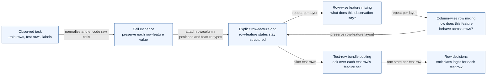

# Model Architecture

Use this reference when you need the live architecture surface, the active
model family, and the current grid/sandwich forward paths.

The repo now has one carried architecture-development lane:

- `grid_sandwich`: the current classification architecture anchor after the
  April 20-21, 2026 grid-preserving follow-on beat the matched `144x4`
  sandwich anchor on the medium multiclass benchmark

It also keeps three comparison lanes plus one sidecar follow-on lane:

- `tabfoundry_sandwich`: the previous carried scaling-prep family and the
  in-family comparison baseline for the grid promotion
- `tabfoundry_simple`: the frozen PFN-style control
- `tabfoundry_staged`: the historical row-first reference line and benchmark
  comparison surface
- `routed_sandwich`: a sidecar routed-residual / evidence-bank follow-on for
  testing residual-path and token-budget hypotheses against the carried
  sandwich surface

Regression is still deferred. The active model surface is classification-only.

Use these alongside this page:

- `docs/development/model-config.md`
- `docs/development/roadmap.md`
- `docs/inference.md`

Key code paths:

- `src/tab_foundry/model/architectures/tabfoundry_sandwich/model.py`
- `src/tab_foundry/model/architectures/routed_sandwich/model.py`
- `src/tab_foundry/model/architectures/grid_sandwich/model.py`
- `src/tab_foundry/model/components/tabular_primitives.py`
- `src/tab_foundry/model/components/attention.py`
- `src/tab_foundry/model/components/normalization.py`
- `src/tab_foundry/model/spec.py`
- `src/tab_foundry/model/factory.py`

## Architecture Roles

- `grid_sandwich` is the active model family and carried architecture anchor.
  It owns the default workstation surface for new classification architecture
  work while the next guardrail is replication and larger-rung validation.
- `tabfoundry_sandwich` remains the previous carried family.
  It owns the historical simplification, dagzoo transfer, many-class plus
  missingness, runtime, and scaling evidence and remains the matched in-family
  comparison line for grid work.
- `tabfoundry_simple` remains the frozen benchmark-trust lane.
  Use it when you need the exact nanoTabPFN-style control.
- `tabfoundry_staged` is still useful as a historical comparison surface, but
  it is no longer the center of the roadmap or architecture docs.
- `routed_sandwich` is a follow-on experiment family, not the carried baseline.
  It keeps the tokenizer, feature encoder, FiLM conditioning, positions, and
  direct head, but replaces the latent/query residual path with two routed
  streams and uses learned row, column, and evidence-bank context tokens.
- `grid_sandwich` keeps the encoded `[row, feature]` grid explicit through
  alternating row-wise and column-wise mixers, then pools each test-row feature
  bundle directly.

## Active TF-RD-009 Carried Surface

The generic sandwich defaults below are not the current repo architecture
anchor. The active Muon training-dynamics study under
`tf_rd_009_muon_training_dynamics_lmo_transfer_medium_v1` carries one fixed
`tabfoundry_sandwich` geometry while testing optimizer and batch transfer laws:

- geometry: `144x4` (`d_icl=144`, `sandwich_layers=4`)
- architecture knobs held fixed:
  - `sandwich_latents=24`
  - `sandwich_heads=1`
  - `sandwich_ff_expansion=2`
  - `sandwich_summary_tokens_per_axis=3`
  - `sandwich_self_attention_per_cross=4`
  - `sandwich_pre_row_attention_layers=1`
  - `sandwich_pre_column_attention_layers=1`
  - `sandwich_pre_column_inducing_tokens=16`
- non-geometry surface held fixed:
  - `input_normalization=train_zscore_clip`
  - `feature_type_conditioning=film`
  - `floating_likelihood=single_gaussian`
  - `integer_likelihood=hybrid_mixture`
  - corrected anchor benchmark `openml_classification_medium_v1`
  - corpus `tf_rd_010_dagzoo_medium_control_curated_v6`

Interpret this as the matched in-family comparison contract for the grid
promotion: `128x2` remains the formal in-family baseline lineage, `264x6`
remains broader Muon planning context, but the grid sidecar promotion is read
against the strict shared-anchor `144x4` LMO transfer surface. The earlier
screen-based transfer sweeps remain preserved superseded context only.

## Grid Anchor Promotion Results

The April 20-21, 2026 routed/grid sidecar benchmark ran the three follow-on rows
against the same `144x4` / `tf_rd_010_dagzoo_medium_control_curated_v6` medium
classification surface used for the carried LMO transfer anchor. The comparison
anchor for this sidecar read is the imported `144x4` low-batch row at
`final_log_loss=0.4914031270`; the model surface uses `head_hidden_dim=96`, as
recorded in the completed `tf_rd_009_muon_training_dynamics_lmo_transfer_medium_v1`
queue rows.

| Row | Architecture | Final log loss | Final Brier | Final ROC AUC | Params | Interpretation |
| --- | --- | ---: | ---: | ---: | ---: | --- |
| `routed_control` | `routed_sandwich`, direct cell bypass on | `0.5120092736` | `0.3123519111` | `0.7705390628` | `5,086,489` | Stable, but worse than the `144x4` anchor by `+0.0206061466` log loss. |
| `routed_rebalance` | `routed_sandwich`, evidence-bank rebalance | `0.5661516574` | `0.3523550294` | `0.7115569578` | `5,086,489` | Stable enough to finish, but clearly worse than both routed control and the anchor. |
| `grid_pilot` | `grid_sandwich` | `0.4221534937` | `0.2568076367` | `0.8111876562` | `3,550,522` | Promoted carried architecture anchor; beats the `144x4` anchor by `-0.0692496333` log loss with fewer parameters. |

The immediate read is that the routed residual/evidence-bank hypothesis does
not beat the carried 144x4 surface in this first implementation, while the
grid-preserving model is the only sidecar family with benchmark-positive signal.
Treat `grid_sandwich` as the carried repo architecture anchor. The next
guardrail is replication under matched runtime controls and comparison against
the broader Muon winner context, not another routed-control rerun.

## Intent Map

This diagram summarizes the design intent behind the current grid architecture.

```mermaid
flowchart LR
    classDef state fill:#eef5ff,stroke:#3567a6,color:#10233a,stroke-width:1px;

    task["Observed task<br/>train rows, test rows, labels"]:::state
    evidence["Cell evidence<br/>preserve each row-feature value"]:::state
    grid["Explicit row-feature grid<br/>row-feature states stay structured"]:::state
    rows["Row-wise feature mixing<br/>what does this observation say?"]:::state
    columns["Column-wise row mixing<br/>how does this feature behave across rows?"]:::state
    pool["Test-row bundle pooling<br/>ask over each test row's feature set"]:::state
    logits["Row decisions<br/>emit class logits for each test row"]:::state

    task -->|normalize and encode raw cells| evidence
    evidence -->|attach row/column positions and feature types| grid
    grid -->|repeat per layer| rows
    rows -->|repeat per layer| columns
    columns -->|preserve row-feature layout| grid
    grid -->|slice test rows| pool
    pool -->|one state per test row| logits
```

## Grid Design Summary

`grid_sandwich` is the active small-class, classification-only classifier. It
uses the same tokenizer, feature encoder, feature-type conditioning, and
row/column position enrichment as the previous carried family, but it does not
collapse the table into a latent-memory stream before the core model.

The live design combines:

- one shared train/test normalization path and a missingness-aware scalar
  tokenizer
- shared value projection followed by feature-type FiLM modulation, then row
  Fourier and column Fourier position enrichment
- an optional inherited pre-mixer with row-wise feature attention and
  column-wise ISAB row mixing
- train-label conditioning added only to train-row feature tokens, plus a
  train/test row-role embedding
- a grid core that keeps hidden states shaped as `[B, R, C, d_icl]` and
  alternates row-wise feature self-attention with column-wise row ISAB mixing
- a learned test-row pool query that attends over each test row's feature
  bundle directly before the `DirectMulticlassHead`

Mental model:

- cell grid = the primary high-bandwidth evidence surface
- row mixer = per-observation feature interactions
- column mixer = per-feature cross-row evidence sharing
- readout = one learned query per test row attending over that row's feature
  bundle

## Grid Forward Path

The implementation lives in
`src/tab_foundry/model/architectures/grid_sandwich/model.py`.

Notation:

- $B$ = task batch size
- $N_{tr}$ = train-row count
- $N_{te}$ = test-row count
- $R = N_{tr} + N_{te}$
- $C$ = feature count

```mermaid
flowchart TB
    classDef tensor fill:#eef5ff,stroke:#3567a6,color:#10233a,stroke-width:1px;
    classDef embed fill:#fff3db,stroke:#b87316,color:#3b2500,stroke-width:1px;
    classDef attn fill:#e9f7ef,stroke:#2e8b57,color:#123524,stroke-width:1px;
    classDef head fill:#f5ebff,stroke:#7a4db3,color:#2c1548,stroke-width:1px;

    xtrain["x_train<br/>[<i>B</i>, <i>N</i><sub>tr</sub>, <i>C</i>]"]:::tensor
    xtest["x_test<br/>[<i>B</i>, <i>N</i><sub>te</sub>, <i>C</i>]"]:::tensor
    ytrain["y_train<br/>[<i>B</i>, <i>N</i><sub>tr</sub>]"]:::tensor

    norm(["Shared train/test normalization"]):::embed
    xall["normalized x_all<br/>[<i>B</i>, <i>R</i>, <i>C</i>]"]:::tensor
    tok(["Missingness-aware tokenizer<br/>[value, is_nan, is_posinf, is_neginf]"]):::embed
    xtok["tokenized cells<br/>[<i>B</i>, <i>R</i>, <i>C</i>, 4]"]:::tensor
    enc(["Shared value projection + Fourier row/col + feature-type embedding"]):::embed
    cells["cell tokens<br/>[<i>B</i>, <i>R</i>, <i>C</i>, d_icl]"]:::tensor
    pre_row[[Optional pre-row feature self-attention<br/>× sandwich_pre_row_attention_layers]]:::attn
    pre_col[[Optional pre-column ISAB row mixing<br/>× sandwich_pre_column_attention_layers]]:::attn
    premixed["premixed cell grid<br/>[<i>B</i>, <i>R</i>, <i>C</i>, d_icl]"]:::tensor

    labels(["Train-label conditioning + row-role embedding<br/>test-row label contribution is zeroed"]):::embed
    conditioned["label-conditioned grid<br/>[<i>B</i>, <i>R</i>, <i>C</i>, d_icl]"]:::tensor

    subgraph grid_core["Grid core × sandwich_layers"]
        row_mix[[Row mixer<br/>self-attention over features within each row]]:::attn
        row_mixed["row-mixed grid<br/>[<i>B</i>, <i>R</i>, <i>C</i>, d_icl]"]:::tensor
        col_mix[[Column mixer<br/>ISAB over rows within each feature]]:::attn
        col_mixed["column-mixed grid<br/>[<i>B</i>, <i>R</i>, <i>C</i>, d_icl]"]:::tensor
        row_mix --> row_mixed --> col_mix --> col_mixed
    end

    test_grid["test-row feature bundles<br/>[<i>B</i>, <i>N</i><sub>te</sub>, <i>C</i>, d_icl]"]:::tensor
    pool[[Learned row-pool query<br/>cross-attends to each test-row feature bundle]]:::attn
    test_rows["test-row states<br/>[<i>B</i>, <i>N</i><sub>te</sub>, d_icl]"]:::tensor
    head([DirectClassifierHead]):::head
    logits["logits<br/>[<i>B</i>, <i>N</i><sub>te</sub>, many_class_base]"]:::tensor

    xtrain --> norm
    xtest --> norm
    norm --> xall
    xall --> tok --> xtok --> enc --> cells --> pre_row --> pre_col --> premixed
    premixed --> labels --> conditioned
    ytrain --> labels
    conditioned --> row_mix
    col_mixed -->|next layer input| row_mix
    col_mixed -->|slice test rows| test_grid --> pool --> test_rows --> head --> logits
```

Read the diagram as:

- cell encoding happens once, before any grid-core layer
- the optional pre-mixer is still a shallow row/column cell-grid mixer
- train labels are added to train rows only; test rows receive row-role context
  but no label value
- every grid-core layer preserves `[B, R, C, d_icl]`
- row mixing attends across features inside one row
- column mixing attends across rows inside one feature using inducing tokens
- readout slices test rows and pools each row's feature bundle directly

## Forward-Pass Shape Trace

| Component | Input Shape | Output Shape | Notes |
| --- | --- | --- | --- |
| Task ingestion | `x_train` [$B$, $N_{tr}$, $C$], `x_test` [$B$, $N_{te}$, $C$], `y_train` [$B$, $N_{tr}$] | `x_all` [$B$, $R$, $C$] | $B = 1$ for single-task forward; task batching is also supported |
| Shared normalization | [$B$, $R$, $C$] | [$B$, $R$, $C$] | uses `input_normalization`; preserves non-finite markers |
| Missingness tokenizer | [$B$, $R$, $C$] | [$B$, $R$, $C$, 4] | channels are `value`, `is_nan`, `is_posinf`, `is_neginf` |
| Shared feature encoder | [$B$, $R$, $C$, 4] | [$B$, $R$, $C$, `d_icl`] | linear projection only |
| Positional/type enrichment | [$B$, $R$, $C$, `d_icl`] | [$B$, $R$, $C$, `d_icl`] | adds row Fourier, column Fourier, and feature-type embeddings |
| Pre-grid mixer | [$B$, $R$, $C$, `d_icl`] | [$B$, $R$, $C$, `d_icl`] | optional row self-attn then column ISAB row mixing |
| Label conditioning | [$B$, $R$, $C$, `d_icl`] + `y_train` | [$B$, $R$, $C$, `d_icl`] | train labels are added only to train-row feature tokens; train/test row-role embedding is added to all rows |
| Row mixer | [$B$, $R$, $C$, `d_icl`] | [$B$, $R$, $C$, `d_icl`] | self-attention over features within each row |
| Column mixer | [$B$, $R$, $C$, `d_icl`] | [$B$, $R$, $C$, `d_icl`] | ISAB over rows within each feature column |
| Grid core | [$B$, $R$, $C$, `d_icl`] | [$B$, $R$, $C$, `d_icl`] | repeats row mixer then column mixer for `sandwich_layers` layers |
| Test-row slice | [$B$, $R$, $C$, `d_icl`] | [$B$, $N_{te}$, $C$, `d_icl`] | keeps only test rows after the grid core |
| Test-row pool | [$B$, $N_{te}$, $C$, `d_icl`] | [$B$, $N_{te}$, `d_icl`] | a learned row-pool query cross-attends to each test-row feature bundle |
| Direct head | [$B$, $N_{te}$, `d_icl`] | [$B$, $N_{te}$, `many_class_base`] | small-class classifier head |

## Current Grid Defaults

Resolved grid defaults come from `src/tab_foundry/model/spec.py`. Several
fields retain `sandwich_*` names because the grid family intentionally reuses
the shared tokenizer, pre-mixer, attention blocks, and config surface where the
semantics still match.

| Field | Default | Meaning |
| --- | --- | --- |
| `model.arch` | `grid_sandwich` in the repo default experiment | choose the grid-preserving family |
| `d_icl` | `60` | shared working width |
| `input_normalization` | `none` | shared train/test normalization mode |
| `many_class_base` | `10` | direct-head output width and current small-class ceiling |
| `head_hidden_dim` | `96` | hidden width inside `DirectClassifierHead` |
| `pre_encoder_clip` | `null` | optional finite-value clip before encoding |
| `norm_type` | `layernorm` | only supported global norm for grid today |
| `sandwich_layers` | `2` | repeated row/column grid-mixer layers |
| `sandwich_heads` | `4` | attention heads across grid blocks |
| `sandwich_ff_expansion` | `2` | FFN expansion factor across grid blocks |
| `sandwich_activation` | `gelu` | grid-core FF activation; `rational` selects the local version-A `5/4` GELU-initialized rational |
| `sandwich_block_norm` | `layernorm` | grid-core pre-norm module; `none` disables those block-local norms while global `norm_type` stays `layernorm` |
| `sandwich_packed_attention` | `false` | opt-in packed-projection SDPA path for speedrun experiments; default preserves the prior attention path |
| `sandwich_pre_row_attention_layers` | `1` | pre-grid row-wise feature self-attention blocks |
| `sandwich_pre_column_attention_layers` | `1` | pre-grid column-wise ISAB row mixers |
| `sandwich_pre_column_inducing_tokens` | `16` | inducing-token count in pre-column and grid-column ISAB blocks |
| `feature_type_conditioning` | `film` | modulate encoded cell states by feature type after the shared feature encoder |
| `sandwich_latents` | unsupported | latent-bank knob from `tabfoundry_sandwich`; rejected when explicitly supplied to `grid_sandwich` |
| `sandwich_summary_tokens_per_axis` | unsupported | summary-token knob from `tabfoundry_sandwich`; rejected when explicitly supplied to `grid_sandwich` |
| `sandwich_self_attention_per_cross` | unsupported | latent-self-attention knob from `tabfoundry_sandwich`; rejected when explicitly supplied to `grid_sandwich` |
| `floating_likelihood` | unsupported | generative likelihood lane is not active for `grid_sandwich` |
| `integer_likelihood` | unsupported | generative likelihood lane is not active for `grid_sandwich` |

## Feature-Type Metadata Contract

`grid_sandwich` consumes per-feature type metadata through
`TaskBatch.metadata["feature_types"]`.

Vocabulary:

- `bool`
- `integer`
- `floating`
- `string_binary`
- `unknown`

Interpretation:

- these are collapsed Parquet or Arrow physical groups, not exact logical type
  strings
- grid requires explicit feature types at runtime; it does not fall back to all
  `floating`
- feature types modulate encoded cells through FiLM after the shared feature
  encoder and before row/column position enrichment
- feature type metadata is conditioning only; it is not emitted as a standalone
  token
- manifest-backed tasks must persist `feature_types`; the shared dataset loader
  no longer infers an all-`floating` default when the metadata is absent
- `run_reference_consumer(..., feature_types=[...])` requires a per-request
  list for exported-bundle execution
- `forward_batched(..., feature_types=[...])` also requires explicit feature
  types; task-batched calls must pass one list per task
- export-bundle `manifest.preprocessor` payloads are policy-only and must not
  include `feature_types`

## Runtime And Input Contract

The current grid implementation has a tighter contract than the older
staged family.

- task: classification only
- class count: `2 <= num_classes <= many_class_base`
- feature metadata: explicit `feature_types` are required; see
  `Feature-Type Metadata Contract`
- loss surfaces: `classification` is the only supported objective
- supported tensor layouts:
  - single-task: `x_train [N_tr,C]`, `x_test [N_te,C]`, `y_train [N_tr]`
  - task-batched: `x_train [B,N_tr,C]`, `x_test [B,N_te,C]`,
    `y_train [B,N_tr]`
- train rows: at least one training row is required
- labels: at least one training label is required
- global norm family: only `layernorm` is accepted through `norm_type`
- grid core block norm: `sandwich_block_norm` may be `layernorm` or `none`
- grid core FF activation: `sandwich_activation` may be `gelu` or `rational`
- activation checkpointing: supported and opt-in
- activation tracing: supported and opt-in

Rejected staged-only fields:

- `stage`
- `stage_label`
- `module_overrides`

Rejected inherited sandwich-only fields:

- `sandwich_latents`
- `sandwich_summary_tokens_per_axis`
- `sandwich_self_attention_per_cross`

## Parameterization Notes

- `row_pool_query` is a learned tensor of shape `[1, 1, d_icl]`; it expands per
  test row and attends over that row's feature bundle
- train labels are injected through `LabelTokenTargetConditioner` and explicitly
  zeroed for test rows before the grid core
- row-role embeddings distinguish train and test rows without leaking test
  labels
- the encoded cell grid is computed once and preserved through all grid layers
