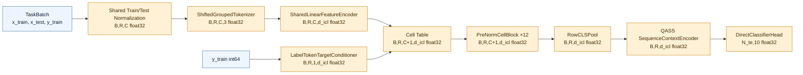

# Model Architecture

Use this reference when you need to understand the current model surface, the
active architecture target, and where the main subsystems live.

The repo now has one primary architecture candidate:

- `tabfoundry_sandwich`: the fixed-latent repeated-input Perceiver-style
  classifier used for new architecture iteration

It also keeps one incumbent reference family:

- `tabfoundry_staged`: the staged row-first classifier that remains the current
  benchmark/reference line

And it keeps one frozen anchor:

- `tabfoundry_simple`: the exact nanoTabPFN-style binary compatibility path

The legacy `tabfoundry` family has been removed. Regression is also removed for
now and will be rebuilt later on top of the promoted post-staged architecture
line rather than the removed legacy family.

Use these alongside this page:

- `docs/development/model-config.md`
- `docs/development/tabfoundry-sandwich.md`
- `docs/development/architecture-deltas.md`
- `docs/inference.md`

Key code paths:

- `src/tab_foundry/model/architectures/tabfoundry_sandwich/`
- `src/tab_foundry/model/architectures/tabfoundry_staged/`
- `src/tab_foundry/model/architectures/tabfoundry_simple.py`
- `src/tab_foundry/model/components/`
- `src/tab_foundry/model/spec.py`
- `src/tab_foundry/model/factory.py`

## Overview

Start here when you need the current model surface at a glance or want to
confirm which family the repo is actively improving.

The short version:

- one frozen family exists for trust and comparison
- one incumbent staged family exists for benchmark continuity and reference
  comparison
- one fixed-latent sandwich family exists as the primary long-term candidate
  for new architecture work

If you want repo orientation first, use
[docs/getting-started.md](../getting-started.md) or
[docs/what-is-tab-foundry.md](../what-is-tab-foundry.md).

## High-Level Structure

Two model families matter for day-to-day development:

- `tabfoundry_sandwich` is the primary architecture-candidate line.
  It is a fixed-latent repeated-input Perceiver-style encoder with one learned
  latent bank, an `R + C` row/column summary stream, repeated cross-attention
  reads plus latent Transformer stages, and test-row readout. Use
  [docs/development/tabfoundry-sandwich.md](tabfoundry-sandwich.md) for the
  dedicated breakdown.
- `tabfoundry_staged` remains the incumbent reference line.
  It is still the main comparison surface for benchmark continuity,
  recipe-based attribution, and the row-first anchor that is currently carried
  through the roadmap.

`tabfoundry_staged` itself is a resolved-surface classifier. Construction
starts from `ModelBuildSpec`, resolves a public `stage` plus optional
`module_overrides`, then builds a concrete subsystem mix.

The forward path is organized as:

1. input preparation and train/test normalization
1. feature tokenization / feature encoding
1. target conditioning
1. table blocks over row-major cell tokens
1. optional column encoder
1. row pooling
1. optional context encoder
1. direct classification head or many-class head

The implementation is split across:

- `recipes.py`: the public staged recipe registry
- `resolved.py`: surface resolution from `stage` and `module_overrides`
- `builders.py`: subsystem construction
- `forward_common.py`: shared input prep, normalization, token building, and
  row/context helpers
- `direct_head.py`: small-class direct-head flow
- `many_class.py`: many-class hierarchical flow
- `subsystems.py`: reusable staged subsystem implementations
- `model.py`: the public `TabFoundryStagedClassifier` facade

### Forward-Pass Shape Trace

Shape trace through the settled default
(`stage=qass_context`, `module_overrides.column_encoder=none`).

The resolved surface owns normalization on the shared train/test path because
its feature encoder is `shared`, but the actual transform still comes from
`input_normalization`. The repo config default is `input_normalization=none`,
so this step is an identity unless a train-split normalization mode is
selected.


```mermaid
flowchart LR
    inp[TaskBatch<br/>x_train, x_test, y_train] --> norm[Shared Train/Test Normalization<br/>B,R,C float32]
    norm --> tok[ShiftedGroupedTokenizer<br/>B,R,C,3 float32]
    tok --> fe[SharedLinearFeatureEncoder<br/>B,R,C,d_icl float32]
    y[y_train int64] --> tc[LabelTokenTargetConditioner<br/>B,R,1,d_icl float32]
    fe --> cat[Cell Table<br/>B,R,C+1,d_icl float32]
    tc --> cat
    cat --> blk[PreNormCellBlock ×12<br/>B,R,C+1,d_icl float32]
    blk --> pool[RowCLSPool<br/>B,R,d_icl float32]
    pool --> ctx[QASS SequenceContextEncoder<br/>B,R,d_icl float32]
    ctx --> head[DirectClassifierHead<br/>N_te,10 float32]

    classDef base fill:#eef5ff,stroke:#3b6ea8,color:#0f1f33;
    classDef delta fill:#fff1d6,stroke:#c67a00,color:#3d2a00;
    class inp,y base;
    class norm,tok,fe,tc,cat,blk,pool,ctx,head delta;
```

| Component | Input Shape | Output Shape | DType | Notes |
|---|---|---|---|---|
| TaskBatch ingestion | `x_train [N_tr, C]`, `x_test [N_te, C]`, `y_train [N_tr]` | `x_all [1, R, C]`, `y_train [1, N_tr]` | x: float32, y: int64 | R = N_tr + N_te |
| Shared train/test normalization | `[B, R, C]` | `[B, R, C]` | float32 | resolved by the shared feature surface; actual transform depends on `input_normalization` (`none` by default, train-split statistics or transforms for other shared modes) |
| ShiftedGroupedTokenizer | `[B, R, C]` | `[B, R, C, 3]` | float32 | shifts (0, 1, 3) |
| SharedLinearFeatureEncoder | `[B, R, C, 3]` | `[B, R, C, d_icl]` | float32 | `Linear(3, 512, bias=False)` |
| LabelTokenTargetConditioner | `y_train [B, N_tr]` | `[B, R, 1, d_icl]` | int64 → float32 | train: `Embedding(10,512)`, test: learned token |
| Cell table assembly | features + target | `[B, R, C+1, d_icl]` | float32 | cat on dim=2 |
| PreNormCellBlock ×12 | `[B, R, C+1, d_icl]` | `[B, R, C+1, d_icl]` | float32 | feature attn → row attn → FFN |
| IdentityColumnEncoder | `[B, R, C+1, d_icl]` | `[B, R, C+1, d_icl]` | float32 | no-op for default |
| RowCLSPool | `[B*R, C+1, d_icl]` | `[B, R, d_icl]` | float32 | 4 CLS tokens, 3-layer TF, project 4×512→512 |
| QASS SequenceContextEncoder | `[B, R, d_icl]` | `[B, R, d_icl]` | float32 | 12-layer QASS, label inject on train rows |
| DirectClassifierHead | `[N_te, d_icl]` | `[N_te, 10]` | float32 | Linear(512,1024) → GELU → Linear(1024,10) |

B=1 for single-task; `forward_batched` supports B>1 only for direct-head
stages.

Source: `forward_common.py:16-23,46-59,90-107`, `states.py`

### Component Details

#### Tokenizers

- **`ScalarPerFeatureTokenizer`**: token_dim=1. Unsqueezes the last
  dimension. No learnable parameters.
- **`ScalarPerFeatureMissingnessTokenizer`**: token_dim=4. Channels:
  (filled_value, is_nan, is_posinf, is_neginf). No learnable parameters.
  Rationale: explicit non-finite channels let downstream layers learn
  missingness patterns.
- **`ShiftedGroupedTokenizer`**: token_dim=3. Shifts (0, 1, 3) applied via
  `roll` on the feature axis. No learnable parameters. Rationale:
  lightweight positional signal across columns without adding parameters.

Source: `subsystems.py:21-54`

#### Feature Encoders

- **`NanoFeatureEncoder`**: Internal z-score per feature (train stats) →
  clip to [-100, 100] → `Linear(1, d_icl)`. Init: Kaiming uniform (PyTorch
  default). Rationale: nanoTabPFN parity.
- **`SharedLinearFeatureEncoder`**: `Linear(token_dim, d_icl, bias=False)`.
  No bias because upstream shared normalization centers the data. Init:
  Kaiming uniform (PyTorch default). Rationale: decouples normalization
  from encoding.

Source: `subsystems.py:57-65`, `tabfoundry_simple.py:19-32`

#### Target Conditioners

- **`MeanPaddedLinearTargetConditioner`**: mean(y_train) padded to test
  rows → `Linear(1, d_icl)`. Init: Kaiming uniform. Rationale: nanoTabPFN
  parity.
- **`LabelTokenTargetConditioner`**: `Embedding(many_class_base, d_icl)` +
  test_token `Parameter(randn * 0.02)` shape `[1, 1, d_icl]`. Init:
  Embedding Normal(0,1); test token std 0.02. Rationale: discrete
  embeddings give cleaner label separation; small-init test token avoids
  dominating features.

Source: `subsystems.py:79-106`

#### Table Blocks

- **`NanoPostNormBlock`**: Post-norm. Feature attn `[B*R, C+1, d_icl]` →
  row attn `[B*(C+1), R, d_icl]` (train-only masking) → FFN → norms
  after each sublayer. Init: `MultiheadAttention` Xavier uniform.
  Rationale: nanoTabPFN parity.
- **`PreNormCellBlock`**: Pre-norm with explicit residuals. Feature attn →
  row attn (mask blocks test-to-test; diagonal optionally unmasked when
  `allow_test_self_attention=True`) → FFN
  `Linear(d_icl, head_hidden_dim) → GELU → Linear(head_hidden_dim, d_icl)`.
  Residual branch gain: `1.0` or `(3 · tficl_n_layers)^(-0.5)` when
  `table_block_residual_scale=depth_scaled`. Rationale: pre-norm trains
  more stably in deep stacks; test-self attention preserves per-test-row
  info without cross-test leakage.

Source: `subsystems.py:109-227`, `resolved.py:349-360`

#### Column Encoder

- **`IdentityColumnEncoder`**: No-op pass-through.
- **`SetColumnEncoder`** → `TFColEncoder`: Permute cells to
  `[B*C, R, d_icl]`, then `tfcol_n_layers` ISABBlocks (default 3). Each
  ISAB: inducing points `Parameter(randn * 0.02)` shape
  `[1, n_inducing, d_icl]` (default 128), two `QASSMultiheadAttention`
  (input→inducing with QASS, inducing→input without), one FFN. Rationale:
  ISAB avoids quadratic row cost; columns as batch axis let each column
  learn independently.

Source: `blocks.py:44-140`

#### Row Pooling

- **`TargetColumnPool`**: Extract `cells[:, :, -1, :]` →
  `[B, R, d_icl]`. No learnable parameters. Rationale: target column
  accumulates row signal through cell transformer.
- **`RowCLSPool`** → `TFRowEncoder`: CLS `Parameter(randn * 0.02)` shape
  `[1, cls_tokens, d_icl]` (default 4). Prepend to feature tokens, run
  `nn.TransformerEncoder` (tfrow_n_layers=3, pre-norm,
  tfrow_n_heads=8). Output `Linear(cls_tokens * d_icl, d_icl)`. Cloned
  layers re-initialized via `_reinitialize_transformer_encoder`. RMSNorm
  disables the TransformerEncoder fast path. Rationale: multiple CLS
  tokens + projection increase row summary capacity without scaling with
  feature count.

Source: `blocks.py:143-218`

#### Context Encoder

- **`SequenceContextEncoder`**: Adds label embeddings
  `Embedding(many_class_base, d_icl)` to training rows before encoding.
  Mask: every query can attend to training rows; when
  `allow_test_self_attention=True`, each row also keeps its diagonal entry.
  `QASSTransformerEncoder` (tficl_n_layers layers + final norm). Each
  layer: pre-norm → `QASSMultiheadAttention` → residual → pre-norm → FFN
  → residual. QASS scaling:
  `q * base(log n) * (1 + tanh(gate(q)))`. Base MLP:
  `Linear(1, 64) → GELU → Linear(64, n_heads*d_head)` (all bias=False).
  Gate MLP: `Linear(d_head, 64) → GELU → Linear(64, d_head)` — final
  layer zero-initialized so QASS starts as identity. All Q/K/V/Out:
  `Linear(d_icl, d_icl, bias=False)`. FFN:
  `Linear(d_icl, d_icl*ff_expansion) → GELU → Dropout → Linear → Dropout`
  (bias=False).

Source: `subsystems.py:320-385`, `qass.py:14-201`

#### Classification Heads

- **`NanoBinaryHead`**: `Linear(d_icl, head_hidden_dim) → GELU → Linear(head_hidden_dim, 2)`.
- **`DirectClassifierHead`**: `Linear(d_icl, head_hidden_dim) → GELU → Linear(head_hidden_dim, many_class_base)`.
- **Many-class**: Hierarchical mixed-radix decomposition, digit position
  embeddings `Embedding(max_mixed_radix_digits, d_icl)`, recursive tree
  traversal. `path_nll` vs `full_probs` training modes.

Source: `subsystems.py:388-414`

#### Normalization

- **`LayerNorm`**: `(x - E[x]) / sqrt(Var[x] + eps) * γ + β`. Weight
  init 1.0, bias init 0.0.
- **`RMSNorm`**: `x / sqrt(mean(x²) + eps) * weight`. Weight init 1.0,
  no bias, no mean centering. Rationale: cheaper than LayerNorm and
  experimentally sufficient.
- Factory: `build_norm(norm_type, dim)`.

Source: `normalization.py:1-39`

For a dimension-by-dimension comparison of these components across
nanoTabPFN, TabPFN / TabPFN-2.5, the settled row-first target, and TabICLv2,
see `docs/development/architecture-deltas.md`
(Component-Level Dimension Deltas).

### Default Build Fields

`ModelBuildSpec` defaults (from `spec.py:120-149`) include both live staged
runtime knobs and compatibility fields.

#### Active Staged Architecture / Runtime Knobs

```
d_icl               = 512          # main embedding dim
input_normalization = "none"       # actual train/test normalization transform
norm_type            = "layernorm"  # global norm type
tfcol_n_heads        = 8            # TFCol attention heads
tfcol_n_layers       = 3            # TFCol ISAB blocks
tfcol_n_inducing     = 128          # TFCol inducing points
tfrow_n_heads        = 8            # TFRow attention heads
tfrow_n_layers       = 3            # TFRow transformer layers
tfrow_cls_tokens     = 4            # TFRow CLS tokens
tfrow_norm           = "layernorm"  # TFRow norm type
tficl_n_heads        = 8            # context encoder heads
tficl_n_layers       = 12           # context encoder layers
tficl_ff_expansion   = 2            # context FFN expansion factor
many_class_base      = 10           # max classes for direct head
head_hidden_dim      = 1024         # head MLP hidden dim
use_digit_position_embed = True     # many-class digit embeddings
many_class_train_mode = "path_nll"  # many-class training mode
max_mixed_radix_digits = 64         # mixed-radix digit limit
staged_dropout       = 0.0          # staged subsystem dropout
pre_encoder_clip     = None         # optional feature clipping
```

#### Compatibility Or Currently Non-Driving Fields

These fields are still carried through config resolution, export metadata, and
checkpoint compatibility, but the current `tabfoundry_staged` builders do not
use them directly.

```
d_col               = 128          # retained for config/export/checkpoint compatibility; staged TFCol is currently sized from d_icl
feature_group_size  = 1            # retained for config/export/checkpoint compatibility; staged tokenizers/encoders do not currently consume it
```

### Storage and DType Policy

- Input features: cast to float32 (`forward_common.py:20`)
- Input labels: cast to int64 (`forward_common.py:21`)
- Model parameters: float32 by default
- Activation tracing: explicit float32 cast (`model.py:191`)
- bf16 / mixed precision: not enforced by model; left to training loop.
  QASS scaler adapts dtype automatically from query tensor.
- Embedding tables: float32

## Mathematical View

This section gives the settled default row-first anchor as a compact operator
pipeline. Read it when you want the exact computations, masks, and
factorization choices rather than a prose architecture tour.

### Notation

- (B): task batch size
- (N\_{\\mathrm{tr}}), (N\_{\\mathrm{te}}): train and test row counts
- (R = N\_{\\mathrm{tr}} + N\_{\\mathrm{te}}): total row count
- (C): number of input features
- (d = d\_{\\mathrm{icl}}): shared embedding width
- (K_0): label-embedding / direct-head width, corresponding to config field
  `many_class_base`
- (q): number of row-CLS tokens, corresponding to config field
  `tfrow_cls_tokens`
- (X \\in \\mathbb{R}^{B \\times R \\times C}): concatenated train/test table
- (y \\in {0, \\dots, K_0 - 1}^{B \\times N\_{\\mathrm{tr}}}): train labels after
  the model's clamp to `many_class_base - 1`
- (\\mathcal{I}_{\\mathrm{tr}} = {0, \\dots, N_{\\mathrm{tr}} - 1}),
  (\\mathcal{I}_{\\mathrm{te}} = {N_{\\mathrm{tr}}, \\dots, R - 1}): train/test
  row index sets
- (E^{(\\ell)} \\in \\mathbb{R}^{B \\times R \\times (C+1) \\times d}): cell table
  after table block (\\ell)
- (G \\in \\mathbb{R}^{B \\times R \\times d}): one row embedding per row after
  `RowCLSPool`

The default path in this section is the settled row-first anchor:
`stage=qass_context + module_overrides.column_encoder=none`, i.e.
`row_cls + qass + no tfcol`.

### Shared Train/Test Normalization

**Motivation.** The staged default keeps train/test preprocessing on one shared
surface, but the actual transform is still delegated to
`input_normalization`.

**Operator.**

\[
\\begin{aligned}
X\_{\\mathrm{tr}} &= X[:, 0:N\_{\\mathrm{tr}}, :] \\
X\_{\\mathrm{te}} &= X[:, N\_{\\mathrm{tr}}:R, :] \\
(\\widehat{X}_{\\mathrm{tr}}, \\widehat{X}_{\\mathrm{te}})
&= \\operatorname{Norm}_{\\mathrm{shared}}
\\bigl(X_{\\mathrm{tr}}, X\_{\\mathrm{te}}; \\texttt{input_normalization}\\bigr) \\
X^{(0)} &= \\operatorname{concat}_{r}
\\bigl(\\widehat{X}_{\\mathrm{tr}}, \\widehat{X}\_{\\mathrm{te}}\\bigr)
\\end{aligned}
\]

If `input_normalization=none`, then (X^{(0)} = X). If `pre_encoder_clip=c`
is set, the model applies finite-value clipping before tokenization:

\[
X^{(0)} \\leftarrow \\operatorname{clip}(X^{(0)}, -c, c).
\]

**Interpretation.** This keeps normalization policy outside the feature encoder,
so the later shared linear map sees a consistent train/test surface.

### Shifted-Grouped Tokenizer

**Motivation.** The tokenizer injects lightweight local column context without
introducing a learned positional system.

**Operator.** Let
(\\pi_s(c) = (c + s) \\bmod C) for shifts (s \\in {0, 1, 3}). The grouped
token at feature (c) is

# \[ T\_{b,r,c,:}

\\bigl\[
X^{(0)}_{b,r,\\pi_0(c)},
X^{(0)}_{b,r,\\pi_1(c)},
X^{(0)}\_{b,r,\\pi_3(c)}
\\bigr\]
\\in \\mathbb{R}^{3}.
\]

Stacking over all rows and features gives
(T \\in \\mathbb{R}^{B \\times R \\times C \\times 3}).

**Interpretation.** Each feature token now carries its own scalar value plus two
deterministic neighboring views, which is the repo's compact substitute for a
heavier learned feature-position stack.

### Shared Linear Feature Encoder

**Motivation.** The shared feature encoder lifts the grouped scalar view into
the common (d\_{\\mathrm{icl}})-dimensional space used everywhere downstream.

**Operator.** With
(W\_{\\mathrm{feat}} \\in \\mathbb{R}^{3 \\times d}),

\[
F\_{b,r,c,:} = T\_{b,r,c,:} W\_{\\mathrm{feat}},
\\qquad
F \\in \\mathbb{R}^{B \\times R \\times C \\times d}.
\]

The staged default uses `bias=False`, so there is no additive term.

**Interpretation.** Once this projection is applied, all later modules operate
on one uniform cell embedding width instead of on raw scalars.

### Label-Token Target Conditioner

**Motivation.** The target conditioner provides explicit train-label evidence
while reserving a learned placeholder token for test rows whose labels are not
available at inference time.

**Operator.** Let
(E\_{\\mathrm{label}} \\in \\mathbb{R}^{K_0 \\times d}) be the target-conditioner
embedding table and (\\tau\_{\\mathrm{test}} \\in \\mathbb{R}^{d}) the learned test
token. For each row,

# \[ U\_{b,r,:}

\\begin{cases}
E\_{\\mathrm{label}}[y\_{b,r}], & r \\in \\mathcal{I}_{\\mathrm{tr}}, \\
\\tau_{\\mathrm{test}}, & r \\in \\mathcal{I}\_{\\mathrm{te}}.
\\end{cases}
\]

The conditioner then inserts a singleton token axis:

\[
Y\_{b,r,0,:} = U\_{b,r,:},
\\qquad
Y \\in \\mathbb{R}^{B \\times R \\times 1 \\times d}.
\]

**Interpretation.** The model sees labels as one more cell-like token rather
than as a separate side channel, which keeps later table blocks agnostic to
whether a token came from features or targets.

### Cell-Table Assembly

**Motivation.** The default stack reasons over one row-major table of cell
tokens, so feature evidence and target evidence must share one tensor.

**Operator.**

\[
E^{(0)} = \\operatorname{concat}\_{c}(F, Y)
\\in \\mathbb{R}^{B \\times R \\times (C+1) \\times d}.
\]

The final token position on the column axis is the target token.

**Interpretation.** This is the point where the model becomes a cell-table
transformer rather than separate feature and label pipelines.

### PreNorm Cell Block

**Motivation.** Each table block first mixes information across tokens within a
row, then across rows within a token position, while blocking test-to-test
leakage except for each test row's own diagonal entry.

**Operator.** Let (M = C + 1) and let (\\gamma) be the residual branch gain
((\\gamma = 1) by default, or ((3L)^{-1/2}) for
`table_block_residual_scale=depth_scaled` across (L) table blocks). For block
(\\ell),

\[
\\begin{aligned}
\\Phi^{(\\ell)} &=
\\operatorname{reshape}_{BR,M,d}\\bigl(E^{(\\ell)}\\bigr) \\
\\Phi_{\\mathrm{feat}}^{(\\ell)}
&=
\\Phi^{(\\ell)}

- \\gamma ,
  \\operatorname{MHA}_{\\mathrm{feat}}
  \\bigl(
  \\operatorname{LN}_{\\mathrm{feat}}(\\Phi^{(\\ell)}),
  \\operatorname{LN}_{\\mathrm{feat}}(\\Phi^{(\\ell)}),
  \\operatorname{LN}_{\\mathrm{feat}}(\\Phi^{(\\ell)})
  \\bigr).
  \\end{aligned}
  \]

Row attention then works on the transposed cell table. The default additive
mask (A\_{\\mathrm{cell}} \\in {0, -\\infty}^{R \\times R}) is

# \[ A\_{\\mathrm{cell}}(i,j)

\\begin{cases}
-\\infty, & i,j \\in \\mathcal{I}\_{\\mathrm{te}} \\text{ and } i \\neq j, \\
0, & \\text{otherwise}.
\\end{cases}
\]

The row-mixing update is

\[
\\begin{aligned}
\\Psi^{(\\ell)}
&=
\\operatorname{reshape}_{BM,R,d}
\\bigl(\\operatorname{transpose}_{r,c}(\\Phi\_{\\mathrm{feat}}^{(\\ell)})\\bigr) \\
\\Psi\_{\\mathrm{row}}^{(\\ell)}
&=
\\Psi^{(\\ell)}

- \\gamma ,
  \\operatorname{MHA}_{\\mathrm{row}}
  \\bigl(
  \\operatorname{LN}_{\\mathrm{row}}(\\Psi^{(\\ell)}),
  \\operatorname{LN}_{\\mathrm{row}}(\\Psi^{(\\ell)}),
  \\operatorname{LN}_{\\mathrm{row}}(\\Psi^{(\\ell)});
  A\_{\\mathrm{cell}}
  \\bigr).
  \\end{aligned}
  \]

After transposing back, the block applies the per-cell feed-forward update

\[
\\begin{aligned}
H^{(\\ell)}
&=
\\operatorname{transpose}_{r,c}^{-1}
\\bigl(\\operatorname{reshape}^{-1}(\\Psi_{\\mathrm{row}}^{(\\ell)})\\bigr) \\
E^{(\\ell+1)}
&=
H^{(\\ell)}

- \\gamma ,
  \\Bigl(
  W_2 ,
  \\operatorname{GELU}
  \\bigl(W_1 \\operatorname{LN}\_{\\mathrm{ff}}(H^{(\\ell)}) + b_1\\bigr)
- b_2
  \\Bigr).
  \\end{aligned}
  \]

**Interpretation.** The block decomposes table reasoning into
"within-row / across-columns" and "within-column / across-rows" passes, which
is the central factorization the staged family keeps from the PFN-style cell
table lineage.

### Row CLS Pooling

**Motivation.** After cell-table reasoning, the model needs one embedding per
row so later context reasoning can operate on rows rather than on every cell.

**Operator.** The settled default has no column encoder, so the input to pooling
is the last table-block output
(\\bar{E} = E^{(L\_{\\mathrm{cell}})}). Let
(C\_{\\mathrm{cls}} \\in \\mathbb{R}^{q \\times d}) be the learned CLS-token bank.
For each row,

\[
\\begin{aligned}
S^{(0)}_{b,r}
&=
\\operatorname{concat}_{c}
\\bigl(C\_{\\mathrm{cls}}, \\bar{E}_{b,r,:,:}\\bigr)
\\in \\mathbb{R}^{(q + C + 1) \\times d} \\
S^{(L_{\\mathrm{row}})}_{b,r}
&=
\\operatorname{TFRow}
\\bigl(S^{(0)}_{b,r}\\bigr) \\
G\_{b,r,:}
&=
\\operatorname{vec}
\\bigl(S^{(L\_{\\mathrm{row}})}_{b,r,0:q,:}\\bigr)
W_{\\mathrm{row}}

- b\_{\\mathrm{row}}.
  \\end{aligned}
  \]

Here `TFRow` is the pre-norm `nn.TransformerEncoder` used by `TFRowEncoder`.

**Interpretation.** The CLS bank acts as a learned bottleneck: each row can use
all of its cell tokens to write into a small fixed-width summary before the
model moves to row-level context reasoning.

### QASS Context Encoder

**Motivation.** The context encoder performs row-level in-context reasoning
after pooling and makes the attention query strength depend on the available
training context size.

**Operator.** Let
(E\_{\\mathrm{ctx}} \\in \\mathbb{R}^{K_0 \\times d}) be the context-label
embedding table. The input sequence is first label-conditioned on training rows:

# \[ H^{(0)}\_{b,r,:}

\\begin{cases}
G\_{b,r,:} + E\_{\\mathrm{ctx}}[y\_{b,r}], & r \\in \\mathcal{I}_{\\mathrm{tr}}, \\
G_{b,r,:}, & r \\in \\mathcal{I}\_{\\mathrm{te}}.
\\end{cases}
\]

The default boolean attention mask is

# \[ M\_{\\mathrm{ctx}}(i,j)

\\begin{cases}
1, & j \\in \\mathcal{I}\_{\\mathrm{tr}}, \\
1, & i = j, \\
0, & \\text{otherwise}.
\\end{cases}
\]

So every query can read training rows, and each row also keeps its own diagonal
entry. For context layer (\\ell), with (d_h = d / n\_{\\mathrm{heads}}),

\[
\\begin{aligned}
\\widetilde{H}^{(\\ell)} &= \\operatorname{LN}\_1(H^{(\\ell)}) \\
Q &= \\widetilde{H}^{(\\ell)} W_Q,\\quad
K = \\widetilde{H}^{(\\ell)} W_K,\\quad
V = \\widetilde{H}^{(\\ell)} W_V.
\\end{aligned}
\]

QASS then rescales the per-head queries using the number of training rows
(N\_{\\mathrm{tr}}), not the total row count (R):

# \[ Q'\_{h,i,:}

Q\_{h,i,:}
\\odot
\\beta_h\\bigl(\\log N\_{\\mathrm{tr}}\\bigr)
\\odot
\\Bigl(1 + \\tanh\\bigl(g_h(Q\_{h,i,:})\\bigr)\\Bigr),
\]

where (\\beta_h(\\cdot)) is the learned base MLP output for head (h) and
(g_h(\\cdot)) is the learned gate MLP. The masked attention update is

\[
\\begin{aligned}
A^{(\\ell)}
&=
\\operatorname{MaskedSoftmax}
\\Bigl(
\\frac{Q' {K}^{\\top}}{\\sqrt{d_h}},
M\_{\\mathrm{ctx}}
\\Bigr) V \\
\\bar{H}^{(\\ell)}
&=
H^{(\\ell)} + A^{(\\ell)} W_O \\
H^{(\\ell+1)}
&=
\\bar{H}^{(\\ell)}

- W^{\\mathrm{ctx}}\_2
  \\operatorname{GELU}
  \\bigl(
  W^{\\mathrm{ctx}}\_1 \\operatorname{LN}\_2(\\bar{H}^{(\\ell)})
  \\bigr).
  \\end{aligned}
  \]

After (L\_{\\mathrm{ctx}}) layers, the encoder applies one final norm:

\[
H\_{\\mathrm{ctx}} = \\operatorname{LN}_{\\mathrm{final}}
\\bigl(H^{(L_{\\mathrm{ctx}})}\\bigr).
\]

**Interpretation.** This is where the architecture becomes explicitly row-first:
cell-table structure has already been compressed, so the context stack only has
to model train-to-test and row-self interactions between row embeddings.

### Direct Classification Head

**Motivation.** The direct head is the last small-class readout from row
embeddings to class logits.

**Operator.** The head only consumes test rows:

\[
G\_{\\mathrm{te}} = H\_{\\mathrm{ctx}}[:, \\mathcal{I}\_{\\mathrm{te}}, :].
\]

With
(W^{\\mathrm{head}}\_1 \\in \\mathbb{R}^{d \\times h}),
(W^{\\mathrm{head}}\_2 \\in \\mathbb{R}^{h \\times K_0}), and
(h) corresponding to config field `head_hidden_dim`,

# \[ \\operatorname{logits}

\\Bigl(
\\operatorname{GELU}
\\bigl(G\_{\\mathrm{te}} W^{\\mathrm{head}}\_1 + b^{\\mathrm{head}}\_1\\bigr)
\\Bigr)
W^{\\mathrm{head}}\_2

- b^{\\mathrm{head}}\_2.
  \]

**Interpretation.** All of the architecture's table and context structure has
already been distilled into (G\_{\\mathrm{te}}); the head is intentionally just
an MLP readout.

### Variant: TFCol Before Row Pooling

**Motivation.** The retained TFCol variant adds an explicit column-wise set
reasoning stage before row pooling, mainly to test whether extra calibration
signal lives in per-column row sets.

**Operator.** With TFCol on, the model permutes the cell table so each column
position becomes its own row-set problem:

# \[ \\Xi^{(0)}

\\operatorname{reshape}_{B(C+1),R,d}
\\bigl(\\operatorname{transpose}_{r,c}(E^{(L\_{\\mathrm{cell}})})\\bigr).
\]

For one ISAB block, let
(P \\in \\mathbb{R}^{n\_{\\mathrm{ind}} \\times d}) be the learned inducing-point
bank and let (n\_{\\mathrm{ctx}} = R). The update is

\[
\\begin{aligned}
\\widetilde{\\Xi} &= \\operatorname{LN}\_{\\mathrm{in}}(\\Xi) \\
P'
&=
P

- \\operatorname{Attn}_{\\mathrm{QASS}}
  \\bigl(P, \\widetilde{\\Xi}, \\widetilde{\\Xi}; n_{\\mathrm{ctx}} = R\\bigr) \\
  \\Xi'
  &=
  \\Xi
- \\operatorname{Attn}
  \\bigl(
  \\widetilde{\\Xi},
  \\operatorname{LN}_{\\mathrm{mid}}(P'),
  \\operatorname{LN}_{\\mathrm{mid}}(P')
  \\bigr) \\
  \\Xi''
  &=
  \\Xi'
- \\operatorname{FF}
  \\bigl(\\operatorname{LN}\_{\\mathrm{out}}(\\Xi')\\bigr).
  \\end{aligned}
  \]

After the configured number of ISAB blocks, the tensor is reshaped back to
(\\mathbb{R}^{B \\times R \\times (C+1) \\times d}) and then fed into
`RowCLSPool`.

**Interpretation.** TFCol keeps the same later row-first stack, but it gives
each token position one extra chance to aggregate information across rows before
the model compresses rows with CLS pooling.

### Variant: Many-Class Routing

**Motivation.** The many-class path keeps the same row-first backbone but avoids
forcing one wide flat softmax when the class count grows beyond
`many_class_base`.

**Operator.** Let (K) be the task class count and let
((b_1, \\dots, b_D) = \\operatorname{balanced_bases}(K, K_0)). For each train
label (y_n), the mixed-radix digit at depth (v) is

# \[ d^{(v)}\_n

\\left\\lfloor
\\frac{y_n}{\\prod\_{j=v+1}^{D} b_j}
\\right\\rfloor
\\bmod b_v.
\]

The model conditions the same row embeddings on each digit view and averages
the resulting context outputs:

\[
\\begin{aligned}
T^{(v)}_n
&=
E_{\\mathrm{ctx}}\[d^{(v)}_n\] + p_v \\
H^{(v)}
&=
\\operatorname{Ctx}
\\bigl(G, T^{(v)}\\bigr) \\
H_{\\mathrm{mc}}
&=
\\frac{1}{D}
\\sum\_{v=1}^{D} H^{(v)}.
\\end{aligned}
\]

Here (p_v) is the optional digit-position embedding and `Ctx` is the same
context-encoder operator as above. The hierarchical tree then recursively
factors class probabilities. For a node (u) with node-local choice
distribution (\\pi_u(x)),

# \[ \\pi_u(x) = \\operatorname{softmax}\\bigl(h_u(x)\\bigr), \\qquad p(c \\mid x)

\\prod\_{u \\in \\operatorname{path}(c)}
\\pi_u(x)\\bigl[\\operatorname{child}\_u(c)\\bigr].
\]

If a node has no training examples, the implementation falls back to a uniform
split across that node's children or leaf classes. In `path_nll` mode, the
model stores the node-local logits and targets along each test sample's path
instead of materializing the full class-probability vector during training.

**Interpretation.** Many-class routing preserves the same row-first reasoning
stack, then turns the final prediction problem into repeated bounded-base
decisions that reuse the direct head and context machinery.

### Variant: `tabfoundry_simple`

**Motivation.** The frozen `tabfoundry_simple` path remains the exact binary
anchor, so it helps to show the operator differences against the active staged
default in one place.

**Operator.** The nano path keeps normalization inside the feature encoder:

\[
\\begin{aligned}
\\mu &= \\operatorname{mean}(X\_{\\mathrm{tr}}) \\
\\sigma &= \\operatorname{std}(X\_{\\mathrm{tr}}) + 10^{-20} \\
\\widetilde{X}
&=
\\operatorname{clip}
\\left(
\\frac{X - \\mu}{\\sigma},
-100,
100
\\right) \\
F\_{\\mathrm{nano}} &= \\widetilde{X} W_x + b_x.
\\end{aligned}
\]

Its target path mean-pads the training labels before projection:

\[
\\begin{aligned}
\\bar{y}
&=
\\frac{1}{N\_{\\mathrm{tr}}}
\\sum\_{i=1}^{N\_{\\mathrm{tr}}} y_i \\
Y\_{\\mathrm{nano}}
&=
\\bigl\[
y_1, \\dots, y\_{N\_{\\mathrm{tr}}},
\\bar{y}, \\dots, \\bar{y}
\\bigr\] W_y + b_y.
\\end{aligned}
\]

After concatenating feature and target cells, each nano block uses post-norm
updates and a stricter row mask:

\[
\\begin{aligned}
R'_{\\mathrm{tr}}
&=
\\operatorname{MHA}(R_{\\mathrm{tr}}, R\_{\\mathrm{tr}}, R\_{\\mathrm{tr}})

- R\_{\\mathrm{tr}} \\
  R'_{\\mathrm{te}}
  &=
  \\operatorname{MHA}(R_{\\mathrm{te}}, R\_{\\mathrm{tr}}, R\_{\\mathrm{tr}})
- R\_{\\mathrm{te}}.
  \\end{aligned}
  \]

The final row summary is just the last token position:

# \[ g\_{b,r,:} = E^{(L)}_{b,r,C,:}, \\qquad \\operatorname{logits}_{\\mathrm{nano}}

\\operatorname{MLP}\\bigl(g\_{b,\\mathcal{I}\_{\\mathrm{te}},:}\\bigr).
\]

**Interpretation.** Relative to the staged default, the frozen nano anchor keeps
normalization and target encoding inside the old PFN-compatible pathway, reads
rows out from the target column directly, and has no separate row-context
encoder after pooling.

## Public Stage Surface

The supported public stages are:

- `nano_exact`
- `label_token`
- `shared_norm`
- `prenorm_block`
- `small_class_head`
- `test_self`
- `grouped_tokens`
- `row_cls_pool`
- `column_set`
- `qass_context`
- `many_class`

`model.stage` is still the stable public selector, but new research work should
prefer queue-managed `stage_label + module_overrides` so changes stay isolated
and attributable.

At a high level, the staged family evolves along these axes:

- feature encoder: `nano` vs `shared`
- target conditioner: mean-padded linear vs label token
- table block: nano-style postnorm vs prenorm
- tokenizer: scalar-per-feature vs shifted-grouped variants
- row pool: target-column vs row-CLS pooling
- column encoder: none vs `tfcol`
- context encoder: none vs plain vs QASS
- head: binary direct, small-class, or many-class

### Stage Ladder Component Matrix

Each public stage resolves to a fixed subsystem mix. Stages inherit from
predecessors, and `module_overrides` can mix-and-match individual components
across stage boundaries.

| Stage | Feature Enc | Target Cond | Tokenizer | Table Block | Row Pool | Col Enc | Context Enc | Head | Norm Mode |
|---|---|---|---|---|---|---|---|---|---|
| `nano_exact` | nano | mean_padded_linear | scalar_per_feature | nano_postnorm | target_column | none | none | binary_direct | internal |
| `label_token` | nano | label_token | scalar_per_feature | nano_postnorm | target_column | none | none | binary_direct | internal |
| `shared_norm` | shared | label_token | scalar_per_feature | nano_postnorm | target_column | none | none | binary_direct | shared |
| `prenorm_block` | shared | label_token | scalar_per_feature | prenorm | target_column | none | none | binary_direct | shared |
| `small_class_head` | shared | label_token | scalar_per_feature | prenorm | target_column | none | none | small_class | shared |
| `test_self` | shared | label_token | scalar_per_feature | prenorm_test_self | target_column | none | none | small_class | shared |
| `grouped_tokens` | shared | label_token | shifted_grouped | prenorm_test_self | target_column | none | none | small_class | shared |
| `row_cls_pool` | shared | label_token | shifted_grouped | prenorm_test_self | row_cls | none | plain | small_class | shared |
| `column_set` | shared | label_token | shifted_grouped | prenorm_test_self | row_cls | tfcol | plain | small_class | shared |
| `qass_context` | shared | label_token | shifted_grouped | prenorm_test_self | row_cls | tfcol | qass | small_class | shared |
| `many_class` | shared | label_token | shifted_grouped | prenorm_test_self | row_cls | tfcol | qass | many_class | shared |

Source: `recipes.py:58-257`

For a step-by-step walkthrough of what changes between each adjacent pair of
stages, see `docs/development/architecture-deltas.md` (Stage Delta
Walkthrough).

The public stage ladder does not exhaust every resolved-surface knob. The main
override-only axes worth tracking separately are:

- `post_encoder_norm`
- `post_stack_norm`
- `table_block_residual_scale`
- `allow_test_self_attention` (also set implicitly by `test_self` and later
  stages)

## Default Row-First Anchor

TF-RD-008 is now closed. The normative row-first classification default is the
`qass_context` staged surface with `module_overrides.column_encoder=none`, which
corresponds to `row_cls + qass + no tfcol`.

The settled default stack is:

- shared feature encoder on the shared normalization surface
- shifted-grouped tokenizer
- label-token target conditioning
- prenorm cell-table blocks with test-self attention enabled
- no column encoder by default
- row-CLS pooling
- QASS context encoder
- small-class direct classification head

This is the default because the final missing-permitting validator
`qass_tfcol_large_missing_validation_v1` produced a mixed result: the retained
TFCol variant improved final Brier and ROC AUC, but it did not beat the no-TFCol
line on final log loss. In that tie state, the repo now prefers the simpler and
lower-runtime line as the default row-first anchor.

## Settled Default Resolved Surface

`qass_context` by itself still resolves to the stage recipe with
`column_encoder=tfcol`. The settled default used throughout this document is
the explicit resolved surface:

```bash
.venv/bin/tab-foundry dev resolve-config --json model.stage=qass_context +model.module_overrides.column_encoder=none
```

Trimmed resolved excerpt:

```json
"module_selection": {
  "allow_test_self_attention": true,
  "column_encoder": "none",
  "context_encoder": "qass",
  "feature_encoder": "shared",
  "head": "small_class",
  "post_encoder_norm": "none",
  "post_stack_norm": "none",
  "row_pool": "row_cls",
  "table_block_residual_scale": "none",
  "table_block_style": "prenorm",
  "target_conditioner": "label_token",
  "tokenizer": "shifted_grouped"
}
```

```json
"module_hyperparameters": {
  "column_encoder": {
    "name": "none",
    "n_heads": null,
    "n_inducing": null,
    "n_layers": null,
    "norm_type": null
  },
  "context_encoder": {
    "allow_test_self_attention": true,
    "ff_expansion": 2,
    "n_heads": 8,
    "n_layers": 12,
    "name": "qass",
    "norm_type": "layernorm",
    "use_qass": true
  },
  "row_pool": {
    "cls_tokens": 4,
    "n_heads": 8,
    "n_layers": 3,
    "name": "row_cls",
    "norm_type": "layernorm"
  },
  "table_block": {
    "allow_test_self_attention": true,
    "mlp_hidden_dim": 1024,
    "n_heads": 8,
    "norm_type": "layernorm",
    "residual_branch_gain": 1.0,
    "residual_scale": "none",
    "style": "prenorm"
  }
}
```

```json
"task_contract": {
  "max_classes": 10,
  "min_classes": 2,
  "supports_many_class": false
}
```

At repo defaults, this resolved no-TFCol surface has `71,445,258` parameters.
For comparison, the unmodified stage recipe:

```bash
.venv/bin/tab-foundry dev resolve-config --json model.stage=qass_context
```

resolves to `column_encoder=tfcol` with `81,339,018` parameters. The settled
default therefore removes `9,893,760` parameters from the raw `qass_context`
stage recipe while keeping the same public stage label.

## Retained Alternative

The main retained alternative is `row_cls + qass + tfcol_heads4`, which is the
same `qass_context` staged surface with TFCol enabled at `tfcol_n_heads=4`.

That variant remains valid because it still improves calibration-oriented
metrics on the missing-permitting large bundle and was the only TFCol adequacy
winner worth carrying forward. It is not the default because:

- it missed the final log-loss promotion rule on the missing-permitting bundle
- it adds extra column-set machinery and runtime cost
- TF-RD-008 now treats the simpler no-TFCol line as the canonical parent for
  later post-008 work unless a calibration-oriented question explicitly calls
  for the TFCol branch

## Normalization And Tokenization

The staged family has two normalization regimes:

- `internal`: the nano-compatible path used by early benchmark-anchor stages
- `shared`: the repo-wide normalization path used by later staged surfaces

The normalization owner is resolved from the stage recipe rather than inferred
from CLI defaults.

Tokenization choices include:

- `scalar_per_feature`
- `scalar_per_feature_nan_mask`
- `shifted_grouped`

The non-finite-aware tokenizer keeps separate pre-embedding channels for:

- `NaN`
- `+inf`
- `-inf`

Finite-only clipping is applied before encoding when `pre_encoder_clip` is set.

## Heads And Class Coverage

The repo is classification-only today.

The staged family has two main head modes:

- direct heads for binary and ordinary small-class classification
- hierarchical many-class routing for larger class counts

The many-class path uses:

- mixed-radix conditioning
- optional digit-position embeddings
- hierarchical class routing
- `many_class_train_mode` of `path_nll` or `full_probs`

On the `many_class` stage, tasks with `num_classes <= many_class_base` still
use the direct head and return logits. Hierarchical mixed-radix routing only
activates once `num_classes > many_class_base`.

The staged many-class implementation is intentionally still single-task at the
`TaskBatch` level. Batched tensor fast paths exist for direct-head execution,
but `_forward_many_class()` now errors clearly if asked to process `B > 1`.

## `tabfoundry_simple`

`tabfoundry_simple` remains as the frozen exact binary anchor.

Its role is deliberately narrow:

- exact benchmark-anchor reproduction
- binary-only classification
- compatibility baseline for comparisons against `tabfoundry_staged`

It is not the place for new architecture work.

## Output Surface

Shared model outputs now live in `src/tab_foundry/model/outputs.py`.

Active output type:

- `ClassificationOutput`

There is no longer a repo-supported `RegressionOutput`.

## Code Navigation Map

- `src/tab_foundry/model/spec.py`
  - canonical build spec, supported arch/task/stage values, and checkpoint
    compatibility rules
- `src/tab_foundry/model/factory.py`
  - model construction for `tabfoundry_simple`, `tabfoundry_staged`, and
    `tabfoundry_sandwich`
- `src/tab_foundry/model/architectures/tabfoundry_sandwich/model.py`
  - public fixed-latent `y` / byte-array `x` sandwich classifier
- `src/tab_foundry/model/architectures/tabfoundry_staged/model.py`
  - public staged classifier facade
- `src/tab_foundry/model/architectures/tabfoundry_staged/recipes.py`
  - public stage registry
- `src/tab_foundry/model/architectures/tabfoundry_staged/resolved.py`
  - resolved staged surface metadata
- `src/tab_foundry/model/architectures/tabfoundry_staged/subsystems.py`
  - staged subsystem implementations
- `src/tab_foundry/model/architectures/tabfoundry_staged/forward_common.py`
  - shared forward-path helpers
- `src/tab_foundry/model/architectures/tabfoundry_staged/direct_head.py`
  - direct-head execution path
- `src/tab_foundry/model/architectures/tabfoundry_staged/many_class.py`
  - many-class execution path
- `src/tab_foundry/model/architectures/tabfoundry_simple.py`
  - frozen exact binary anchor
- `src/tab_foundry/model/components/`
  - reusable QASS, many-class, non-finite, and normalization components

## Maintenance Notes

- `tabfoundry_sandwich` is the primary architecture-iteration surface.
- `tabfoundry_staged` remains the incumbent reference and benchmark line; keep
  work there attributable and reference-oriented unless a roadmap item says
  otherwise.
- `tabfoundry_simple` should change only for bug fixes or compatibility
  maintenance.
- Future regression support should be introduced on the promoted architecture
  line rather than by reviving the removed legacy `tabfoundry` family.
