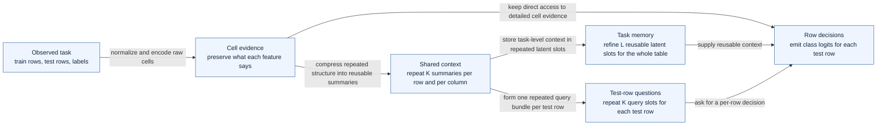

# Model Architecture

Use this reference when you need the current model surface, the active
architecture target, and the live sandwich forward path.

The repo now has one active architecture-development lane:

- `tabfoundry_sandwich`: the primary classification architecture target and
  scaling-prep family

It also keeps two comparison lanes:

- `tabfoundry_simple`: the frozen PFN-style control
- `tabfoundry_staged`: the historical row-first reference line and benchmark
  comparison surface

Regression is still deferred. The active model surface is classification-only.

Use these alongside this page:

- `docs/development/model-config.md`
- `docs/development/tabfoundry-sandwich.md`
- `docs/development/roadmap.md`
- `docs/inference.md`

Key code paths:

- `src/tab_foundry/model/architectures/tabfoundry_sandwich/model.py`
- `src/tab_foundry/model/components/tabular_primitives.py`
- `src/tab_foundry/model/components/attention.py`
- `src/tab_foundry/model/components/normalization.py`
- `src/tab_foundry/model/spec.py`
- `src/tab_foundry/model/factory.py`

## Architecture Roles

- `tabfoundry_sandwich` is the active model family.
  It owns the current simplification, dagzoo transfer, many-class plus
  missingness, runtime, and scaling work.
- `tabfoundry_simple` remains the frozen benchmark-trust lane.
  Use it when you need the exact nanoTabPFN-style control.
- `tabfoundry_staged` is still useful as a historical comparison surface, but
  it is no longer the center of the roadmap or architecture docs.

## Intent Map

Start here if you want the model's job before its tensor mechanics.

```mermaid
flowchart LR
    classDef state fill:#eef5ff,stroke:#3567a6,color:#10233a,stroke-width:1px;

    task["Observed task<br/>train rows, test rows, labels"]:::state
    evidence["Cell evidence<br/>preserve what each feature says"]:::state
    context["Shared context<br/>repeat K summaries per row and per column"]:::state
    memory["Task memory<br/>refine L reusable latent slots for the whole table"]:::state
    queries["Test-row questions<br/>repeat K query slots for each test row"]:::state
    logits["Row decisions<br/>emit class logits for each test row"]:::state

    task -->|normalize and encode raw cells| evidence
    evidence -->|compress repeated structure into reusable summaries| context
    context -->|store task-level context in repeated latent slots| memory
    context -->|form one repeated query bundle per test row| queries
    evidence -->|keep direct access to detailed cell evidence| logits
    memory -->|supply reusable context| logits
    queries -->|ask for a per-row decision| logits
```

## Current Sandwich Model

`tabfoundry_sandwich` is a small-class, classification-only hybrid full-cell /
summary-stream Perceiver-style model.

The current forward path is:

1. normalize `x_train` and `x_test` with one shared train/test normalization
   path
1. tokenize each scalar cell into four missingness-aware channels:
   `value`, `is_nan`, `is_posinf`, `is_neginf`
1. project those channels to `d_icl`
1. add row Fourier positions, column Fourier positions, and learned
   feature-type embeddings
1. optionally mix cells before the Perceiver using:
   - per-row self-attention over feature cells
   - per-column ISAB-style row mixing over rows
1. build three conditioned token streams from the same encoded cell table:
   - full-cell stream over all `R * C` cells
   - row-summary stream with $K$ = `sandwich_summary_tokens_per_axis` learned
     summary tokens per row
   - column-summary stream with $K$ learned summary tokens per column
1. let stage `0` of the latent array read from `full-cell + summary`
1. let later Perceiver stages read only from the compact summary stream
1. form test-row readout queries from the test-row summary tokens
1. read those queries against:
   - final latents
   - then the full-cell stream
1. pool the `K` updated query tokens back to one state per test row
1. emit logits through the direct classifier head

Mental model:

- full-cell stream = high-bandwidth raw table evidence
- row and column summary streams = compact repeated context
- latent array = fixed-capacity memory and refinement state
- readout = test-row summary queries with both latent memory access and a
  full-cell bypass

## Tensor-Level Structure

Notation:

- $B$ = task batch size
- $N_{tr}$ = train-row count
- $N_{te}$ = test-row count
- $R = N_{tr} + N_{te}$
- $C$ = feature count
- $K$ = `sandwich_summary_tokens_per_axis`
- $L$ = `sandwich_latents`

```mermaid
flowchart LR
    classDef tensor fill:#eef5ff,stroke:#3567a6,color:#10233a,stroke-width:1px;

    xtrain["x_train<br/>[$$B$$, $$N_{tr}$$, $$C$$]"]:::tensor
    xtest["x_test<br/>[$$B$$, $$N_{te}$$, $$C$$]"]:::tensor
    ytrain["y_train<br/>[$$B$$, $$N_{tr}$$]"]:::tensor
    xall["normalized x_all<br/>[$$B$$, $$R$$, $$C$$]"]:::tensor
    xtok["tokenized cells<br/>[$$B$$, $$R$$, $$C$$, 4]"]:::tensor
    cells["cell tokens<br/>[$$B$$, $$R$$, $$C$$, d_icl]"]:::tensor
    full["full-cell stream<br/>[$$B$$, $$R \\cdot C$$, d_icl]"]:::tensor
    rowsum["row summary tokens<br/>[$$B$$, $$R \\cdot K$$, d_icl]<br/>$$K$$ repeated summary slots per row"]:::tensor
    colsum["column summary tokens<br/>[$$B$$, $$C \\cdot K$$, d_icl]<br/>$$K$$ repeated summary slots per column"]:::tensor
    summary["summary stream<br/>[$$B$$, $$K \\cdot (R + C)$$, d_icl]"]:::tensor
    lat0["latent seed<br/>[$$B$$, $$L$$, d_icl]<br/>$$L$$ repeated latent slots"]:::tensor
    latf["final latents<br/>[$$B$$, $$L$$, d_icl]<br/>$$L$$ refined latent slots"]:::tensor
    testq["test-row query bank<br/>[$$B$$, $$N_{te} \\cdot K$$, d_icl]<br/>$$K$$ repeated query slots per test row"]:::tensor
    rows["test-row states<br/>[$$B$$, $$N_{te}$$, d_icl]"]:::tensor
    logits["logits<br/>[$$B$$, $$N_{te}$$, many_class_base]"]:::tensor

    xtrain -->|shared train/test normalization + concatenate train/test rows| xall
    xtest -->|shared train/test normalization + concatenate train/test rows| xall
    xall -->|missingness-aware tokenization| xtok
    xtok -->|shared projection + row/col Fourier + feature-type embedding + optional pre-Perceiver mixing| cells

    cells -->|flatten + train-label/test-query + role + token-type conditioning| full
    ytrain -->|train-label conditioning for train rows| full

    cells -->|learned row-summary queries repeated K times per row + row conditioning| rowsum
    ytrain -->|train-label conditioning for train rows| rowsum

    cells -->|learned column-summary queries repeated K times per column + column token typing| colsum
    rowsum -->|concatenate row summaries| summary
    colsum -->|concatenate column summaries| summary

    lat0 -->|stage 0 reads full + summary; later stages read summary only with latent self-refinement| latf
    full -->|stage 0 KV| latf
    summary -->|stage 0 + later-stage KV| latf

    rowsum -->|slice test rows and keep K repeated query slots per row| testq
    testq -->|latent readout + full-cell readout + pool K repeated queries per row| rows
    latf -->|readout memory| rows
    full -->|raw cell evidence| rows

    rows -->|direct classifier head| logits
```

## Forward-Pass Shape Trace

| Component | Input Shape | Output Shape | Notes |
| --- | --- | --- | --- |
| Task ingestion | `x_train` [$B$, $N_{tr}$, $C$], `x_test` [$B$, $N_{te}$, $C$], `y_train` [$B$, $N_{tr}$] | `x_all` [$B$, $R$, $C$] | $B = 1$ for single-task forward; task batching is also supported |
| Shared normalization | [$B$, $R$, $C$] | [$B$, $R$, $C$] | uses `input_normalization`; preserves non-finite markers |
| Missingness tokenizer | [$B$, $R$, $C$] | [$B$, $R$, $C$, 4] | channels are `value`, `is_nan`, `is_posinf`, `is_neginf` |
| Shared feature encoder | [$B$, $R$, $C$, 4] | [$B$, $R$, $C$, `d_icl`] | linear projection only |
| Positional/type enrichment | [$B$, $R$, $C$, `d_icl`] | [$B$, $R$, $C$, `d_icl`] | adds row Fourier, column Fourier, and feature-type embeddings |
| Pre-Perceiver mixer | [$B$, $R$, $C$, `d_icl`] | [$B$, $R$, $C$, `d_icl`] | row self-attn then column ISAB row mixing |
| Full-cell stream | [$B$, $R$, $C$, `d_icl`] | [$B$, $R * C$, `d_icl`] | adds train/test role, label/query conditioning, and cell token type |
| Row summary stream | [$B$, $R$, $C$, `d_icl`] | [$B$, $R * K$, `d_icl`] | learned row-summary queries with $K$ repeated slots per row plus label/query and role conditioning |
| Column summary stream | [$B$, $R$, $C$, `d_icl`] | [$B$, $C * K$, `d_icl`] | learned column-summary queries with $K$ repeated slots per column plus token type |
| Summary stream | row + column summaries | [$B$, $K * (R + C)$, `d_icl`] | compact repeated context |
| Latent seed | none | [$B$, $L$, `d_icl`] | learned latent bank with $L$ repeated slots, expanded per task |
| Perceiver stages | latents + input stream | [$B$, $L$, `d_icl`] | stage `0` reads full-cell + summary; later stages read summary only |
| Test query bank | test-row summary tokens | [$B$, $N_{te} * K$, `d_icl`] | derived from the row-summary stream with $K$ repeated query slots per test row |
| Latent readout | queries + final latents | [$B$, $N_{te} * K$, `d_icl`] | first readout pass |
| Full-cell readout | updated queries + full-cell stream | [$B$, $N_{te}$, $K$, `d_icl`] | second readout pass |
| Test-row pool | [$B$, $N_{te}$, $K$, `d_icl`] | [$B$, $N_{te}$, `d_icl`] | pool the $K$ repeated query slots down to one state per test row |
| Direct head | [$B$, $N_{te}$, `d_icl`] | [$B$, $N_{te}$, `many_class_base`] | small-class classifier head |

## Current Sandwich Defaults

Resolved sandwich defaults come from `src/tab_foundry/model/spec.py`.

| Field | Default | Meaning |
| --- | --- | --- |
| `model.arch` | `tabfoundry_sandwich` when selected | choose the sandwich family |
| `d_icl` | `60` | shared working width |
| `input_normalization` | `none` | shared train/test normalization mode |
| `many_class_base` | `10` | direct-head output width and current small-class ceiling |
| `head_hidden_dim` | `96` | hidden width inside `DirectClassifierHead` |
| `pre_encoder_clip` | `null` | optional finite-value clip before encoding |
| `norm_type` | `layernorm` | only supported norm for sandwich today |
| `sandwich_latents` | `24` | learned latent slots |
| `sandwich_layers` | `2` | repeated Perceiver cross-read stages |
| `sandwich_heads` | `4` | attention heads across sandwich blocks |
| `sandwich_ff_expansion` | `2` | FFN expansion factor across sandwich blocks |
| `sandwich_summary_tokens_per_axis` | `4` | learned row summaries per row and column summaries per column |
| `sandwich_self_attention_per_cross` | `4` | latent self-attention blocks after each cross-read |
| `sandwich_pre_row_attention_layers` | `1` | pre-Perceiver row-wise feature self-attention blocks |
| `sandwich_pre_column_attention_layers` | `1` | pre-Perceiver column-wise ISAB row mixers |
| `sandwich_pre_column_inducing_tokens` | `16` | inducing-token count in each pre-column ISAB block |

## Runtime And Input Contract

The current sandwich implementation has a tighter contract than the older
staged family.

- task: classification only
- class count: `2 <= num_classes <= many_class_base`
- feature metadata: explicit `feature_types` are required
- supported tensor layouts:
  - single-task: `x_train [N_tr,C]`, `x_test [N_te,C]`, `y_train [N_tr]`
  - task-batched: `x_train [B,N_tr,C]`, `x_test [B,N_te,C]`,
    `y_train [B,N_tr]`
- train rows: at least one training row is required
- labels: at least one training label is required
- norm family: only `layernorm` is accepted
- activation checkpointing: supported and opt-in
- activation tracing: supported and opt-in

Rejected staged-only fields:

- `stage`
- `stage_label`
- `module_overrides`

## Other Model Families

- `tabfoundry_simple` is still the frozen PFN-style control.
  Keep it for exact control comparisons and benchmark trust.
- `tabfoundry_staged` is still available, but it is now comparison context
  rather than the center of architecture documentation.
  Its settled row-first result remains useful background, but the live design
  work is on the sandwich family.
