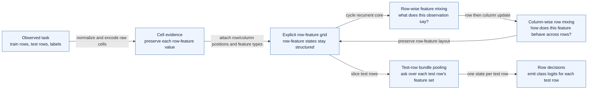

# Model Architecture

Use this reference when you need the live architecture surface, the active
model family, and the current grid/sandwich forward paths.

The repo now has one carried architecture-development lane:

- `grid_sandwich`: the current classification architecture anchor after
  TF-RD-026 row `10` promoted a two-layer recurrent SwiGLU grid core on
  April 22, 2026

It also keeps three comparison lanes plus one sidecar follow-on lane:

- `tabfoundry_sandwich`: the previous carried scaling-prep family and the
  in-family comparison baseline for the grid promotion
- `tabfoundry_simple`: the frozen PFN-style control
- `tabfoundry_staged`: the historical row-first reference line and benchmark
  comparison surface
- `routed_sandwich`: a sidecar routed-residual / evidence-bank follow-on kept
  as negative evidence rather than the active development path

Regression is still deferred. The active model surface is classification-only.

Use these alongside this page:

- `docs/development/model-config.md`
- `docs/development/roadmap.md`
- `docs/inference.md`

Key code paths:

- `src/tab_foundry/model/architectures/tabfoundry_sandwich/model.py`
- `src/tab_foundry/model/architectures/routed_sandwich/model.py`
- `src/tab_foundry/model/architectures/grid_sandwich/model.py`
- `src/tab_foundry/model/components/tabular_primitives.py`
- `src/tab_foundry/model/components/attention.py`
- `src/tab_foundry/model/components/normalization.py`
- `src/tab_foundry/model/spec.py`
- `src/tab_foundry/model/factory.py`

## Architecture Roles

- `grid_sandwich` is the active model family and carried architecture anchor.
  It owns the default workstation surface for new classification architecture
  work while the next guardrail is replication and larger-rung validation.
- `tabfoundry_sandwich` remains the previous carried family.
  It owns the historical simplification, dagzoo transfer, many-class plus
  missingness, runtime, and scaling evidence and remains the matched in-family
  comparison line for grid work.
- `tabfoundry_simple` remains the frozen benchmark-trust lane.
  Use it when you need the exact nanoTabPFN-style control.
- `tabfoundry_staged` is still useful as a historical comparison surface, but
  it is no longer the center of the roadmap or architecture docs.
- `routed_sandwich` is a follow-on experiment family, not the carried baseline.
  It keeps the tokenizer, feature encoder, FiLM conditioning, positions, and
  direct head, but replaces the latent/query residual path with two routed
  streams and uses learned row, column, and evidence-bank context tokens.
- `grid_sandwich` keeps the encoded `[row, feature]` grid explicit through
  alternating row-wise and column-wise mixers. The current anchor uses two
  distinct grid-mixer layers, cycles them four times for eight total
  applications, then pools each test-row feature bundle directly.

## Previous TF-RD-009 Comparison Surface

The previous matched in-family comparison contract was the `144x4`
`tabfoundry_sandwich` surface inherited by the Muon training-dynamics study
under `tf_rd_009_muon_training_dynamics_lmo_transfer_medium_v1`. It used the
same medium v6 corpus and OpenML medium benchmark surface, which is why the
grid rows can be read against the older sandwich line.

Interpret this as historical comparison context for the current grid anchor,
not as the active default. The broader Muon winner context remains relevant for
scaling, but the live architecture lane is now grid-preserving.

## Current Grid Anchor

The current carried architecture is TF-RD-026 row `10`,
`delta_tf_rd_026_grid_recurrent_8_unique2_swiglu_v1`, registered as
`sd_tf_rd_026_grid_sandwich_broad_ml_v1_10_delta_tf_rd_026_grid_recurrent_8_unique2_swiglu_v1_v2`.
It runs on the same medium v6 corpus, Muon optimizer, 5000-step budget, and
OpenML medium benchmark surface as the control replay.

| Row | Architecture | Final log loss | Final Brier | Final ROC AUC | Params | Interpretation |
| --- | --- | ---: | ---: | ---: | ---: | --- |
| `01_control_replay` | four distinct GELU grid layers | `0.4223376775` | `0.2575211571` | `0.8118131392` | `3,550,522` | Replayed the previous executable grid control. |
| `04_swiglu_ffn` | four distinct SwiGLU grid layers | `0.4208939494` | `0.2560712825` | `0.8116368786` | `3,552,058` | Positive standalone FFN-capacity signal. |
| `10_recurrent_8_unique2_swiglu` | two distinct SwiGLU grid layers cycled four times | `0.4181767299` | `0.2551413012` | `0.8132547851` | `2,205,754` | Promoted anchor; best final log loss and lower parameter count than the control. |
| `11_recurrent_8_unique4_swiglu` | four distinct SwiGLU grid layers cycled twice | `0.4183364953` | `0.2553847774` | `0.8142223497` | `3,552,058` | Close comparison row with slightly better ROC AUC but worse final log loss and more parameters. |

The read is that the useful TF-RD-026 change is not generic recurrent sharing
alone. The winning shape preserves multiple learned grid transformations, adds
gated cell-token FFNs, and spends extra compute by cycling a compact two-layer
core. The one-layer recurrent baseline was smaller but generalized worse, and
the four-layer recurrent variant was close but less efficient.

## Intent Map

This diagram summarizes the design intent behind the current grid architecture.

```mermaid
flowchart LR
    classDef state fill:#eef5ff,stroke:#3567a6,color:#10233a,stroke-width:1px;

    task["Observed task<br/>train rows, test rows, labels"]:::state
    evidence["Cell evidence<br/>preserve each row-feature value"]:::state
    grid["Explicit row-feature grid<br/>row-feature states stay structured"]:::state
    rows["Row-wise feature mixing<br/>what does this observation say?"]:::state
    columns["Column-wise row mixing<br/>how does this feature behave across rows?"]:::state
    pool["Test-row bundle pooling<br/>ask over each test row's feature set"]:::state
    logits["Row decisions<br/>emit class logits for each test row"]:::state

    task -->|normalize and encode raw cells| evidence
    evidence -->|attach row/column positions and feature types| grid
    grid -->|cycle recurrent core| rows
    rows -->|row then column update| columns
    columns -->|preserve row-feature layout| grid
    grid -->|slice test rows| pool
    pool -->|one state per test row| logits
```

## Grid Design Summary

`grid_sandwich` is the active small-class, classification-only classifier. It
uses the same tokenizer, feature encoder, feature-type conditioning, and
row/column position enrichment as the previous carried family, but it does not
collapse the table into a latent-memory stream before the core model.

The live design combines:

- one shared train/test normalization path and a missingness-aware scalar
  tokenizer
- shared value projection followed by feature-type FiLM modulation, then row
  Fourier and column Fourier position enrichment
- an optional inherited pre-mixer with row-wise feature attention and
  column-wise ISAB row mixing
- train-label conditioning added only to train-row feature tokens, plus a
  train/test row-role embedding
- a recurrent grid core that keeps hidden states shaped as `[B, R, C, d_icl]`,
  alternates row-wise feature self-attention with column-wise row ISAB mixing,
  and applies two distinct SwiGLU grid-mixer layers four times each
- a learned test-row pool query that attends over each test row's feature
  bundle directly before the `DirectMulticlassHead`

Mental model:

- cell grid = the primary high-bandwidth evidence surface
- row mixer = per-observation feature interactions
- column mixer = per-feature cross-row evidence sharing
- recurrent core = eight row/column refinement applications through two learned
  grid transformations
- readout = one learned query per test row attending over that row's feature
  bundle

## Grid Forward Path

The implementation lives in
`src/tab_foundry/model/architectures/grid_sandwich/model.py`.

Notation:

- $B$ = task batch size
- $N_{tr}$ = train-row count
- $N_{te}$ = test-row count
- $R = N_{tr} + N_{te}$
- $C$ = feature count

```mermaid
flowchart TB
    classDef tensor fill:#eef5ff,stroke:#3567a6,color:#10233a,stroke-width:1px;
    classDef embed fill:#fff3db,stroke:#b87316,color:#3b2500,stroke-width:1px;
    classDef attn fill:#e9f7ef,stroke:#2e8b57,color:#123524,stroke-width:1px;
    classDef head fill:#f5ebff,stroke:#7a4db3,color:#2c1548,stroke-width:1px;

    xtrain["x_train<br/>[<i>B</i>, <i>N</i><sub>tr</sub>, <i>C</i>]"]:::tensor
    xtest["x_test<br/>[<i>B</i>, <i>N</i><sub>te</sub>, <i>C</i>]"]:::tensor
    ytrain["y_train<br/>[<i>B</i>, <i>N</i><sub>tr</sub>]"]:::tensor

    norm(["Shared train/test normalization"]):::embed
    xall["normalized x_all<br/>[<i>B</i>, <i>R</i>, <i>C</i>]"]:::tensor
    tok(["Missingness-aware tokenizer<br/>[value, is_nan, is_posinf, is_neginf]"]):::embed
    xtok["tokenized cells<br/>[<i>B</i>, <i>R</i>, <i>C</i>, 4]"]:::tensor
    enc(["Shared value projection + Fourier row/col + feature-type embedding"]):::embed
    cells["cell tokens<br/>[<i>B</i>, <i>R</i>, <i>C</i>, d_icl]"]:::tensor
    pre_row[[Optional pre-row feature self-attention<br/>× sandwich_pre_row_attention_layers]]:::attn
    pre_col[[Optional pre-column ISAB row mixing<br/>× sandwich_pre_column_attention_layers]]:::attn
    premixed["premixed cell grid<br/>[<i>B</i>, <i>R</i>, <i>C</i>, d_icl]"]:::tensor

    labels(["Train-label conditioning + row-role embedding<br/>test-row label contribution is zeroed"]):::embed
    conditioned["label-conditioned grid<br/>[<i>B</i>, <i>R</i>, <i>C</i>, d_icl]"]:::tensor

    subgraph grid_core["Recurrent grid core: 2 unique layers × 4 cycles"]
        row_mix[[Row mixer<br/>self-attention over features within each row]]:::attn
        row_mixed["row-mixed grid<br/>[<i>B</i>, <i>R</i>, <i>C</i>, d_icl]"]:::tensor
        col_mix[[Column mixer<br/>ISAB over rows within each feature]]:::attn
        col_mixed["column-mixed grid<br/>[<i>B</i>, <i>R</i>, <i>C</i>, d_icl]"]:::tensor
        row_mix --> row_mixed --> col_mix --> col_mixed
    end

    test_grid["test-row feature bundles<br/>[<i>B</i>, <i>N</i><sub>te</sub>, <i>C</i>, d_icl]"]:::tensor
    pool[[Learned row-pool query<br/>cross-attends to each test-row feature bundle]]:::attn
    test_rows["test-row states<br/>[<i>B</i>, <i>N</i><sub>te</sub>, d_icl]"]:::tensor
    head([DirectClassifierHead]):::head
    logits["logits<br/>[<i>B</i>, <i>N</i><sub>te</sub>, many_class_base]"]:::tensor

    xtrain --> norm
    xtest --> norm
    norm --> xall
    xall --> tok --> xtok --> enc --> cells --> pre_row --> pre_col --> premixed
    premixed --> labels --> conditioned
    ytrain --> labels
    conditioned --> row_mix
    col_mixed -->|next recurrent application| row_mix
    col_mixed -->|slice test rows| test_grid --> pool --> test_rows --> head --> logits
```

Read the diagram as:

- cell encoding happens once, before any grid-core layer
- the optional pre-mixer is still a shallow row/column cell-grid mixer
- train labels are added to train rows only; test rows receive row-role context
  but no label value
- every grid-core application preserves `[B, R, C, d_icl]`
- row mixing attends across features inside one row
- column mixing attends across rows inside one feature using inducing tokens
- the current anchor cycles two unique grid-mixer layers for eight total
  row/column applications
- readout slices test rows and pools each row's feature bundle directly

## Forward-Pass Shape Trace

| Component | Input Shape | Output Shape | Notes |
| --- | --- | --- | --- |
| Task ingestion | `x_train` [$B$, $N_{tr}$, $C$], `x_test` [$B$, $N_{te}$, $C$], `y_train` [$B$, $N_{tr}$] | `x_all` [$B$, $R$, $C$] | $B = 1$ for single-task forward; task batching is also supported |
| Shared normalization | [$B$, $R$, $C$] | [$B$, $R$, $C$] | uses `input_normalization`; preserves non-finite markers |
| Missingness tokenizer | [$B$, $R$, $C$] | [$B$, $R$, $C$, 4] | channels are `value`, `is_nan`, `is_posinf`, `is_neginf` |
| Shared feature encoder | [$B$, $R$, $C$, 4] | [$B$, $R$, $C$, `d_icl`] | linear projection only |
| Positional/type enrichment | [$B$, $R$, $C$, `d_icl`] | [$B$, $R$, $C$, `d_icl`] | adds row Fourier, column Fourier, and feature-type embeddings |
| Pre-grid mixer | [$B$, $R$, $C$, `d_icl`] | [$B$, $R$, $C$, `d_icl`] | optional row self-attn then column ISAB row mixing |
| Label conditioning | [$B$, $R$, $C$, `d_icl`] + `y_train` | [$B$, $R$, $C$, `d_icl`] | train labels are added only to train-row feature tokens; train/test row-role embedding is added to all rows |
| Row mixer | [$B$, $R$, $C$, `d_icl`] | [$B$, $R$, $C$, `d_icl`] | self-attention over features within each row |
| Column mixer | [$B$, $R$, $C$, `d_icl`] | [$B$, $R$, $C$, `d_icl`] | ISAB over rows within each feature column |
| Grid core | [$B$, $R$, $C$, `d_icl`] | [$B$, $R$, $C$, `d_icl`] | current anchor cycles two unique row/column grid-mixer layers for eight applications |
| Test-row slice | [$B$, $R$, $C$, `d_icl`] | [$B$, $N_{te}$, $C$, `d_icl`] | keeps only test rows after the grid core |
| Test-row pool | [$B$, $N_{te}$, $C$, `d_icl`] | [$B$, $N_{te}$, `d_icl`] | a learned row-pool query cross-attends to each test-row feature bundle |
| Direct head | [$B$, $N_{te}$, `d_icl`] | [$B$, $N_{te}$, `many_class_base`] | small-class classifier head |

## Current Anchor Config

`configs/experiment/cls_workstation_grid_sandwich.yaml` is the current
architecture-development surface. Several fields retain `sandwich_*` names
because the grid family reuses shared tokenizer, pre-mixer, attention, and
runtime wiring.

| Field | Anchor value | Meaning |
| --- | --- | --- |
| `model.arch` | `grid_sandwich` | grid-preserving classification family |
| `d_icl` | `144` | cell-token working width |
| `input_normalization` | `train_zscore_clip` | shared train/test normalization |
| `many_class_base` | `10` | direct-head output width and current small-class ceiling |
| `head_hidden_dim` | `96` | hidden width inside `DirectClassifierHead` |
| `sandwich_layers` | `4` | historical control depth; the recurrent anchor uses two unique grid layers cycled across eight applications |
| `sandwich_heads` | `1` | attention heads across row mixers, column mixers, and row pooling |
| `sandwich_ff_expansion` | `2` | FFN expansion factor before the SwiGLU gate sizing rule |
| `sandwich_pre_row_attention_layers` | `1` | pre-grid row-wise feature self-attention blocks |
| `sandwich_pre_column_attention_layers` | `1` | pre-grid column-wise ISAB row mixers |
| `sandwich_pre_column_inducing_tokens` | `16` | inducing-token count in pre-column and grid-column ISAB blocks |
| `sandwich_packed_attention` | `true` | packed-projection attention path used by the Muon runtime surface |
| `grid_ffn_mode` | `swiglu` | gated FFN path inside grid-core row and column mixers |
| `grid_recurrence_steps` | `8` | total row/column grid-core applications |
| `grid_recurrence_unique_layers` | `2` | two distinct grid-mixer layers, cycled four times |
| `classification_logit_softcap` | `null` | disabled by default; TF-RD-027 tests tanh logit softcapping as an isolated stability mechanism |
| `attention_qk_norm` | `false` | disabled by default; TF-RD-027 tests QK-normalized grid attention as an isolated stability mechanism |
| `training.classification_z_loss_coeff` | `0.0` | disabled by default; TF-RD-027 tests the auxiliary classification z-loss as an isolated training mechanism |
| `feature_type_conditioning` | `film` | feature-type modulation after the shared feature encoder |
| `runtime.activation_checkpointing` | `false` | disabled for the current recurrent SwiGLU anchor because the checkpointed path trips a TorchDynamo tracing assertion |

Residuals and attention remain the standard prenorm/attention implementation.
The experiment-only mechanisms that did not win TF-RD-026 are documented in the
sweep artifacts rather than in this live architecture reference.

## Feature-Type Metadata Contract

`grid_sandwich` consumes per-feature type metadata through
`TaskBatch.metadata["feature_types"]`.

Vocabulary:

- `bool`
- `integer`
- `floating`
- `string_binary`
- `unknown`

Interpretation:

- these are collapsed Parquet or Arrow physical groups, not exact logical type
  strings
- grid requires explicit feature types at runtime; it does not fall back to all
  `floating`
- feature types modulate encoded cells through FiLM after the shared feature
  encoder and before row/column position enrichment
- feature type metadata is conditioning only; it is not emitted as a standalone
  token
- manifest-backed tasks must persist `feature_types`; the shared dataset loader
  no longer infers an all-`floating` default when the metadata is absent
- `run_reference_consumer(..., feature_types=[...])` requires a per-request
  list for exported-bundle execution
- `forward_batched(..., feature_types=[...])` also requires explicit feature
  types; task-batched calls must pass one list per task
- export-bundle `manifest.preprocessor` payloads are policy-only and must not
  include `feature_types`

## Runtime And Input Contract

The current grid implementation has a tighter contract than the older
staged family.

- task: classification only
- class count: `2 <= num_classes <= many_class_base`
- feature metadata: explicit `feature_types` are required; see
  `Feature-Type Metadata Contract`
- loss surfaces: `classification` is the only supported objective
- supported tensor layouts:
  - single-task: `x_train [N_tr,C]`, `x_test [N_te,C]`, `y_train [N_tr]`
  - task-batched: `x_train [B,N_tr,C]`, `x_test [B,N_te,C]`,
    `y_train [B,N_tr]`
- train rows: at least one training row is required
- labels: at least one training label is required
- normalization: the anchor uses LayerNorm pre-norm blocks
- activation checkpointing: supported, but disabled for the current recurrent
  SwiGLU anchor
- activation tracing: supported and opt-in

## Parameterization Notes

- `row_pool_query` is a learned tensor of shape `[1, 1, d_icl]`; it expands per
  test row and attends over that row's feature bundle
- train labels are injected through `LabelTokenTargetConditioner` and explicitly
  zeroed for test rows before the grid core
- row-role embeddings distinguish train and test rows without leaking test
  labels
- the encoded cell grid is computed once and preserved through all grid-core
  applications
