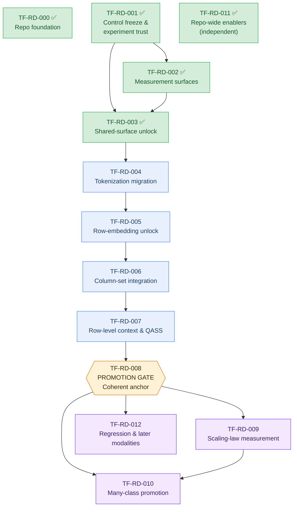

# Mission-Aligned Roadmap (2026Q1)

This is the canonical roadmap for `tab-foundry`.

The repo-wide plan is now architecture-first:

- keep one frozen PFN-style control lane for trust and comparison
- evolve `tabfoundry_staged` toward a coherent row-first classifier inspired by
  TabICLv2
- stay free to borrow the best components from TabPFN and other tabular models
  rather than aiming for literal TabICLv2 parity
- defer regression, extended modalities, and broader runtime handoff until the
  row-first classification anchor is coherent

Related docs:

- design decisions and repo structure: `docs/development/design-decisions.md`
- codebase navigation: `docs/development/codebase-navigation.md`
- architecture reference: `docs/development/model-architecture.md`
- architecture deltas: `docs/development/architecture-deltas.md`
- workflow runbooks: `docs/workflows.md`
- inference/export contract: `docs/inference.md`
- reference index: `reference/README.md`
- evidence appendix: `reference/evidence.md`

## Status Labels

- `implemented`: available in current code and wired into the canonical
  workflow surface
- `completed`: scoped work finished with a recorded decision or evidence
  package, even if it does not imply a promoted default
- `partial`: meaningful building blocks or evidence exist, but the roadmap
  claim is not yet satisfied end to end
- `planned`: clearly scoped and prioritized, but not yet implemented
- `research`: intentionally deferred or gated behind earlier roadmap work
- `retired`: historical item retained only for traceability

## Canonical Planning Metadata

`docs/development/roadmap.md` is the single source of truth for planning state
in `tab-foundry`.

The canonical planning unit is the local roadmap item `TF-RD-###`. External BL
issues or GitHub issues can track execution work when needed, but missing
external issue chains should not block planning. If another document disagrees
with this file, this file is authoritative.

## Program Statement

The repo now operates with two architecture lanes:

- PFN control lane:
  - `tabfoundry_simple`
  - `tabfoundry_staged` with `stage=nano_exact`
  - used to preserve benchmark comparability and experiment trust
- active architecture target lane:
  - a row-first staged classifier inspired primarily by TabICLv2
  - allowed to borrow components from TabPFN or other references when they fit
    better
  - must remain one coherent `tabfoundry_staged` surface rather than a second
    live model family

Important non-goals for this roadmap:

- do not treat the current `nano_exact + prenorm + row_cls` hybrid line as the
  long-term destination
- do not bundle regression into the first row-first promotion push
- do not make QASS structurally mandatory
- do not rewrite the repo around a second architecture family

## Prioritization Lens

- Scaling predictability comes first.
- Classification remains the anchor workload until the row-first control family
  is stable.
- Architecture conclusions should come from coherent staged surfaces, not from
  piling more overrides onto `nano_exact`.
- Row-first migration work should move one architectural boundary at a time:
  shared surface, small-class/test-self bridge, grouped tokens, row
  embedding, column set reasoning, then row-level context.
- Many-class, regression, inference handoff, and modality expansion remain
  later unless earlier evidence shows they are blocking the main architecture
  program.

## Canonical Priority Queue

Lower rank means higher priority. Rank `0` is reserved for implemented work
retained for traceability.

| Rank | Roadmap ID | Item | Status | Milestone |
| ---- | ---------- | ---- | ------ | --------- |
| 0 | TF-RD-000 | Repo foundation and staged-family split | implemented | Implemented |
| 1 | TF-RD-001 | Control freeze and experiment trust | implemented | Implemented |
| 2 | TF-RD-002 | Measurement surfaces for architecture migration | implemented | Implemented |
| 3 | TF-RD-003 | Shared-surface unlock | implemented | Implemented |
| 4 | TF-RD-004 | Tokenization migration | completed | Now |
| 5 | TF-RD-005 | Row-embedding unlock | completed | Now |
| 6 | TF-RD-006 | Column-set integration | completed | Now |
| 7 | TF-RD-007 | Row-level context and QASS attribution | completed | Now |
| 8 | TF-RD-008 | Coherent classification anchor promotion | partial | Next |
| 9 | TF-RD-009 | Scaling-law measurement on the promoted anchor | planned | Next |
| 10 | TF-RD-010 | Many-class promotion on the row-first base | research | Next |
| 11 | TF-RD-011 | Repo-wide enablers and contract fidelity | implemented | Implemented |
| 12 | TF-RD-012 | Regression, inference handoff, and later modalities | research | Later |

## Dependency Graph

Critical path: **003 → 004 → 005 → 006 → 007 → 008**. 000, 001, 002, 003, and
011 are implemented; 004, 005, 006, and 007 are completed evidence steps. 008
remains the active promotion gate, and everything after 008 is post-promotion
work.

## Current Capability Matrix

| Objective / Claim | Current State | Evidence In Repo | Current Gap | Roadmap IDs |
| --- | --- | --- | --- | --- |
| Frozen PFN-style control exists | `implemented` | `tabfoundry_simple`, `stage=nano_exact`, benchmark comparison tooling, and prior-trained PFN-facing lanes already exist | The current large-anchor hybrid line is still easy to confuse with the intended destination | `TF-RD-001` |
| Coherent row-first migration ladder exists in code | `partial` | The staged recipe ladder already encodes `shared_norm -> prenorm_block -> small_class_head -> test_self -> grouped_tokens -> row_cls_pool -> column_set -> qass_context -> many_class`; `sd_tokenization_migration_v1_02_delta_training_linear_warmup_decay_v1` locks the grouped-token replay, `sd_row_embedding_attribution_v2_01_delta_row_embeddings_no_context_v2_v1` closes the row-embedding unlock, `row_embedding_attribution_v3` completes the TFCol × QASS factorization, `sd_qass_tfcol_adequacy_v1_03_delta_qass_context_tfcol_heads4_v1_v1` wins the medium-bundle adequacy screen, and `qass_tfcol_large_no_missing_validation_v1` passed its large no-missing validator narrowly | The remaining gap is no longer row-first ladder shape but final regime coverage: the missing-data generalization check on `nanotabpfn_openml_binary_large_v1.json` still needs to land before promotion language can fully close | `TF-RD-003`, `TF-RD-004`, `TF-RD-005`, `TF-RD-006`, `TF-RD-007` |
| Architecture comparisons are attributable | `partial` | Grouped-token replay, v2/v3 matched controls, the TFCol adequacy sweep, and the large no-missing validation now separate row embeddings, plain context, TFCol-only, QASS-only, and the selected `qass + tfcol_heads4` calibration line | The remaining open comparison is missing-data generalization, not medium-bundle matched-control attribution | `TF-RD-002`, `TF-RD-005`, `TF-RD-006`, `TF-RD-007` |
| One promoted row-first classification anchor exists | `partial` | The calibration-first candidate `row_cls + qass + tfcol_heads4` now passed the large no-missing validator narrowly, while `row_cls + qass + no tfcol` remains the ROC-oriented fallback | The repo still needs the missing-data generalization check on `nanotabpfn_openml_binary_large_v1.json` before it can claim a single promoted default anchor across regimes | `TF-RD-008` |
| Scaling-law work targets the right architecture | `partial` | Tuning and benchmark-adjacent tooling already exist | There is no canonical scaling artifact path on a promoted row-first anchor yet | `TF-RD-009` |
| Many-class extends the active backbone cleanly | `partial` | The staged family already includes `many_class` and the reusable machinery exists | Many-class is not yet tied to a promoted row-first classification base | `TF-RD-010` |
| Repo-wide data, preprocessing, and export surfaces can support the migration | `partial` | Manifest-backed training, shared preprocessing work, and v3 export scaffolding already exist | Corpus provenance, producer-fidelity cleanup, and downstream contract hardening are still unfinished | `TF-RD-011` |
| Regression and downstream runtime handoff are ready | `research` | The repo has clear placeholders and partial bundle/runtime infrastructure | Regression is intentionally removed, and runtime handoff should follow the promoted classification base rather than run ahead of it | `TF-RD-012` |

## Current Implementation Baseline

This roadmap assumes the following repo truths:

- `tabfoundry_staged` is the only active architecture-development surface.
- `tabfoundry_simple` is the frozen exact PFN-style anchor.
- the staged family already contains the intended migration ladder through
  `shared_norm`, `prenorm_block`, `small_class_head`, `test_self`,
  `grouped_tokens`, `row_cls_pool`, `column_set`, `qass_context`, and
  `many_class`
- grouped-token replay
  `sd_tokenization_migration_v1_02_delta_training_linear_warmup_decay_v1`
  is the canonical predecessor for the current row-first line
- `row_embedding_attribution_v2` established that row embeddings help on the
  grouped-token replay surface, while plain row-level context does not justify
  promotion on that same base
- `row_embedding_attribution_v3` established that TFCol alone is negative on the
  row-first base, `qass + no tfcol` is near-tied with the row-embedding base,
  and `qass + tfcol` wins on calibration while losing ROC
- `qass_tfcol_adequacy_v1` established that `tfcol_heads4` is the only TFCol
  adequacy winner worth carrying forward, while `inducing64` and `layers1`
  remain negative evidence
- `qass_tfcol_large_no_missing_validation_v1` established a narrow large
  no-missing validation pass for `row_cls + qass + tfcol_heads4`; the
  remaining gate is missing-data generalization on
  `nanotabpfn_openml_binary_large_v1.json`
- the current large-anchor `nano_exact + prenorm + row_cls` line is useful as a
  diagnostic bridge, but not yet a promoted architecture target

## Roadmap Items

### TF-RD-000: Repo Foundation And Staged-Family Split

- Status: `implemented`
- Milestone: `Implemented`
- Goal: preserve the current role-based repo organization and the split between
  the frozen PFN control and the active staged family
- Current state:
  - `tabfoundry_staged` is the active family
  - `tabfoundry_simple` is the frozen anchor
  - reusable model pieces already live under `model/components`
- Exit criteria:
  - this remains the stable base for all later roadmap work

### TF-RD-001: Control Freeze And Experiment Trust

- Status: `implemented`
- Milestone: `Implemented`
- Goal: make the PFN control lane and the row-first target lane explicit so the
  roadmap stops mixing benchmark trust with architecture aspiration
- Current state:
  - the PFN control lane is named explicitly as `tabfoundry_simple` plus
    `tabfoundry_staged` with `stage=nano_exact`
  - the current large-anchor hybrid line is documented as diagnostic rather
    than promotable
  - the canonical medium-bundle control-baseline id `cls_benchmark_linear_v2`
    now resolves through the prior-trained staged `nano_exact` anchor
    `01_nano_exact_md_prior_parity_fix_binary_medium_v1`
- Implemented contract:
  - keep `tabfoundry_simple` and `stage=nano_exact` as the frozen PFN control
    lane
  - document the current large-anchor hybrid line as diagnostic rather than
    promotable
  - preserve one canonical control interpretation surface for benchmark claims
- Exit criteria:
  - one named PFN control lane exists
  - one explicitly non-promoted hybrid diagnostic lane exists
  - benchmark-facing interpretation is tied to the control lane rather than the
    hybrid line

### TF-RD-002: Measurement Surfaces For Architecture Migration

- Status: `implemented`
- Milestone: `Implemented`
- Goal: add the telemetry needed to interpret row-first architecture changes
  structurally rather than by end metrics alone
- Current state:
  - the exact-prior diagnostic lane already emits rich module-gradient and
    activation telemetry
  - the canonical architecture-screen surface still lacks that same telemetry
    parity in the regular trainer
  - row-first stage boundaries are partially traced, but `post_context_encoder`
    is still missing
- Required work:
  - emit and persist `post_column_encoder`, `post_row_pool`, and
    `post_context_encoder` on the regular training path
  - write `gradient_history.jsonl` and `telemetry.json` from the regular
    trainer, not only the prior-dump loop
  - sync selected stage-local stability summaries to wandb and expose them in
    sweep artifacts and result cards
  - defer per-stage runtime and memory profiling until later architecture
    tickets prove those costs are decision-critical
- Exit criteria:
  - regular training emits the same class of module-gradient and activation
    telemetry as the exact-prior path
  - row-first rows can be compared on quality and stage-local stability without
    relying only on raw wandb charts
  - runtime and memory are explicitly out of scope for closing TF-RD-002

### TF-RD-003: Shared-Surface Unlock

- Status: `implemented`
- Milestone: `Implemented`
- Goal: move the active architecture program off the PFN-only `nano` encoder
  path and onto the coherent shared staged surface
- Current state:
  - `shared_surface_bridge_v1` established the stage-native architecture-screen
    bridge from `nano_exact` through `shared_norm` and `prenorm_block`
  - the canonical grouped-token predecessor is locked as
    `sd_shared_surface_bridge_v1_03_delta_architecture_screen_prenorm_block_v1`,
    registered at `2026-03-20T00:17:09Z` (`2026-03-19` in Los Angeles)
  - `small_class_head` and `test_self` remain explicit historical bridge rows,
    but neither displaced `prenorm_block` as the default grouped-token handoff
- Implemented contract:
  - treat the public shared-surface stages as the primary migration program
  - keep tokenizer work off the old `feature_encoder=nano` lane where it is not
    active
  - carry grouped-token work forward from the locked `prenorm_block` handoff
    rather than reopening optional bridge rows by default
- Exit criteria:
  - the architecture target lane starts from a shared surface
  - one explicit shared-surface handoff row is locked for grouped-token work
  - later tokenization and row-first rows are tested only where they are
    actually active

### TF-RD-004: Tokenization Migration

- Status: `completed`
- Milestone: `Implemented`
- Goal: evaluate grouped tokenization as the first true row-first preparation
  step on the shared surface
- Current state:
  - `grouped_tokens` already exists in the staged recipe ladder
  - compact-ladder evidence showed that tokenizer changes under the nano encoder
    were not isolatable
  - `shared_surface_bridge_v1` closed TF-RD-003 and locked `prenorm_block` as
    the canonical grouped-token predecessor
  - `small_class_head` and `test_self` remain optional historical bridge rows,
    not the default TF-RD-004 handoff
  - the architecture-screen grouped-token benchmark `sd_tokenization_migration_v1_01_delta_architecture_screen_grouped_tokens_v2`
    was mixed, so `grouped_token_stability_probe_v1` was executed on March 19,
    2026 against that locked anchor
  - the traced anchor rerun `sd_grouped_token_stability_probe_v1_01_delta_anchor_activation_trace_baseline_v1`
    and the no-trace warmup-decay row
    `sd_grouped_token_stability_probe_v1_03_delta_training_linear_warmup_decay_v1`
    converged to the same grouped-token read: final log loss about `0.4002`,
    final Brier about `0.2618`, final ROC AUC about `0.741`, clipped-step
    fraction `0.0012`, and zero drift
  - the no-warmup decay row
    `sd_grouped_token_stability_probe_v1_02_delta_training_linear_decay_v1`
    improved final ROC AUC to `0.7540`, but it lost on log loss/Brier and pushed
    `max_grad_norm` to `9.99`, so it is not the preferred grouped-token surface
  - TF-RD-004 now has an explicit keep decision: grouped tokens stay on the
    migration path, with `prior_linear_warmup_decay` as the preferred adequacy
    surface for the benchmark-facing replay
  - the benchmark-facing grouped-token replay
    `sd_tokenization_migration_v1_02_delta_training_linear_warmup_decay_v1`
    is now registered on the architecture-screen lane and lands the probe's
    no-trace warmup-decay surface as the canonical grouped-token predecessor
- Implemented contract:
  - keep `prenorm_block` as the locked TF-RD-004 anchor for attributable
    comparisons, but carry later row-first work forward from
    `sd_tokenization_migration_v1_02_delta_training_linear_warmup_decay_v1`
  - treat the warmup-decay grouped-token replay, not the old scalar-per-feature
    token path, as the predecessor for TF-RD-005, TF-RD-006, and TF-RD-007
  - preserve the adequacy probe as supporting evidence rather than the
    benchmark-facing handoff itself
- Exit criteria:
  - the grouped-token keep decision is recorded from the mixed
    `tokenization_migration_v1` result plus the warmup-decay stability follow-up
  - the winning grouped-token replay is registered on the benchmark-facing lane
  - later row-first work inherits grouped tokens as the working token surface
    rather than assuming scalar-per-feature PFN tokens

### TF-RD-005: Row-Embedding Unlock

- Status: `completed`
- Milestone: `Now`
- Goal: determine whether the staged family can form useful row embeddings on
  the intended shared/grouped surface
- Current state:
  - `row_cls_pool` exists as a coherent staged recipe on the grouped-token
    replay surface
  - `row_embedding_attribution_v2` closed the grouped-token row-embedding
    question with the no-context row
    `sd_row_embedding_attribution_v2_01_delta_row_embeddings_no_context_v2_v1`
  - the paired plain-context row did not improve that row-embedding base, so
    old compact-surface row-CLS evidence is no longer the main blocker
- Completed evidence:
  - TF-RD-005 was anchored on grouped-token replay
    `sd_tokenization_migration_v1_02_delta_training_linear_warmup_decay_v1`,
    not on `prenorm_block` or the older scalar-token path
  - row pooling was isolated first on that grouped-token replay before the
    bundled public `row_cls_pool` stage was interpreted
  - the result package now separates row embeddings from plain row-level
    context on the intended migration surface
- Exit criteria:
  - the repo has a direct answer to whether row embeddings help on the intended
    migration surface
  - satisfied: row embeddings help on the grouped-token replay surface
  - satisfied: plain row-level context does not improve that row-embedding base

### TF-RD-006: Column-Set Integration

- Status: `completed`
- Milestone: `Now`
- Goal: decide whether explicit column-set reasoning belongs in the promoted
  row-first line
- Current state:
  - `column_set` already exists as a staged recipe
  - `delta_column_set_no_context_v3` is negative evidence for default TFCol
    alone on the grouped-token row-first base
  - `sd_qass_tfcol_adequacy_v1_03_delta_qass_context_tfcol_heads4_v1_v1` was
    the medium-bundle adequacy winner and the only TFCol row worth carrying
    forward
  - `qass_tfcol_large_no_missing_validation_v1` then validated
    `delta_qass_context_tfcol_heads4_v1` against `delta_qass_no_column_v3` on
    `nanotabpfn_openml_binary_large_no_missing_v1.json` with a narrow pass:
    final log loss `-0.0013818`, final Brier `-0.0004977`, and final ROC AUC
    `-0.0047989` versus the no-TFCol control
- Completed evidence:
  - default TFCol alone is resolved negative evidence on the row-first base and
    should not be reopened as a standalone promotion candidate
  - TFCol is justified only under the validated
    `row_cls + qass + tfcol_heads4` calibration-first line
  - the remaining follow-up is missing-data generalization, not another TFCol
    adequacy or TFCol-alone screen
- Exit criteria:
  - satisfied: TFCol is promoted only under the validated
    `qass + tfcol_heads4` line, not as a standalone default row-first module
  - satisfied: the repo now has an explicit ROC-oriented fallback against
    `qass + no tfcol`

### TF-RD-007: Row-Level Context And QASS Attribution

- Status: `completed`
- Milestone: `Now`
- Goal: determine whether row-level context helps, and whether QASS helps beyond
  plain row-level context
- Current state:
  - `qass_context` already exists as a staged recipe
  - QASS components already exist as reusable modules
  - `row_embedding_attribution_v2` showed that plain row-level context does not
    justify promotion over the no-context row-embedding base
  - `row_embedding_attribution_v3` showed that `qass + no tfcol` is near-tied
    with the row-embedding base, TFCol alone is bad, and `qass + tfcol` wins on
    calibration while losing ROC
  - `qass_tfcol_large_no_missing_validation_v1` then showed that
    `row_cls + qass + tfcol_heads4` keeps the calibration win over
    `row_cls + qass + no tfcol` on the larger no-missing bundle while staying
    inside the `-0.005` ROC guardrail
- Completed evidence:
  - plain row-level context is resolved negative evidence on the row-first path
  - QASS remains optional by construction, but the calibration-first line is
    now `row_cls + qass + tfcol_heads4`
  - `row_cls + qass + no tfcol` remains the explicit ROC-oriented fallback
  - the remaining follow-up is missing-data generalization, not reopening
    medium-bundle attribution
- Exit criteria:
  - satisfied: the repo has an explicit calibration-first recommendation and an
    explicit ROC-oriented fallback for `qass + no tfcol` versus
    `qass + tfcol_heads4`

### TF-RD-008: Coherent Classification Anchor Promotion

- Status: `partial`
- Milestone: `Next`
- Goal: promote one coherent row-first classification anchor and stop treating
  the architecture target as an open set of hybrid lines
- Current state:
  - the staged ladder exists
  - no row-first classification anchor has been promoted
  - the calibration-first candidate is
    `row_cls + qass + tfcol_heads4`
  - `row_cls + qass + no tfcol` remains the ROC-oriented fallback
  - `qass_tfcol_large_no_missing_validation_v1` passed narrowly, so the
    remaining blocker is missing-data generalization rather than large
    no-missing validation
- Required work:
  - run the missing-data generalization check on
    `src/tab_foundry/bench/nanotabpfn_openml_binary_large_v1.json` using
    `row_cls + qass + no tfcol` as the ROC-oriented control and
    `row_cls + qass + tfcol_heads4` as the calibration-first candidate
  - if the missing-data check keeps the calibration win while the ROC gap stays
    small, promote `row_cls + qass + tfcol_heads4` as the default row-first
    classification anchor
  - if the missing-data check fails or the ROC penalty widens materially, keep
    a split recommendation rather than forcing a single promoted anchor
  - update research defaults and promotion language only after that gate closes
- Exit criteria:
  - one row-first classification anchor is named, benchmarked, and treated as
    the active architecture target

### TF-RD-009: Scaling-Law Measurement On The Promoted Anchor

- Status: `planned`
- Milestone: `Next`
- Goal: move size, depth, width, and compute scaling work onto the promoted
  row-first classification anchor
- Current state:
  - tuning and benchmark-adjacent tooling already exist
  - scaling-law intent is clear, but there is no canonical artifact path on the
    right architecture yet
- Required work:
  - run size sweeps on the promoted row-first anchor rather than the hybrid
    diagnostic line
  - emit comparable compute, parameter-count, and benchmark artifacts
  - use these artifacts as the basis for future architecture decisions
- Exit criteria:
  - the repo can fit scaling trends on the promoted architecture rather than on
    a transient bridge surface

### TF-RD-010: Many-Class Promotion On The Row-First Base

- Status: `research`
- Milestone: `Next`
- Goal: extend the promoted row-first backbone into the existing `many_class`
  path
- Current state:
  - the staged family already contains `many_class`
  - the hierarchical many-class machinery already exists
  - the backbone it should inherit from has not yet been promoted
- Required work:
  - re-evaluate `many_class` on top of the promoted row-first base
  - keep many-class as an extension of the same staged family
  - avoid opening a separate architecture lane for many-class
- Exit criteria:
  - many-class uses the promoted row-first backbone and has benchmark-facing
    evidence

### TF-RD-011: Repo-Wide Enablers And Contract Fidelity

- Status: `implemented`
- Milestone: `Implemented`
- Goal: keep the repo-wide data, preprocessing, and export surfaces healthy
  enough to support the architecture program without letting them dominate it
- Current state:
  - manifest-backed training and evaluation exist
  - shared preprocessing and v3 export groundwork exist
  - corpus provenance, preprocessing producer fidelity, and downstream contract
    hardening are still incomplete
- Required work:
  - finish dagzoo handoff and path-independent corpus identity
  - stabilize shared preprocessing and export fidelity
  - keep these changes architecture-compatible and family-neutral
- Exit criteria:
  - the row-first architecture program can rely on trustworthy data and export
    contracts without forcing a second planning track

### TF-RD-012: Regression, Inference Handoff, And Later Modalities

- Status: `research`
- Milestone: `Later`
- Goal: rebuild prediction-mode breadth only after the promoted row-first
  classification anchor is stable
- Current state:
  - classification is the only active supported mode
  - regression has been intentionally removed
  - runtime handoff and later modalities remain deferred
- Required work:
  - rebuild regression as a staged-family extension on the promoted row-first
    base
  - advance separate-runtime handoff only after classification/export contracts
    settle
  - keep time series, text-conditioned inputs, and other later modalities out of
    the critical path
- Exit criteria:
  - regression and runtime handoff build on the promoted staged base rather than
    running ahead of it

## Acceptance Gates For Architecture Promotion

The architecture target lane should promote rows only when all of the following
hold:

- the row is coherent as a staged surface rather than an ad hoc override pile
- the row is stable on training telemetry, not only acceptable on final metrics
- the row is benchmark-neutral-or-better against the relevant control surface
- added runtime and memory cost are justified by the gain
- the interpretation is attributable against matched controls rather than
  speculative

## Planning Defaults And Assumptions

- TabICLv2 is the strongest directional reference for the active architecture
  target, but not a literal reproduction target.
- TabPFN remains the control lineage and a legitimate donor for specific
  components.
- QASS remains optional.
- Classification remains the anchor workload until the row-first classification
  base is promoted.
- The current large-anchor hybrid line is diagnostic evidence, not the intended
  architecture destination.
