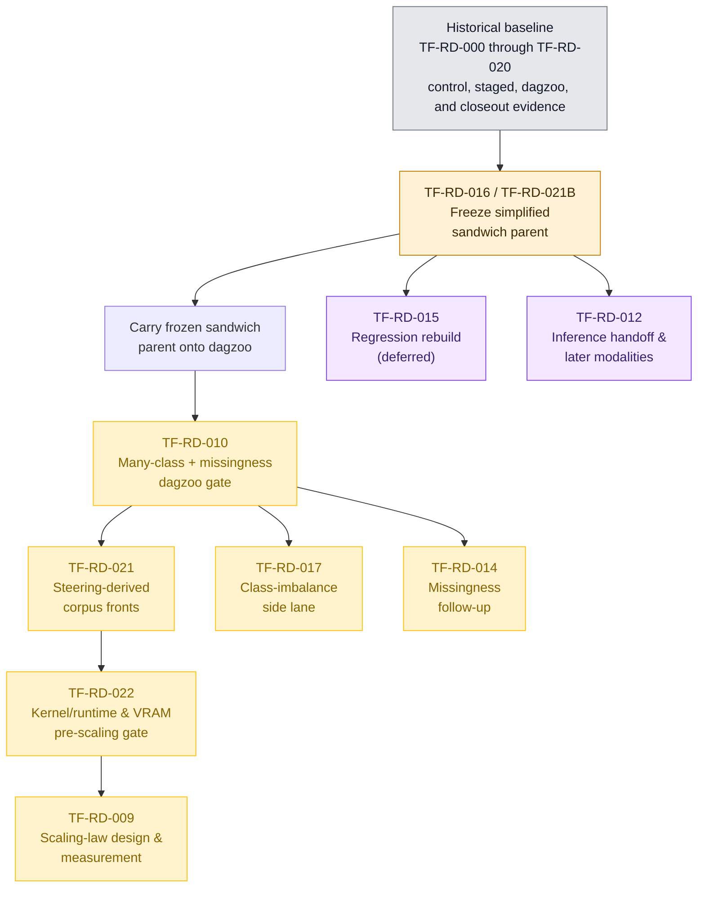

# Roadmap (202604)

Use this roadmap to understand which questions are active now, which surfaces
are frozen, and what evidence the repo still needs before promotion.

The repo-wide plan is now sandwich-first:

- keep one frozen PFN-style control lane for trust and comparison
- treat `tabfoundry_sandwich` as the active classification architecture target
  and scaling-prep family
- use dagzoo-backed many-class plus missingness as the first anti-saturation
  classification regime before the first scaling fit
- test steering-derived corpus fronts only after that first carried dagzoo
  slice exists
- make bounded kernel/runtime and VRAM optimization a hard prerequisite to
  later scaling so every scale ladder inherits one measured runtime policy
- defer regression from the first classification scaling plan

Use these alongside this roadmap:

- design decisions and repo structure: `docs/development/design-decisions.md`
- codebase navigation: `docs/development/codebase-navigation.md`
- dataset curation and license gate: `docs/development/dataset-curation.md`
- architecture reference: `docs/development/model-architecture.md`
- sandwich architecture: `docs/development/tabfoundry-sandwich.md`
- architecture deltas: `docs/development/architecture-deltas.md`
- workflow runbooks: `docs/workflows.md`
- inference/export contract: `docs/inference.md`
- reference index: `reference/README.md`
- evidence appendix: `reference/evidence.md`

## Status Labels

- `implemented`: available in current code and wired into the canonical
  workflow surface
- `completed`: scoped work finished with a recorded decision or evidence
  package, even if it does not imply a promoted default
- `partial`: meaningful building blocks or evidence exist, but the roadmap
  claim is not yet satisfied end to end
- `planned`: clearly scoped and prioritized, but not yet implemented
- `research`: intentionally deferred or gated behind earlier roadmap work
- `retired`: historical item retained only for traceability

## Canonical Planning Metadata

`docs/development/roadmap.md` is the single source of truth for planning state
in `tab-foundry`.

The canonical planning unit is the local roadmap item `TF-RD-###`. External BL
issues or GitHub issues can track execution work when needed, but missing
external issue chains should not block planning. If another document disagrees
with this file, this file is authoritative.

## Program Statement

The roadmap now has one active architecture-development lane:

- frozen control lane:
  - `tabfoundry_simple`
  - `tabfoundry_staged` with `stage=nano_exact`
  - used only for benchmark comparability and experiment trust
- historical incumbent reference:
  - `tabfoundry_staged`
  - useful as a comparison surface, but no longer the focus of roadmap
    sequencing
- active development lane:
  - `tabfoundry_sandwich`
  - fixed-latent `y` / byte-array `x` Perceiver-style classifier
  - owns the current architecture simplification, dagzoo transfer,
    many-class/missingness, runtime, and scaling work

Important non-goals for this roadmap:

- do not treat the current `nano_exact + prenorm + row_cls` hybrid line as the
  long-term destination
- do not assume the incumbent staged reference line is the final architecture
  destination either; it is the current benchmark carry-forward surface
- do not bundle regression into the first row-first promotion push
- do not make QASS structurally mandatory
- do not proliferate many parallel live architecture families beyond the frozen
  control, the incumbent staged reference line, and the current sandwich
  candidate line

## Prioritization Lens

- Classification remains the anchor workload while the sandwich family is
  tested on harder post-008 regimes.
- The next useful architecture evidence should come from coherent sandwich
  surfaces, not from extending the older staged line.
- After sandwich-parent simplification, the next deliberate front should make
  the research surface less saturating and more realistic: a dagzoo-backed
  many-class plus missingness regime on the frozen sandwich parent, followed by
  steering-derived corpus fronts, then bounded runtime/kernel tuning, then
  scaling.
- If those harder or broader surfaces still leave the model hard to separate or
  obviously underfit, open a later architecture-surface adequacy pass before
  relying on scaling-law work as the main next source of evidence.
- Class imbalance is still not sufficiently tested on the current benchmark
  surfaces because the bundles only enforce `min_minority_class_pct = 2.5`
  rather than defining an explicit skew ladder.
- Harder real-data ladders should keep one canonical OpenML baseline where the
  benchmark tooling is already native, allow manifest-backed external
  real-data augmentations when they add regimes OpenML does not cover cleanly,
  and require completed review records before those datasets enter curated
  bundles or manifests; `dagzoo` remains the synthetic-data lane under
  TF-RD-013 rather than an external real-data source.
- The deliberate post-008 execution order is now:
  TF-RD-021B under TF-RD-016 ablates and freezes one simplified sandwich
  parent; that frozen parent is then carried onto dagzoo; TF-RD-010 uses that
  dagzoo-backed sandwich family on the first many-class plus missingness slice
  so the first scaling target does not saturate too early on binary data;
  TF-RD-017 class-imbalance work proceeds as a side robustness lane on the same
  family; TF-RD-021 then tests whether steering-derived dagzoo corpus fronts
  improve that carried slice; TF-RD-022 performs the kernel, runtime, and VRAM
  tuning needed for reliable scaling on the kept front; TF-RD-009 then fits the
  first scaling law on that carried multiclass slice.
- Low-level questions such as norm family or placement, learned special-token
  initialization scale, QASS scaler capacity, and activation family belong
  under TF-RD-016 after the earlier adequacy and harder-surface gates are in
  place, not as free-floating anchor-settlement work.
- Many-class, regression, and runtime handoff should build on that
  deconfounded post-008 base rather than competing with the earlier gates.
- Runtime, VRAM, and any bounded kernel tuning should finish before the first
  scaling fit so classification ladders inherit one measured 80 GB A100-safe
  policy instead of discovering memory limits during the scale study.
- Scaling-law design should start only after the repo has a simplified sandwich
  parent, one carried dagzoo curriculum slice, runtime telemetry and artifact
  integrity, and at least one missingness read on the same classification
  family.

## Canonical Priority Queue

This queue is intentionally sandwich-focused. Historical staged/control work is
summarized later instead of occupying the active queue.

| Rank | Roadmap ID | Item | Status | Milestone |
| ---- | ---------- | ---- | ------ | --------- |
| 1 | TF-RD-016 | Architecture surface adequacy, sandwich simplification, and selective expansion | planned | Next |
| 2 | TF-RD-010 | First many-class + missingness dagzoo gate on the row-first base | planned | Next |
| 3 | TF-RD-021 | Steering-derived dagzoo corpus fronts on the promoted anchor | planned | Next |
| 4 | TF-RD-017 | Class-imbalance robustness on the promoted anchor | planned | Next |
| 5 | TF-RD-022 | Training runtime and VRAM efficiency before classification scaling | planned | Next |
| 6 | TF-RD-009 | Scaling-law design and measurement on the classification-first sandwich target | planned | Next |
| 7 | TF-RD-014 | Missingness robustness on the promoted anchor | planned | Next |
| 8 | TF-RD-015 | Regression rebuild deferred from the classification-first scaling plan | research | Later |
| 9 | TF-RD-012 | Inference handoff and later modalities | research | Later |

## Dependency Graph

```mermaid
flowchart TD
    HIST["Historical baseline<br/>TF-RD-000 through TF-RD-020<br/>control, staged, dagzoo, and closeout evidence"]
    RD016["TF-RD-016 / TF-RD-021B<br/>Freeze simplified<br/>sandwich parent"]
    DAG["Carry frozen sandwich<br/>parent onto dagzoo"]
    RD010["TF-RD-010<br/>Many-class + missingness<br/>dagzoo gate"]
    RD021["TF-RD-021<br/>Steering-derived<br/>corpus fronts"]
    RD017["TF-RD-017<br/>Class-imbalance<br/>side lane"]
    RD022["TF-RD-022<br/>Kernel/runtime & VRAM<br/>pre-scaling gate"]
    RD014["TF-RD-014<br/>Missingness<br/>follow-up"]
    RD015["TF-RD-015<br/>Regression rebuild<br/>(deferred)"]
    RD012["TF-RD-012<br/>Inference handoff &<br/>later modalities"]
    RD009["TF-RD-009<br/>Scaling-law design &<br/>measurement"]

    HIST --> RD016
    RD016 --> DAG
    DAG --> RD010
    RD010 --> RD021
    RD010 --> RD014
    RD010 --> RD017
    RD021 --> RD022
    RD022 --> RD009
    RD016 --> RD015
    RD016 --> RD012

    classDef hist fill:#e5e7eb,stroke:#6b7280,color:#111827;
    classDef readyNow fill:#fff3cd,stroke:#ffc107,color:#856404;
    classDef gate fill:#fff1d6,stroke:#c67a00,color:#3d2a00;
    classDef later fill:#f3e8ff,stroke:#7c3aed,color:#3b1f6e;

    class HIST hist;
    class RD009,RD021,RD022,RD014,RD017,RD010 readyNow;
    class RD016 gate;
    class RD012,RD015 later;
```

Current path: **TF-RD-016 / TF-RD-021B → sandwich-on-dagzoo carry-forward → TF-RD-010 → TF-RD-021 → TF-RD-022 → TF-RD-009**.

- TF-RD-016, through TF-RD-021B, is the first active gate: finish the bounded
  sandwich ablation package and freeze one simplified parent.
- Then switch that frozen sandwich parent onto dagzoo as the carried synthetic
  classification family rather than continuing to tune the staged-control lane.
- TF-RD-010 then evaluates the first dagzoo-backed many-class plus missingness
  classification slice on that frozen sandwich parent, with multiclass log
  loss as the primary objective.
- TF-RD-021 then decides whether any steering-derived dagzoo corpus front
  replaces the carried sandwich dagzoo slice before runtime/kernel tuning.
- TF-RD-022 is the next hard pre-scaling gate after steering: it must hand back
  one measured kernel/runtime policy before broader scaling fits.
- TF-RD-009 only starts after those gates are closed and fits the first law on
  that carried multiclass slice under matched regime budget.

Parallel/later lanes are intentionally off that main path:

- TF-RD-014 is now a follow-on missingness robustness lane after the first
  many-class plus missingness gate rather than a blocker to the first scaling
  fit.
- TF-RD-017 is the preferred side robustness lane during the many-class plus
  missingness push, but not a blocker for the first scaling fit.
- TF-RD-015 regression and TF-RD-012 inference handoff/later modalities remain
  later work.

## Current Capability Matrix

| Objective / Claim | Current State | Evidence In Repo | Current Gap | Roadmap IDs |
| --- | --- | --- | --- | --- |
| Frozen PFN-style control exists | `implemented` | `tabfoundry_simple`, `stage=nano_exact`, and the prior-trained PFN-facing benchmark lane are all stable | Keep that lane clearly separate from the architecture target | `TF-RD-001` |
| Sandwich is the primary classification candidate | `partial` | `tabfoundry_sandwich` is landed, the compact hybrid replay is benchmarked, and the first knob screen plus bounded width/head follow-up both kept the compact control; [#184](https://github.com/bensonlee5/tab-foundry/issues/184) now owns simplified-parent follow-up | Choose and freeze one simplified sandwich parent before harder-surface or scaling work | `TF-RD-016`, `TF-RD-021A`, `TF-RD-021B` |
| Harder synthetic classification fronts are runnable | `implemented` | Dagzoo manifest/export fidelity is complete, TF-RD-013 settled the representative medium surface, and TF-RD-020 settled harder-front winners that can seed sandwich-on-dagzoo carry-forward work | Carry the frozen sandwich parent onto dagzoo, then choose whether steering improves that first carried slice | `TF-RD-011`, `TF-RD-013`, `TF-RD-020`, `TF-RD-016`, `TF-RD-010`, `TF-RD-021` |
| Runtime and VRAM are measurable | `partial` | Training and registry artifacts now preserve runtime-summary and regime-budget fields, and the repo already has bf16/checkpointing-capable runtime plumbing | TF-RD-022 still needs to turn that into one explicit 80 GB A100-safe kernel/runtime policy on the carried sandwich dagzoo slice | `TF-RD-022` |
| Many-class + missingness is now the first anti-saturation carried slice | `partial` | `many_class` is implemented, the small multiclass bundle already exists, and the roadmap now treats a dagzoo-backed many-class plus missingness slice as the first harder classification gate | The repo still needs one explicit carried many-class plus missingness dagzoo slice on the frozen sandwich parent | `TF-RD-010` |
| Follow-on missingness and imbalance robustness remain open | `partial` | Missing-permitting binary bundles exist, and the current bundle policy already excludes degenerate minority-class cases | TF-RD-014 remains later missingness follow-up, while TF-RD-017 still needs an explicit side-lane imbalance ladder on the same sandwich family | `TF-RD-014`, `TF-RD-017` |
| Regression and later modalities are deferred | `research` | Partial bundle/runtime scaffolding exists | They should not absorb attention from the classification-first path | `TF-RD-015`, `TF-RD-012` |
| Scaling-law work has the needed metadata path | `planned` | Artifacts now preserve resolved sandwich specs plus runtime/regime-budget metadata | TF-RD-009 still waits on the simplified parent, one fixed dagzoo many-class plus missingness slice, one steering decision, and the runtime gate | `TF-RD-009` |

## Current Implementation Baseline

This roadmap assumes the following repo truths:

- `tabfoundry_simple` and `tabfoundry_staged` with `stage=nano_exact` remain
  the frozen PFN-style control lane.
- `tabfoundry_sandwich` exists as the primary classification architecture
  candidate; the initial replay, knob screen, and bounded width/head follow-up
  are complete, and the next sandwich step is simplified-parent selection under
  [#184](https://github.com/bensonlee5/tab-foundry/issues/184).
- dagzoo manifest identity, export/reference preprocessing fidelity, and the
  one-way data boundary are part of the baseline rather than active blockers.
- the representative post-008 synthetic training-data surface is
  `tf_rd_013_dagzoo_shape_aware_size_medium_v1`.
- many-class scaffolding exists, and the next harder carried classification
  target is now a dagzoo-backed many-class plus missingness slice; regression
  and later inference/runtime handoff are still not part of the first
  classification-scaling path.

## Roadmap Items

### Historical Summary

- TF-RD-000 through TF-RD-013 established the control lane, the staged
  row-first reference, the shared repo/data contracts, and the representative
  dagzoo training surface.
- TF-RD-018 and TF-RD-020 remain historical staged-control evidence only:
  partial training-surface closeout plus harder dagzoo corpus-front winners.
- The detailed historical record remains in completed issues, sweep artifacts,
  and [reference/evidence.md](../../reference/evidence.md); the sections below
  focus on active sandwich development and later follow-up lanes.

### TF-RD-010: First Many-Class + Missingness Dagzoo Gate On The Row-First Base

- Status: `planned`
- Milestone: `Next`
- Goal: use a dagzoo-backed many-class plus missingness regime as the first
  harder post-simplification classification gate so the first scaling target
  does not saturate too early on binary data
- Current state:
  - the staged family already contains `many_class`
  - the hierarchical many-class machinery already exists
  - `nanotabpfn_openml_classification_small_v1.json` already exists as a
    benchmark-facing multiclass bundle
  - issue [#52](https://github.com/bensonlee5/tab-foundry/issues/52) is now
    the epic for this lane, and issue
    [#99](https://github.com/bensonlee5/tab-foundry/issues/99) is the first
    execution issue
  - this lane now sits on the first classification-scaling path after the
    simplified-parent phase of TF-RD-016 rather than as a later extension
- Required work:
  - confirm one carried dagzoo-backed many-class plus missingness slice and the
    promoted backbone that will read it
  - keep the lane on the same promoted family rather than opening a separate
    architecture track
  - evaluate this first gate by multiclass log loss first, with runtime,
    stability, and calibration-oriented metrics as guardrails
  - record one explicit keep/defer decision on the carried many-class plus
    missingness slice before TF-RD-009 starts
- Exit criteria:
  - the repo has one explicit carried dagzoo many-class plus missingness slice
    on the promoted backbone
  - multiclass is no longer only untested scaffolding on the first scaling path

### TF-RD-012: Inference Handoff And Later Modalities

- Status: `research`
- Milestone: `Later`
- Goal: advance separate-runtime handoff and genuinely later modalities only
  after the promoted row-first classification base is stable
- Current state:
  - classification remains the only active supported prediction mode
  - runtime handoff and later modalities remain deferred
- Required work:
  - advance separate-runtime handoff only after the classification base settles
  - keep time series, text-conditioned inputs, and other later modalities out
    of the current path
- Exit criteria:
  - inference handoff and later modalities build on the promoted staged base
    rather than running ahead of it

### TF-RD-014: Missingness Robustness On The Promoted Anchor

- Status: `planned`
- Milestone: `Next`
- Goal: deepen missingness robustness after the first many-class plus
  missingness gate is established on the promoted family
- Current state:
  - `missingness_followup` exists, but it is anchored on the older stabilized
    prenorm hybrid surface rather than the row-first line
  - the repo already has separate no-missing and allow-missing benchmark bundle
    contracts
  - issue [#97](https://github.com/bensonlee5/tab-foundry/issues/97) remains
    the missingness epic, but TF-RD-010 now owns the first anti-saturation
    many-class plus missingness gate
  - issue [#146](https://github.com/bensonlee5/tab-foundry/issues/146) now
    occupies the adjacent synthetic harder-dagzoo slot and does not replace
    this benchmark-front missingness lane
  - there is no explicit row-first missingness-mechanism recommendation yet;
    TF-RD-008 only settled the default row-first anchor on the allow-missing
    benchmark surface
- Required work:
  - re-anchor missingness work on the promoted row-first base after the carried
    many-class plus missingness slice is established under TF-RD-010
  - keep one pinned OpenML missingness ladder as the canonical benchmark
    baseline and allow license-cleared manifest-backed external augmentations
    when they add missingness regimes OpenML does not cover cleanly
  - use a review ledger for both OpenML datasets and vetted external real-data
    candidates rather than relying on source names alone
  - keep regime identity in task-source names, bundle names, manifest names,
    and curation reports rather than changing benchmark bundle schema in this
    pass
  - focus this lane on deeper missingness mechanism, severity, and benchmark
    coverage rather than on establishing the first anti-saturation regime
  - decide whether explicit missingness handling belongs in the default
    promoted line or remains an optional robustness variant after TF-RD-010
- Exit criteria:
  - the repo has a benchmark-backed follow-on missingness recommendation for
    the promoted family beyond the first many-class plus missingness gate

### TF-RD-017: Class-Imbalance Robustness On The Promoted Anchor

- Status: `planned`
- Milestone: `Next`
- Goal: decide how the promoted row-first family behaves under materially
  skewed class priors
- Current state:
  - current benchmark bundles only enforce `min_minority_class_pct = 2.5`
  - there is no dedicated imbalance-focused bundle ladder yet
  - this is now the preferred side robustness lane once TF-RD-010 has
    established the first sandwich many-class plus missingness dagzoo slice
  - issue [#146](https://github.com/bensonlee5/tab-foundry/issues/146) now
    occupies the adjacent synthetic harder-dagzoo slot and does not replace
    this benchmark-front imbalance lane
  - benchmark-facing reporting is still centered on ROC AUC, log loss, and
    Brier score
- Required work:
  - define the canonical imbalance-focused binary bundle or bundle-selection
    ladder on the promoted row-first anchor
  - keep one pinned OpenML imbalance ladder as the canonical benchmark
    baseline and allow license-cleared manifest-backed external augmentations
    when they add skew regimes OpenML does not cover cleanly
  - use the same review ledger for OpenML datasets and vetted external
    real-data candidates
  - keep regime identity in task-source names, bundle names, manifest names,
    and curation reports rather than changing benchmark bundle schema in this
    pass
  - define benchmark-facing comparison and reporting that includes PR AUC,
    average precision, and balanced accuracy alongside ROC/log loss/Brier
  - measure the promoted anchor first without class reweighting or focal-style
    loss changes
  - only if the baseline read is weak, run bounded weighted-loss or focal-loss
    follow-up work
- Exit criteria:
  - the repo has a benchmark-backed keep/defer decision on the promoted
    row-first line under class imbalance
  - the repo has an explicit imbalance metric and reporting contract rather
    than relying only on the current general binary bundle metrics

### TF-RD-018: Training-Surface Adequacy On The Promoted Anchor

- Status: `closed incomplete`
- Milestone: `Historical`
- Goal: preserve the completed staged-control training-surface reads without
  continuing this lane as a blocker now that the repo is prioritizing the
  sandwich family
- Current state:
  - issue [#109](https://github.com/bensonlee5/tab-foundry/issues/109) closed
    the initial dataset-batch ladder on the representative post-008 medium
    dagzoo surface
  - issue [#137](https://github.com/bensonlee5/tab-foundry/issues/137) kept
    `schedulefree_adamw` over `adamw` and `muon` on the inherited
    `tf_rd_020_shift_noise_drift_v1` staged-control runtime
  - TF-RD-020 remains the historical harder-front handoff for that same
    staged-control line
  - the remaining LR, clipping, and step-budget follow-up under issues
    [#138](https://github.com/bensonlee5/tab-foundry/issues/138) and
    [#139](https://github.com/bensonlee5/tab-foundry/issues/139) is no longer
    on the active roadmap path
  - issue [#107](https://github.com/bensonlee5/tab-foundry/issues/107) is now
    a closeout tracker rather than an active research epic
- Closure decision:
  - keep the completed TF-RD-018 artifacts as historical evidence on the
    staged-control line
  - do not treat unfinished TF-RD-018 LR or clipping work as a blocker for
    sandwich-first dagzoo, many-class, steering, runtime, or scaling work
  - if later runtime or optimizer tuning is needed, do it on the carried
    sandwich classification family under TF-RD-021, TF-RD-022, or TF-RD-009
    instead of reopening TF-RD-018
- Exit criteria:
  - satisfied: the repo retains one explicit partial training-surface record on
    the staged-control line
  - satisfied: the active path now moves to sandwich simplification and dagzoo
    carry-forward instead of continuing TF-RD-018

### TF-RD-022: Training Runtime And VRAM Efficiency Before Classification Scaling

- Status: `planned`
- Milestone: `Next`
- Goal: do the bounded kernel, runtime, and VRAM tuning needed so later
  scaling work inherits one measured runtime policy instead of ad hoc
  host-specific tweaks
- Current state:
  - deferred issue [#58](https://github.com/bensonlee5/tab-foundry/issues/58)
    already exists for runtime or VRAM summaries, but it stayed attached to
    the earlier TF-RD-002 measurement chain and never became a full execution
    spine
  - new epic [#168](https://github.com/bensonlee5/tab-foundry/issues/168) now
    tracks this runtime lane, with child issues
    [#169](https://github.com/bensonlee5/tab-foundry/issues/169),
    [#170](https://github.com/bensonlee5/tab-foundry/issues/170), and
    [#171](https://github.com/bensonlee5/tab-foundry/issues/171)
  - the sandwich architecture lane now lives under issue
    [#178](https://github.com/bensonlee5/tab-foundry/issues/178), with issue
    [#184](https://github.com/bensonlee5/tab-foundry/issues/184) owning the
    simplified-parent freeze before dagzoo carry-forward
  - training telemetry and benchmark-registry records now preserve
    `runtime_summary` and `regime_budget` payloads, including peak VRAM,
    throughput, token-budget fields, objective metric, and curriculum or SCM
    metadata
  - canonical benchmark prior configs still inherit `runtime.mixed_precision: "no"` from `configs/experiment/_shared/compact_binary_prior.yaml` unless a
    higher-level experiment overrides it
  - `tabfoundry_staged` already supports
    `runtime.activation_checkpointing`, but the ordinary benchmark-facing
    defaults keep it disabled
  - benchmark-facing exact-prior runs still default to
    `runtime.trace_activations: true`, which is useful for diagnostics but is
    not yet separated cleanly from ordinary benchmark execution
- this epic now follows the first carried dagzoo many-class slice and the
  steering decision; it should not reopen sandwich-parent selection or earlier
  regime-choice work
- Required work:
  - land the runtime and VRAM measurement dependency from issue
    [#58](https://github.com/bensonlee5/tab-foundry/issues/58) so sweep and
    result artifacts expose peak memory, reserved memory, throughput, and time
    breakdowns directly
  - run the bounded low-risk runtime ladder under issue
    [#169](https://github.com/bensonlee5/tab-foundry/issues/169) on one frozen
    carried classification recipe: treat bf16, benchmark-facing
    activation-trace policy, and activation checkpointing as the first
    runtime-policy knobs
  - include any low-level kernel tuning only to the extent needed to make the
    carried sandwich dagzoo slice reliable and efficient enough for scaling
  - encode the winning runtime policy as a first-class config and sweep surface
    under issue [#170](https://github.com/bensonlee5/tab-foundry/issues/170)
    rather than relying on per-run overrides
  - keep sandwich architecture work on
    [#174](https://github.com/bensonlee5/tab-foundry/issues/174),
    [#178](https://github.com/bensonlee5/tab-foundry/issues/178), and
    [#179](https://github.com/bensonlee5/tab-foundry/issues/179) rather than
    reopening this runtime epic as the sandwich owner; MPS OOMs should not be
    part of the quantitative CUDA decision record
  - only after the runtime policy is explicit, reopen harder-surface batching
    under issue [#171](https://github.com/bensonlee5/tab-foundry/issues/171)
    with a conservative 80 GB A100 memory guardrail and a fixed effective
    optimizer batch
  - keep architecture, steering/curriculum choice, and law-fitting changes out
    of this epic except insofar as TF-RD-016, TF-RD-010, and TF-RD-021 have
    already frozen them for the runtime read
- Exit criteria:
  - the repo has one explicit runtime policy for the classification scaling
    target, justified by repo-local time and VRAM evidence
  - sweep outputs, inspect surfaces, and result summaries expose runtime and
    VRAM metrics compactly enough that future runs can be compared without
    manual log inspection
  - later sandwich scaling, deferred CUDA-capacity follow-up, and
    TF-RD-009 preparation can inherit the same runtime policy without
    re-deriving it from scratch

### TF-RD-020: Harder Dagzoo Corpus Fronts On The Promoted Anchor

- Status: `completed`
- Milestone: `Completed`
- Goal: once the first TF-RD-018 dataset-batch ladder is complete, turn harder
  dagzoo-generated corpus fronts into the next explicit synthetic harder-surface
  decision lane on the promoted row-first anchor
- Current state:
  - TF-RD-020 is now historical handoff material rather than an active lane.
  - It closed on one kept harder-front winner in each family, with
    `tf_rd_020_shift_noise_drift_v1` becoming the default carry-forward
    surface for TF-RD-018 and `tf_rd_020_noise_mixture_v1` retained as named
    fallback context.
  - The completed ladder stayed synthetic-data-only; benchmark-front
    missingness and imbalance remain separate work.
- Completed outcomes:
  - `tf_rd_020_missingness_mcar_v1` is the kept missingness family winner.
  - `tf_rd_020_shift_noise_drift_v1` is the kept default harder carry-forward
    winner.
  - `tf_rd_020_noise_mixture_v1` is the kept mechanism/noise-family winner.
  - Larger-corpus, winner-mix, and steering follow-ups moved to later lanes
    rather than reopening TF-RD-020 itself.
- Exit criteria:
  - satisfied: the repo retains a documented default harder front plus named
    fallback context without reopening the completed ladder
  - satisfied: the relationship to TF-RD-010, TF-RD-017, and TF-RD-021 is
    explicit and non-overlapping

### TF-RD-021: Steering-Derived Dagzoo Corpus Fronts On The Promoted Anchor

- Status: `planned`
- Milestone: `Next`
- Goal: after the first sandwich dagzoo many-class plus missingness gate is in
  place, test whether steering-derived dagzoo corpus fronts improve that
  carried slice before runtime or scaling work
- Current state:
  - issue [#165](https://github.com/bensonlee5/tab-foundry/issues/165) is the
    successor synthetic-data epic after the first carried sandwich dagzoo
    many-class slice is established
  - TF-RD-020 already records the historical staged-control harder-front
    winners, while TF-RD-010 now owns the first sandwich dagzoo carried slice
  - dagzoo issue
    [#246](https://github.com/bensonlee5/dagzoo/issues/246) now owns the
    upstream steering implementation, deterministic metadata, and
    coverage-movement diagnostics
- Required work:
  - wait until TF-RD-010 has established one explicit carried sandwich dagzoo
    many-class plus missingness slice and dagzoo RD-008 has landed enough of
    issue `#246` to make steering fixed-seed reproducible and auditable
  - define one bounded first sweep under issue
    [#167](https://github.com/bensonlee5/tab-foundry/issues/167): one control
    row on the carried sandwich dagzoo slice plus `3-4` steering-derived
    corpus rows produced from named steering policies or presets
  - hold architecture, many-class plus missingness regime definition, and
    benchmark contract fixed across every row
  - interpret multiclass log loss first, with runtime, clipped-step fraction,
    and stability telemetry as guardrails
  - keep exactly one steering-derived carry-forward surface only if it clearly
    beats the incumbent control; otherwise keep the original carried slice
  - keep this epic synthetic-data-only rather than absorbing imbalance,
    runtime-kernel, or scaling-law conclusions
- Exit criteria:
  - the repo has one explicit keep/defer decision on whether any
    steering-derived corpus front replaces the carried sandwich dagzoo slice
  - the relationship between TF-RD-021 and TF-RD-010, TF-RD-017, TF-RD-022,
    and TF-RD-009 is explicit and non-overlapping

### TF-RD-015: Regression Rebuild Deferred From The Classification-First Scaling Plan

- Status: `research`
- Milestone: `Later`
- Goal: resume regression only after the classification-first sandwich scaling
  plan has landed a stable runtime policy, harder-surface classification
  evidence, and a usable scaling contract
- Current state:
  - regression support is intentionally removed from the active repo surface
  - regression metrics and bundle normalization support already exist in parts
    of the repo
  - there is no active regression program, canonical regression bundle, or
    regression head/loss contract
  - regression is intentionally out of scope as a blocker for the first
    classification scaling program
- Required work:
  - define the canonical regression benchmark surface or surfaces only after
    the classification-first scaling plan closes its core gates
  - if regression curation expands, keep one OpenML baseline where possible and
    use only license-cleared manifest-backed external datasets as augmentations
  - define the eventual regression head and loss contract on the chosen
    post-classification family rather than reopening regression ownership now
- Exit criteria:
  - regression has a benchmark-facing baseline and a bounded roadmap for
    promotion or deferral after the classification-first scaling plan is
    complete

### TF-RD-016: Architecture Surface Adequacy, Sandwich Simplification, And Selective Expansion

- Status: `planned`
- Milestone: `Next`
- Goal: simplify the sandwich classification parent before broader harder-surface
  work, then decide whether any additional architecture-surface expansion is
  justified once harder classification surfaces are in place
- Current state:
  - `tabfoundry_sandwich` is now the primary classification candidate under
    umbrella issue [#178](https://github.com/bensonlee5/tab-foundry/issues/178).
  - The earlier summary-bottleneck replay is closed negative evidence under
    [#179](https://github.com/bensonlee5/tab-foundry/issues/179), while the
    compact hybrid replay and the first two follow-up screens under
    [#181](https://github.com/bensonlee5/tab-foundry/issues/181),
    [#182](https://github.com/bensonlee5/tab-foundry/issues/182), and
    [#183](https://github.com/bensonlee5/tab-foundry/issues/183) all kept the
    compact hybrid control unchanged.
  - Issue [#184](https://github.com/bensonlee5/tab-foundry/issues/184) now owns
    the simplified-parent decision and scaling prep.
  - The existing public staged/sandwich surface is already broad enough that
    the next step should be simplification and freeze, not immediate new-knob
    expansion.
- Required work:
  - Run the bounded simplification package under
    [#184](https://github.com/bensonlee5/tab-foundry/issues/184) on the locked
    compact control:
    `sandwich_self_attention_per_cross=1`,
    `sandwich_ff_expansion=1`, both together, and both together plus
    `sandwich_summary_tokens_per_axis=1`.
  - Choose the smallest parent that stays inside the bounded final-log-loss,
    clipped-step-fraction, and late-drift tolerances, then freeze the
    non-shape sandwich knobs on that parent.
  - Carry that frozen parent onto dagzoo immediately after the simplification
    decision so later many-class, steering, runtime, and scaling work all reuse
    the same sandwich family.
  - Then use that dagzoo-backed sandwich family on one many-class plus
    missingness slice under
    [#52](https://github.com/bensonlee5/tab-foundry/issues/52) and
    [#99](https://github.com/bensonlee5/tab-foundry/issues/99) before treating
    deeper missingness or imbalance as follow-on robustness work.
  - Prefer already-exposed choices such as norm placement, tokenizer/grouping,
    and width/depth/capacity controls before adding new public fields.
  - Only if the simplified harder-surface reads remain low-signal, consider a
    small bounded set of new architecture knobs rather than a general
    “everything configurable” expansion.
- Exit criteria:
  - the repo has one explicit simplified sandwich parent for classification and
    a frozen non-shape knob surface for follow-on harder-surface work
  - the repo has an explicit keep/defer decision on whether the current public
    architecture surfaces, including the fixed-latent sandwich candidate, are
    sufficient on harder post-008 regimes
  - any newly exposed architecture knobs are bounded, justified, and tied to a
    coherent comparison surface rather than broad config expansion

### TF-RD-009: Scaling-Law Design And Measurement On The Classification-First Sandwich Target

- Status: `planned`
- Milestone: `Next`
- Goal: fit the first classification scaling laws on the simplified sandwich
  family only after the repo has one fixed dagzoo many-class plus missingness
  slice, one steering decision, one runtime policy, and a literature-grounded
  law-design note
- Current state:
  - tuning and benchmark-adjacent tooling already exist
  - scaling-law intent is clear, but scaling on the current simple binary regime
    risks low-signal conclusions because recent architecture deltas are already
    close on that surface
  - training telemetry and benchmark-registry artifacts now preserve resolved
    sandwich specs, runtime summaries, and regime-budget metadata needed for
    later scaling comparisons
  - there is still no canonical scaling artifact path on a fixed dagzoo
    many-class plus missingness slice with matched runtime policy and matched
    regime budget
  - sandwich-local simplification work under
    [#184](https://github.com/bensonlee5/tab-foundry/issues/184) is the
    required precursor for this family, but it does not satisfy TF-RD-009 by
    itself
- Required work:
  - write the dedicated law-design note before any scaling fit, grounded in
    μP, depth-aware μP follow-ups, optimizer-budget scaling work, Chinchilla,
    and synthetic-data curriculum references
  - separate theory-backed and empirical dimensions explicitly:
    width via `d_icl`, depth via `sandwich_layers`, optimizer transfer via LR,
    momentum, and batch, and curriculum or SCM mixture as an empirical
    higher-order term
  - treat matched token budget as necessary but not sufficient; compare by
    matched regime budget using token budget, unique-task budget, fixed
    curriculum or SCM-mixture slice, and fixed task-complexity band
  - finish the simplified-parent phase of TF-RD-016, the first sandwich-on-dagzoo
    many-class gate under TF-RD-010, the steering decision under TF-RD-021,
    and the runtime policy under TF-RD-022 before using scaling results as
    architecture evidence
  - keep the other sandwich knobs frozen at the chosen simplified-parent values
    while fitting the first width-depth classification laws
  - use multiclass log loss as the primary ranking objective on the carried
    many-class plus missingness slice
  - run optimizer-transfer and model-size scaling together rather than as
    separate programs
  - keep the eventual `sandwich_scale` interface internal-only until the law is
    validated on the carried multiclass slice and later follow-on robustness
    lanes
- Exit criteria:
  - the repo can fit width-depth classification laws on the simplified sandwich
    architecture under a fixed dagzoo many-class plus missingness slice that is
    harder or broader than the current simple binary regime
  - scaling artifacts compare runs by matched regime budget with final
    multiclass log loss as the primary objective and stability, calibration,
    and runtime as guardrails
  - any later single-knob scaling interface is explicitly derived from those
    law fits and remains internal until cross-surface validation is complete

## Acceptance Gates For Architecture Promotion

The architecture target lane should promote rows only when all of the following
hold:

- the row is coherent as a named architecture surface rather than an ad hoc
  override pile
- the row is stable on training telemetry, not only acceptable on final metrics
- the row is benchmark-neutral-or-better against the relevant control surface
- added runtime and memory cost are justified by the gain
- the interpretation is attributable against matched controls rather than
  speculative

## Planning Defaults And Assumptions

- TabICLv2 is the strongest directional reference for the active architecture
  target, but not a literal reproduction target.
- Dagzoo synthetic-data efficacy is already established historically; the
  active sandwich path now runs: simplified-parent freeze, sandwich-on-dagzoo
  carry-forward, first many-class plus missingness gate, steering-derived
  corpus fronts, bounded kernel/runtime tuning, then scaling-law work.
- The current large-anchor hybrid line is diagnostic evidence, not the intended
  architecture destination.
