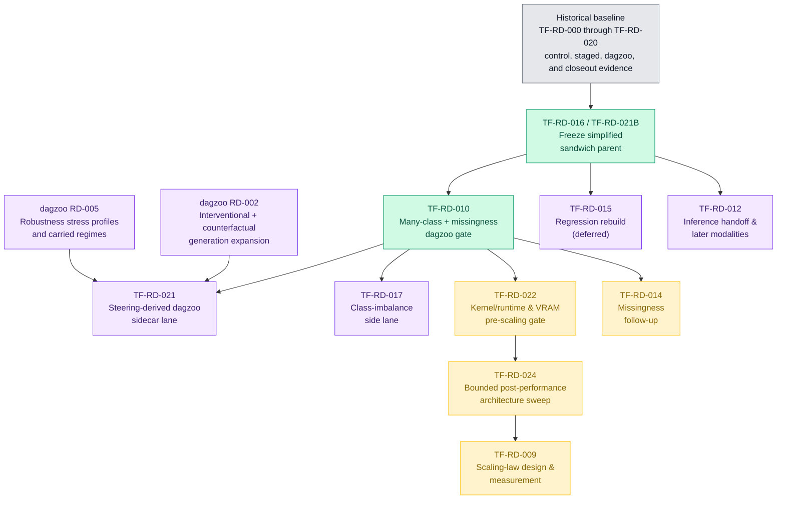

# Roadmap (202604)

Use this roadmap to understand which questions are active now, which surfaces
are frozen, and what evidence the repo still needs before promotion.

The repo-wide plan is now sandwich-first:

- keep one frozen PFN-style control lane for trust and comparison
- treat `tabfoundry_sandwich` as the active classification architecture target
  and scaling-prep family
- use the closed TF-RD-010 classification benchmark contract as the fixed
  anti-saturation regime before the first scaling fit
- treat steering-derived dagzoo fronts and other synthetic-surface expansion
  work as sidecars rather than blockers on the `tab-foundry` critical path
- make bounded kernel/runtime and VRAM optimization a hard prerequisite to
  later scaling so every scale ladder inherits one measured runtime policy
- defer regression from the first classification scaling plan

Use these alongside this roadmap:

- problem formulation: `docs/development/synthetic-prior-mission.md`
- design decisions and repo structure: `docs/development/design-decisions.md`
- codebase navigation: `docs/development/codebase-navigation.md`
- dataset curation and license gate: `docs/development/dataset-curation.md`
- architecture reference: `docs/development/model-architecture.md`
- workflow runbooks: `docs/workflows.md`
- inference/export contract: `docs/inference.md`
- reference index: `reference/README.md`
- evidence appendix: `reference/evidence.md`

## Status Labels

- `implemented`: available in current code and wired into the canonical
  workflow surface
- `completed`: scoped work finished with a recorded decision or evidence
  package, even if it does not imply a promoted default
- `partial`: meaningful building blocks or evidence exist, but the roadmap
  claim is not yet satisfied end to end
- `planned`: clearly scoped and prioritized, but not yet implemented
- `research`: intentionally deferred or gated behind earlier roadmap work
- `retired`: historical item retained only for traceability

## Canonical Planning Metadata

`docs/development/roadmap.md` is the single source of truth for planning state
in `tab-foundry`.

The canonical planning unit is the local roadmap item `TF-RD-###`. External BL
issues or GitHub issues can track execution work when needed, but missing
external issue chains should not block planning. If another document disagrees
with this file, this file is authoritative.

## Program Statement

The roadmap now has one active architecture-development lane:

- frozen control lane:
  - `tabfoundry_simple`
  - `tabfoundry_staged` with `stage=nano_exact`
  - used only for benchmark comparability and experiment trust
- historical incumbent reference:
  - `tabfoundry_staged`
  - useful as a comparison surface, but no longer the focus of roadmap
    sequencing
- active development lane:
  - `tabfoundry_sandwich`
  - fixed-latent `y` / byte-array `x` Perceiver-style classifier
  - owns the current architecture simplification, dagzoo transfer,
    many-class/missingness, runtime, and scaling work

Important non-goals for this roadmap:

- do not treat the current `nano_exact + prenorm + row_cls` hybrid line as the
  long-term destination
- do not assume the incumbent staged reference line is the final architecture
  destination either; it is the current benchmark carry-forward surface
- do not bundle regression into the first row-first promotion push
- do not make QASS structurally mandatory
- do not proliferate many parallel live architecture families beyond the frozen
  control, the incumbent staged reference line, and the current sandwich
  candidate line

## Prioritization Lens

- Classification remains the anchor workload while the sandwich family is
  tested on harder post-008 regimes.
- The next useful architecture evidence should come from coherent sandwich
  surfaces, not from extending the older staged line.
- After TF-RD-016 closeout, the next deliberate front should make the research
  surface less saturating and more realistic: a benchmark-defined
  classification regime where `dagzoo` owns synthetic training fronts,
  `tab-realdata-hub` owns medium and large validation manifests, and
  `tab-foundry` owns the evolved sandwich model and sweep contracts.
- If those harder or broader surfaces still leave the model hard to separate or
  obviously underfit, open a later bounded architecture follow-up before
  relying on scaling-law work as the main next source of evidence.
- Class imbalance is still not sufficiently tested on the current benchmark
  surfaces because the bundles still only enforce
  `min_minority_class_pct = 2.5` rather than defining an explicit skew ladder.
- Harder real-data ladders should keep one canonical OpenML baseline where the
  benchmark tooling is already native, but the validation-bundle source of
  truth now lives in `tab-realdata-hub` rather than in local `tab-foundry`
  fixtures. `dagzoo` remains the synthetic-data lane under TF-RD-013 rather
  than an external real-data source.
- The deliberate post-008 execution order is now:
  TF-RD-016 closes on the modest sandwich evolution and benchmark-definition
  handoff; TF-RD-010 then freezes the first medium and large classification
  validation program, with `dagzoo` synthetic training fronts feeding
  `tab-realdata-hub` materialized manifests; TF-RD-022 then performs the
  telemetry/read-surface cleanup plus bounded kernel, runtime, and VRAM tuning
  needed so later work inherits one explicit runtime policy on that closed
  benchmark contract; TF-RD-024 then runs one bounded post-performance
  architecture-knob sweep on the inherited runtime surface; TF-RD-009 then
  writes the scaling-law design note and fits the first scaling law on the
  same fixed classification contract; TF-RD-021, dagzoo RD-002, dagzoo RD-005,
  and other synthetic-surface expansions remain sidecars rather than blockers
  on the main `tab-foundry` roadmap; TF-RD-014 remains the next follow-on
  missingness lane, while TF-RD-017 moves to later imbalance work outside the
  current critical path.
- Low-level questions such as norm family or placement, learned special-token
  initialization scale, QASS scaler capacity, and activation family belong
  under TF-RD-016 after the earlier adequacy and harder-surface gates are in
  place, not as free-floating anchor-settlement work.
- Many-class, regression, and runtime handoff should build on that
  deconfounded post-008 base rather than competing with the earlier gates.
- Runtime, VRAM, and any bounded kernel tuning should finish before the first
  scaling fit so classification ladders inherit one measured 80 GB A100-safe
  policy instead of discovering memory limits during the scale study.
- Scaling-law design should start only after the repo has a simplified sandwich
  parent, the closed TF-RD-010 benchmark contract, one TF-RD-022 runtime
  policy, and one bounded TF-RD-024 post-performance architecture read on the
  same classification family.

## Canonical Priority Queue

This queue is intentionally sandwich-focused. Historical staged/control work is
summarized later instead of occupying the active queue.

| Rank | Roadmap ID | Item | Status | Milestone |
| ---- | ---------- | ---- | ------ | --------- |
| 1 | TF-RD-022 | Training runtime and VRAM efficiency before classification scaling | partial | Next |
| 2 | TF-RD-024 | Post-performance architecture-knob sweep on the classification-first sandwich target | planned | Next |
| 3 | TF-RD-009 | Scaling-law design and measurement on the classification-first sandwich target | planned | Next |
| 4 | TF-RD-014 | Missingness robustness on the classification-first sandwich target | planned | Next |
| 5 | TF-RD-017 | Class-imbalance robustness on the classification-first sandwich target | planned | Later |
| 6 | TF-RD-021 | Steering-derived dagzoo corpus fronts on the classification-first sandwich target | research | Later |
| 7 | TF-RD-015 | Regression rebuild deferred from the classification-first scaling plan | research | Later |
| 8 | TF-RD-012 | Inference handoff and later modalities | research | Later |

## Dependency Graph

```mermaid
flowchart TD
    HIST["Historical baseline<br/>TF-RD-000 through TF-RD-020<br/>control, staged, dagzoo, and closeout evidence"]
    RD016["TF-RD-016 / TF-RD-021B<br/>Freeze simplified<br/>sandwich parent"]
    RD010["TF-RD-010<br/>Many-class + missingness<br/>dagzoo gate"]
    RD021["TF-RD-021<br/>Steering-derived dagzoo<br/>sidecar lane"]
    DZ002["dagzoo RD-002<br/>Interventional + counterfactual<br/>generation expansion"]
    DZ005["dagzoo RD-005<br/>Robustness stress profiles<br/>and carried regimes"]
    RD017["TF-RD-017<br/>Class-imbalance<br/>side lane"]
    RD022["TF-RD-022<br/>Kernel/runtime & VRAM<br/>pre-scaling gate"]
    RD024["TF-RD-024<br/>Bounded post-performance<br/>architecture sweep"]
    RD014["TF-RD-014<br/>Missingness<br/>follow-up"]
    RD015["TF-RD-015<br/>Regression rebuild<br/>(deferred)"]
    RD012["TF-RD-012<br/>Inference handoff &<br/>later modalities"]
    RD009["TF-RD-009<br/>Scaling-law design &<br/>measurement"]

    HIST --> RD016
    RD016 --> RD010
    RD010 --> RD022
    RD022 --> RD024
    RD024 --> RD009
    RD010 --> RD021
    DZ002 --> RD021
    DZ005 --> RD021
    RD010 --> RD014
    RD010 --> RD017
    RD016 --> RD015
    RD016 --> RD012

    classDef hist fill:#e5e7eb,stroke:#6b7280,color:#111827;
    classDef done fill:#d1fae5,stroke:#059669,color:#064e3b;
    classDef readyNow fill:#fff3cd,stroke:#ffc107,color:#856404;
    classDef gate fill:#fff1d6,stroke:#c67a00,color:#3d2a00;
    classDef later fill:#f3e8ff,stroke:#7c3aed,color:#3b1f6e;

    class HIST hist;
    class RD010,RD016 done;
    class RD022,RD024,RD009,RD014 readyNow;
    class DZ002,DZ005,RD021,RD012,RD015,RD017 later;
```

Current path: **TF-RD-022 → TF-RD-024 → TF-RD-009** on the closed TF-RD-010 benchmark contract.

- TF-RD-016 is now completed historical context: issue
  [#178](https://github.com/bensonlee5/tab-foundry/issues/178) closes on the
  decision to evaluate the next sandwich phase through benchmark definition and
  modest head evolution rather than more simplification-only evidence.
- TF-RD-010 is now completed: issue
  [#52](https://github.com/bensonlee5/tab-foundry/issues/52), issue
  [#99](https://github.com/bensonlee5/tab-foundry/issues/99), and child issues
  [#197](https://github.com/bensonlee5/tab-foundry/issues/197),
  [#198](https://github.com/bensonlee5/tab-foundry/issues/198),
  [#199](https://github.com/bensonlee5/tab-foundry/issues/199), and
  [#200](https://github.com/bensonlee5/tab-foundry/issues/200) remain historical
  setup context, while issue [#202](https://github.com/bensonlee5/tab-foundry/issues/202)
  plus issues [#205](https://github.com/bensonlee5/tab-foundry/issues/205),
  [#203](https://github.com/bensonlee5/tab-foundry/issues/203), and
  [#204](https://github.com/bensonlee5/tab-foundry/issues/204) now define the
  trusted rerun and refactor path that closed the benchmark gate on the same
  contract.
- Issue [#205](https://github.com/bensonlee5/tab-foundry/issues/205) now owns
  the completed `tf_rd_010_classification_evolution_medium_v4` package: row 1
  keeps the refreshed medium control anchor by benchmarking the reusable
  `tf_rd_010_synthetic_adequacy_v3` production-control artifact, while rows 2
  through 4 defer as exploratory missingness reads on the same medium manifest.
- That medium read is now the carried TF-RD-010 comparator: the completed
  sorted-order replay did not beat it, so the original `medium_v4` control
  remains the trusted benchmark anchor for later lanes.
- The completed TF-RD-010 medium follow-up under
  [#202](https://github.com/bensonlee5/tab-foundry/issues/202) is now closed
  negative evidence: row 1 retrained
  `tf_rd_010_dagzoo_medium_control_curated_v5` under the current sorted-order
  code path and finished at `final_log_loss=0.6849303354`, which is worse than
  the original `medium_v4` control at `0.6811727401`.
- `large_v2` under [#203](https://github.com/bensonlee5/tab-foundry/issues/203)
  now records the trusted large-rung replay under that kept comparator:
  control `0.8974410961` remains better than `mcar=0.9155278224`,
  `mar=0.9418792099`, and `mnar=0.9411754209`, so TF-RD-010 does not promote
  missingness exposure from the first medium/large package.
- TF-RD-010 continues to rank the active sandwich benchmark path by
  `final_log_loss_at_matched_regime_budget`, interpreted explicitly as
  label-target log loss per test cell. The older `cell_bpc` / BPC lane is
  preserved only for historical reruns while calibration, runtime, and
  stability remain guardrails on the active CE-based path.
- TF-RD-021, dagzoo RD-002, and dagzoo RD-005 are now sidecar synthetic-data
  work rather than blockers on the main `tab-foundry` architecture path.
- TF-RD-022 is the next hard pre-scaling gate after TF-RD-010: it must hand
  back one measured kernel/runtime policy on the closed medium/large benchmark
  contract before broader scaling fits open.
- TF-RD-024 then runs one bounded post-performance architecture-knob sweep on
  that inherited TF-RD-022 runtime policy, using medium as the screening rung
  and the closed large benchmark as the validation rung for any keep signal.
- TF-RD-009 only starts after TF-RD-022 and TF-RD-024 are closed, and fits the
  first law on the same fixed multiclass benchmark contract under matched
  regime budget.

Parallel/later lanes are intentionally off that main path:

- TF-RD-014 is now a follow-on missingness robustness lane after the first
  many-class plus missingness gate rather than a blocker to the first scaling
  fit.
- TF-RD-017 remains a later imbalance robustness lane on the same family, but
  it is now explicitly off the current TF-RD-022 → TF-RD-024 → TF-RD-009
  critical path.
- TF-RD-015 regression and TF-RD-012 inference handoff/later modalities remain
  later work.

## Current Capability Matrix

| Objective / Claim | Current State | Evidence In Repo | Current Gap | Roadmap IDs |
| --- | --- | --- | --- | --- |
| Frozen PFN-style control exists | `implemented` | `tabfoundry_simple`, `stage=nano_exact`, and the prior-trained PFN-facing benchmark lane are all stable | Keep that lane clearly separate from the architecture target | `TF-RD-001` |
| Sandwich is the primary classification candidate | `implemented` | `tabfoundry_sandwich` is landed, the compact hybrid replay is benchmarked, the first knob screen plus bounded width/head follow-up both kept the compact control, the completed removal-first package under [#184](https://github.com/bensonlee5/tab-foundry/issues/184) retained that anchor, and TF-RD-016 now closes on a bounded direct-multiclass head evolution | Judge the evolved sandwich family on the TF-RD-010 benchmark program rather than reopening simplification-first work | `TF-RD-016`, `TF-RD-021A`, `TF-RD-021B`, `TF-RD-010` |
| Harder synthetic classification fronts are runnable | `implemented` | Dagzoo manifest/export fidelity is complete, TF-RD-013 settled the representative medium surface, TF-RD-020 settled harder-front winners that can seed the sandwich benchmark program, and dagzoo epics [#249](https://github.com/bensonlee5/dagzoo/issues/249) and [#247](https://github.com/bensonlee5/dagzoo/issues/247) define later surface-expansion work | Keep TF-RD-021 and dagzoo RD-002/RD-005 as sidecar synthetic-data context while TF-RD-022 and TF-RD-024 execute on the closed TF-RD-010 benchmark contract | `TF-RD-011`, `TF-RD-013`, `TF-RD-020`, `TF-RD-016`, `TF-RD-010`, `TF-RD-021` |
| Runtime and VRAM are measurable | `partial` | Training and registry artifacts now preserve runtime-summary and regime-budget fields, `tab-foundry dev run-inspect` now exposes compact runtime and regime-budget summaries, sweep summaries now carry compact runtime columns, and the repo already has bf16/checkpointing-capable runtime plumbing plus a named TF-RD-022 runtime-policy surface | TF-RD-022 still needs to turn those read surfaces into one explicit 80 GB A100-safe kernel/runtime policy on the closed TF-RD-010 classification benchmark contract | `TF-RD-022` |
| Benchmark-backed classification validation contract is fixed, `medium_v4` completed the directional medium package, `medium_v5` now records the sorted-control replay, and `large_v2` now records the local large-rung replay | `implemented` | `many_class` is implemented, the sandwich evolution config fixes FiLM plus `sandwich_summary_tokens_per_axis=3`, `tab-realdata-hub` issue [#1](https://github.com/bensonlee5/tab-realdata-hub/issues/1) owns the medium and large validation manifests under `min_classes=2`, `max_classes=10`, and `max_missing_pct=20.0`, TF-RD-010 child issues [#197](https://github.com/bensonlee5/tab-foundry/issues/197), [#198](https://github.com/bensonlee5/tab-foundry/issues/198), [#199](https://github.com/bensonlee5/tab-foundry/issues/199), and [#200](https://github.com/bensonlee5/tab-foundry/issues/200) froze the missing baselines plus corpora, `medium_v4` now records a kept medium control anchor plus exploratory MCAR, MAR, and MNAR defer rows, `medium_v5` now records the completed sorted-order control replay under [#202](https://github.com/bensonlee5/tab-foundry/issues/202) at `0.6849303354`, and `large_v2` now records the completed local all-rows benchmark-only large replay under [#203](https://github.com/bensonlee5/tab-foundry/issues/203) with control `0.8974410961`, `mcar=0.9155278224`, `mar=0.9418792099`, and `mnar=0.9411754209` | TF-RD-010 now explicitly keeps the original `medium_v4` control (`0.6811727401`) over the worse sorted-order `medium_v5` replay (`0.6849303354`), and the completed `large_v2` replay preserves the same ordering with control best on the harder rung. Later lanes inherit that closed benchmark contract and the no-missingness-promotion read, while the canonical metric key remains `final_log_loss_at_matched_regime_budget`, interpreted as label-target log loss per test cell | `TF-RD-010`, `TF-RD-022`, `TF-RD-024`, `TF-RD-014`, `TF-RD-017` |
| Follow-on missingness and imbalance robustness remain open | `partial` | Missing-permitting binary bundles exist, and the current bundle policy already excludes degenerate minority-class cases | TF-RD-014 remains the next follow-on missingness lane after the first scaling pass, while TF-RD-017 still needs an explicit later imbalance ladder on the same sandwich family | `TF-RD-014`, `TF-RD-017` |
| Regression and later modalities are deferred | `research` | Partial bundle/runtime scaffolding exists | They should not absorb attention from the classification-first path | `TF-RD-015`, `TF-RD-012` |
| Scaling-law work has the needed metadata path | `planned` | Artifacts now preserve resolved sandwich specs plus runtime/regime-budget metadata, TF-RD-010 has fixed the first benchmark-defined classification contract, and TF-RD-024 now has a bounded post-performance sweep scaffold | TF-RD-009 now waits on the TF-RD-022 runtime gate and the TF-RD-024 bounded architecture read on that closed contract | `TF-RD-009`, `TF-RD-010`, `TF-RD-022`, `TF-RD-024` |

## Current Implementation Baseline

This roadmap assumes the following repo truths:

- `tabfoundry_simple` and `tabfoundry_staged` with `stage=nano_exact` remain
  the frozen PFN-style control lane.
- `tabfoundry_sandwich` exists as the primary classification architecture
  candidate; the initial replay, knob screen, bounded width/head follow-up,
  and removal-first package are complete, and the compact hybrid anchor remains
  the kept parent after [#184](https://github.com/bensonlee5/tab-foundry/issues/184).
- dagzoo manifest identity, export/reference preprocessing fidelity, and the
  one-way data boundary are part of the baseline rather than active blockers.
- the representative post-008 synthetic training-data surface is
  `tf_rd_013_dagzoo_shape_aware_size_medium_v1`.
- many-class scaffolding exists, and the next harder carried classification
  target is now a dagzoo-backed many-class plus missingness slice; regression
  and later inference/runtime handoff are still not part of the first
  classification-scaling path.

## Roadmap Items

### Historical Summary

- TF-RD-000 through TF-RD-013 established the control lane, the staged
  row-first reference, the shared repo/data contracts, and the representative
  dagzoo training surface.
- TF-RD-018 and TF-RD-020 remain historical staged-control evidence only:
  partial training-surface closeout plus harder dagzoo corpus-front winners.
- The detailed historical record remains in completed issues, sweep artifacts,
  and [reference/evidence.md](../../reference/evidence.md); the sections below
  focus on active sandwich development and later follow-up lanes.

Legacy wording note:

- some TF-RD item titles still use earlier row-first or promoted-anchor
  phrasing so existing roadmap links remain stable
- the dependency order, current-state bullets, and required-work bullets below
  are the authoritative description of the active sandwich-first path

### TF-RD-010: Benchmark-Defined Multiclass Evolution On The Classification-First Sandwich Target

- Status: `completed`
- Milestone: `Completed`
- Goal: define the first benchmark-backed classification evaluation program for
  the evolved sandwich family using explicit hub-owned bundle policy rather
  than local fixture assumptions
- Current state:
  - issue [#52](https://github.com/bensonlee5/tab-foundry/issues/52) and issue
    [#99](https://github.com/bensonlee5/tab-foundry/issues/99) now serve as
    historical umbrella and execution context, while issue
    [#202](https://github.com/bensonlee5/tab-foundry/issues/202) is the closed
    trusted-rerun umbrella
  - historical child issues
    [#197](https://github.com/bensonlee5/tab-foundry/issues/197),
    [#198](https://github.com/bensonlee5/tab-foundry/issues/198),
    [#199](https://github.com/bensonlee5/tab-foundry/issues/199), and
    [#200](https://github.com/bensonlee5/tab-foundry/issues/200) define the
    TF-RD-010 corpora and freeze the missing baselines; successor issues
    [#205](https://github.com/bensonlee5/tab-foundry/issues/205) completed the
    trusted medium rerun package, while
    [#203](https://github.com/bensonlee5/tab-foundry/issues/203) now records
    the completed local large-rung benchmark-only replay
  - issue [#204](https://github.com/bensonlee5/tab-foundry/issues/204) is the
    completed sandwich refactor follow-up that landed before the trusted
    TF-RD-010 reruns were recorded as canonical evidence
  - `tab-realdata-hub` issue
    [#1](https://github.com/bensonlee5/tab-realdata-hub/issues/1) is now the
    upstream dependency for medium and large classification validation bundles
    and materialized manifests
  - the evolved sandwich benchmark config uses FiLM,
    `sandwich_summary_tokens_per_axis=3`, `many_class_base=10`, and a direct
    multiclass head
  - the canonical benchmark metric key remains
    `final_log_loss_at_matched_regime_budget`, interpreted explicitly as
    label-target log loss per test cell
  - the synthetic TF-RD-010 corpora and upstream hub bundles now align on
    `min_classes=2`, `max_classes=10`; the upstream hub bundles also fix
    `max_missing_pct=20.0`
  - the active TF-RD-010 synthetic fronts are explicit balanced grids with
    `144` tasks per front, row totals `128/256/512/1024`, feature counts
    `6/10/14/20`, and class coverage for every integer `2..10`
  - the repo now has materialized validation manifests under the local
    benchmark-manifest output root, with the legacy local output ids
    `openml_classification_medium_v1` and
    `openml_classification_large_v1`
  - issue [#205](https://github.com/bensonlee5/tab-foundry/issues/205) is now
    completed for the medium rung: row 1 reused the finished
    `tf_rd_010_synthetic_adequacy_v3` production-control train artifact and
    kept the medium anchor at `final_log_loss=0.6811727401`, while rows 2
    through 4 finished as exploratory defer reads with `mcar=0.6944203482`,
    `mar=0.7090284828`, and `mnar=0.7095624598`
  - `tf_rd_010_classification_evolution_medium_v5` now records the completed
    sorted-order control replay: row 1 finished at `final_log_loss=0.6849303354`,
    which is worse than the carried `medium_v4` control anchor at
    `0.6811727401`, so TF-RD-010 explicitly keeps the original `medium_v4`
    control as the carried comparator
  - `tf_rd_010_classification_evolution_large_v2` now records the completed
    local all-rows benchmark-only replay: the large control row finished at
    `final_log_loss=0.8974410961`, while the exploratory missingness rows
    finished at `mcar=0.9155278224`, `mar=0.9418792099`, and
    `mnar=0.9411754209`, preserving the same control-best ordering on the
    harder rung
- What remains fixed:
  - `dagzoo` now owns the explicit TF-RD-010 control, MCAR, MAR, and MNAR
    corpora through `tf_rd_010_dagzoo_medium_control_v1`,
    `tf_rd_010_missingness_mcar_v1`, `tf_rd_010_missingness_mar_v1`, and
    `tf_rd_010_missingness_mnar_v1`
  - upcoming synthetic sweeps now default to one pass over corpus manifest
    tasks at `prior_dump_batch_size=64`, and TF-RD-010 adopts that single-epoch
    synthetic budget for its trusted reruns
  - `tab-foundry` froze the legacy baseline ids
    `cls_benchmark_linear_multiclass_medium_v1` and
    `cls_benchmark_linear_multiclass_large_v1` against the hub-backed medium
    and large manifests
  - the `dagzoo -> tab-realdata-hub -> tab-foundry` benchmark contract remains
    fixed and does not need to be redefined
  - the refreshed `dagzoo` factorization now follows equation `(1)`, and the
    closed TF-RD-010 rerun package is recorded on that refreshed `*_v3` corpus
    family
  - medium row 1 is the only promotable row in `medium_v4`; rows 2 through 4
    remain exploratory because curated missingness fronts do not exist yet
  - `medium_v5` is the completed single-row sorted-control follow-up and does
    not reopen the exploratory medium missingness rows
- Reset state:
  - the previously recorded medium and large sweep executions are invalidated by
    later training and sandwich correctness fixes and are no longer canonical
    evidence
  - on-disk run directories, W&B runs, and old closed execution issues remain as
    historical artifacts only
  - the trusted rerun path now flows through issues
    [#202](https://github.com/bensonlee5/tab-foundry/issues/202),
    [#205](https://github.com/bensonlee5/tab-foundry/issues/205),
    [#203](https://github.com/bensonlee5/tab-foundry/issues/203), and
    [#204](https://github.com/bensonlee5/tab-foundry/issues/204)
  - `medium_v4` is no longer a blocked draft: it is the completed medium rerun
    package on the refreshed contract
  - `medium_v5` is now the completed sorted-order control replay on the medium
    rung
  - `large_v2` is no longer blocked on execution or interpretation: the local
    benchmark-only replay is completed and read against the kept original
    `medium_v4` control
- Exit criteria:
  - satisfied: the repo has one explicit medium-plus-large classification benchmark
    contract on the evolved sandwich family
  - satisfied: the hub-backed classification contract is no longer only
    untested scaffolding on the first scaling path
  - satisfied: `medium_v4` now records one kept medium control anchor plus the
    first exploratory medium missingness read on the corrected sandwich family
  - satisfied: TF-RD-010 explicitly keeps the original `medium_v4` control
    (`0.6811727401`) over the completed `medium_v5` sorted-order replay
    (`0.6849303354`)
  - satisfied: the completed medium and large missingness rows remain deferred
    because none beat the carried control on either rung
  - satisfied: later lanes can now inherit TF-RD-010 again as closed benchmark
    context

### TF-RD-012: Inference Handoff And Later Modalities

- Status: `research`
- Milestone: `Later`
- Goal: advance separate-runtime handoff and genuinely later modalities only
  after the classification-first sandwich base is stable
- Current state:
  - classification remains the only active supported prediction mode
  - runtime handoff and later modalities remain deferred
- Required work:
  - advance separate-runtime handoff only after the classification base settles
  - keep time series, text-conditioned inputs, and other later modalities out
    of the current path
- Exit criteria:
  - inference handoff and later modalities build on the classification-first
    sandwich base
    rather than running ahead of it

### TF-RD-014: Missingness Robustness On The Classification-First Sandwich Target

- Status: `planned`
- Milestone: `Next`
- Goal: deepen missingness robustness after the first scaling pass has landed
  on the carried sandwich family
- Current state:
  - `missingness_followup` exists, but it is anchored on the older stabilized
    prenorm hybrid surface rather than the carried sandwich family
  - the repo already has separate no-missing and allow-missing benchmark bundle
    contracts
  - issue [#97](https://github.com/bensonlee5/tab-foundry/issues/97) remains
    the missingness epic, and completed TF-RD-010 now records the first
    anti-saturation many-class plus missingness gate
  - issue [#146](https://github.com/bensonlee5/tab-foundry/issues/146) now
    occupies the adjacent synthetic harder-dagzoo slot and does not replace
    this benchmark-front missingness lane
  - there is no explicit carried-sandwich missingness recommendation yet; the
    older TF-RD-008 row-first settlement remains historical context only
- Required work:
  - re-anchor missingness work on the carried sandwich family after the carried
    many-class plus missingness slice is established under TF-RD-010
  - keep this lane off the immediate TF-RD-022 -> TF-RD-024 -> TF-RD-009 path
    so it can inherit the first kept benchmark contract and runtime policy
    rather than compete with the first scaling pass
  - keep one pinned OpenML missingness ladder as the canonical benchmark
    baseline and allow license-cleared manifest-backed external augmentations
    when they add missingness regimes OpenML does not cover cleanly
  - use a review ledger for both OpenML datasets and vetted external real-data
    candidates rather than relying on source names alone
  - keep regime identity in task-source names, bundle names, manifest names,
    and curation reports rather than changing benchmark bundle schema in this
    pass
  - focus this lane on deeper missingness mechanism, severity, and benchmark
    coverage rather than on establishing the first anti-saturation regime
  - decide whether explicit missingness handling belongs in the default carried
    sandwich family or remains an optional robustness variant after TF-RD-010
- Exit criteria:
  - the repo has a benchmark-backed follow-on missingness recommendation for
    the carried sandwich family beyond the first many-class plus missingness
    gate

### TF-RD-017: Class-Imbalance Robustness On The Classification-First Sandwich Target

- Status: `planned`
- Milestone: `Later`
- Goal: decide how the carried sandwich family behaves under materially
  skewed class priors
- Current state:
  - current benchmark bundles only enforce `min_minority_class_pct = 2.5`
  - there is no dedicated imbalance-focused bundle ladder yet
  - this now remains a later robustness lane once TF-RD-010 has established
    the first sandwich many-class plus missingness dagzoo slice
  - issue [#146](https://github.com/bensonlee5/tab-foundry/issues/146) now
    occupies the adjacent synthetic harder-dagzoo slot and does not replace
    this benchmark-front imbalance lane
  - benchmark-facing reporting is still centered on ROC AUC, log loss, and
    Brier score
- Required work:
  - keep this lane explicitly behind TF-RD-022, TF-RD-024, and TF-RD-009 so
    the first scaling pass lands before imbalance-specific follow-up work
  - define the canonical imbalance-focused binary bundle or bundle-selection
    ladder on the carried sandwich family
  - keep one pinned OpenML imbalance ladder as the canonical benchmark
    baseline and allow license-cleared manifest-backed external augmentations
    when they add skew regimes OpenML does not cover cleanly
  - use the same review ledger for OpenML datasets and vetted external
    real-data candidates
  - keep regime identity in task-source names, bundle names, manifest names,
    and curation reports rather than changing benchmark bundle schema in this
    pass
  - define benchmark-facing comparison and reporting that includes PR AUC,
    average precision, and balanced accuracy alongside ROC/log loss/Brier
  - measure the carried sandwich family first without class reweighting or
    focal-style loss changes
  - only if the baseline read is weak, run bounded weighted-loss or focal-loss
    follow-up work
- Exit criteria:
  - the repo has a benchmark-backed keep/defer decision on the promoted
    sandwich family under class imbalance
  - the repo has an explicit imbalance metric and reporting contract rather
    than relying only on the current general binary bundle metrics

### TF-RD-018: Training-Surface Adequacy On The Promoted Anchor

- Status: `closed incomplete`
- Milestone: `Historical`
- Goal: preserve the completed staged-control training-surface reads without
  continuing this lane as a blocker now that the repo is prioritizing the
  sandwich family
- Current state:
  - issue [#109](https://github.com/bensonlee5/tab-foundry/issues/109) closed
    the initial dataset-batch ladder on the representative post-008 medium
    dagzoo surface
  - issue [#137](https://github.com/bensonlee5/tab-foundry/issues/137) kept
    `schedulefree_adamw` over `adamw` and `muon` on the inherited
    `tf_rd_020_shift_noise_drift_v1` staged-control runtime
  - TF-RD-020 remains the historical harder-front handoff for that same
    staged-control line
  - the remaining LR, clipping, and step-budget follow-up under issues
    [#138](https://github.com/bensonlee5/tab-foundry/issues/138) and
    [#139](https://github.com/bensonlee5/tab-foundry/issues/139) is no longer
    on the active roadmap path
  - issue [#107](https://github.com/bensonlee5/tab-foundry/issues/107) is now
    a closeout tracker rather than an active research epic
- Closure decision:
  - keep the completed TF-RD-018 artifacts as historical evidence on the
    staged-control line
  - do not treat unfinished TF-RD-018 LR or clipping work as a blocker for
    sandwich-first dagzoo, many-class, steering, runtime, or scaling work
  - if later runtime or optimizer tuning is needed, do it on the carried
    sandwich classification family under TF-RD-022, TF-RD-024, or TF-RD-009
    instead of reopening TF-RD-018
- Exit criteria:
  - satisfied: the repo retains one explicit partial training-surface record on
    the staged-control line
  - satisfied: the active path now moves to sandwich simplification and dagzoo
    carry-forward instead of continuing TF-RD-018

### TF-RD-022: Performance Optimization On The Settled Sandwich Runtime Surface Before Classification Scaling

- Status: `partial`
- Milestone: `Next`
- Goal: close the bounded training, benchmark, and materialization performance
  questions that remain after runtime-policy selection, so later scaling work
  inherits one settled runtime surface and explicit keep or defer reads on the
  remaining local speed levers
- Current state:
  - completed historical issues [#58](https://github.com/bensonlee5/tab-foundry/issues/58),
    [#169](https://github.com/bensonlee5/tab-foundry/issues/169), and
    [#170](https://github.com/bensonlee5/tab-foundry/issues/170) now record
    the runtime-summary instrumentation, bounded medium ladder, and named
    runtime-policy surface that made TF-RD-022 explicit enough for downstream
    work; issue [#171](https://github.com/bensonlee5/tab-foundry/issues/171)
    is superseded because TF-RD-022 will not reopen harder-surface batching
  - epic [#168](https://github.com/bensonlee5/tab-foundry/issues/168) now
    tracks performance optimization on the settled runtime surface, with child
    issues [#239](https://github.com/bensonlee5/tab-foundry/issues/239),
    [#240](https://github.com/bensonlee5/tab-foundry/issues/240), and
    [#241](https://github.com/bensonlee5/tab-foundry/issues/241)
  - the sandwich architecture lane still lives under issue
    [#178](https://github.com/bensonlee5/tab-foundry/issues/178), with issue
    [#184](https://github.com/bensonlee5/tab-foundry/issues/184) recording the
    keep-current-anchor decision before the current benchmark-only follow-up
  - training telemetry and benchmark-registry records now preserve
    `runtime_summary` and `regime_budget` payloads, including peak VRAM,
    throughput, token-budget fields, objective metric, and curriculum or SCM
    metadata
  - `tab-foundry dev run-inspect`, sweep summaries, and result-card reporting
    now surface compact runtime and regime-budget reads directly, so issue
    [#58](https://github.com/bensonlee5/tab-foundry/issues/58) is no longer
    blocked on manual log inspection
  - the repo now has a named runtime policy surface at
    `configs/runtime/tf_rd_022_policy.yaml` plus the inherited benchmark-facing
    experiment `cls_benchmark_sandwich_classification_evolution_tf_rd_022_policy_v1`
  - sweep `tf_rd_022_runtime_policy_medium_v1` is now registered as the
    benchmark-first TF-RD-022 medium screening ladder: row 1 replays the
    no-AMP control, rows 2 through 4 isolate bf16, benchmark-facing activation
    tracing, and activation checkpointing, and the keep bar requires
    non-worse `final_log_loss_at_matched_regime_budget` before runtime or VRAM
    tie-breakers are considered
  - `tf_rd_022_runtime_policy_medium_v1` is now completed locally from the
    mirrored CUDA run artifacts: row 4
    `sd_tf_rd_022_runtime_policy_medium_v1_04_delta_tf_rd_022_cls_runtime_checkpoint_v1_v2`
    is the medium-rung winner with `final_log_loss=0.6765953232`,
    `peak_vram_reserved=3321888768`, and
    `throughput_tokens_per_second=150561.1995`; row 2 bf16 is benchmark-safe
    but deferred, row 3 trace is benchmark-safe but diagnostic-only, and row 1
    remains the no-AMP screening control
  - the inherited validation contract is the closed TF-RD-010 medium and large
    classification benchmark package under issues
    [#202](https://github.com/bensonlee5/tab-foundry/issues/202),
    [#203](https://github.com/bensonlee5/tab-foundry/issues/203),
    [#204](https://github.com/bensonlee5/tab-foundry/issues/204), and
    [#205](https://github.com/bensonlee5/tab-foundry/issues/205)
  - the named TF-RD-022 runtime policy surface now inherits the measured
    medium winner (`mixed_precision=bf16`, `trace_activations=false`,
    `activation_checkpointing=true`)
  - issue [#239](https://github.com/bensonlee5/tab-foundry/issues/239) now
    records one explicit same-host CUDA training-throughput defer on the
    low-risk loader-overlap and non-blocking-transfer path: the candidate
    improved `best_training_time` from `6117.0161` to `3429.1443` and
    `final_training_time` from `6244.0331` to `3456.8260`, but drifted the
    wrong way on benchmark quality (`best_roc_auc=0.6619213 -> 0.6592971`,
    `best_log_loss=0.5339507 -> 0.5346940`,
    `best_brier_score=0.3631727 -> 0.3636804`,
    `best_bpc=2.1102889 -> 2.1123012`), so the carried runtime policy remains
    unchanged
- this epic now follows the closed TF-RD-010 benchmark contract directly; it
  should not reopen sandwich-parent selection, TF-RD-021, dagzoo RD-002,
  dagzoo RD-005, or broader regime-choice work
- Required work:
  - close the benchmark-throughput lane under issue
    [#240](https://github.com/bensonlee5/tab-foundry/issues/240) with one
    explicit keep or defer decision on the serial medium benchmark evaluator
  - close the corpus-materialization-throughput lane under issue
    [#241](https://github.com/bensonlee5/tab-foundry/issues/241) with one
    explicit keep or defer decision plus local-versus-upstream bottleneck
    attribution
  - only reopen training-throughput work if a more diagnostic profiling pass
    shows a narrower follow-up than the deferred combined `#239` candidate
  - keep sandwich architecture ownership under historical implementation issue
    [#174](https://github.com/bensonlee5/tab-foundry/issues/174), active
    umbrella issue [#178](https://github.com/bensonlee5/tab-foundry/issues/178),
    and the completed anchor-retention decision in
    [#184](https://github.com/bensonlee5/tab-foundry/issues/184) rather than
    reopening this runtime epic as the sandwich owner; MPS OOMs should not be
    part of the quantitative CUDA decision record
  - keep architecture, synthetic-surface choice, and law-fitting changes out
    of this epic except insofar as TF-RD-016 and TF-RD-010 have already frozen
    them for the runtime read
- Exit criteria:
  - the repo has one explicit runtime policy for the classification scaling
    target, justified by repo-local time and VRAM evidence
  - the repo has one explicit measured keep or defer outcome for training
    throughput, medium benchmark throughput, and corpus materialization
    throughput on that settled runtime surface
  - sweep outputs, inspect surfaces, and result summaries expose runtime and
    timing reads compactly enough that future runs can be compared without
    manual log inspection
  - later TF-RD-024 architecture work and TF-RD-009 preparation can inherit
    the same runtime policy without re-deriving it from scratch

### TF-RD-024: Post-Performance Architecture-Knob Sweep On The Classification-First Sandwich Target

- Status: `planned`
- Milestone: `Next`
- Goal: run one bounded post-performance sandwich knob sweep after TF-RD-022 so
  TF-RD-009 inherits a fixed runtime policy and one explicit keep/defer read on
  the remaining non-scaling architecture knobs
- Current state:
  - issue [#233](https://github.com/bensonlee5/tab-foundry/issues/233) now
    tracks this post-performance architecture lane
  - sweep `tf_rd_024_classification_knob_sweep_v1` is drafted and inherits the
    benchmark-facing runtime policy experiment
    `cls_benchmark_sandwich_classification_evolution_tf_rd_022_policy_v1`
  - the inherited TF-RD-022 medium winner is now the checkpointed bf16 policy
    (`mixed_precision=bf16`, `trace_activations=false`,
    `activation_checkpointing=true`), and TF-RD-024 stays blocked until
    TF-RD-022 closes the remaining benchmark and materialization performance
    follow-up work
  - completed sweep `tf_rd_025_sandwich_rational_activation_screen_v1` now
    records the sandwich-only CPU train screen for `sandwich_block_norm=none`
    and local rational activation on the same TF-RD-010 medium contract; the
    rational row stayed trainable but did not beat the norm-free GELU control
    and ran materially slower, so this sidecar does not earn a benchmark rerun
    or change the active TF-RD-024 knob set
  - the sweep reuses historical TF-RD-021B sandwich delta families where
    possible instead of inventing a new parallel architecture-search path
  - every drafted row remains blocked on TF-RD-022 performance closeout so the
    first execution can happen on one explicit inherited runtime surface
- Required work:
  - wait for TF-RD-022 performance closeout, then execute the bounded TF-RD-024
    sweep on the closed TF-RD-010 medium benchmark contract as the screening
    rung
  - validate any keep-worthy medium signal on the closed TF-RD-010 large rung
    before carrying a knob forward into TF-RD-009
  - keep the live knob set bounded to `head_hidden_dim`,
    `sandwich_summary_tokens_per_axis`, `sandwich_latents`, `sandwich_heads`,
    `sandwich_ff_expansion`, and `sandwich_self_attention_per_cross`
  - keep `d_icl`, `sandwich_layers`, batch size, LR, clipping, optimizer
    family, and other training-dynamics knobs out of this epic
  - reuse the existing system-delta machinery and the historical sandwich delta
    families rather than opening a second sweep implementation path
- Exit criteria:
  - the repo has one explicit keep/defer decision on the bounded
    post-performance sandwich knob set under the inherited TF-RD-022 runtime
    policy
  - TF-RD-009 can freeze the remaining non-scaling architecture knobs and
    proceed on the inherited benchmark and runtime contract

### TF-RD-020: Harder Dagzoo Corpus Fronts On The Promoted Anchor

- Status: `completed`
- Milestone: `Completed`
- Goal: once the first TF-RD-018 dataset-batch ladder is complete, turn harder
  dagzoo-generated corpus fronts into the next explicit synthetic harder-surface
  decision lane on the historical staged-control line
- Current state:
  - TF-RD-020 is now historical handoff material rather than an active lane.
  - It closed on one kept harder-front winner in each family, with
    `tf_rd_020_shift_noise_drift_v1` becoming the default carry-forward
    surface for TF-RD-018 and `tf_rd_020_noise_mixture_v1` retained as named
    fallback context.
  - The completed ladder stayed synthetic-data-only; benchmark-front
    missingness and imbalance remain separate work.
- Completed outcomes:
  - `tf_rd_020_missingness_mcar_v1` is the kept missingness family winner.
  - `tf_rd_020_shift_noise_drift_v1` is the kept default harder carry-forward
    winner.
  - `tf_rd_020_noise_mixture_v1` is the kept mechanism/noise-family winner.
  - Larger-corpus, winner-mix, and steering follow-ups moved to later lanes
    rather than reopening TF-RD-020 itself.
- Exit criteria:
  - satisfied: the repo retains a documented default harder front plus named
    fallback context without reopening the completed ladder
  - satisfied: the relationship to TF-RD-010, TF-RD-017, and TF-RD-021 is
    explicit and non-overlapping

### TF-RD-021: Steering-Derived Dagzoo Corpus Fronts On The Classification-First Sandwich Target

- Status: `research`
- Milestone: `Later`
- Goal: keep steering-derived dagzoo corpus-front expansion available as a
  synthetic-data sidecar without blocking the main TF-RD-022 → TF-RD-024 →
  TF-RD-009 path on the closed TF-RD-010 benchmark contract
- Current state:
  - issue [#165](https://github.com/bensonlee5/tab-foundry/issues/165) is the
    successor synthetic-data epic after the first sandwich many-class
    benchmark contract is established
  - TF-RD-020 already records the historical staged-control harder-front
    winners, while TF-RD-010 now records the fixed first sandwich benchmark
    contract that later lanes already inherit directly
  - completed dagzoo issue
    [#246](https://github.com/bensonlee5/dagzoo/issues/246) remains historical
    steering context, while dagzoo epics
    [#249](https://github.com/bensonlee5/dagzoo/issues/249) and
    [#247](https://github.com/bensonlee5/dagzoo/issues/247) now define the
    upstream surface expansion that TF-RD-021 will inherit
  - this lane no longer blocks TF-RD-022 runtime work, the new TF-RD-024
    bounded architecture sweep, or TF-RD-009 scaling-law preparation
- Required work:
  - if this sidecar resumes, reuse the closed TF-RD-010 benchmark contract,
    then wait for dagzoo RD-002 and RD-005 under issues
    [#249](https://github.com/bensonlee5/dagzoo/issues/249) and
    [#247](https://github.com/bensonlee5/dagzoo/issues/247) to expand the
    admissible candidate surface and metadata contract
  - freeze one evaluation-ready post-RD-002/RD-005 dagzoo candidate set under
    a dedicated child of issue
    [#165](https://github.com/bensonlee5/tab-foundry/issues/165), including
    named presets, regime identifiers, and the compact metadata needed for
    matched-regime-budget comparisons
  - run one bounded carry-forward sweep under issue
    [#167](https://github.com/bensonlee5/tab-foundry/issues/167) on that
    frozen candidate set: one incumbent control row on the carried sandwich
    dagzoo slice plus a small set of named post-RD-002/RD-005 corpus rows
  - hold architecture, many-class plus missingness regime definition, and
    benchmark contract fixed across every row
  - interpret `final_log_loss_at_matched_regime_budget` first, with
    calibration, runtime, clipped-step fraction, and stability telemetry as
    guardrails
  - keep exactly one expanded dagzoo carry-forward surface only if it clearly
    beats the incumbent control; otherwise keep the original carried slice
  - keep this epic synthetic-data-only rather than absorbing imbalance,
    runtime-kernel, or scaling-law conclusions
- Exit criteria:
  - the repo has one explicit keep/defer decision on whether any frozen
    post-RD-002/RD-005 corpus front replaces the carried sandwich dagzoo slice
  - the relationship between TF-RD-021 and TF-RD-010, TF-RD-017, TF-RD-022,
    TF-RD-024, and TF-RD-009 is explicit and non-overlapping

### TF-RD-015: Regression Rebuild Deferred From The Classification-First Scaling Plan

- Status: `research`
- Milestone: `Later`
- Goal: resume regression only after the classification-first sandwich scaling
  plan has landed a stable runtime policy, harder-surface classification
  evidence, and a usable scaling contract
- Current state:
  - regression support is intentionally removed from the active repo surface
  - regression metrics and bundle normalization support already exist in parts
    of the repo
  - there is no active regression program, canonical regression bundle, or
    regression head/loss contract
  - regression is intentionally out of scope as a blocker for the first
    classification scaling program
- Required work:
  - define the canonical regression benchmark surface or surfaces only after
    the classification-first scaling plan closes its core gates
  - if regression curation expands, keep one OpenML baseline where possible and
    use only license-cleared manifest-backed external datasets as augmentations
  - define the eventual regression head and loss contract on the chosen
    post-classification family rather than reopening regression ownership now
- Exit criteria:
  - regression has a benchmark-facing baseline and a bounded roadmap for
    promotion or deferral after the classification-first scaling plan is
    complete

### TF-RD-016: Architecture Surface Adequacy, Sandwich Simplification, And Selective Expansion

- Status: `completed`
- Milestone: `Completed`
- Goal: determine whether the sandwich family needed more simplification-first
  work before broader harder-surface evaluation
- Current state:
  - issue [#178](https://github.com/bensonlee5/tab-foundry/issues/178) now
    closes as a historical handoff issue rather than an active lane
  - the earlier summary-bottleneck replay is closed negative evidence under
    [#179](https://github.com/bensonlee5/tab-foundry/issues/179), while the
    compact hybrid replay and the first two follow-up screens under
    [#181](https://github.com/bensonlee5/tab-foundry/issues/181),
    [#182](https://github.com/bensonlee5/tab-foundry/issues/182), and
    [#183](https://github.com/bensonlee5/tab-foundry/issues/183) all kept the
    compact hybrid control unchanged
  - issue [#184](https://github.com/bensonlee5/tab-foundry/issues/184) ran the
    four-row removal-first package and kept the compact hybrid control
    unchanged as the historical predecessor surface
  - TF-RD-016 now records that the next useful evidence is benchmark definition
    plus a modest head/output evolution, not more simplification-only replay
- Completed outcomes:
  - the repo now has a bounded decision that the sandwich backbone is coherent
    enough to move into medium and large multiclass benchmark formulation
  - the follow-on family is explicitly FiLM-conditioned, uses
    `sandwich_summary_tokens_per_axis=3`, raises `many_class_base` to `10`, and
    uses a direct multiclass head rather than reopening the staged line
  - TF-RD-010 then fixed the first benchmark program contract, with `dagzoo`
    synthetic training fronts feeding `tab-realdata-hub` validation manifests;
    the corrected medium rerun is now complete and the large-rung replay is
    now recorded as a completed local benchmark-only pass, with the original
    `medium_v4` control explicitly retained over the worse `medium_v5`
    sorted-order replay
- Exit criteria:
  - satisfied: the repo has an explicit keep/defer decision that the sandwich
    architecture surface is adequate enough to move into benchmark-defined
    multiclass evaluation
  - satisfied: later work now reuses one coherent sandwich family instead of
    reopening general simplification or staged-family divergence

### TF-RD-009: Scaling-Law Design And Measurement On The Classification-First Sandwich Target

- Status: `planned`
- Milestone: `Next`
- Goal: fit the first classification scaling laws on the simplified sandwich
  family only after the repo has the closed TF-RD-010 benchmark contract, one
  TF-RD-022 runtime policy, one TF-RD-024 bounded architecture read, and a
  literature-grounded law-design note
- Current state:
  - tuning and benchmark-adjacent tooling already exist
  - scaling-law intent is clear, but scaling on the current simple binary regime
    risks low-signal conclusions because recent architecture deltas are already
    close on that surface
  - training telemetry and benchmark-registry artifacts now preserve resolved
    sandwich specs, runtime summaries, and regime-budget metadata needed for
    later scaling comparisons
  - there is still no canonical scaling artifact path on the closed
    classification benchmark contract with matched runtime policy and matched
    regime budget
  - the keep-current-anchor decision under
    [#184](https://github.com/bensonlee5/tab-foundry/issues/184) is the
    required precursor for this family, but it does not satisfy TF-RD-009 by
    itself
- Required work:
  - write the dedicated law-design note before any scaling fit, grounded in
    μP, depth-aware μP follow-ups, optimizer-budget scaling work, Chinchilla,
    and synthetic-data curriculum references
  - separate theory-backed and empirical dimensions explicitly:
    width via `d_icl`, depth via `sandwich_layers`, optimizer transfer via LR,
    momentum, and batch, and curriculum or SCM mixture as an empirical
    higher-order term
  - keep the bounded non-dynamics sandwich knob sweep in TF-RD-024 rather than
    reopening those dimensions inside TF-RD-009
  - treat matched token budget as necessary but not sufficient; compare by
    matched regime budget using token budget, unique-task budget, fixed
    curriculum or SCM-mixture slice, and fixed task-complexity band
  - reuse the closed TF-RD-010 benchmark contract, then finish TF-RD-022 and
    TF-RD-024 before using scaling results as architecture evidence
  - keep the other sandwich knobs frozen at the retained compact hybrid anchor
    values while fitting the first width-depth classification laws, except for
    any bounded keep/defer changes explicitly carried forward by TF-RD-024
  - use `final_log_loss_at_matched_regime_budget` as the primary ranking
    objective on the carried multiclass slice, with calibration, stability,
    and runtime as explicit guardrails rather than BPC-era stand-ins
  - run optimizer-transfer and model-size scaling together rather than as
    separate programs
  - keep the eventual `sandwich_scale` interface internal-only until the law is
    validated on the carried multiclass slice and later follow-on robustness
    lanes
- Exit criteria:
  - the repo can fit width-depth classification laws on the simplified sandwich
    architecture under the closed TF-RD-010 classification benchmark contract
    and one inherited runtime policy
  - scaling artifacts compare runs by matched regime budget with final log loss
    as the primary objective, and stability, calibration, and runtime as
    guardrails
  - any later single-knob scaling interface is explicitly derived from those
    law fits and remains internal until cross-surface validation is complete

## Acceptance Gates For Architecture Promotion

The architecture target lane should promote rows only when all of the following
hold:

- the row is coherent as a named architecture surface rather than an ad hoc
  override pile
- the row is stable on training telemetry, not only acceptable on final metrics
- the row is benchmark-neutral-or-better against the relevant control surface
- added runtime and memory cost are justified by the gain
- the interpretation is attributable against matched controls rather than
  speculative

## Planning Defaults And Assumptions

- TabICLv2 is the strongest directional reference for the active architecture
  target, but not a literal reproduction target.
- Dagzoo synthetic-data efficacy is already established historically; the
  active sandwich path now runs: keep-current-anchor decision, first
  benchmark-defined many-class plus missingness gate, bounded kernel/runtime
  tuning, bounded post-performance architecture sweep, then scaling-law work.
- The current large-anchor hybrid line is diagnostic evidence, not the intended
  architecture destination.
