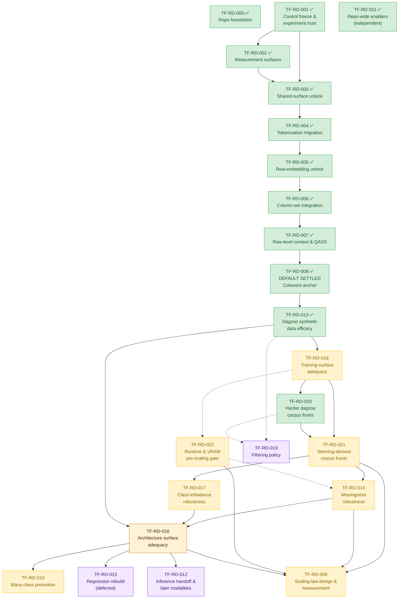

# Mission-Aligned Roadmap (2026Q1)

Use this roadmap to understand which questions are active now, which surfaces
are frozen, and what evidence the repo still needs before promotion.

The repo-wide plan is now architecture-first:

- keep one frozen PFN-style control lane for trust and comparison
- keep `tabfoundry_staged` as the incumbent row-first reference and benchmark
  line
- treat `tabfoundry_sandwich` as the primary classification architecture target
  and scaling-prep family
- make runtime and VRAM optimization a hard prerequisite to later scaling so
  every scale ladder inherits one measured runtime policy
- stay free to borrow the best components from TabPFN and other tabular models
  rather than aiming for literal TabICLv2 parity
- defer regression from the first classification scaling plan; many-class can
  advance later as a non-blocking extension once the classification base is
  coherent and documented

Use these alongside this roadmap:

- design decisions and repo structure: `docs/development/design-decisions.md`
- codebase navigation: `docs/development/codebase-navigation.md`
- dataset curation and license gate: `docs/development/dataset-curation.md`
- architecture reference: `docs/development/model-architecture.md`
- sandwich architecture: `docs/development/tabfoundry-sandwich.md`
- architecture deltas: `docs/development/architecture-deltas.md`
- workflow runbooks: `docs/workflows.md`
- inference/export contract: `docs/inference.md`
- reference index: `reference/README.md`
- evidence appendix: `reference/evidence.md`

## Status Labels

- `implemented`: available in current code and wired into the canonical
  workflow surface
- `completed`: scoped work finished with a recorded decision or evidence
  package, even if it does not imply a promoted default
- `partial`: meaningful building blocks or evidence exist, but the roadmap
  claim is not yet satisfied end to end
- `planned`: clearly scoped and prioritized, but not yet implemented
- `research`: intentionally deferred or gated behind earlier roadmap work
- `retired`: historical item retained only for traceability

## Canonical Planning Metadata

`docs/development/roadmap.md` is the single source of truth for planning state
in `tab-foundry`.

The canonical planning unit is the local roadmap item `TF-RD-###`. External BL
issues or GitHub issues can track execution work when needed, but missing
external issue chains should not block planning. If another document disagrees
with this file, this file is authoritative.

## Program Statement

The repo now operates with three architecture roles:

- PFN control lane:
  - `tabfoundry_simple`
  - `tabfoundry_staged` with `stage=nano_exact`
  - used to preserve benchmark comparability and experiment trust
- incumbent reference lane:
  - `tabfoundry_staged`
  - current promoted row-first benchmark/reference line
  - remains the carried comparison surface until a later promotion decision
- primary architecture candidate lane:
  - `tabfoundry_sandwich`
  - fixed-latent `y` / byte-array `x` Perceiver-style classifier
  - expected to absorb the next long-running architecture iteration work
  - allowed to borrow components from TabPFN or other references when they fit
    better
  - still must earn promotion through stability and harder-surface evidence

Important non-goals for this roadmap:

- do not treat the current `nano_exact + prenorm + row_cls` hybrid line as the
  long-term destination
- do not assume the incumbent staged reference line is the final architecture
  destination either; it is the current benchmark carry-forward surface
- do not bundle regression into the first row-first promotion push
- do not make QASS structurally mandatory
- do not proliferate many parallel live architecture families beyond the frozen
  control, the incumbent staged reference line, and the current sandwich
  candidate line

## Prioritization Lens

- TF-RD-008 is now closed on an explicit split with a simple default, so the
  next deliberate move is onto harder or broader post-008 surfaces before a
  heavy scaling pass.
- Classification remains the anchor workload while the settled row-first family
  is tested on harder post-008 regimes.
- Architecture conclusions should come from coherent staged surfaces, not from
  piling more overrides onto `nano_exact`.
- Row-first migration work should move one architectural boundary at a time:
  shared surface, small-class/test-self bridge, grouped tokens, row
  embedding, column set reasoning, then row-level context.
- After the binary anchor is coherent, the next deliberate fronts should make
  the research surface less saturating and more realistic: synthetic data,
  training adequacy, runtime policy, missingness, class imbalance, and later
  many-class.
- If those harder or broader surfaces still leave the model hard to separate or
  obviously underfit, open a later architecture-surface adequacy pass before
  relying on scaling-law work as the main next source of evidence.
- Class imbalance is still not sufficiently tested on the current benchmark
  surfaces because the bundles only enforce `min_minority_class_pct = 2.5`
  rather than defining an explicit skew ladder.
- Training adequacy should become explicit once the repo has settled whether the
  fresh default current corpus or alternative dagzoo-style corpora better match
  the training data it actually expects to use, so optimizer and schedule work
  does not overfit the wrong data surface.
- Harder real-data ladders should keep one canonical OpenML baseline where the
  benchmark tooling is already native, allow manifest-backed external
  real-data augmentations when they add regimes OpenML does not cover cleanly,
  and require completed review records before those datasets enter curated
  bundles or manifests; `dagzoo` remains the synthetic-data lane under
  TF-RD-013 rather than an external real-data source.
- The deliberate post-008 execution order is now:
  TF-RD-013 dagzoo synthetic-data efficacy first so the repo decides whether
  its post-008 training surface should move closer to intended use before
  optimizing it; TF-RD-018 training adequacy next on that representative data
  base; TF-RD-020 harder dagzoo corpus fronts next as the adjacent synthetic
  harder-surface lane, closing on one kept uncapped winner per family on the
  canonical pre-filter ladder; TF-RD-021 steering-derived dagzoo corpus fronts
  after TF-RD-018 settles one explicit default recipe and dagzoo RD-008
  steering lands, so the repo can test whether curriculum-steered corpora beat
  the TF-RD-020 control before benchmark-front ladders; TF-RD-022 runtime and
  VRAM efficiency next as the hard pre-scaling gate that makes time and memory
  a measured surface without reopening the carried recipe; TF-RD-021B
  simplification work on `tabfoundry_sandwich` then narrows the classification
  parent before broader law fitting; TF-RD-014 missingness and TF-RD-017
  class-imbalance remain the preferred benchmark-backed harder-surface ladders;
  then TF-RD-016 architecture-surface adequacy and bounded low-level
  micro-decisions.
- Low-level questions such as norm family or placement, learned special-token
  initialization scale, QASS scaler capacity, and activation family belong
  under TF-RD-016 after the earlier adequacy and harder-surface gates are in
  place, not as free-floating anchor-settlement work.
- Many-class, regression, and runtime handoff should build on that
  deconfounded post-008 base rather than competing with the earlier gates.
- Runtime and VRAM optimization should finish before the first scaling fit so
  classification ladders inherit one measured 80 GB A100-safe policy instead of
  discovering memory limits during the scale study.
- Scaling-law design should start only after the repo has a simplified sandwich
  parent, one carried dagzoo curriculum slice, runtime telemetry and artifact
  integrity, and at least one missingness read on the same classification
  family.

## Canonical Priority Queue

Lower rank means higher priority. Rank `0` is reserved for implemented work
retained for traceability.

| Rank | Roadmap ID | Item | Status | Milestone |
| ---- | ---------- | ---- | ------ | --------- |
| 0 | TF-RD-000 | Repo foundation and staged-family split | implemented | Implemented |
| 1 | TF-RD-001 | Control freeze and experiment trust | implemented | Implemented |
| 2 | TF-RD-002 | Measurement surfaces for architecture migration | implemented | Implemented |
| 3 | TF-RD-003 | Shared-surface unlock | implemented | Implemented |
| 4 | TF-RD-011 | Repo-wide enablers and contract fidelity | implemented | Implemented |
| 5 | TF-RD-004 | Tokenization migration | completed | Implemented |
| 6 | TF-RD-005 | Row-embedding unlock | completed | Implemented |
| 7 | TF-RD-006 | Column-set integration | completed | Implemented |
| 8 | TF-RD-007 | Row-level context and QASS attribution | completed | Implemented |
| 9 | TF-RD-008 | Coherent classification anchor promotion | implemented | Implemented |
| 10 | TF-RD-013 | Dagzoo synthetic-data efficacy on the promoted anchor | completed | Completed |
| 11 | TF-RD-018 | Training-surface adequacy on the promoted anchor | planned | Next |
| 12 | TF-RD-020 | Harder dagzoo corpus fronts on the promoted anchor | completed | Completed |
| 13 | TF-RD-021 | Steering-derived dagzoo corpus fronts on the promoted anchor | planned | Next |
| 14 | TF-RD-022 | Training runtime and VRAM efficiency before classification scaling | planned | Next |
| 15 | TF-RD-014 | Missingness robustness on the promoted anchor | planned | Next |
| 16 | TF-RD-017 | Class-imbalance robustness on the promoted anchor | planned | Next |
| 17 | TF-RD-016 | Architecture surface adequacy, sandwich simplification, and selective expansion | planned | Next |
| 18 | TF-RD-010 | Many-class promotion on the row-first base | planned | Next |
| 19 | TF-RD-009 | Scaling-law design and measurement on the classification-first sandwich target | planned | Next |
| 20 | TF-RD-015 | Regression rebuild deferred from the classification-first scaling plan | research | Later |
| 21 | TF-RD-012 | Inference handoff and later modalities | research | Later |

TF-RD-019 remains intentionally unranked in the canonical queue because it is a
separate later filtering-policy lane, but it is included in the dependency
graph below for completeness.

## Dependency Graph

```mermaid
flowchart TD
    RD000["TF-RD-000 ✅<br/>Repo foundation"]

    RD001["TF-RD-001 ✅<br/>Control freeze &<br/>experiment trust"]
    RD002["TF-RD-002 ✅<br/>Measurement surfaces"]
    RD011["TF-RD-011 ✅<br/>Repo-wide enablers<br/>(independent)"]

    RD003["TF-RD-003 ✅<br/>Shared-surface unlock"]
    RD004["TF-RD-004 ✅<br/>Tokenization migration"]
    RD005["TF-RD-005 ✅<br/>Row-embedding unlock"]
    RD006["TF-RD-006 ✅<br/>Column-set integration"]
    RD007["TF-RD-007 ✅<br/>Row-level context & QASS"]
    RD008["TF-RD-008 ✅<br/>DEFAULT SETTLED<br/>Coherent anchor"]
    RD013["TF-RD-013 ✅<br/>Dagzoo synthetic<br/>data efficacy"]
    RD018["TF-RD-018<br/>Training-surface<br/>adequacy"]
    RD020["TF-RD-020<br/>Harder dagzoo<br/>corpus fronts"]
    RD021["TF-RD-021<br/>Steering-derived<br/>corpus fronts"]
    RD022["TF-RD-022<br/>Runtime & VRAM<br/>pre-scaling gate"]
    RD019["TF-RD-019<br/>Filtering policy"]
    RD014["TF-RD-014<br/>Missingness<br/>robustness"]
    RD017["TF-RD-017<br/>Class-imbalance<br/>robustness"]
    RD016["TF-RD-016<br/>Architecture surface<br/>adequacy"]
    RD010["TF-RD-010<br/>Many-class promotion"]
    RD015["TF-RD-015<br/>Regression rebuild<br/>(deferred)"]
    RD012["TF-RD-012<br/>Inference handoff &<br/>later modalities"]
    RD009["TF-RD-009<br/>Scaling-law design &<br/>measurement"]

    RD001 --> RD002
    RD001 --> RD003
    RD002 --> RD003
    RD003 --> RD004
    RD004 --> RD005
    RD005 --> RD006
    RD006 --> RD007
    RD007 --> RD008
    RD008 --> RD013
    RD013 --> RD018
    RD018 --> RD020
    RD018 --> RD021
    RD018 -.-> RD022
    RD020 --> RD021
    RD013 -.-> RD019
    RD020 -.-> RD019
    RD021 --> RD014
    RD021 --> RD017
    RD021 --> RD009
    RD022 -.-> RD014
    RD014 --> RD016
    RD014 --> RD009
    RD017 --> RD016
    RD013 --> RD016
    RD016 --> RD010
    RD016 --> RD015
    RD016 --> RD012
    RD022 --> RD009
    RD016 --> RD009

    classDef done fill:#d4edda,stroke:#28a745,color:#155724;
    classDef readyNow fill:#fff3cd,stroke:#ffc107,color:#856404;
    classDef now fill:#fce4ec,stroke:#e91e63,color:#880e4f;
    classDef gate fill:#fff1d6,stroke:#c67a00,color:#3d2a00;
    classDef later fill:#f3e8ff,stroke:#7c3aed,color:#3b1f6e;

    class RD000,RD001,RD002,RD003,RD004,RD005,RD006,RD007,RD008,RD011,RD013,RD020 done;
    class RD009,RD018,RD021,RD022,RD014,RD017,RD010 readyNow;
    class RD016 gate;
    class RD012,RD015,RD019 later;
```

Critical path: **003 → 004 → 005 → 006 → 007 → 008**. 000, 001, 002, 003, and
011 are implemented; 004, 005, 006, 007, and 013 are completed evidence steps;
and 008 is now implemented as an explicit split with `row_cls + qass + no tfcol` as the default row-first anchor. With TF-RD-013 complete and TF-RD-020
now closed, TF-RD-018 resumes on the inherited TF-RD-020 noise-drift runtime
(`task_batch_size=1`, `grad_accum_steps=4`, `max_steps=400`) over
`tf_rd_020_shift_noise_drift_v1` to settle optimizer, LR or warmup, clipping,
and budget. Once that recipe is explicit and dagzoo RD-008 steering lands
under [#246](https://github.com/bensonlee5/dagzoo/issues/246), TF-RD-021 can
compare a small steering-derived corpus ladder against the incumbent
`tf_rd_020_shift_noise_drift_v1` control before TF-RD-014 and TF-RD-017 start
as the preferred benchmark-backed harder-surface ladders. `tf_rd_020_noise_mixture_v1`
remains the named fallback harder surface if the first optimizer-family read on
noise drift is too close or unstable to collapse cleanly. TF-RD-022 now runs
as a hard pre-scaling gate rather than an optional sibling lane: it should make
time and VRAM a measured, reproducible surface without reopening TF-RD-018
recipe choices, then hand one explicit runtime policy back into later
classification ladders. Separately, TF-RD-021A now runs under the broader
TF-RD-016 architecture lane:
issue [#174](https://github.com/bensonlee5/tab-foundry/issues/174) records the
fixed-latent sandwich implementation, issue
[#178](https://github.com/bensonlee5/tab-foundry/issues/178) owns long-running
stability and iteration, and issue
[#179](https://github.com/bensonlee5/tab-foundry/issues/179) closed the
immediate nanoTabPFN latent or width screen as stable negative evidence for the
summary-bottleneck replay. Replay issue
[#181](https://github.com/bensonlee5/tab-foundry/issues/181) now records the
first compact hybrid full-cell replay and benchmarked local control under the
same umbrella. Child issues [#182](https://github.com/bensonlee5/tab-foundry/issues/182),
[#183](https://github.com/bensonlee5/tab-foundry/issues/183), and
[#184](https://github.com/bensonlee5/tab-foundry/issues/184) now split the
next TF-RD-021B work into the completed 9-run knob-sensitivity screen, the
completed bounded width or head follow-up, and the remaining simplified-parent
and classification-scaling-prep follow-up. That simplification lane should
freeze most sandwich-local knobs before TF-RD-014 and TF-RD-009 consume the
main roadmap attention. TF-RD-015 is now intentionally off the first
classification scaling critical path and remains a later extension once the
classification family is settled.
TF-RD-019 remains a separate later filtering-policy lane off that main
execution spine rather than a blocker on it.

## Current Capability Matrix

| Objective / Claim | Current State | Evidence In Repo | Current Gap | Roadmap IDs |
| --- | --- | --- | --- | --- |
| Frozen PFN-style control exists | `implemented` | `tabfoundry_simple`, `stage=nano_exact`, benchmark comparison tooling, and prior-trained PFN-facing lanes already exist | The current large-anchor hybrid line is still easy to confuse with the intended destination | `TF-RD-001` |
| Coherent row-first migration ladder exists in code | `implemented` | The staged recipe ladder already encodes `shared_norm -> prenorm_block -> small_class_head -> test_self -> grouped_tokens -> row_cls_pool -> column_set -> qass_context -> many_class`; `sd_tokenization_migration_v1_02_delta_training_linear_warmup_decay_v1` locks the grouped-token replay, `sd_row_embedding_attribution_v2_01_delta_row_embeddings_no_context_v2_v1` closes the row-embedding unlock, `row_embedding_attribution_v3` completes the TFCol × QASS factorization, `sd_qass_tfcol_adequacy_v1_03_delta_qass_context_tfcol_heads4_v1_v1` wins the medium-bundle adequacy screen, `qass_tfcol_large_no_missing_validation_v1` passed its large no-missing validator narrowly, and `qass_tfcol_large_missing_validation_v1` closed the missing-permitting settlement sweep | The remaining work is no longer anchor coherence; it is harder and broader post-008 regime coverage on the settled row-first base | `TF-RD-003`, `TF-RD-004`, `TF-RD-005`, `TF-RD-006`, `TF-RD-007`, `TF-RD-008` |
| Architecture comparisons are attributable | `partial` | Grouped-token replay, v2/v3 matched controls, the TFCol adequacy sweep, and both large-bundle validators now separate row embeddings, plain context, TFCol-only, QASS-only, the no-TFCol default line, and the retained `qass + tfcol_heads4` calibration variant | The next comparison gap is no longer anchor settlement; it is whether harder post-008 fronts provide more decisive regime separation before scaling work | `TF-RD-002`, `TF-RD-005`, `TF-RD-006`, `TF-RD-007`, `TF-RD-008` |
| One promoted row-first classification anchor exists | `implemented` | `qass_tfcol_large_missing_validation_v1` closed on an explicit split: `row_cls + qass + no tfcol` is now the default row-first anchor, while `row_cls + qass + tfcol_heads4` is retained as a calibration-oriented alternative | Future work should treat the no-TFCol line as the default and reserve TFCol for explicit calibration-oriented follow-up rather than reopening anchor settlement | `TF-RD-008` |
| Fixed-latent sandwich architecture is available as the primary long-term candidate line | `partial` | `model.arch=tabfoundry_sandwich` now exists with a hybrid stage-`0` full-cell-plus-summary read, later repeated summary-stream stages, latent-then-full-cell readout, schema-aware feature-type encoding, shared inspection/export/training-surface wiring, implementation issue [#174](https://github.com/bensonlee5/tab-foundry/issues/174), umbrella issue [#178](https://github.com/bensonlee5/tab-foundry/issues/178), closed immediate screen issue [#179](https://github.com/bensonlee5/tab-foundry/issues/179), completed local-only replay issue [#181](https://github.com/bensonlee5/tab-foundry/issues/181), completed first knob-sensitivity screen issue [#182](https://github.com/bensonlee5/tab-foundry/issues/182), completed bounded width or head follow-up issue [#183](https://github.com/bensonlee5/tab-foundry/issues/183), and successor follow-up issue [#184](https://github.com/bensonlee5/tab-foundry/issues/184). The compact hybrid control `tf_rd_021b_hybrid_full_cell_compact_prior_v1` is now benchmarked at final ROC AUC `0.7370`, final log loss `0.4672`, and final Brier `0.3072` on the pinned medium binary bundle without an external comparator, the completed `tf_rd_021b_sandwich_knob_sensitivity_v1` screen kept that control, and the completed `tf_rd_021b_sandwich_width_capacity_sensitivity_v1` follow-up also kept it: `d_icl=96` was the least harmful bounded capacity row (`+0.0166` delta final log loss), while `d_icl=48`, `head_hidden_dim=64`, and `head_hidden_dim=128` were all materially worse. | The next gaps are no longer the first sandwich sensitivity read or the bounded width/head read; they are choosing and freezing a simplified sandwich parent, then carrying that parent onto harder dagzoo and missingness classification surfaces before wider scaling fits | `TF-RD-016`, `TF-RD-021A`, `TF-RD-021B` |
| Harder post-008 data surfaces can be exercised | `implemented` | Dagzoo CLI-to-manifest handoff, path-independent corpus identity, canonical no-missing versus allow-missing binary bundles, the completed TF-RD-013 size ladder under `#132`, the completed TF-RD-018 batch ladder under `#109`, the completed TF-RD-020 harder-front ladder under `#146/#148/#149/#150`, and the completed TF-RD-018 optimizer-family sweep under `#137` now exist on the current manifest backend | The next gap is no longer whether harder synthetic fronts can be executed or which optimizer family to carry; it is finishing TF-RD-018 LR, clipping, and budget continuation on top of `tf_rd_020_shift_noise_drift_v1` with locked `schedulefree_adamw`, then testing whether steering-derived corpus fronts under TF-RD-021 beat that incumbent carry-forward surface before benchmark-backed ladders open | `TF-RD-011`, `TF-RD-013`, `TF-RD-018`, `TF-RD-020`, `TF-RD-021`, `TF-RD-014`, `TF-RD-017` |
| Class-imbalance robustness is meaningfully exercised | `partial` | Current benchmark bundles enforce `min_minority_class_pct = 2.5`, so the repo already excludes degenerate class-balance cases | There is no dedicated imbalance-focused bundle ladder, imbalance-oriented reporting contract, or explicit decision on the promoted anchor under materially skewed priors | `TF-RD-017` |
| Training adequacy is handled coherently across fronts | `partial` | Sweep-local `parameter_adequacy_plan` notes exist throughout the research metadata, bounded adequacy sweeps such as `qass_tfcol_adequacy_v1` already exist, `row_first_training_adequacy_v1` completed the first TF-RD-018 dataset-batch ladder under `#109`, TF-RD-020 records kept harder-front winners for missingness, shift or drift, and mechanism or noise, `tf_rd_018_optimizer_family_v1` kept `schedulefree_adamw` on the inherited noise-drift runtime, and issue `#165` now gives steering-derived synthetic continuation a dedicated roadmap home | The repo still needs TF-RD-018 to resolve LR-shape, clipping, and step-budget adequacy on the inherited TF-RD-020 noise-drift runtime with `schedulefree_adamw` locked as the carried optimizer, then TF-RD-021 to decide whether any steering-derived corpus front changes the carried control enough to justify one fresh bounded Muon retry | `TF-RD-018`, `TF-RD-020`, `TF-RD-021` |
| Runtime and VRAM efficiency are deliberate and measurable | `partial` | The repo already has deferred runtime or VRAM measurement issue [#58](https://github.com/bensonlee5/tab-foundry/issues/58), benchmark and sweep profiles, bf16-capable runtime plumbing, `tabfoundry_staged` activation checkpointing support, and training plus benchmark-registry payloads now preserve runtime-summary and regime-budget fields such as peak VRAM, throughput, tokens seen, token budget, objective metric, and curriculum or SCM metadata | The benchmark-facing runtime policy is not first-class yet, sweep/result summaries still need compact runtime presentation, and the harder-surface batching lane still lacks a measured reopen rule under an explicit 80 GB A100 guardrail | `TF-RD-022`, `TF-RD-018`, `TF-RD-009` |
| Many-class evaluation can start on the row-first base | `partial` | The staged family already includes `many_class`, reusable machinery exists, and `nanotabpfn_openml_classification_small_v1.json` provides a benchmark-facing multiclass bundle | Many-class still lacks a promoted row-first benchmark ladder, adequacy sweeps, and a keep/defer decision | `TF-RD-010` |
| Regression is intentionally deferred from the first classification scaling plan | `research` | Regression metrics and benchmark-bundle normalization support already exist in the repo | Regression is not a blocker for sandwich classification scaling; any rebuilt regression lane should resume only after the classification family, runtime policy, and scaling contract are settled | `TF-RD-015` |
| The staged surface is broad enough for future adequacy work before adding new knobs | `partial` | Tokenization already includes `scalar_per_feature`, `scalar_per_feature_nan_mask`, and `shifted_grouped`; token count is already adjustable through `feature_group_size`; norms, widths, depths, row CLS count, TFCol inducing count, context FF expansion, dropout, and clipping are already exposed | The repo still needs a deliberate decision on whether the existing surface is sufficient on harder regimes and, only if not, whether low-level or hardcoded choices such as special-token init scale, activation family, row or column FF expansion, QASS scaler capacity, grouped shift recipe, or many-class threshold should be surfaced selectively | `TF-RD-016` |
| Scaling-law work targets the right architecture and surface | `planned` | Tuning and benchmark-adjacent tooling already exist, and the artifact contract now preserves resolved sandwich specs plus runtime/regime-budget metadata needed for later fits | Scaling on the current simple binary regime still risks low-signal conclusions until the repo freezes a simplified sandwich parent, keeps one carried dagzoo curriculum slice, lands the runtime gate, and compares by matched regime budget rather than token budget alone | `TF-RD-009` |
| Repo-wide data, preprocessing, and export surfaces can support the migration | `implemented` | The dagzoo CLI-to-manifest boundary, canonical dagzoo dataset identity, and export/reference preprocessing fidelity were completed under TF-RD-011 | New dagzoo work is now about efficacy on the promoted anchor, not about reopening the boundary layer | `TF-RD-011` |
| Inference handoff and later modalities are ready | `research` | The repo has clear placeholders and partial bundle/runtime infrastructure | Inference handoff and later modalities should follow the promoted classification base and not absorb regression ownership again | `TF-RD-012` |

## Current Implementation Baseline

This roadmap assumes the following repo truths:

- `tabfoundry_staged` remains the incumbent row-first reference and benchmark
  line.
- `tabfoundry_simple` is the frozen exact PFN-style anchor.
- `tabfoundry_sandwich` exists as a documented hybrid full-cell /
  summary-stream candidate and is the primary family for ongoing architecture
  iteration.
- the staged family already contains the intended migration ladder through
  `shared_norm`, `prenorm_block`, `small_class_head`, `test_self`,
  `grouped_tokens`, `row_cls_pool`, `column_set`, `qass_context`, and
  `many_class`
- grouped-token replay
  `sd_tokenization_migration_v1_02_delta_training_linear_warmup_decay_v1`
  is the canonical predecessor for the current row-first line
- `row_embedding_attribution_v2` established that row embeddings help on the
  grouped-token replay surface, while plain row-level context does not justify
  promotion on that same base
- `row_embedding_attribution_v3` established that TFCol alone is negative on the
  row-first base, `qass + no tfcol` is near-tied with the row-embedding base,
  and `qass + tfcol` wins on calibration while losing ROC
- `qass_tfcol_adequacy_v1` established that `tfcol_heads4` is the only TFCol
  adequacy winner worth carrying forward, while `inducing64` and `layers1`
  remain negative evidence
- `qass_tfcol_large_no_missing_validation_v1` established a narrow large
  no-missing validation pass for `row_cls + qass + tfcol_heads4`
- `qass_tfcol_large_missing_validation_v1` then closed the missing-permitting
  bundle decision with a mixed result: `row_cls + qass + tfcol_heads4`
  improved final Brier and ROC AUC, but its final log loss was slightly worse
  than `row_cls + qass + no tfcol`, so the simpler no-TFCol line is now the
  default row-first anchor and the TFCol line is retained as a
  calibration-oriented variant
- closed `TF-RD-011` work already completed the dagzoo CLI-to-manifest
  boundary, path-independent canonical dagzoo identity, and export/reference
  preprocessing fidelity
- `missingness_followup` exists only as a hybrid-diagnostic precursor on the
  old prenorm foundation and should not be treated as the closure path for
  row-first missingness robustness
- current benchmark bundles already enforce `min_minority_class_pct = 2.5`, but
  that is only a floor and should not be treated as a real class-imbalance
  program
- current training adequacy work is fragmented across sweep-local
  `parameter_adequacy_plan` notes and isolated follow-up sweeps rather than a
  single roadmap workstream
- the repo already ships `nanotabpfn_openml_classification_small_v1.json`, so
  many-class benchmark scaffolding exists even though the row-first many-class
  program does not
- regression metrics plumbing and bundle normalization support exist in parts of
  the repo, but there is no active staged regression program yet
- the staged model surface is already broad enough for a future adequacy pass:
  tokenizers include `scalar_per_feature`, `scalar_per_feature_nan_mask`, and
  `shifted_grouped`; token count is adjustable through `feature_group_size`;
  and norms, widths, depths, row CLS count, TFCol inducing count, context FF
  expansion, dropout, and clipping are already exposed
- norm family and post-encoder or post-stack norm placement are already exposed
  enough for a first micro-architecture read, but learned special-token and
  inducing-token initialization scale remains hardcoded
- several architecture choices remain deliberately hardcoded, including special
  token initialization family, feed forward activation family, row or column FF
  expansion, QASS scaler capacity, grouped-token shift recipe, and the
  many-class routing threshold; these should only be exposed selectively if
  harder surfaces still remain low-signal
- the current sandwich public surface is deliberately smaller:
  `sandwich_latents`, `sandwich_layers`, `sandwich_heads`,
  `sandwich_ff_expansion`, `d_icl`, `head_hidden_dim`,
  `input_normalization`, and `pre_encoder_clip`; issue
  [#178](https://github.com/bensonlee5/tab-foundry/issues/178) owns any later
  follow-on ticketing for stability, harder-surface reads, and selective
  sandwich-surface expansion
- `Muon` is already supported in the optimizer surface and belongs in training
  adequacy work rather than architecture-surface expansion
- the current large-anchor `nano_exact + prenorm + row_cls` line is useful as a
  diagnostic bridge, but not the promoted architecture target

## Roadmap Items

### TF-RD-000: Repo Foundation And Staged-Family Split

- Status: `implemented`
- Milestone: `Implemented`
- Goal: preserve the current role-based repo organization and the split between
  the frozen PFN control and the active staged family
- Current state:
  - `tabfoundry_staged` is the active family
  - `tabfoundry_simple` is the frozen anchor
  - reusable model pieces already live under `model/components`
- Exit criteria:
  - this remains the stable base for all later roadmap work

### TF-RD-001: Control Freeze And Experiment Trust

- Status: `implemented`
- Milestone: `Implemented`
- Goal: make the PFN control lane and the row-first target lane explicit so the
  roadmap stops mixing benchmark trust with architecture aspiration
- Current state:
  - the PFN control lane is named explicitly as `tabfoundry_simple` plus
    `tabfoundry_staged` with `stage=nano_exact`
  - the current large-anchor hybrid line is documented as diagnostic rather
    than promotable
  - the canonical medium-bundle control-baseline id `cls_benchmark_linear_v2`
    now resolves through the prior-trained staged `nano_exact` anchor
    `01_nano_exact_md_prior_parity_fix_binary_medium_v1`
- Implemented contract:
  - keep `tabfoundry_simple` and `stage=nano_exact` as the frozen PFN control
    lane
  - document the current large-anchor hybrid line as diagnostic rather than
    promotable
  - preserve one canonical control interpretation surface for benchmark claims
- Exit criteria:
  - one named PFN control lane exists
  - one explicitly non-promoted hybrid diagnostic lane exists
  - benchmark-facing interpretation is tied to the control lane rather than the
    hybrid line

### TF-RD-002: Measurement Surfaces For Architecture Migration

- Status: `implemented`
- Milestone: `Implemented`
- Goal: add the telemetry needed to interpret row-first architecture changes
  structurally rather than by end metrics alone
- Current state:
  - the exact-prior diagnostic lane already emits rich module-gradient and
    activation telemetry
  - the canonical architecture-screen surface still lacks that same telemetry
    parity in the regular trainer
  - row-first stage boundaries are partially traced, but `post_context_encoder`
    is still missing
- Required work:
  - emit and persist `post_column_encoder`, `post_row_pool`, and
    `post_context_encoder` on the regular training path
  - write `gradient_history.jsonl` and `telemetry.json` from the regular
    trainer, not only the prior-dump loop
  - sync selected stage-local stability summaries to wandb and expose them in
    sweep artifacts and result cards
  - defer per-stage runtime and memory profiling until later architecture
    tickets prove those costs are decision-critical
- Exit criteria:
  - regular training emits the same class of module-gradient and activation
    telemetry as the exact-prior path
  - row-first rows can be compared on quality and stage-local stability without
    relying only on raw wandb charts
  - runtime and memory are explicitly out of scope for closing TF-RD-002

### TF-RD-003: Shared-Surface Unlock

- Status: `implemented`
- Milestone: `Implemented`
- Goal: move the active architecture program off the PFN-only `nano` encoder
  path and onto the coherent shared staged surface
- Current state:
  - `shared_surface_bridge_v1` established the stage-native architecture-screen
    bridge from `nano_exact` through `shared_norm` and `prenorm_block`
  - the canonical grouped-token predecessor is locked as
    `sd_shared_surface_bridge_v1_03_delta_architecture_screen_prenorm_block_v1`,
    registered at `2026-03-20T00:17:09Z` (`2026-03-19` in Los Angeles)
  - `small_class_head` and `test_self` remain explicit historical bridge rows,
    but neither displaced `prenorm_block` as the default grouped-token handoff
- Implemented contract:
  - treat the public shared-surface stages as the primary migration program
  - keep tokenizer work off the old `feature_encoder=nano` lane where it is not
    active
  - carry grouped-token work forward from the locked `prenorm_block` handoff
    rather than reopening optional bridge rows by default
- Exit criteria:
  - the architecture target lane starts from a shared surface
  - one explicit shared-surface handoff row is locked for grouped-token work
  - later tokenization and row-first rows are tested only where they are
    actually active

### TF-RD-004: Tokenization Migration

- Status: `completed`
- Milestone: `Implemented`
- Goal: evaluate grouped tokenization as the first true row-first preparation
  step on the shared surface
- Current state:
  - `grouped_tokens` already exists in the staged recipe ladder
  - compact-ladder evidence showed that tokenizer changes under the nano encoder
    were not isolatable
  - `shared_surface_bridge_v1` closed TF-RD-003 and locked `prenorm_block` as
    the canonical grouped-token predecessor
  - `small_class_head` and `test_self` remain optional historical bridge rows,
    not the default TF-RD-004 handoff
  - the architecture-screen grouped-token benchmark `sd_tokenization_migration_v1_01_delta_architecture_screen_grouped_tokens_v2`
    was mixed, so `grouped_token_stability_probe_v1` was executed on March 19,
    2026 against that locked anchor
  - the traced anchor rerun `sd_grouped_token_stability_probe_v1_01_delta_anchor_activation_trace_baseline_v1`
    and the no-trace warmup-decay row
    `sd_grouped_token_stability_probe_v1_03_delta_training_linear_warmup_decay_v1`
    converged to the same grouped-token read: final log loss about `0.4002`,
    final Brier about `0.2618`, final ROC AUC about `0.741`, clipped-step
    fraction `0.0012`, and zero drift
  - the no-warmup decay row
    `sd_grouped_token_stability_probe_v1_02_delta_training_linear_decay_v1`
    improved final ROC AUC to `0.7540`, but it lost on log loss/Brier and pushed
    `max_grad_norm` to `9.99`, so it is not the preferred grouped-token surface
  - TF-RD-004 now has an explicit keep decision: grouped tokens stay on the
    migration path, with `prior_linear_warmup_decay` as the preferred adequacy
    surface for the benchmark-facing replay
  - the benchmark-facing grouped-token replay
    `sd_tokenization_migration_v1_02_delta_training_linear_warmup_decay_v1`
    is now registered on the architecture-screen lane and lands the probe's
    no-trace warmup-decay surface as the canonical grouped-token predecessor
- Implemented contract:
  - keep `prenorm_block` as the locked TF-RD-004 anchor for attributable
    comparisons, but carry later row-first work forward from
    `sd_tokenization_migration_v1_02_delta_training_linear_warmup_decay_v1`
  - treat the warmup-decay grouped-token replay, not the old scalar-per-feature
    token path, as the predecessor for TF-RD-005, TF-RD-006, and TF-RD-007
  - preserve the adequacy probe as supporting evidence rather than the
    benchmark-facing handoff itself
- Exit criteria:
  - the grouped-token keep decision is recorded from the mixed
    `tokenization_migration_v1` result plus the warmup-decay stability follow-up
  - the winning grouped-token replay is registered on the benchmark-facing lane
  - later row-first work inherits grouped tokens as the working token surface
    rather than assuming scalar-per-feature PFN tokens

### TF-RD-005: Row-Embedding Unlock

- Status: `completed`
- Milestone: `Implemented`
- Goal: determine whether the staged family can form useful row embeddings on
  the intended shared/grouped surface
- Current state:
  - `row_cls_pool` exists as a coherent staged recipe on the grouped-token
    replay surface
  - `row_embedding_attribution_v2` closed the grouped-token row-embedding
    question with the no-context row
    `sd_row_embedding_attribution_v2_01_delta_row_embeddings_no_context_v2_v1`
  - the paired plain-context row did not improve that row-embedding base, so
    old compact-surface row-CLS evidence is no longer the main blocker
- Completed evidence:
  - TF-RD-005 was anchored on grouped-token replay
    `sd_tokenization_migration_v1_02_delta_training_linear_warmup_decay_v1`,
    not on `prenorm_block` or the older scalar-token path
  - row pooling was isolated first on that grouped-token replay before the
    bundled public `row_cls_pool` stage was interpreted
  - the result package now separates row embeddings from plain row-level
    context on the intended migration surface
- Exit criteria:
  - the repo has a direct answer to whether row embeddings help on the intended
    migration surface
  - satisfied: row embeddings help on the grouped-token replay surface
  - satisfied: plain row-level context does not improve that row-embedding base

### TF-RD-006: Column-Set Integration

- Status: `completed`
- Milestone: `Implemented`
- Goal: decide whether explicit column-set reasoning belongs in the promoted
  row-first line
- Current state:
  - `column_set` already exists as a staged recipe
  - `delta_column_set_no_context_v3` is negative evidence for default TFCol
    alone on the grouped-token row-first base
  - `sd_qass_tfcol_adequacy_v1_03_delta_qass_context_tfcol_heads4_v1_v1` was
    the medium-bundle adequacy winner and the only TFCol row worth carrying
    forward
  - `qass_tfcol_large_no_missing_validation_v1` then validated
    `delta_qass_context_tfcol_heads4_v1` against `delta_qass_no_column_v3` on
    `nanotabpfn_openml_binary_large_no_missing_v1.json` with a narrow pass:
    final log loss `-0.0013818`, final Brier `-0.0004977`, and final ROC AUC
    `-0.0047989` versus the no-TFCol control
  - `qass_tfcol_large_missing_validation_v1` then showed that
    `delta_qass_context_tfcol_heads4_v1` improved final Brier and ROC AUC on
    `nanotabpfn_openml_binary_large_v1.json`, but missed the final log-loss
    promotion rule by about `+0.0000045`, so TF-RD-008 closed on the simpler
    no-TFCol default
- Completed evidence:
  - default TFCol alone is resolved negative evidence on the row-first base and
    should not be reopened as a standalone promotion candidate
  - TFCol is retained only under the documented
    `row_cls + qass + tfcol_heads4` calibration-oriented variant, not as the
    default row-first line
  - missing-data settlement is closed; further TFCol work belongs to explicit
    calibration-oriented follow-up rather than anchor promotion
- Exit criteria:
  - satisfied: TFCol is not promoted as a standalone default row-first module
  - satisfied: the repo now has a default no-TFCol line and a retained
    calibration-oriented TFCol alternative

### TF-RD-007: Row-Level Context And QASS Attribution

- Status: `completed`
- Milestone: `Implemented`
- Goal: determine whether row-level context helps, and whether QASS helps beyond
  plain row-level context
- Current state:
  - `qass_context` already exists as a staged recipe
  - QASS components already exist as reusable modules
  - `row_embedding_attribution_v2` showed that plain row-level context does not
    justify promotion over the no-context row-embedding base
  - `row_embedding_attribution_v3` showed that `qass + no tfcol` is near-tied
    with the row-embedding base, TFCol alone is bad, and `qass + tfcol` wins on
    calibration while losing ROC
  - `qass_tfcol_large_no_missing_validation_v1` then showed that
    `row_cls + qass + tfcol_heads4` keeps the calibration win over
    `row_cls + qass + no tfcol` on the larger no-missing bundle while staying
    inside the `-0.005` ROC guardrail
  - `qass_tfcol_large_missing_validation_v1` then closed the final bundle with
    a mixed result: `tfcol_heads4` improved final Brier and ROC AUC, but lost
    very slightly on final log loss, so the repo settled on the simpler
    no-TFCol default
- Completed evidence:
  - plain row-level context is resolved negative evidence on the row-first path
  - QASS remains optional by construction, but the settled default line is now
    `row_cls + qass + no tfcol`
  - `row_cls + qass + tfcol_heads4` remains the retained calibration-oriented
    alternative rather than the default
  - missing-data settlement is closed, so medium-bundle attribution and bundle
    closure no longer remain open
- Exit criteria:
  - satisfied: the repo has an explicit default and an explicit retained
    calibration-oriented alternative for `qass + no tfcol` versus
    `qass + tfcol_heads4`

### TF-RD-008: Coherent Classification Anchor Promotion

- Status: `implemented`
- Milestone: `Implemented`
- Goal: promote one coherent row-first classification anchor and stop treating
  the architecture target as an open set of hybrid lines
- Current state:
  - the staged ladder exists
  - `qass_tfcol_large_no_missing_validation_v1` narrowed the final choice to
    `row_cls + qass + no tfcol` versus `row_cls + qass + tfcol_heads4`
  - `qass_tfcol_large_missing_validation_v1` closed the missing-permitting
    bundle decision with a mixed result:
    - `row_cls + qass + no tfcol`: final log loss `0.42151056`, Brier
      `0.26437641`, ROC AUC `0.67022423`
    - `row_cls + qass + tfcol_heads4`: final log loss `0.42151508`, Brier
      `0.26432957`, ROC AUC `0.67529660`
  - `tfcol_heads4` therefore improved final Brier and ROC AUC, but failed the
    planned promotion rule because final log loss was slightly worse than the
    no-TFCol control
  - TF-RD-008 settles on an explicit split with
    `row_cls + qass + no tfcol` as the default row-first anchor because the
    result was mixed and the repo prefers the simpler lower-runtime line when
    there is no clear winner
- Implemented contract:
  - the default row-first classification anchor is
    `row_cls + qass + no tfcol`
  - `row_cls + qass + tfcol_heads4` remains a retained calibration-oriented
    alternative rather than the default
  - research and documentation surfaces should treat the no-TFCol line as the
    default post-008 parent unless a calibration-oriented question explicitly
    asks for the TFCol variant
  - architecture references document both the default and the retained
    alternative without reopening the older hybrid diagnostic surfaces
- Exit criteria:
  - satisfied: an explicit split recommendation is named, benchmarked,
    documented, and treated as the active architecture target

### TF-RD-010: Many-Class Promotion On The Row-First Base

- Status: `completed`
- Milestone: `Next`
- Goal: extend the promoted row-first backbone into the existing `many_class`
  path
- Current state:
  - the staged family already contains `many_class`
  - the hierarchical many-class machinery already exists
  - `nanotabpfn_openml_classification_small_v1.json` already exists as a
    benchmark-facing multiclass bundle
  - the many-class path is implemented but still unvalidated on the promoted
    row-first base
- Required work:
  - confirm the canonical multiclass bundle, control baseline, and promoted
    row-first backbone for the first many-class program
  - run the first many-class benchmark and adequacy sweeps on top of the
    promoted row-first base rather than reopening older hybrid lines
  - if many-class curation expands, keep the current OpenML bundle as the
    baseline surface and use only license-cleared manifest-backed external
    datasets as augmentations
  - keep many-class as an extension of the same staged family
  - avoid opening a separate architecture lane for many-class
  - record an explicit keep/defer decision for the row-first many-class path
- Exit criteria:
  - many-class uses the promoted row-first backbone, has benchmark-facing
    evidence, and no longer sits only as untested scaffolding

### TF-RD-011: Repo-Wide Enablers And Contract Fidelity

- Status: `implemented`
- Milestone: `Implemented`
- Goal: keep the repo-wide data, preprocessing, and export surfaces healthy
  enough to support the architecture program without letting them dominate it
- Current state:
  - manifest-backed training and evaluation exist
  - the reusable dagzoo CLI-to-manifest boundary is complete
  - canonical dagzoo dataset identity is path-independent for canonical corpora
  - export and reference-consumer preprocessing fidelity now track the resolved
    preprocessing surface
- Implemented contract:
  - keep dagzoo as a CLI-and-artifact boundary rather than importing dagzoo
    internals into `tab-foundry`
  - preserve path-independent manifest identity for canonical dagzoo corpora
  - keep export and reference-consumer preprocessing policy aligned with the
    resolved training/runtime surface
- Exit criteria:
  - satisfied: the row-first architecture program can rely on trustworthy data
    and export contracts without forcing a second planning track

### TF-RD-012: Inference Handoff And Later Modalities

- Status: `research`
- Milestone: `Later`
- Goal: advance separate-runtime handoff and genuinely later modalities only
  after the promoted row-first classification base is stable
- Current state:
  - classification remains the only active supported prediction mode
  - runtime handoff and later modalities remain deferred
- Required work:
  - advance separate-runtime handoff only after classification/export contracts
    settle
  - use runtime feedback as a later architecture constraint only after
    TF-RD-013, TF-RD-018, at least one harder post-008 ladder, and TF-RD-016
    have made the classification base stable enough to interpret cost tradeoffs
    cleanly
  - keep time series, text-conditioned inputs, and other later modalities out of
    the critical path
- Exit criteria:
  - inference handoff and later modalities build on the promoted staged base
    rather than running ahead of it

### TF-RD-013: Dagzoo Synthetic-Data Efficacy On The Promoted Anchor

- Status: `completed`
- Milestone: `Completed`
- Goal: decide before training-surface adequacy work whether the fresh default
  current-corpus dagzoo recipe at TF-RD-008 scale or smaller shape-aware dagzoo
  corpora better match the intended post-008 training data surface, and whether
  any of those choices materially improve training difficulty, architecture
  discrimination, or final quality on the promoted row-first anchor
- Current state:
  - the dagzoo handoff boundary is complete through closed TF-RD-011 work
  - dagzoo smoke and manifest identity are no longer the main blocker
  - issue [#122](https://github.com/bensonlee5/tab-foundry/issues/122) executed
    the first promoted-anchor comparison against one unfiltered dagzoo surface
    and one OpenML-only curated comparator
  - that TF-RD-013 evidence remains a historical nanoTabPFN-era comparison package
    and does not define the forward benchmark policy for new sweeps, which now
    defaults to TabICLv2
  - that first read was neutral: the anchor, the single-invocation dagzoo surface,
    and the OpenML-only comparator all landed on the same recorded large-bundle
    metrics, while the dagzoo and curated manifests still remained materially different
    from the anchor contract
  - the direct nanoTabPFN helper comparison is partially confounded on this bundle
    because dataset `Fitness_Club` produced non-finite probabilities even with
    `--allow-missing-values`
  - dagzoo is the synthetic-data generation lane, not an external real-data
    ingestion surface
  - issue [#120](https://github.com/bensonlee5/tab-foundry/issues/120) records
    the first runnable unfiltered dagzoo generated-source surface and its support
    artifacts for the promoted anchor
  - issue [#127](https://github.com/bensonlee5/tab-foundry/issues/127) completed
    the broader multi-invocation, shape-aware dagzoo follow-up, but it still ran
    under the inherited `runtime.target_train_seconds: 330` manifest cap while the
    historical anchor control remained a prior-dump-era artifact
  - issue [#132](https://github.com/bensonlee5/tab-foundry/issues/132) tracked
    the reopened TF-RD-008-scale fresh-current-corpus control, uncapped
    current-corpus control, and dagzoo size ladder that finished the
    representative-data decision on 2026-03-23
  - first-class corpus recipes now exist under `reference/corpus_recipes/`, and
    TF-RD-013 is the first sweep migrated onto that shared local corpus layer
    instead of relying on sweep-local dagzoo orchestration
  - issue [#107](https://github.com/bensonlee5/tab-foundry/issues/107) is no
    longer blocked on TF-RD-013; issue
    [#109](https://github.com/bensonlee5/tab-foundry/issues/109) completed the
    larger manifest-backed dataset-batching ladder on the selected same-backend
    medium-rung manifest surface, and issue
    [#146](https://github.com/bensonlee5/tab-foundry/issues/146) now carries
    the next harder dagzoo synthetic front before TF-RD-018 resumes optimizer
    and schedule follow-up
  - the fresh current-corpus control resolved through recipe
    `tf_rd_013_current_corpus_default_v1` and surface label
    `anchor_manifest_default` now inspects to `10` total records with an
    `8 train / 1 val / 1 test` split, so the reopened current-corpus control is
    explicitly sized to that TF-RD-008 promotion-run scale rather than the
    earlier `8192`-dataset current-corpus recipe
- Evidence so far:
  - the corrected manifest-backed reruns preserved the first read direction: the
    unfiltered dagzoo generated-source surface remained close to, but still worse
    than, the current-corpus anchor on final large-bundle log loss and Brier
  - the broader shape-aware follow-up under issue [#127](https://github.com/bensonlee5/tab-foundry/issues/127)
    still underperformed the anchor on final large-bundle log loss and Brier, but
    it did so under the inherited 330-second manifest cap rather than an uncapped
    `max_steps=2500` contract
  - issue [#132](https://github.com/bensonlee5/tab-foundry/issues/132) executed
    the resized `10 / 20 / 40 / 80` ladder on 2026-03-23 with runs
    `sd_tf_rd_013_dagzoo_size_ladder_v1_01_delta_training_current_corpus_uncapped_v1`,
    `sd_tf_rd_013_dagzoo_size_ladder_v1_02_delta_data_manifest_root_dagzoo_shape_aware_size_small_v1`,
    `sd_tf_rd_013_dagzoo_size_ladder_v1_03_delta_data_manifest_root_dagzoo_shape_aware_size_medium_v1`,
    and `sd_tf_rd_013_dagzoo_size_ladder_v1_04_delta_data_manifest_root_dagzoo_shape_aware_size_large_v1`
  - all three shape-aware dagzoo rungs materially improved final log loss over
    the TF-RD-008-scale fresh current-corpus control, cutting final log loss from
    `4.9823` to `2.5230`, `2.2604`, and `2.1742` for the `20`, `40`, and `80`
    dataset rungs respectively
  - the `40`-dataset medium rung is the best-balanced representative surface:
    it improved final Brier from `0.6889` to `0.4912`, improved final ROC AUC
    from `0.4889` to `0.5625`, reduced clipped-step fraction from `0.4532` to
    `0.3364`, and kept late-run drift much smaller than the `80`-dataset rung
  - the `80`-dataset large rung reached the lowest final log loss and clip
    fraction, but it drifted much harder (`best_to_final_roc_auc_delta = -0.0999`)
    and finished with a worse final Brier (`0.7078`) than both the control and
    the `40`-dataset rung, so it is not the preferred representative surface
  - the `20`-dataset small rung improved sharply over the control, but it remained
    weaker than the `40`-dataset rung on final log loss, final Brier, and final
    ROC AUC
  - the direct nanoTabPFN helper comparison remains confounded on this bundle by
    `Fitness_Club`; rows 3 and 4 therefore reused the recorded helper-failure
    benchmark outcome instead of rerunning nanoTabPFN for every row
  - the earlier reopened `8192`-dataset current-corpus recipe was not a credible
    same-backend control for `batch_size=1` manifest training because an uncapped
    `max_steps=2500` run would still see well under half an epoch
  - the OpenML-first curated comparator remained materially worse than the anchor
    on final large-bundle log loss and Brier in both TF-RD-013 sweeps, so it stays
    evidence-only and is omitted from the reopened size ladder
  - issue [#124](https://github.com/bensonlee5/tab-foundry/issues/124) remains
    later filtering-policy work only if a future corpus-selection or predictability
    problem appears
- Decision:
  - close issue [#132](https://github.com/bensonlee5/tab-foundry/issues/132):
    the resized size ladder completed and settled the representative-data read
  - carry `tf_rd_013_dagzoo_shape_aware_size_medium_v1` forward as the canonical
    post-008 synthetic training-data surface for TF-RD-018 and issue
    [#107](https://github.com/bensonlee5/tab-foundry/issues/107)
  - treat the `10`-dataset current-corpus control plus the `20`- and `80`-dataset
    rungs as supporting evidence only; they bracket the decision, but the `40`
    dataset rung is the best-balanced surface

### TF-RD-014: Missingness Robustness On The Promoted Anchor

- Status: `planned`
- Milestone: `Next`
- Goal: decide how the promoted row-first family should handle missing-valued
  inputs in training and evaluation
- Current state:
  - `missingness_followup` exists, but it is anchored on the older stabilized
    prenorm hybrid surface rather than the row-first line
  - the repo already has separate no-missing and allow-missing benchmark bundle
    contracts
  - this is now one of the preferred next benchmark-backed harder-surface
    ladders once TF-RD-013 and TF-RD-018 have settled the representative
    training-data and adequacy surface
  - issue [#146](https://github.com/bensonlee5/tab-foundry/issues/146) now
    occupies the adjacent synthetic harder-dagzoo slot and does not replace
    this benchmark-front missingness lane
  - there is no explicit row-first missingness-mechanism recommendation yet;
    TF-RD-008 only settled the default row-first anchor on the allow-missing
    benchmark surface
- Required work:
  - re-anchor missingness work on the promoted row-first base
  - keep one pinned OpenML missingness ladder as the canonical benchmark
    baseline and allow license-cleared manifest-backed external augmentations
    when they add missingness regimes OpenML does not cover cleanly
  - use a review ledger for both OpenML datasets and vetted external real-data
    candidates rather than relying on source names alone
  - keep regime identity in task-source names, bundle names, manifest names,
    and curation reports rather than changing benchmark bundle schema in this
    pass
  - separate missing-token or missingness-mechanism adequacy from synthetic
    missingness training and from benchmark-surface evaluation
  - decide whether explicit missingness handling belongs in the default
    row-first line or remains an optional robustness variant
- Exit criteria:
  - the repo has a benchmark-backed missingness recommendation for the row-first
    family

### TF-RD-017: Class-Imbalance Robustness On The Promoted Anchor

- Status: `planned`
- Milestone: `Next`
- Goal: decide how the promoted row-first family behaves under materially
  skewed class priors
- Current state:
  - current benchmark bundles only enforce `min_minority_class_pct = 2.5`
  - there is no dedicated imbalance-focused bundle ladder yet
  - this is now one of the preferred next benchmark-backed harder-surface
    ladders once TF-RD-013 and TF-RD-018 have settled the representative
    training-data and adequacy surface
  - issue [#146](https://github.com/bensonlee5/tab-foundry/issues/146) now
    occupies the adjacent synthetic harder-dagzoo slot and does not replace
    this benchmark-front imbalance lane
  - benchmark-facing reporting is still centered on ROC AUC, log loss, and
    Brier score
- Required work:
  - define the canonical imbalance-focused binary bundle or bundle-selection
    ladder on the promoted row-first anchor
  - keep one pinned OpenML imbalance ladder as the canonical benchmark
    baseline and allow license-cleared manifest-backed external augmentations
    when they add skew regimes OpenML does not cover cleanly
  - use the same review ledger for OpenML datasets and vetted external
    real-data candidates
  - keep regime identity in task-source names, bundle names, manifest names,
    and curation reports rather than changing benchmark bundle schema in this
    pass
  - define benchmark-facing comparison and reporting that includes PR AUC,
    average precision, and balanced accuracy alongside ROC/log loss/Brier
  - measure the promoted anchor first without class reweighting or focal-style
    loss changes
  - only if the baseline read is weak, run bounded weighted-loss or focal-loss
    follow-up work
- Exit criteria:
  - the repo has a benchmark-backed keep/defer decision on the promoted
    row-first line under class imbalance
  - the repo has an explicit imbalance metric and reporting contract rather
    than relying only on the current general binary bundle metrics

### TF-RD-018: Training-Surface Adequacy On The Promoted Anchor

- Status: `planned`
- Milestone: `Next`
- Goal: once TF-RD-013 has fixed the representative post-008 training-data
  surface, make dataset batching, optimizer, schedule, budget, and runtime
  adequacy an explicit cross-cutting decision surface instead of leaving it as
  sweep-local interpretation
- Current state:
  - adequacy work already exists in `parameter_adequacy_plan` notes and
    isolated sweeps, but there is no canonical training-surface epic
  - `Muon` is already supported in the optimizer surface but has no clean
    roadmap home
  - current adequacy reads are still scattered across frontier-specific sweeps
  - this epic now has a linked tracking issue
    [#107](https://github.com/bensonlee5/tab-foundry/issues/107) and a first
    execution issue
    [#109](https://github.com/bensonlee5/tab-foundry/issues/109)
  - issue [#109](https://github.com/bensonlee5/tab-foundry/issues/109) is now
    completed, so the first larger dataset-batch ladder is no longer pending
  - issues `#122`, `#127`, and the completed size ladder in
    [#132](https://github.com/bensonlee5/tab-foundry/issues/132) now settle the
    representative post-008 training-data surface: TF-RD-018 should start from
    `tf_rd_013_dagzoo_shape_aware_size_medium_v1`
  - issue [#146](https://github.com/bensonlee5/tab-foundry/issues/146) is now
    completed, so TF-RD-018 no longer waits on a harder-front blocker before
    optimizer, LR/warmup, and clipping follow-up resume
  - the default harder carry-forward surface for TF-RD-018 is now
    `tf_rd_020_shift_noise_drift_v1` because it leads the kept TF-RD-020
    winners on final log loss and final Brier while preserving a positive final
    ROC delta and the shortest runtime among the kept set
  - issue [#137](https://github.com/bensonlee5/tab-foundry/issues/137) is now
    closed on completed sweep
    [`tf_rd_018_optimizer_family_v1`](../../reference/system_delta_sweeps/tf_rd_018_optimizer_family_v1/matrix.md):
    `schedulefree_adamw` stays primary on the inherited TF-RD-020 row-`06`
    noise-drift anchor, while both `adamw` and `muon` remain `defer`
  - `tf_rd_020_noise_mixture_v1` was considered as the named fallback harder
    surface, but the completed optimizer-family read on
    `tf_rd_020_shift_noise_drift_v1` was not close or unstable enough to
    activate that branch
  - issue [#138](https://github.com/bensonlee5/tab-foundry/issues/138) now
    opens as active sweep
    [`tf_rd_018_lr_warmup_shape_v1`](../../reference/system_delta_sweeps/tf_rd_018_lr_warmup_shape_v1/matrix.md),
    which keeps the inherited TF-RD-020 row-`06` noise-drift runtime fixed
    while tuning LR and warmup shape around the kept `schedulefree_adamw`
    optimizer family on a corrected `400`-step schedule horizon
- later architecture reads remain confounded until the repo has one explicit
  adequacy decision surface on the settled row-first base
- Required work:
- keep `tf_rd_020_shift_noise_drift_v1` as the default harder carry-forward
  surface and inherit the successful TF-RD-020 row-`06` runtime
  (`task_batch_size=1`, `grad_accum_steps=4`, `max_steps=400`) for the
  remaining LR/schedule or warmup shape, step-budget, and clipping
  comparisons
- keep `schedulefree_adamw` as the carried optimizer family after completed
  issue [#137](https://github.com/bensonlee5/tab-foundry/issues/137); both
  `adamw` and `muon` remain deferred
- use `tf_rd_018_lr_warmup_shape_v1` as the active execution sweep for issue
  [#138](https://github.com/bensonlee5/tab-foundry/issues/138): compare the
  carried corrected short-run linear-warmup baseline against warmup-zero,
  lower-ceiling, lower-floor, and warmup-20 variants on the locked noise-drift
  runtime
- keep `tf_rd_020_noise_mixture_v1` as inactive fallback context only; this
  branch is not reopened unless a later TF-RD-018 read becomes genuinely
  confounded on the carried noise-drift surface
- keep architecture changes out of this epic and treat device/runtime
  constraints only insofar as they change interpretation of optimizer or
  schedule adequacy
- Exit criteria:
  - the repo has an explicit default training surface for next-tier fronts on
    the settled row-first anchor, starting from the completed dataset-batch
    ladder under issue [#109](https://github.com/bensonlee5/tab-foundry/issues/109)
    and the documented `tf_rd_020_shift_noise_drift_v1` harder carry-forward
    surface from issue [#146](https://github.com/bensonlee5/tab-foundry/issues/146)
  - the repo has a clear rule for when optimizer or schedule adequacy must be
    resolved before interpreting architecture outcomes

### TF-RD-022: Training Runtime And VRAM Efficiency Before Classification Scaling

- Status: `planned`
- Milestone: `Next`
- Goal: make training time and VRAM headroom an explicit decision surface for
  the classification scaling target so later batching, CUDA-capacity, and
  scaling work inherit one measured runtime policy instead of ad hoc
  host-specific tweaks
- Current state:
  - deferred issue [#58](https://github.com/bensonlee5/tab-foundry/issues/58)
    already exists for runtime or VRAM summaries, but it stayed attached to
    the earlier TF-RD-002 measurement chain and never became a full execution
    spine
  - new epic [#168](https://github.com/bensonlee5/tab-foundry/issues/168) now
    tracks this runtime lane, with child issues
    [#169](https://github.com/bensonlee5/tab-foundry/issues/169),
    [#170](https://github.com/bensonlee5/tab-foundry/issues/170), and
    [#171](https://github.com/bensonlee5/tab-foundry/issues/171)
  - the sandwich architecture lane now lives under issue
    [#178](https://github.com/bensonlee5/tab-foundry/issues/178) with the
    immediate nanoTabPFN screen under issue
    [#179](https://github.com/bensonlee5/tab-foundry/issues/179); runtime work
    is now a dependency surface for later sandwich hard-surface reads rather
    than the owner of sandwich planning
  - training telemetry and benchmark-registry records now preserve
    `runtime_summary` and `regime_budget` payloads, including peak VRAM,
    throughput, token-budget fields, objective metric, and curriculum or SCM
    metadata
  - canonical benchmark prior configs still inherit `runtime.mixed_precision: "no"` from `configs/experiment/_shared/compact_binary_prior.yaml` unless a
    higher-level experiment overrides it
  - `tabfoundry_staged` already supports
    `runtime.activation_checkpointing`, but the ordinary benchmark-facing
    defaults keep it disabled
  - benchmark-facing exact-prior runs still default to
    `runtime.trace_activations: true`, which is useful for diagnostics but is
    not yet separated cleanly from ordinary benchmark execution
- this epic is now a hard prerequisite to TF-RD-009 rather than an optional
  sibling lane; it should not reopen optimizer-family or LR adequacy work
- Required work:
  - land the runtime and VRAM measurement dependency from issue
    [#58](https://github.com/bensonlee5/tab-foundry/issues/58) so sweep and
    result artifacts expose peak memory, reserved memory, throughput, and time
    breakdowns directly
  - run the bounded low-risk runtime ladder under issue
    [#169](https://github.com/bensonlee5/tab-foundry/issues/169) on one frozen
    carried classification recipe: treat bf16, benchmark-facing
    activation-trace policy, and activation checkpointing as the first
    runtime-policy knobs
  - encode the winning runtime policy as a first-class config and sweep surface
    under issue [#170](https://github.com/bensonlee5/tab-foundry/issues/170)
    rather than relying on per-run overrides
  - keep sandwich architecture work on
    [#174](https://github.com/bensonlee5/tab-foundry/issues/174),
    [#178](https://github.com/bensonlee5/tab-foundry/issues/178), and
    [#179](https://github.com/bensonlee5/tab-foundry/issues/179) rather than
    reopening this runtime epic as the sandwich owner; MPS OOMs should not be
    part of the quantitative CUDA decision record
  - only after the runtime policy is explicit, reopen harder-surface batching
    under issue [#171](https://github.com/bensonlee5/tab-foundry/issues/171)
    with a conservative 80 GB A100 memory guardrail and a fixed effective
    optimizer batch
  - keep architecture, optimizer-family, LR or warmup, clipping, budget, and
    curriculum changes out of this epic except insofar as TF-RD-018 and
    TF-RD-021 have already frozen them for the runtime read
- Exit criteria:
  - the repo has one explicit runtime policy for the classification scaling
    target, justified by repo-local time and VRAM evidence
  - sweep outputs, inspect surfaces, and result summaries expose runtime and
    VRAM metrics compactly enough that future runs can be compared without
    manual log inspection
  - later sandwich dagzoo, missingness, deferred CUDA-capacity follow-up, and
    TF-RD-009 preparation can inherit the same runtime policy without
    re-deriving it from scratch

### TF-RD-020: Harder Dagzoo Corpus Fronts On The Promoted Anchor

- Status: `completed`
- Milestone: `Completed`
- Goal: once the first TF-RD-018 dataset-batch ladder is complete, turn harder
  dagzoo-generated corpus fronts into the next explicit synthetic harder-surface
  decision lane on the promoted row-first anchor
- Current state:
  - `row_first_training_adequacy_v1` is complete and now part of `main`, so
    issue [#109](https://github.com/bensonlee5/tab-foundry/issues/109) closes
    the first larger dataset-batch ladder on the representative medium surface
  - the settled post-008 synthetic training-data surface remains
    `tf_rd_013_dagzoo_shape_aware_size_medium_v1`
  - issue [#147](https://github.com/bensonlee5/tab-foundry/issues/147) now
    records the canonical pre-filter harder-front ladder in
    [`tf_rd_020_harder_dagzoo_ladder_v1`](../../reference/system_delta_sweeps/tf_rd_020_harder_dagzoo_ladder_v1/matrix.md),
    along with the corresponding `tf_rd_020_*_v1` corpus recipes
  - issue [#146](https://github.com/bensonlee5/tab-foundry/issues/146) is the
    sibling epic to issue
    [#107](https://github.com/bensonlee5/tab-foundry/issues/107) and the
    uncapped harder-front lane has now closed on
    `tf_rd_020_harder_dagzoo_ladder_v1`
- the repo already has explicit dagzoo surfaces for missingness, shift or
  drift, mechanism diversity, and noise, and the pre-filter TF-RD-020
  ladder now fixes their initial ordering and nomination rubric
- TF-RD-020 now hands TF-RD-018 both the default harder carry-forward surface
  and the inherited optimizer anchor runtime: the kept noise-drift winner under
  [`tf_rd_018_optimizer_family_v1`](../../reference/system_delta_sweeps/tf_rd_018_optimizer_family_v1/matrix.md)
  is reused directly rather than replayed inside TF-RD-018
- dagzoo now ships a small-shot ease filter contract rather than the removed
  threshold-era filter contract, but TF-RD-020 stayed pre-filter and left
  broader filtering policy to TF-RD-019 rather than reopening filtering in
  this ladder
  - this epic is synthetic-data work only and does not replace the
    benchmark-front missingness and class-imbalance epics under issues
    [#97](https://github.com/bensonlee5/tab-foundry/issues/97) and
    [#106](https://github.com/bensonlee5/tab-foundry/issues/106)
  - issue [#124](https://github.com/bensonlee5/tab-foundry/issues/124) remains
    the later filtering-policy lane rather than owning threshold-setting for
    this harder-front program
  - the completed uncapped ladder ran with `task_batch_size=1`,
    `grad_accum_steps=4`, and a harmonized `max_steps=400` budget to fit the
    uncapped large-shape rows on this CUDA host while preserving an effective
    four-task optimizer batch
- Completed outcomes:
  - issue [#148](https://github.com/bensonlee5/tab-foundry/issues/148) closed on
    order `01` `tf_rd_020_missingness_mcar_v1`, which beat the MAR and MNAR
    rows on final log loss (`0.5865`), final Brier (`0.4027`), and final ROC
    AUC (`0.5642`)
  - issue [#149](https://github.com/bensonlee5/tab-foundry/issues/149) closed on
    order `06` `tf_rd_020_shift_noise_drift_v1`, which beat the other
    shift/drift rows on final log loss (`0.5501`) and final Brier (`0.3740`)
  - issue [#150](https://github.com/bensonlee5/tab-foundry/issues/150) closed on
    order `11` `tf_rd_020_noise_mixture_v1`, which beat the mechanism and noise
    alternatives on final log loss (`0.5737`) and final Brier (`0.3917`)
  - the canonical queue now records exactly one `keep` in each family, with all
    other completed rows left `defer`
  - treat the larger-corpus and winner-mix follow-up ideas from closed issues
    [#154](https://github.com/bensonlee5/tab-foundry/issues/154),
    [#155](https://github.com/bensonlee5/tab-foundry/issues/155), and
    [#156](https://github.com/bensonlee5/tab-foundry/issues/156) as deferred
    future work rather than part of the completed TF-RD-020 scope
  - issue [#165](https://github.com/bensonlee5/tab-foundry/issues/165) now
    tracks the later steering-derived synthetic follow-on so TF-RD-020 stays
    closed on the v1 harder-front ladder rather than being reopened for
    curriculum-steered corpora
- Exit criteria:
  - the repo has explicit keep, defer, or reject decisions across the harder
    dagzoo corpus fronts, including exactly one kept row in each TF-RD-020
    family
  - issue [#147](https://github.com/bensonlee5/tab-foundry/issues/147) is closed
    because the canonical pre-filter ladder and handoff are recorded in
    [`tf_rd_020_harder_dagzoo_ladder_v1`](../../reference/system_delta_sweeps/tf_rd_020_harder_dagzoo_ladder_v1/matrix.md)
  - TF-RD-018 can resume from a documented default recipe plus the selected
    uncapped harder-front evidence set rather than continuing optimizer, LR, or
    clipping work on the medium surface alone
  - the relationship between TF-RD-020 and the benchmark-front epics TF-RD-014
    and TF-RD-017 plus the later filtering-policy lane TF-RD-019 is explicit
    and non-overlapping

### TF-RD-021: Steering-Derived Dagzoo Corpus Fronts On The Promoted Anchor

- Status: `planned`
- Milestone: `Next`
- Goal: once TF-RD-018 has one explicit default training recipe and dagzoo
  RD-008 steering lands, test whether steering-derived dagzoo corpus fronts
  beat the carried TF-RD-020 control without reopening TF-RD-018
- Current state:
  - issue [#165](https://github.com/bensonlee5/tab-foundry/issues/165) is the
    sibling epic to issues
    [#107](https://github.com/bensonlee5/tab-foundry/issues/107) and
    [#146](https://github.com/bensonlee5/tab-foundry/issues/146)
  - TF-RD-020 already closed on `tf_rd_020_shift_noise_drift_v1` as the
    default carried harder surface plus `tf_rd_020_noise_mixture_v1` as the
    named fallback context
  - TF-RD-018 still needs issues
    [#138](https://github.com/bensonlee5/tab-foundry/issues/138) and
    [#139](https://github.com/bensonlee5/tab-foundry/issues/139) to finish one
    explicit default LR, clipping, and step-budget recipe on the inherited
    noise-drift runtime
  - completed issue [#137](https://github.com/bensonlee5/tab-foundry/issues/137)
    deferred `muon` on that inherited control, so the repo does not retry it
    inside TF-RD-018
  - dagzoo issue
    [#246](https://github.com/bensonlee5/dagzoo/issues/246) now owns the
    upstream steering implementation, deterministic metadata, and
    coverage-movement diagnostics
- Required work:
  - wait until TF-RD-018 closes issues `#138` and `#139` and dagzoo RD-008 has
    landed enough of issue `#246` to make steering fixed-seed reproducible and
    auditable
  - define one bounded first sweep under issue
    [#167](https://github.com/bensonlee5/tab-foundry/issues/167): one control
    row on `tf_rd_020_shift_noise_drift_v1` plus `3-4` steering-derived corpus
    rows produced from named steering policies or presets
  - hold model, optimizer, LR, clipping, and budget fixed at the final
    TF-RD-018 recipe across every row
  - interpret final log loss first, final Brier score second, final ROC AUC
    third, with runtime, clipped-step fraction, and stability telemetry as
    guardrails
  - keep exactly one steering-derived carry-forward surface only if it clearly
    beats the incumbent control; otherwise keep `tf_rd_020_shift_noise_drift_v1`
  - only if a steering-derived front wins, execute issue
    [#166](https://github.com/bensonlee5/tab-foundry/issues/166) as one bounded
    `schedulefree_adamw` versus `muon` retry on the promoted steering front
  - keep this epic synthetic-data-only rather than absorbing benchmark-front
    missingness or class-imbalance conclusions
- Exit criteria:
  - the repo has one explicit keep/defer decision on whether any
    steering-derived corpus front replaces `tf_rd_020_shift_noise_drift_v1`
  - if a steering-derived front wins, the repo has one bounded optimizer-family
    follow-up on that front; otherwise the retry is explicitly skipped
  - the relationship between TF-RD-021 and TF-RD-018 or TF-RD-020 plus
    TF-RD-014 and TF-RD-017 is explicit and non-overlapping

### TF-RD-019: Predictable Dagzoo Filtering Policy For Training Corpora

- Status: `research`
- Milestone: `Later`
- Goal: if this lane is reopened later, decide whether tab-foundry should treat
  dagzoo filtering as part of the default training-data pipeline after the
  current harder-front program, and if so, what implementation, provenance
  contract, and throughput budget are acceptable
- Current state:
  - TF-RD-013 is no longer blocked on filtering for its initial dagzoo read;
    issue `#120` records the unfiltered generated-source support artifacts
  - dagzoo now ships a concrete small-shot ease filter contract using
    `ease_k_small`, `easy_skill_threshold`, `easy_gain_threshold`,
    `hard_skill_threshold`, `stump_skill_threshold`, and `use_lineage_veto`
    rather than the removed threshold-era filter contract
  - issue [#146](https://github.com/bensonlee5/tab-foundry/issues/146) now ends
    with the uncapped no-filter harder-front ladder, so TF-RD-019 remains the
    broader later policy lane for any future filtering recommendation
  - issue [#151](https://github.com/bensonlee5/tab-foundry/issues/151) is now
    closed `not_planned`, so there is no active TF-RD-020 filter-regime follow-up
  - this lane is now deferred indefinitely unless later training-surface or
    benchmark evidence makes filtering decision-relevant again
  - `filter-calibration` is currently unsupported for the small-shot ease
    filter, so TF-RD-019 should not assume calibration is the active decision
    path
  - any filtering strategy that materially reduces corpus throughput must
    justify the cost before it becomes part of the default training-data lane
- Required work:
  - define what predictable training corpora mean for tab-foundry and which
    failure modes filtering is supposed to address
  - decide whether filtered dagzoo surfaces are required, optional, or out of
    scope for the promoted-anchor training-data program after TF-RD-020 closes
  - evaluate the shipped small-shot ease filter contract in dagzoo against
    lighter heuristics or no post-generation filter rather than reopening the
    removed threshold-era contract
  - measure or estimate the throughput and operational cost of the candidate
    approaches
  - define the provenance and artifact contract needed if filtered dagzoo
    surfaces are re-enabled
- Exit criteria:
  - the repo has an explicit recommendation on whether dagzoo filtering belongs
    in the training-data pipeline after the current harder-front program closes
  - if filtering is kept, the acceptable implementation and throughput budget
    plus provenance contract are documented
  - later filtered dagzoo surfaces can either be introduced under a defined
    contract or retired explicitly

### TF-RD-015: Regression Rebuild Deferred From The Classification-First Scaling Plan

- Status: `research`
- Milestone: `Later`
- Goal: resume regression only after the classification-first sandwich scaling
  plan has landed a stable runtime policy, harder-surface classification
  evidence, and a usable scaling contract
- Current state:
  - regression support is intentionally removed from the active repo surface
  - regression metrics and bundle normalization support already exist in parts
    of the repo
  - there is no active regression program, canonical regression bundle, or
    regression head/loss contract
  - regression is intentionally out of scope as a blocker for the first
    classification scaling program
- Required work:
  - define the canonical regression benchmark surface or surfaces only after
    the classification-first scaling plan closes its core gates
  - if regression curation expands, keep one OpenML baseline where possible and
    use only license-cleared manifest-backed external datasets as augmentations
  - define the eventual regression head and loss contract on the chosen
    post-classification family rather than reopening regression ownership now
- Exit criteria:
  - regression has a benchmark-facing baseline and a bounded roadmap for
    promotion or deferral after the classification-first scaling plan is
    complete

### TF-RD-016: Architecture Surface Adequacy, Sandwich Simplification, And Selective Expansion

- Status: `planned`
- Milestone: `Next`
- Goal: simplify the sandwich classification parent before broader harder-surface
  work, then decide whether any additional architecture-surface expansion is
  justified once harder classification surfaces are in place
- Current state:
  - `tabfoundry_sandwich` now exists as a separate hybrid full-cell /
    summary-stream architecture with one public latent-count knob,
    `sandwich_latents`, plus bounded depth and capacity knobs
  - implementation issue [#174](https://github.com/bensonlee5/tab-foundry/issues/174)
    is now the historical record for that architecture landing
  - umbrella issue [#178](https://github.com/bensonlee5/tab-foundry/issues/178)
    now owns long-running sandwich stabilization and iteration
  - immediate nanoTabPFN sweep issue
    [#179](https://github.com/bensonlee5/tab-foundry/issues/179) is now
    completed negative evidence for the earlier summary-bottleneck replay
  - successor replay issue
    [#181](https://github.com/bensonlee5/tab-foundry/issues/181) now records
    the first bounded replay for the hybrid full-cell successor and the local
    benchmark control `tf_rd_021b_hybrid_full_cell_compact_prior_v1`
  - child issue [#182](https://github.com/bensonlee5/tab-foundry/issues/182)
    now records the completed sandwich knob-sensitivity screen and its result
    that the compact hybrid control stayed ahead of every tested stage-1
    topology ablation
  - child issue [#183](https://github.com/bensonlee5/tab-foundry/issues/183)
    now records the completed bounded width or head-capacity follow-up and its
    result that none of the tested width or head changes beat the compact
    hybrid control
  - child issue [#184](https://github.com/bensonlee5/tab-foundry/issues/184)
    now owns the post-screen simplified-parent and classification-scaling-prep
    follow-up for this family
  - the staged surface is already broad enough to support meaningful future
    adequacy work without immediately adding more model fields
  - tokenization already includes `scalar_per_feature`,
    `scalar_per_feature_nan_mask`, and `shifted_grouped`
  - token count and grouping are already adjustable through
    `feature_group_size`
  - norms, widths, depths, row CLS count, TFCol inducing count, context FF
    expansion, dropout, and clipping are already exposed
  - norm family and post-encoder or post-stack norm placement are already
    partially exposed and should be read before new model fields are added
  - learned special-token and inducing-token initialization scale remains
    hardcoded today
  - several architecture choices remain hardcoded and should be revisited only
    if harder surfaces remain low-signal
  - optimizer adequacy work, including `Muon`, stays out of this epic because
    it already belongs to the training surface rather than the model-config
    surface
- Required work:
  - Phase 0: establish the fixed-latent sandwich candidate baseline
    - treat `tabfoundry_sandwich` as the primary architecture candidate while
      `tabfoundry_staged` remains the incumbent reference line
    - treat [#179](https://github.com/bensonlee5/tab-foundry/issues/179) as
      the closed negative-evidence screen for the earlier summary-bottleneck
      replay
    - use issue [#181](https://github.com/bensonlee5/tab-foundry/issues/181)
      as the recorded locked-prior replay of the hybrid full-cell successor and
      current local control
    - break later sandwich stability, harder-surface, dagzoo, and promotion
      work into additional child issues under
      [#178](https://github.com/bensonlee5/tab-foundry/issues/178) rather than
      extending one monolithic sweep ladder
  - Phase 1: bounded sandwich sensitivity on the locked compact control
    - the completed architecture-only screen under
      [#182](https://github.com/bensonlee5/tab-foundry/issues/182) measured
      latent count, repeated-stage depth, head count, FF expansion,
      summary-token multiplicity, latent self-refinement depth, and the axial
      pre-mixers one knob at a time
    - keep the result read architecture-only: the legacy prior surface, pinned
      medium bundle, and fixed `2500`-step budget stayed frozen, and no tested
      simplification beat the compact hybrid control
  - Phase 2: bounded width or readout-capacity follow-up
    - the completed [#183](https://github.com/bensonlee5/tab-foundry/issues/183)
      follow-up ran the immediate `d_icl` and `head_hidden_dim` probes after
      the completed sandwich knob screen kept the compact control unchanged
    - keep the interpretation narrow: `sandwich_heads=4` stayed fixed, the
      least harmful bounded-capacity row was `d_icl=96`, and none of the tested
      width or head changes beat the compact hybrid control
  - Phase 3: simplify and freeze the sandwich parent before broader law fitting
    - use [#184](https://github.com/bensonlee5/tab-foundry/issues/184) to run
      the bounded simplification package on the locked compact control:
      `sandwich_self_attention_per_cross=1`,
      `sandwich_ff_expansion=1`, both together, and both together plus
      `sandwich_summary_tokens_per_axis=1`
    - choose the smallest parent that keeps final log-loss degradation within
      the bounded tolerance and does not materially worsen clipped-step
      fraction or late-training drift
    - freeze the non-shape sandwich knobs on that chosen parent before harder
      dagzoo, missingness, or scaling-law work reuses the family
  - Phase 4: existing-surface adequacy on harder post-008 classification surfaces
    - carry the simplified sandwich parent onto one curriculum-backed dagzoo
      slice and then onto missingness before reopening broader architecture
      adequacy
    - start the micro-architecture read with already-exposed norm family and
      norm placement choices such as `norm_type`, `tfrow_norm`,
      `post_encoder_norm`, and `post_stack_norm`
    - make tokenization the first explicit subtrack, covering
      `feature_group_size`, tokenizer choice, and grouped-token usage on
      coherent shared-surface rows
    - keep tokenizer work off the `feature_encoder=nano` lane where tokenizer
      changes are ineffective
    - evaluate already-exposed row, column, and context width-depth-capacity
      knobs on harder post-008 surfaces before adding new model fields
    - record an explicit decision on whether the current staged surface is
      sufficient for future architecture-depth work
  - Phase 5: selective surface expansion only if the simplified-parent harder
    surfaces remain low-signal
    - consider bounded additions such as `special_token_init_scale`,
      `special_token_init_family`, `activation_family`,
      `tfcol_ff_expansion`, `tfrow_ff_expansion`,
      `qass_scaler_hidden_dim`, `group_shift_recipe`, and
      `many_class_threshold`
    - read initialization-scale or QASS-scaler changes only on the settled
      harder-surface ladder rather than on the saturating simple binary screen
    - expose a hardcoded architecture choice only when it is likely to matter
      across multiple future regimes, can be compared on one coherent staged
      surface, and can be represented with a small bounded option set
    - do not open a generic “everything configurable” program
- Exit criteria:
  - the repo has one explicit simplified sandwich parent for classification and
    a frozen non-shape knob surface for follow-on harder-surface work
  - the repo has an explicit keep/defer decision on whether the current public
    architecture surfaces, including the fixed-latent sandwich candidate, are
    sufficient on harder post-008 regimes
  - any newly exposed architecture knobs are bounded, justified, and tied to a
    coherent comparison surface rather than broad config expansion

### TF-RD-009: Scaling-Law Design And Measurement On The Classification-First Sandwich Target

- Status: `planned`
- Milestone: `Next`
- Goal: fit classification scaling laws on the simplified sandwich family only
  after the repo has one carried harder classification surface, one runtime
  policy, and a literature-grounded law-design note
- Current state:
  - tuning and benchmark-adjacent tooling already exist
  - scaling-law intent is clear, but scaling on the current simple binary regime
    still risks low-signal conclusions because recent architecture deltas are
    already close on that surface
  - training telemetry and benchmark-registry artifacts now preserve resolved
    sandwich specs, runtime summaries, and regime-budget metadata needed for
    later scaling comparisons
  - there is still no canonical scaling artifact path on a fixed dagzoo slice
    with matched runtime policy and matched regime budget
  - sandwich-local simplification work under
    [#184](https://github.com/bensonlee5/tab-foundry/issues/184) is the
    required precursor for this family, but it does not satisfy TF-RD-009 by
    itself
- Required work:
  - write the dedicated law-design note before any scaling fit, grounded in
    μP, depth-aware μP follow-ups, optimizer-budget scaling work, Chinchilla,
    and synthetic-data curriculum references
  - separate theory-backed and empirical dimensions explicitly:
    width via `d_icl`, depth via `sandwich_layers`, optimizer transfer via LR,
    momentum, and batch, and curriculum or SCM mixture as an empirical
    higher-order term
  - treat matched token budget as necessary but not sufficient; compare by
    matched regime budget using token budget, unique-task budget, fixed
    curriculum or SCM-mixture slice, and fixed task-complexity band
  - finish TF-RD-021, TF-RD-022, TF-RD-014, and the simplified-parent phase of
    TF-RD-016 before using scaling results as architecture evidence
  - keep the other sandwich knobs frozen at the chosen simplified-parent values
    while fitting the first width-depth classification laws
  - run optimizer-transfer and model-size scaling together rather than as
    separate programs
  - keep the eventual `sandwich_scale` interface internal-only until the law is
    validated on dagzoo classification and missingness
- Exit criteria:
  - the repo can fit width-depth classification laws on the simplified sandwich
    architecture under a carried dagzoo slice that is harder or broader than
    the current simple binary no-missing regime
  - scaling artifacts compare runs by matched regime budget with final
    classification log loss as the primary objective and Brier, ROC AUC,
    clipped-step fraction, drift, and runtime as guardrails
  - any later single-knob scaling interface is explicitly derived from those
    law fits and remains internal until cross-surface validation is complete

## Acceptance Gates For Architecture Promotion

The architecture target lane should promote rows only when all of the following
hold:

- the row is coherent as a named architecture surface rather than an ad hoc
  override pile
- the row is stable on training telemetry, not only acceptable on final metrics
- the row is benchmark-neutral-or-better against the relevant control surface
- added runtime and memory cost are justified by the gain
- the interpretation is attributable against matched controls rather than
  speculative

## Planning Defaults And Assumptions

- TabICLv2 is the strongest directional reference for the active architecture
  target, but not a literal reproduction target.
- TabPFN remains the control lineage and a legitimate donor for specific
  components.
- QASS remains optional.
- Classification remains the anchor workload while the simplified sandwich
  parent is tested against the incumbent staged reference on harder post-008
  surfaces.
- After TF-RD-008, harder or broader surfaces should come before large scaling
  passes whenever the current binary regime risks saturation.
- Dagzoo synthetic-data efficacy is the first post-008 gate for training-surface
  optimization, and bounded low-level micro-architecture work belongs after
  that data-source decision, the initial TF-RD-018 batch-ladder closure, the
  TF-RD-020 harder dagzoo corpus front, and at least one harder post-008
  ladder.
- The current large-anchor hybrid line is diagnostic evidence, not the intended
  architecture destination.
