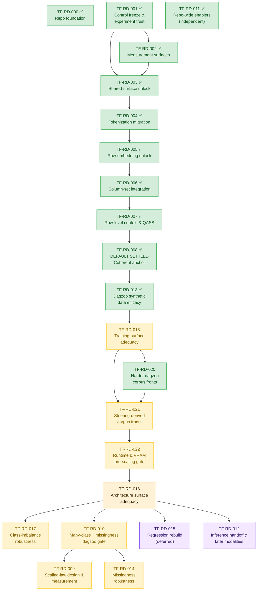

# Mission-Aligned Roadmap (2026Q1)

Use this roadmap to understand which questions are active now, which surfaces
are frozen, and what evidence the repo still needs before promotion.

The repo-wide plan is now architecture-first:

- keep one frozen PFN-style control lane for trust and comparison
- keep `tabfoundry_staged` as the incumbent row-first reference and benchmark
  line
- treat `tabfoundry_sandwich` as the primary classification architecture target
  and scaling-prep family
- make runtime and VRAM optimization a hard prerequisite to later scaling so
  every scale ladder inherits one measured runtime policy
- stay free to borrow the best components from TabPFN and other tabular models
  rather than aiming for literal TabICLv2 parity
- defer regression from the first classification scaling plan, and use
  many-class plus missingness as the first anti-saturation classification regime
  before the first scaling fit

Use these alongside this roadmap:

- design decisions and repo structure: `docs/development/design-decisions.md`
- codebase navigation: `docs/development/codebase-navigation.md`
- dataset curation and license gate: `docs/development/dataset-curation.md`
- architecture reference: `docs/development/model-architecture.md`
- sandwich architecture: `docs/development/tabfoundry-sandwich.md`
- architecture deltas: `docs/development/architecture-deltas.md`
- workflow runbooks: `docs/workflows.md`
- inference/export contract: `docs/inference.md`
- reference index: `reference/README.md`
- evidence appendix: `reference/evidence.md`

## Status Labels

- `implemented`: available in current code and wired into the canonical
  workflow surface
- `completed`: scoped work finished with a recorded decision or evidence
  package, even if it does not imply a promoted default
- `partial`: meaningful building blocks or evidence exist, but the roadmap
  claim is not yet satisfied end to end
- `planned`: clearly scoped and prioritized, but not yet implemented
- `research`: intentionally deferred or gated behind earlier roadmap work
- `retired`: historical item retained only for traceability

## Canonical Planning Metadata

`docs/development/roadmap.md` is the single source of truth for planning state
in `tab-foundry`.

The canonical planning unit is the local roadmap item `TF-RD-###`. External BL
issues or GitHub issues can track execution work when needed, but missing
external issue chains should not block planning. If another document disagrees
with this file, this file is authoritative.

## Program Statement

The repo now operates with three architecture roles:

- PFN control lane:
  - `tabfoundry_simple`
  - `tabfoundry_staged` with `stage=nano_exact`
  - used to preserve benchmark comparability and experiment trust
- incumbent reference lane:
  - `tabfoundry_staged`
  - current promoted row-first benchmark/reference line
  - remains the carried comparison surface until a later promotion decision
- primary architecture candidate lane:
  - `tabfoundry_sandwich`
  - fixed-latent `y` / byte-array `x` Perceiver-style classifier
  - expected to absorb the next long-running architecture iteration work
  - allowed to borrow components from TabPFN or other references when they fit
    better
  - still must earn promotion through stability and harder-surface evidence

Important non-goals for this roadmap:

- do not treat the current `nano_exact + prenorm + row_cls` hybrid line as the
  long-term destination
- do not assume the incumbent staged reference line is the final architecture
  destination either; it is the current benchmark carry-forward surface
- do not bundle regression into the first row-first promotion push
- do not make QASS structurally mandatory
- do not proliferate many parallel live architecture families beyond the frozen
  control, the incumbent staged reference line, and the current sandwich
  candidate line

## Prioritization Lens

- TF-RD-008 is now closed on an explicit split with a simple default, so the
  next deliberate move is onto harder or broader post-008 surfaces before a
  heavy scaling pass.
- Classification remains the anchor workload while the settled row-first family
  is tested on harder post-008 regimes.
- Architecture conclusions should come from coherent staged surfaces, not from
  piling more overrides onto `nano_exact`.
- Row-first migration work should move one architectural boundary at a time:
  shared surface, small-class/test-self bridge, grouped tokens, row
  embedding, column set reasoning, then row-level context.
- After the binary anchor is coherent, the next deliberate front should make
  the research surface less saturating and more realistic: a dagzoo-backed
  many-class plus missingness regime on the frozen sandwich parent, followed by
  later robustness lanes such as deeper missingness-mechanism and
  class-imbalance coverage.
- If those harder or broader surfaces still leave the model hard to separate or
  obviously underfit, open a later architecture-surface adequacy pass before
  relying on scaling-law work as the main next source of evidence.
- Class imbalance is still not sufficiently tested on the current benchmark
  surfaces because the bundles only enforce `min_minority_class_pct = 2.5`
  rather than defining an explicit skew ladder.
- Training adequacy should become explicit once the repo has settled whether the
  fresh default current corpus or alternative dagzoo-style corpora better match
  the training data it actually expects to use, so optimizer and schedule work
  does not overfit the wrong data surface.
- Harder real-data ladders should keep one canonical OpenML baseline where the
  benchmark tooling is already native, allow manifest-backed external
  real-data augmentations when they add regimes OpenML does not cover cleanly,
  and require completed review records before those datasets enter curated
  bundles or manifests; `dagzoo` remains the synthetic-data lane under
  TF-RD-013 rather than an external real-data source.
- The deliberate post-008 execution order is now:
  TF-RD-013 dagzoo synthetic-data efficacy first so the repo decides whether
  its post-008 training surface should move closer to intended use before
  optimizing it; TF-RD-018 training adequacy next on that representative data
  base; TF-RD-020 harder dagzoo corpus fronts next as the adjacent synthetic
  harder-surface lane, closing on one kept uncapped winner per family on the
  canonical harder-front ladder; TF-RD-021 steering-derived dagzoo corpus fronts
  after TF-RD-018 settles one explicit default recipe and dagzoo RD-008
  steering lands, so the repo can test whether curriculum-steered corpora beat
  the TF-RD-020 control before benchmark-front ladders; TF-RD-022 runtime and
  VRAM efficiency next as the hard pre-scaling gate that makes time and memory
  a measured surface without reopening the carried recipe; the simplified-parent
  phase under TF-RD-016 then narrows the sandwich classification parent before
  broader law fitting; TF-RD-010 then uses that frozen parent on one carried
  dagzoo many-class plus missingness slice so the first scaling target does not
  saturate too early on binary data; TF-RD-009 then fits the first scaling law
  on that carried multiclass slice; TF-RD-014 missingness follow-up and
  TF-RD-017 class-imbalance remain later robustness lanes off that main path.
- Low-level questions such as norm family or placement, learned special-token
  initialization scale, QASS scaler capacity, and activation family belong
  under TF-RD-016 after the earlier adequacy and harder-surface gates are in
  place, not as free-floating anchor-settlement work.
- Many-class, regression, and runtime handoff should build on that
  deconfounded post-008 base rather than competing with the earlier gates.
- Runtime and VRAM optimization should finish before the first scaling fit so
  classification ladders inherit one measured 80 GB A100-safe policy instead of
  discovering memory limits during the scale study.
- Scaling-law design should start only after the repo has a simplified sandwich
  parent, one carried dagzoo curriculum slice, runtime telemetry and artifact
  integrity, and at least one missingness read on the same classification
  family.

## Canonical Priority Queue

Lower rank means higher priority. Rank `0` is reserved for implemented work
retained for traceability.

| Rank | Roadmap ID | Item | Status | Milestone |
| ---- | ---------- | ---- | ------ | --------- |
| 0 | TF-RD-000 | Repo foundation and staged-family split | implemented | Implemented |
| 1 | TF-RD-001 | Control freeze and experiment trust | implemented | Implemented |
| 2 | TF-RD-002 | Measurement surfaces for architecture migration | implemented | Implemented |
| 3 | TF-RD-003 | Shared-surface unlock | implemented | Implemented |
| 4 | TF-RD-011 | Repo-wide enablers and contract fidelity | implemented | Implemented |
| 5 | TF-RD-004 | Tokenization migration | completed | Implemented |
| 6 | TF-RD-005 | Row-embedding unlock | completed | Implemented |
| 7 | TF-RD-006 | Column-set integration | completed | Implemented |
| 8 | TF-RD-007 | Row-level context and QASS attribution | completed | Implemented |
| 9 | TF-RD-008 | Coherent classification anchor promotion | implemented | Implemented |
| 10 | TF-RD-013 | Dagzoo synthetic-data efficacy on the promoted anchor | completed | Completed |
| 11 | TF-RD-018 | Training-surface adequacy on the promoted anchor | planned | Next |
| 12 | TF-RD-020 | Harder dagzoo corpus fronts on the promoted anchor | completed | Completed |
| 13 | TF-RD-021 | Steering-derived dagzoo corpus fronts on the promoted anchor | planned | Next |
| 14 | TF-RD-022 | Training runtime and VRAM efficiency before classification scaling | planned | Next |
| 15 | TF-RD-016 | Architecture surface adequacy, sandwich simplification, and selective expansion | planned | Next |
| 16 | TF-RD-010 | First many-class + missingness dagzoo gate on the row-first base | planned | Next |
| 17 | TF-RD-009 | Scaling-law design and measurement on the classification-first sandwich target | planned | Next |
| 18 | TF-RD-014 | Missingness robustness on the promoted anchor | planned | Next |
| 19 | TF-RD-017 | Class-imbalance robustness on the promoted anchor | planned | Next |
| 20 | TF-RD-015 | Regression rebuild deferred from the classification-first scaling plan | research | Later |
| 21 | TF-RD-012 | Inference handoff and later modalities | research | Later |

## Dependency Graph

```mermaid
flowchart TD
    RD000["TF-RD-000 ✅<br/>Repo foundation"]

    RD001["TF-RD-001 ✅<br/>Control freeze &<br/>experiment trust"]
    RD002["TF-RD-002 ✅<br/>Measurement surfaces"]
    RD011["TF-RD-011 ✅<br/>Repo-wide enablers<br/>(independent)"]

    RD003["TF-RD-003 ✅<br/>Shared-surface unlock"]
    RD004["TF-RD-004 ✅<br/>Tokenization migration"]
    RD005["TF-RD-005 ✅<br/>Row-embedding unlock"]
    RD006["TF-RD-006 ✅<br/>Column-set integration"]
    RD007["TF-RD-007 ✅<br/>Row-level context & QASS"]
    RD008["TF-RD-008 ✅<br/>DEFAULT SETTLED<br/>Coherent anchor"]
    RD013["TF-RD-013 ✅<br/>Dagzoo synthetic<br/>data efficacy"]
    RD018["TF-RD-018<br/>Training-surface<br/>adequacy"]
    RD020["TF-RD-020<br/>Harder dagzoo<br/>corpus fronts"]
    RD021["TF-RD-021<br/>Steering-derived<br/>corpus fronts"]
    RD022["TF-RD-022<br/>Runtime & VRAM<br/>pre-scaling gate"]
    RD014["TF-RD-014<br/>Missingness<br/>robustness"]
    RD017["TF-RD-017<br/>Class-imbalance<br/>robustness"]
    RD016["TF-RD-016<br/>Architecture surface<br/>adequacy"]
    RD010["TF-RD-010<br/>Many-class + missingness<br/>dagzoo gate"]
    RD015["TF-RD-015<br/>Regression rebuild<br/>(deferred)"]
    RD012["TF-RD-012<br/>Inference handoff &<br/>later modalities"]
    RD009["TF-RD-009<br/>Scaling-law design &<br/>measurement"]

    RD001 --> RD002
    RD001 --> RD003
    RD002 --> RD003
    RD003 --> RD004
    RD004 --> RD005
    RD005 --> RD006
    RD006 --> RD007
    RD007 --> RD008
    RD008 --> RD013
    RD013 --> RD018
    RD018 --> RD020
    RD018 --> RD021
    RD020 --> RD021
    RD021 --> RD022
    RD022 --> RD016
    RD016 --> RD010
    RD010 --> RD009
    RD010 --> RD014
    RD016 --> RD017
    RD016 --> RD015
    RD016 --> RD012

    classDef done fill:#d4edda,stroke:#28a745,color:#155724;
    classDef readyNow fill:#fff3cd,stroke:#ffc107,color:#856404;
    classDef now fill:#fce4ec,stroke:#e91e63,color:#880e4f;
    classDef gate fill:#fff1d6,stroke:#c67a00,color:#3d2a00;
    classDef later fill:#f3e8ff,stroke:#7c3aed,color:#3b1f6e;

    class RD000,RD001,RD002,RD003,RD004,RD005,RD006,RD007,RD008,RD011,RD013,RD020 done;
    class RD009,RD018,RD021,RD022,RD014,RD017,RD010 readyNow;
    class RD016 gate;
    class RD012,RD015 later;
```

Current path: **TF-RD-018 → TF-RD-021 → TF-RD-022 → TF-RD-016 (simplified-parent phase) → TF-RD-010 → TF-RD-009**.

- TF-RD-018 is the first active gate: finish one explicit training recipe on
  the inherited `tf_rd_020_shift_noise_drift_v1` harder surface.
- TF-RD-021 then decides whether any steering-derived dagzoo corpus front
  replaces that carried control.
- TF-RD-022 is a hard pre-scaling gate: it must hand back one measured runtime
  policy before broader classification ladders or scaling fits.
- TF-RD-016 then chooses and freezes a simplified sandwich parent for the
  classification family.
- TF-RD-010 then evaluates the first dagzoo-backed many-class plus missingness
  classification slice on that frozen parent, with multiclass log loss as the
  primary objective.
- TF-RD-009 only starts after those gates are closed and fits the first law on
  that carried multiclass slice under matched regime budget.

Parallel/later lanes are intentionally off that main path:

- TF-RD-014 is now a follow-on missingness robustness lane after the first
  many-class plus missingness gate rather than a blocker to the first scaling
  fit.
- TF-RD-017 is still a preferred benchmark-backed robustness lane, but not a
  blocker for the first scaling fit.
- TF-RD-015 regression and TF-RD-012 inference handoff/later modalities remain
  later work.

## Current Capability Matrix

| Objective / Claim | Current State | Evidence In Repo | Current Gap | Roadmap IDs |
| --- | --- | --- | --- | --- |
| Frozen PFN-style control exists | `implemented` | `tabfoundry_simple`, `stage=nano_exact`, and the prior-trained PFN-facing benchmark lane are all stable | Keep that lane clearly separate from the architecture target | `TF-RD-001` |
| Row-first staged reference line is settled | `implemented` | The grouped-token, row-embedding, QASS, and TFCol studies all resolve to `row_cls + qass + no tfcol` as the default staged anchor, with `tfcol_heads4` retained only as a calibration-oriented variant | Future work should reuse that settled split rather than reopen anchor selection | `TF-RD-003` to `TF-RD-008` |
| Sandwich is the primary classification candidate | `partial` | `tabfoundry_sandwich` is landed, the compact hybrid replay is benchmarked, and the first knob screen plus bounded width/head follow-up both kept the compact control; [#184](https://github.com/bensonlee5/tab-foundry/issues/184) now owns simplified-parent follow-up | Choose and freeze one simplified sandwich parent before harder-surface or scaling work | `TF-RD-016`, `TF-RD-021A`, `TF-RD-021B` |
| Harder synthetic classification fronts are runnable | `implemented` | Dagzoo manifest/export fidelity is complete, TF-RD-013 settled the representative medium surface, TF-RD-020 settled harder-front winners, and TF-RD-018 kept `schedulefree_adamw` on the inherited noise-drift runtime | Finish TF-RD-018 continuation and TF-RD-021 steering before using those fronts as scaling evidence | `TF-RD-011`, `TF-RD-013`, `TF-RD-018`, `TF-RD-020`, `TF-RD-021` |
| Runtime and VRAM are measurable | `partial` | Training and registry artifacts now preserve runtime-summary and regime-budget fields, and the repo already has bf16/checkpointing-capable runtime plumbing | TF-RD-022 still needs to turn that into one explicit 80 GB A100-safe runtime policy | `TF-RD-022` |
| Many-class + missingness is now the first anti-saturation carried slice | `partial` | `many_class` is implemented, the small multiclass bundle already exists, and the roadmap now treats a dagzoo-backed many-class plus missingness slice as the first harder classification gate | The repo still needs one explicit carried many-class plus missingness dagzoo slice on the frozen sandwich parent | `TF-RD-010` |
| Follow-on missingness and imbalance robustness remain open | `partial` | Missing-permitting binary bundles exist, and the current bundle policy already excludes degenerate minority-class cases | TF-RD-014 and TF-RD-017 still need explicit follow-on robustness ladders and keep/defer decisions on the promoted family after the first multiclass gate | `TF-RD-014`, `TF-RD-017` |
| Regression and later modalities are deferred | `research` | Partial bundle/runtime scaffolding exists | They should not absorb attention from the classification-first path | `TF-RD-015`, `TF-RD-012` |
| Scaling-law work has the needed metadata path | `planned` | Artifacts now preserve resolved sandwich specs plus runtime/regime-budget metadata | TF-RD-009 still waits on the runtime gate, simplified parent, and one fixed dagzoo many-class plus missingness slice | `TF-RD-009` |

## Current Implementation Baseline

This roadmap assumes the following repo truths:

- `tabfoundry_simple` and `tabfoundry_staged` with `stage=nano_exact` remain
  the frozen PFN-style control lane.
- `tabfoundry_staged` remains the incumbent row-first reference line; its
  settled default anchor is `row_cls + qass + no tfcol`, with
  `row_cls + qass + tfcol_heads4` retained only as a calibration-oriented
  variant.
- `tabfoundry_sandwich` exists as the primary classification architecture
  candidate; the initial replay, knob screen, and bounded width/head follow-up
  are complete, and the next sandwich step is simplified-parent selection under
  [#184](https://github.com/bensonlee5/tab-foundry/issues/184).
- dagzoo manifest identity, export/reference preprocessing fidelity, and the
  one-way data boundary are part of the baseline rather than active blockers.
- the representative post-008 synthetic training-data surface is
  `tf_rd_013_dagzoo_shape_aware_size_medium_v1`.
- many-class scaffolding exists, and the next harder carried classification
  target is now a dagzoo-backed many-class plus missingness slice; regression
  and later inference/runtime handoff are still not part of the first
  classification-scaling path.

## Roadmap Items

### Historical Summary: TF-RD-000 Through TF-RD-013

- TF-RD-000 through TF-RD-004 are complete: the repo foundation, control lane,
  measurement surfaces, shared-surface unlock, and grouped-token migration are
  all part of the baseline now.
- TF-RD-005 through TF-RD-008 are also complete: row embeddings helped, plain
  row context did not, default TFCol did not justify promotion, QASS stayed
  optional, and the staged reference line settled on
  `row_cls + qass + no tfcol` with `row_cls + qass + tfcol_heads4` retained as
  a calibration-oriented variant.
- TF-RD-011 is complete: dagzoo CLI-to-manifest handoff, path-independent
  corpus identity, and export/reference preprocessing fidelity are baseline
  repo guarantees rather than active roadmap work.
- TF-RD-013 is complete: the representative post-008 synthetic-data surface is
  `tf_rd_013_dagzoo_shape_aware_size_medium_v1`.
- The detailed historical record remains in completed issues, sweep artifacts,
  and [reference/evidence.md](/Users/bensonlee/dev/tab-foundry/reference/evidence.md); the sections below focus on active and later work only.

### TF-RD-010: First Many-Class + Missingness Dagzoo Gate On The Row-First Base

- Status: `planned`
- Milestone: `Next`
- Goal: use a dagzoo-backed many-class plus missingness regime as the first
  harder post-simplification classification gate so the first scaling target
  does not saturate too early on binary data
- Current state:
  - the staged family already contains `many_class`
  - the hierarchical many-class machinery already exists
  - `nanotabpfn_openml_classification_small_v1.json` already exists as a
    benchmark-facing multiclass bundle
  - issue [#52](https://github.com/bensonlee5/tab-foundry/issues/52) is now
    the epic for this lane, and issue
    [#99](https://github.com/bensonlee5/tab-foundry/issues/99) is the first
    execution issue
  - this lane now sits on the first classification-scaling path after the
    simplified-parent phase of TF-RD-016 rather than as a later extension
- Required work:
  - confirm one carried dagzoo-backed many-class plus missingness slice and the
    promoted backbone that will read it
  - keep the lane on the same promoted family rather than opening a separate
    architecture track
  - evaluate this first gate by multiclass log loss first, with runtime,
    stability, and calibration-oriented metrics as guardrails
  - record one explicit keep/defer decision on the carried many-class plus
    missingness slice before TF-RD-009 starts
- Exit criteria:
  - the repo has one explicit carried dagzoo many-class plus missingness slice
    on the promoted backbone
  - multiclass is no longer only untested scaffolding on the first scaling path

### TF-RD-012: Inference Handoff And Later Modalities

- Status: `research`
- Milestone: `Later`
- Goal: advance separate-runtime handoff and genuinely later modalities only
  after the promoted row-first classification base is stable
- Current state:
  - classification remains the only active supported prediction mode
  - runtime handoff and later modalities remain deferred
- Required work:
  - advance separate-runtime handoff only after the classification base settles
  - keep time series, text-conditioned inputs, and other later modalities out
    of the current path
- Exit criteria:
  - inference handoff and later modalities build on the promoted staged base
    rather than running ahead of it

### TF-RD-014: Missingness Robustness On The Promoted Anchor

- Status: `planned`
- Milestone: `Next`
- Goal: deepen missingness robustness after the first many-class plus
  missingness gate is established on the promoted family
- Current state:
  - `missingness_followup` exists, but it is anchored on the older stabilized
    prenorm hybrid surface rather than the row-first line
  - the repo already has separate no-missing and allow-missing benchmark bundle
    contracts
  - issue [#97](https://github.com/bensonlee5/tab-foundry/issues/97) remains
    the missingness epic, but TF-RD-010 now owns the first anti-saturation
    many-class plus missingness gate
  - issue [#146](https://github.com/bensonlee5/tab-foundry/issues/146) now
    occupies the adjacent synthetic harder-dagzoo slot and does not replace
    this benchmark-front missingness lane
  - there is no explicit row-first missingness-mechanism recommendation yet;
    TF-RD-008 only settled the default row-first anchor on the allow-missing
    benchmark surface
- Required work:
  - re-anchor missingness work on the promoted row-first base after the carried
    many-class plus missingness slice is established under TF-RD-010
  - keep one pinned OpenML missingness ladder as the canonical benchmark
    baseline and allow license-cleared manifest-backed external augmentations
    when they add missingness regimes OpenML does not cover cleanly
  - use a review ledger for both OpenML datasets and vetted external real-data
    candidates rather than relying on source names alone
  - keep regime identity in task-source names, bundle names, manifest names,
    and curation reports rather than changing benchmark bundle schema in this
    pass
  - focus this lane on deeper missingness mechanism, severity, and benchmark
    coverage rather than on establishing the first anti-saturation regime
  - decide whether explicit missingness handling belongs in the default
    promoted line or remains an optional robustness variant after TF-RD-010
- Exit criteria:
  - the repo has a benchmark-backed follow-on missingness recommendation for
    the promoted family beyond the first many-class plus missingness gate

### TF-RD-017: Class-Imbalance Robustness On The Promoted Anchor

- Status: `planned`
- Milestone: `Next`
- Goal: decide how the promoted row-first family behaves under materially
  skewed class priors
- Current state:
  - current benchmark bundles only enforce `min_minority_class_pct = 2.5`
  - there is no dedicated imbalance-focused bundle ladder yet
  - this is now one of the preferred next benchmark-backed harder-surface
    ladders once TF-RD-013 and TF-RD-018 have settled the representative
    training-data and adequacy surface
  - issue [#146](https://github.com/bensonlee5/tab-foundry/issues/146) now
    occupies the adjacent synthetic harder-dagzoo slot and does not replace
    this benchmark-front imbalance lane
  - benchmark-facing reporting is still centered on ROC AUC, log loss, and
    Brier score
- Required work:
  - define the canonical imbalance-focused binary bundle or bundle-selection
    ladder on the promoted row-first anchor
  - keep one pinned OpenML imbalance ladder as the canonical benchmark
    baseline and allow license-cleared manifest-backed external augmentations
    when they add skew regimes OpenML does not cover cleanly
  - use the same review ledger for OpenML datasets and vetted external
    real-data candidates
  - keep regime identity in task-source names, bundle names, manifest names,
    and curation reports rather than changing benchmark bundle schema in this
    pass
  - define benchmark-facing comparison and reporting that includes PR AUC,
    average precision, and balanced accuracy alongside ROC/log loss/Brier
  - measure the promoted anchor first without class reweighting or focal-style
    loss changes
  - only if the baseline read is weak, run bounded weighted-loss or focal-loss
    follow-up work
- Exit criteria:
  - the repo has a benchmark-backed keep/defer decision on the promoted
    row-first line under class imbalance
  - the repo has an explicit imbalance metric and reporting contract rather
    than relying only on the current general binary bundle metrics

### TF-RD-018: Training-Surface Adequacy On The Promoted Anchor

- Status: `planned`
- Milestone: `Next`
- Goal: once TF-RD-013 has fixed the representative post-008 training-data
  surface, make dataset batching, optimizer, schedule, budget, and runtime
  adequacy an explicit cross-cutting decision surface instead of leaving it as
  sweep-local interpretation
- Current state:
  - adequacy work already exists in `parameter_adequacy_plan` notes and
    isolated sweeps, but there is no canonical training-surface epic
  - `Muon` is already supported in the optimizer surface but has no clean
    roadmap home
  - current adequacy reads are still scattered across frontier-specific sweeps
  - this epic now has a linked tracking issue
    [#107](https://github.com/bensonlee5/tab-foundry/issues/107) and a first
    execution issue
    [#109](https://github.com/bensonlee5/tab-foundry/issues/109)
  - issue [#109](https://github.com/bensonlee5/tab-foundry/issues/109) is now
    completed, so the first larger dataset-batch ladder is no longer pending
  - issues `#122`, `#127`, and the completed size ladder in
    [#132](https://github.com/bensonlee5/tab-foundry/issues/132) now settle the
    representative post-008 training-data surface: TF-RD-018 should start from
    `tf_rd_013_dagzoo_shape_aware_size_medium_v1`
  - issue [#146](https://github.com/bensonlee5/tab-foundry/issues/146) is now
    completed, so TF-RD-018 no longer waits on a harder-front blocker before
    optimizer, LR/warmup, and clipping follow-up resume
  - the default harder carry-forward surface for TF-RD-018 is now
    `tf_rd_020_shift_noise_drift_v1` because it leads the kept TF-RD-020
    winners on final log loss and final Brier while preserving a positive final
    ROC delta and the shortest runtime among the kept set
  - issue [#137](https://github.com/bensonlee5/tab-foundry/issues/137) is now
    closed on completed sweep
    [`tf_rd_018_optimizer_family_v1`](../../reference/system_delta_sweeps/tf_rd_018_optimizer_family_v1/matrix.md):
    `schedulefree_adamw` stays primary on the inherited TF-RD-020 row-`06`
    noise-drift anchor, while both `adamw` and `muon` remain `defer`
  - `tf_rd_020_noise_mixture_v1` was considered as the named fallback harder
    surface, but the completed optimizer-family read on
    `tf_rd_020_shift_noise_drift_v1` was not close or unstable enough to
    activate that branch
  - issue [#138](https://github.com/bensonlee5/tab-foundry/issues/138) now
    opens as active sweep
    [`tf_rd_018_lr_warmup_shape_v1`](../../reference/system_delta_sweeps/tf_rd_018_lr_warmup_shape_v1/matrix.md),
    which keeps the inherited TF-RD-020 row-`06` noise-drift runtime fixed
    while tuning LR and warmup shape around the kept `schedulefree_adamw`
    optimizer family on a corrected `400`-step schedule horizon
- later architecture reads remain confounded until the repo has one explicit
  adequacy decision surface on the settled row-first base
- Required work:
- keep `tf_rd_020_shift_noise_drift_v1` as the default harder carry-forward
  surface and inherit the successful TF-RD-020 row-`06` runtime
  (`task_batch_size=1`, `grad_accum_steps=4`, `max_steps=400`) for the
  remaining LR/schedule or warmup shape, step-budget, and clipping
  comparisons
- keep `schedulefree_adamw` as the carried optimizer family after completed
  issue [#137](https://github.com/bensonlee5/tab-foundry/issues/137); both
  `adamw` and `muon` remain deferred
- use `tf_rd_018_lr_warmup_shape_v1` as the active execution sweep for issue
  [#138](https://github.com/bensonlee5/tab-foundry/issues/138): compare the
  carried corrected short-run linear-warmup baseline against warmup-zero,
  lower-ceiling, lower-floor, and warmup-20 variants on the locked noise-drift
  runtime
- keep `tf_rd_020_noise_mixture_v1` as inactive fallback context only; this
  branch is not reopened unless a later TF-RD-018 read becomes genuinely
  confounded on the carried noise-drift surface
- keep architecture changes out of this epic and treat device/runtime
  constraints only insofar as they change interpretation of optimizer or
  schedule adequacy
- Exit criteria:
  - the repo has an explicit default training surface for next-tier fronts on
    the settled row-first anchor, starting from the completed dataset-batch
    ladder under issue [#109](https://github.com/bensonlee5/tab-foundry/issues/109)
    and the documented `tf_rd_020_shift_noise_drift_v1` harder carry-forward
    surface from issue [#146](https://github.com/bensonlee5/tab-foundry/issues/146)
  - the repo has a clear rule for when optimizer or schedule adequacy must be
    resolved before interpreting architecture outcomes

### TF-RD-022: Training Runtime And VRAM Efficiency Before Classification Scaling

- Status: `planned`
- Milestone: `Next`
- Goal: make training time and VRAM headroom an explicit decision surface for
  the classification scaling target so later batching, CUDA-capacity, and
  scaling work inherit one measured runtime policy instead of ad hoc
  host-specific tweaks
- Current state:
  - deferred issue [#58](https://github.com/bensonlee5/tab-foundry/issues/58)
    already exists for runtime or VRAM summaries, but it stayed attached to
    the earlier TF-RD-002 measurement chain and never became a full execution
    spine
  - new epic [#168](https://github.com/bensonlee5/tab-foundry/issues/168) now
    tracks this runtime lane, with child issues
    [#169](https://github.com/bensonlee5/tab-foundry/issues/169),
    [#170](https://github.com/bensonlee5/tab-foundry/issues/170), and
    [#171](https://github.com/bensonlee5/tab-foundry/issues/171)
  - the sandwich architecture lane now lives under issue
    [#178](https://github.com/bensonlee5/tab-foundry/issues/178) with the
    immediate nanoTabPFN screen under issue
    [#179](https://github.com/bensonlee5/tab-foundry/issues/179); runtime work
    is now a dependency surface for later sandwich hard-surface reads rather
    than the owner of sandwich planning
  - training telemetry and benchmark-registry records now preserve
    `runtime_summary` and `regime_budget` payloads, including peak VRAM,
    throughput, token-budget fields, objective metric, and curriculum or SCM
    metadata
  - canonical benchmark prior configs still inherit `runtime.mixed_precision: "no"` from `configs/experiment/_shared/compact_binary_prior.yaml` unless a
    higher-level experiment overrides it
  - `tabfoundry_staged` already supports
    `runtime.activation_checkpointing`, but the ordinary benchmark-facing
    defaults keep it disabled
  - benchmark-facing exact-prior runs still default to
    `runtime.trace_activations: true`, which is useful for diagnostics but is
    not yet separated cleanly from ordinary benchmark execution
- this epic is now a hard prerequisite to TF-RD-009 rather than an optional
  sibling lane; it should not reopen optimizer-family or LR adequacy work
- Required work:
  - land the runtime and VRAM measurement dependency from issue
    [#58](https://github.com/bensonlee5/tab-foundry/issues/58) so sweep and
    result artifacts expose peak memory, reserved memory, throughput, and time
    breakdowns directly
  - run the bounded low-risk runtime ladder under issue
    [#169](https://github.com/bensonlee5/tab-foundry/issues/169) on one frozen
    carried classification recipe: treat bf16, benchmark-facing
    activation-trace policy, and activation checkpointing as the first
    runtime-policy knobs
  - encode the winning runtime policy as a first-class config and sweep surface
    under issue [#170](https://github.com/bensonlee5/tab-foundry/issues/170)
    rather than relying on per-run overrides
  - keep sandwich architecture work on
    [#174](https://github.com/bensonlee5/tab-foundry/issues/174),
    [#178](https://github.com/bensonlee5/tab-foundry/issues/178), and
    [#179](https://github.com/bensonlee5/tab-foundry/issues/179) rather than
    reopening this runtime epic as the sandwich owner; MPS OOMs should not be
    part of the quantitative CUDA decision record
  - only after the runtime policy is explicit, reopen harder-surface batching
    under issue [#171](https://github.com/bensonlee5/tab-foundry/issues/171)
    with a conservative 80 GB A100 memory guardrail and a fixed effective
    optimizer batch
  - keep architecture, optimizer-family, LR or warmup, clipping, budget, and
    curriculum changes out of this epic except insofar as TF-RD-018 and
    TF-RD-021 have already frozen them for the runtime read
- Exit criteria:
  - the repo has one explicit runtime policy for the classification scaling
    target, justified by repo-local time and VRAM evidence
  - sweep outputs, inspect surfaces, and result summaries expose runtime and
    VRAM metrics compactly enough that future runs can be compared without
    manual log inspection
  - later sandwich dagzoo, missingness, deferred CUDA-capacity follow-up, and
    TF-RD-009 preparation can inherit the same runtime policy without
    re-deriving it from scratch

### TF-RD-020: Harder Dagzoo Corpus Fronts On The Promoted Anchor

- Status: `completed`
- Milestone: `Completed`
- Goal: once the first TF-RD-018 dataset-batch ladder is complete, turn harder
  dagzoo-generated corpus fronts into the next explicit synthetic harder-surface
  decision lane on the promoted row-first anchor
- Current state:
  - TF-RD-020 is now historical handoff material rather than an active lane.
  - It closed on one kept harder-front winner in each family, with
    `tf_rd_020_shift_noise_drift_v1` becoming the default carry-forward
    surface for TF-RD-018 and `tf_rd_020_noise_mixture_v1` retained as named
    fallback context.
  - The completed ladder stayed synthetic-data-only; benchmark-front
    missingness and imbalance remain separate work.
- Completed outcomes:
  - `tf_rd_020_missingness_mcar_v1` is the kept missingness family winner.
  - `tf_rd_020_shift_noise_drift_v1` is the kept default harder carry-forward
    winner.
  - `tf_rd_020_noise_mixture_v1` is the kept mechanism/noise-family winner.
  - Larger-corpus, winner-mix, and steering follow-ups moved to later lanes
    rather than reopening TF-RD-020 itself.
- Exit criteria:
  - satisfied: TF-RD-018 inherits a documented default harder front plus named
    fallback context without reopening the completed ladder
  - satisfied: the relationship to TF-RD-014, TF-RD-017, and TF-RD-021 is
    explicit and non-overlapping

### TF-RD-021: Steering-Derived Dagzoo Corpus Fronts On The Promoted Anchor

- Status: `planned`
- Milestone: `Next`
- Goal: once TF-RD-018 has one explicit default training recipe and dagzoo
  RD-008 steering lands, test whether steering-derived dagzoo corpus fronts
  beat the carried TF-RD-020 control without reopening TF-RD-018
- Current state:
  - issue [#165](https://github.com/bensonlee5/tab-foundry/issues/165) is the
    sibling epic to issues
    [#107](https://github.com/bensonlee5/tab-foundry/issues/107) and
    [#146](https://github.com/bensonlee5/tab-foundry/issues/146)
  - TF-RD-020 already closed on `tf_rd_020_shift_noise_drift_v1` as the
    default carried harder surface plus `tf_rd_020_noise_mixture_v1` as the
    named fallback context
  - TF-RD-018 still needs issues
    [#138](https://github.com/bensonlee5/tab-foundry/issues/138) and
    [#139](https://github.com/bensonlee5/tab-foundry/issues/139) to finish one
    explicit default LR, clipping, and step-budget recipe on the inherited
    noise-drift runtime
  - completed issue [#137](https://github.com/bensonlee5/tab-foundry/issues/137)
    deferred `muon` on that inherited control, so the repo does not retry it
    inside TF-RD-018
  - dagzoo issue
    [#246](https://github.com/bensonlee5/dagzoo/issues/246) now owns the
    upstream steering implementation, deterministic metadata, and
    coverage-movement diagnostics
- Required work:
  - wait until TF-RD-018 closes issues `#138` and `#139` and dagzoo RD-008 has
    landed enough of issue `#246` to make steering fixed-seed reproducible and
    auditable
  - define one bounded first sweep under issue
    [#167](https://github.com/bensonlee5/tab-foundry/issues/167): one control
    row on `tf_rd_020_shift_noise_drift_v1` plus `3-4` steering-derived corpus
    rows produced from named steering policies or presets
  - hold model, optimizer, LR, clipping, and budget fixed at the final
    TF-RD-018 recipe across every row
  - interpret final log loss first, final Brier score second, final ROC AUC
    third, with runtime, clipped-step fraction, and stability telemetry as
    guardrails
  - keep exactly one steering-derived carry-forward surface only if it clearly
    beats the incumbent control; otherwise keep `tf_rd_020_shift_noise_drift_v1`
  - only if a steering-derived front wins, execute issue
    [#166](https://github.com/bensonlee5/tab-foundry/issues/166) as one bounded
    `schedulefree_adamw` versus `muon` retry on the promoted steering front
  - keep this epic synthetic-data-only rather than absorbing benchmark-front
    missingness or class-imbalance conclusions
- Exit criteria:
  - the repo has one explicit keep/defer decision on whether any
    steering-derived corpus front replaces `tf_rd_020_shift_noise_drift_v1`
  - if a steering-derived front wins, the repo has one bounded optimizer-family
    follow-up on that front; otherwise the retry is explicitly skipped
  - the relationship between TF-RD-021 and TF-RD-018 or TF-RD-020 plus
    TF-RD-010, TF-RD-014, and TF-RD-017 is explicit and non-overlapping

### TF-RD-015: Regression Rebuild Deferred From The Classification-First Scaling Plan

- Status: `research`
- Milestone: `Later`
- Goal: resume regression only after the classification-first sandwich scaling
  plan has landed a stable runtime policy, harder-surface classification
  evidence, and a usable scaling contract
- Current state:
  - regression support is intentionally removed from the active repo surface
  - regression metrics and bundle normalization support already exist in parts
    of the repo
  - there is no active regression program, canonical regression bundle, or
    regression head/loss contract
  - regression is intentionally out of scope as a blocker for the first
    classification scaling program
- Required work:
  - define the canonical regression benchmark surface or surfaces only after
    the classification-first scaling plan closes its core gates
  - if regression curation expands, keep one OpenML baseline where possible and
    use only license-cleared manifest-backed external datasets as augmentations
  - define the eventual regression head and loss contract on the chosen
    post-classification family rather than reopening regression ownership now
- Exit criteria:
  - regression has a benchmark-facing baseline and a bounded roadmap for
    promotion or deferral after the classification-first scaling plan is
    complete

### TF-RD-016: Architecture Surface Adequacy, Sandwich Simplification, And Selective Expansion

- Status: `planned`
- Milestone: `Next`
- Goal: simplify the sandwich classification parent before broader harder-surface
  work, then decide whether any additional architecture-surface expansion is
  justified once harder classification surfaces are in place
- Current state:
  - `tabfoundry_sandwich` is now the primary classification candidate under
    umbrella issue [#178](https://github.com/bensonlee5/tab-foundry/issues/178).
  - The earlier summary-bottleneck replay is closed negative evidence under
    [#179](https://github.com/bensonlee5/tab-foundry/issues/179), while the
    compact hybrid replay and the first two follow-up screens under
    [#181](https://github.com/bensonlee5/tab-foundry/issues/181),
    [#182](https://github.com/bensonlee5/tab-foundry/issues/182), and
    [#183](https://github.com/bensonlee5/tab-foundry/issues/183) all kept the
    compact hybrid control unchanged.
  - Issue [#184](https://github.com/bensonlee5/tab-foundry/issues/184) now owns
    the simplified-parent decision and scaling prep.
  - The existing public staged/sandwich surface is already broad enough that
    the next step should be simplification and freeze, not immediate new-knob
    expansion.
- Required work:
  - Run the bounded simplification package under
    [#184](https://github.com/bensonlee5/tab-foundry/issues/184) on the locked
    compact control:
    `sandwich_self_attention_per_cross=1`,
    `sandwich_ff_expansion=1`, both together, and both together plus
    `sandwich_summary_tokens_per_axis=1`.
  - Choose the smallest parent that stays inside the bounded final-log-loss,
    clipped-step-fraction, and late-drift tolerances, then freeze the
    non-shape sandwich knobs on that parent.
  - Carry that frozen parent first onto one dagzoo-backed many-class plus
    missingness slice under
    [#52](https://github.com/bensonlee5/tab-foundry/issues/52) and
    [#99](https://github.com/bensonlee5/tab-foundry/issues/99) before treating
    deeper missingness or imbalance as follow-on robustness work.
  - Prefer already-exposed choices such as norm placement, tokenizer/grouping,
    and width/depth/capacity controls before adding new public fields.
  - Only if the simplified harder-surface reads remain low-signal, consider a
    small bounded set of new architecture knobs rather than a general
    “everything configurable” expansion.
- Exit criteria:
  - the repo has one explicit simplified sandwich parent for classification and
    a frozen non-shape knob surface for follow-on harder-surface work
  - the repo has an explicit keep/defer decision on whether the current public
    architecture surfaces, including the fixed-latent sandwich candidate, are
    sufficient on harder post-008 regimes
  - any newly exposed architecture knobs are bounded, justified, and tied to a
    coherent comparison surface rather than broad config expansion

### TF-RD-009: Scaling-Law Design And Measurement On The Classification-First Sandwich Target

- Status: `planned`
- Milestone: `Next`
- Goal: fit the first classification scaling laws on the simplified sandwich
  family only after the repo has one fixed dagzoo many-class plus missingness
  slice, one runtime policy, and a literature-grounded law-design note
- Current state:
  - tuning and benchmark-adjacent tooling already exist
  - scaling-law intent is clear, but scaling on the current simple binary regime
    risks low-signal conclusions because recent architecture deltas are already
    close on that surface
  - training telemetry and benchmark-registry artifacts now preserve resolved
    sandwich specs, runtime summaries, and regime-budget metadata needed for
    later scaling comparisons
  - there is still no canonical scaling artifact path on a fixed dagzoo
    many-class plus missingness slice with matched runtime policy and matched
    regime budget
  - sandwich-local simplification work under
    [#184](https://github.com/bensonlee5/tab-foundry/issues/184) is the
    required precursor for this family, but it does not satisfy TF-RD-009 by
    itself
- Required work:
  - write the dedicated law-design note before any scaling fit, grounded in
    μP, depth-aware μP follow-ups, optimizer-budget scaling work, Chinchilla,
    and synthetic-data curriculum references
  - separate theory-backed and empirical dimensions explicitly:
    width via `d_icl`, depth via `sandwich_layers`, optimizer transfer via LR,
    momentum, and batch, and curriculum or SCM mixture as an empirical
    higher-order term
  - treat matched token budget as necessary but not sufficient; compare by
    matched regime budget using token budget, unique-task budget, fixed
    curriculum or SCM-mixture slice, and fixed task-complexity band
  - finish TF-RD-021, TF-RD-022, TF-RD-010, and the simplified-parent phase of
    TF-RD-016 before using scaling results as architecture evidence
  - keep the other sandwich knobs frozen at the chosen simplified-parent values
    while fitting the first width-depth classification laws
  - use multiclass log loss as the primary ranking objective on the carried
    many-class plus missingness slice
  - run optimizer-transfer and model-size scaling together rather than as
    separate programs
  - keep the eventual `sandwich_scale` interface internal-only until the law is
    validated on the carried multiclass slice and later follow-on robustness
    lanes
- Exit criteria:
  - the repo can fit width-depth classification laws on the simplified sandwich
    architecture under a fixed dagzoo many-class plus missingness slice that is
    harder or broader than the current simple binary regime
  - scaling artifacts compare runs by matched regime budget with final
    multiclass log loss as the primary objective and stability, calibration,
    and runtime as guardrails
  - any later single-knob scaling interface is explicitly derived from those
    law fits and remains internal until cross-surface validation is complete

## Acceptance Gates For Architecture Promotion

The architecture target lane should promote rows only when all of the following
hold:

- the row is coherent as a named architecture surface rather than an ad hoc
  override pile
- the row is stable on training telemetry, not only acceptable on final metrics
- the row is benchmark-neutral-or-better against the relevant control surface
- added runtime and memory cost are justified by the gain
- the interpretation is attributable against matched controls rather than
  speculative

## Planning Defaults And Assumptions

- TabICLv2 is the strongest directional reference for the active architecture
  target, but not a literal reproduction target.
- TabPFN remains the control lineage and a legitimate donor for specific
  components.
- QASS remains optional.
- Classification remains the anchor workload while the simplified sandwich
  parent is tested against the incumbent staged reference on harder post-008
  surfaces.
- After TF-RD-008, the first anti-saturation carried regime should be
  dagzoo-backed many-class plus missingness rather than another binary-only
  surface whenever the current binary regime risks saturation.
- Dagzoo synthetic-data efficacy is the first post-008 gate for training-surface
  optimization, and bounded low-level micro-architecture work belongs after
  that data-source decision, the initial TF-RD-018 batch-ladder closure, the
  TF-RD-020 harder dagzoo corpus front, and the first many-class plus
  missingness gate under TF-RD-010.
- The current large-anchor hybrid line is diagnostic evidence, not the intended
  architecture destination.
