# `tabfoundry_sandwich`

Use this reference when you need the current `tabfoundry_sandwich`
architecture, its runtime contract, and its public tuning surface.

Current repo role:

- primary long-term architecture candidate for ongoing model iteration
- separate from the staged recipe ladder
- not yet the canonical benchmark/reference default
- currently constrained to small-class classification

Keep these roles straight:

- `tabfoundry_simple` remains the frozen PFN-style control
- `tabfoundry_staged` remains the incumbent benchmark/reference line
- `tabfoundry_sandwich` is the main future-facing architecture candidate

Use these alongside this page:

- [docs/development/model-architecture.md](model-architecture.md)
- [docs/development/model-config.md](model-config.md)
- [docs/development/roadmap.md](roadmap.md)

## Design Summary

`tabfoundry_sandwich` is a fixed-latent repeated-input Perceiver-style
classifier.

The model:

1. tokenizes every observed cell with the missingness-aware scalar tokenizer
1. projects those scalar tokens into `d_icl`
1. adds shared Fourier row positions, shared Fourier column positions, and
   learned feature-type embeddings to every cell token
1. builds row summaries and column summaries with learned summary-query
   attention over the cell table
1. fuses train-label embeddings or the learned test-query token directly into
   row-summary tokens, together with row Fourier positions, train/test role
   embeddings, and row/column token-type embeddings
1. concatenates `R` fused row-summary tokens with `C` column-summary tokens
   into one repeated Perceiver input stream of exactly `R + C` tokens
1. lets a fixed learned latent array repeatedly cross-attend to that unified
   stream, then apply one latent Transformer block per stage
1. uses the fused test-row summary tokens as readout queries over the final
   latent state
1. predicts logits through the direct small-class head

Mental model:

- latent array = fixed-capacity latent memory
- repeated input stream = `R + C` row/column summary tokens
- train-label and test-query information live inside the row-summary tokens
- each `sandwich_layers` unit is one repeated Perceiver stage:
  cross-attention read plus one latent Transformer block

## Forward Path

The implementation lives in
`src/tab_foundry/model/architectures/tabfoundry_sandwich/model.py`.

Notation:

- `B` = task batch size
- `N_tr` = training-row count
- `N_te` = test-row count
- `R = N_tr + N_te`
- `C` = feature count
- `L = sandwich_latents`

```mermaid
flowchart TB
    classDef tensor fill:#eef5ff,stroke:#3567a6,color:#10233a,stroke-width:1px;
    classDef embed fill:#fff3db,stroke:#b87316,color:#3b2500,stroke-width:1px;
    classDef attn fill:#e9f7ef,stroke:#2e8b57,color:#123524,stroke-width:1px;
    classDef head fill:#f5ebff,stroke:#7a4db3,color:#2c1548,stroke-width:1px;
    classDef note fill:#f7f7f7,stroke:#888,color:#333,stroke-dasharray: 4 2;

    subgraph legend["Legend"]
        legend_tensor["Tensor / matrix<br/>shape shown in node"]:::tensor
        legend_embed(["Embedding or token-construction op"]):::embed
        legend_attn[[Attention block<br/>PreNorm + residual inside block]]:::attn
        legend_head([Readout / head]):::head
    end

    xtrain["x_train<br/>[B, N_tr, C]"]:::tensor
    xtest["x_test<br/>[B, N_te, C]"]:::tensor
    ytrain["y_train<br/>[B, N_tr]"]:::tensor

    norm(["Shared train/test normalization"]):::embed
    xall["normalized x_all<br/>[B, R, C]"]:::tensor
    tok(["Missingness-aware tokenizer<br/>[value, is_nan, is_posinf, is_neginf]"]):::embed
    xtok["tokenized cells<br/>[B, R, C, 4]"]:::tensor
    enc(["Shared value projection + Fourier row/col + feature-type embedding"]):::embed
    cells["cell tokens<br/>[B, R, C, d_icl]"]:::tensor

    row_attn[[Row-summary query attention<br/>PreNorm + residual]]:::attn
    row_base["row summary bases<br/>[B, R, d_icl]"]:::tensor
    row_fuse(["Label/query fusion + row Fourier + role + token type"]):::embed
    row_tokens["row summary tokens<br/>[B, R, d_icl]"]:::tensor

    col_attn[[Column-summary query attention<br/>PreNorm + residual]]:::attn
    col_base["column summary bases<br/>[B, C, d_icl]"]:::tensor
    col_fuse(["Column token type"]):::embed
    col_tokens["column summary tokens<br/>[B, C, d_icl]"]:::tensor

    concat(["Concatenate row + column summaries"]):::embed
    input_stream["repeated input stream<br/>[B, R + C, d_icl]"]:::tensor

    latent_seed["latent seed<br/>[B, L, d_icl]"]:::tensor

    subgraph stages["Repeated Perceiver stages × sandwich_layers"]
        lat_in["latents in<br/>[B, L, d_icl]"]:::tensor
        cross[[Cross-attention read<br/>Q = latents, KV = repeated input stream<br/>PreNorm + residual]]:::attn
        lat_mid["after input read<br/>[B, L, d_icl]"]:::tensor
        self[[Latent Transformer block<br/>Self-attn + FFN<br/>PreNorm + residual]]:::attn
        lat_out["latents out<br/>[B, L, d_icl]"]:::tensor
        lat_in --> cross --> lat_mid --> self --> lat_out
        lat_in -. residual .-> lat_mid
        lat_mid -. residual .-> lat_out
    end

    test_queries["test-row queries<br/>[B, N_te, d_icl]"]:::tensor
    readout[[Test readout cross-attention<br/>Q = test-row queries, KV = final latents<br/>PreNorm + residual]]:::attn
    test_rows["test-row states<br/>[B, N_te, d_icl]"]:::tensor
    head([DirectClassifierHead]):::head
    logits["logits<br/>[B, N_te, many_class_base]"]:::tensor

    xtrain --> norm
    xtest --> norm
    norm --> xall
    xall --> tok --> xtok --> enc --> cells

    cells --> row_attn --> row_base --> row_fuse --> row_tokens
    ytrain --> row_fuse

    cells --> col_attn --> col_base --> col_fuse --> col_tokens

    row_tokens --> concat
    col_tokens --> concat
    concat --> input_stream

    latent_seed --> lat_in
    input_stream --> cross
    lat_out --> readout --> test_rows --> head --> logits
    row_tokens -->|slice test rows| test_queries
    test_queries --> readout
```

More concretely:

- Cell tokenization:
  - `ScalarPerFeatureMissingnessTokenizer` expands each scalar into
    `[value, is_nan, is_posinf, is_neginf]`
  - `SharedLinearFeatureEncoder` projects those 4 channels into `d_icl`
  - every cell then adds:
    - shared Fourier row-position encoding
    - shared Fourier column-position encoding
    - learned feature-type embedding from `metadata.feature_types`
- Repeated input construction:
  - row summaries use one learned row-summary query per row over that row's
    `C` cell tokens
  - column summaries use one learned column-summary query per column over that
    column's `R` cell tokens
  - column summaries use all observed rows, including test rows
  - row-summary tokens then add:
    - train-label embeddings for train rows
    - the learned test token for test rows
    - shared Fourier row-position encoding
    - learned train/test role embedding
    - learned row token-type embedding
  - column-summary tokens add the learned column token-type embedding
  - the repeated Perceiver input stream is `R row-summary tokens + C column-summary tokens`
- Repeated Perceiver stages:
  - the fixed latent seed has shape `[1, sandwich_latents, d_icl]`
  - each stage does:
    1. latent cross-attention read from the unified repeated input stream
    1. one latent self-attention plus FFN block
  - the same repeated input stream is reused at every stage
  - `sandwich_layers` counts these repeated stages
- Readout:
  - the fused test-row summary tokens act as readout queries
  - `DirectClassifierHead` produces logits of width `many_class_base`

## Hyperparameters

The table below documents every accepted user-facing knob for this
architecture.

| Name | Default | What it controls | Notes |
| ---- | ------- | ---------------- | ----- |
| `model.arch` | global model default is `tabfoundry_staged` | Selects the model family. Set this to `tabfoundry_sandwich` to build the sandwich architecture. | Required to use this model. |
| `d_icl` | `512` | Shared working width for cell tokens, repeated-input tokens, latent blocks, and head input. | The common sandwich experiment presets override this to `96`. |
| `input_normalization` | `none` | Shared train/test feature normalization mode before tokenization. | Accepted values are `none`, `train_zscore`, `train_zscore_clip`, `train_rankgauss`, `train_robust`, `train_winsorize_zscore`, `train_zscore_tanh`, and `train_robust_tanh`. Common sandwich presets use `train_zscore_clip`. |
| `many_class_base` | `10` | Output width of the direct classifier head. | This also sets the small-class limit, so sandwich requires `2 <= num_classes <= many_class_base`. |
| `head_hidden_dim` | `1024` | Hidden width of the final `DirectClassifierHead` MLP. | The common sandwich experiment presets override this to `128`. |
| `pre_encoder_clip` | `null` | Optional finite-value clip applied before feature encoding. | Only finite values are clipped. |
| `norm_type` | `layernorm` | Normalization family used inside sandwich attention blocks. | `tabfoundry_sandwich` currently requires `layernorm`; other values are rejected. |
| `sandwich_latents` | `48` | Number of learned latent slots in the fixed latent array. | This is latent count, not latent width. Width stays at `d_icl`. |
| `sandwich_layers` | `8` | Number of repeated Perceiver stages. | Each stage is one input-read cross-attention plus one latent Transformer block. |
| `sandwich_heads` | `8` | Attention heads used in summary-query, repeated input-read, latent self-attention, and test-readout blocks. | The same head count is reused across the whole sandwich attention surface. |
| `sandwich_ff_expansion` | `2` | Feedforward expansion factor used inside sandwich attention blocks. | The same expansion factor is reused in summary-query, repeated input-read, latent self-attention, and readout blocks. |

Rejected staged-only fields:

- `stage`
- `stage_label`
- `module_overrides`

Useful experiment entry points:

- `configs/experiment/cls_workstation_sandwich.yaml`
- `configs/experiment/cls_benchmark_sandwich_prior.yaml`

## Feature-Type Metadata Contract

`tabfoundry_sandwich` consumes per-feature type metadata through
`TaskBatch.metadata["feature_types"]`.

Vocabulary:

- `bool`
- `integer`
- `floating`
- `string_binary`
- `unknown`

Interpretation:

- these are collapsed Parquet or Arrow physical groups, not exact logical type
  strings
- sandwich requires explicit feature types at runtime; it does not fall back
  to all `floating`
- manifest-backed tasks must persist `feature_types`; the shared dataset loader
  no longer infers an all-`floating` default when the metadata is absent
- `run_reference_consumer(..., feature_types=[...])` requires a per-request
  list for exported-bundle execution
- `forward_batched(..., feature_types=[...])` also requires explicit feature
  types; task-batched calls must pass one list per task
- export-bundle `manifest.preprocessor` payloads are policy-only and must not
  include `feature_types`

## Parameterization Notes

- the fixed latent array is stored as `latent_seed` with shape
  `[1, sandwich_latents, d_icl]`
- `latent_seed` is initialized from a truncated normal with mean `0.0`,
  standard deviation `0.02`, and literal truncation bounds `[-2.0, 2.0]`
- row-summary and column-summary query parameters are separate learned tensors
  of shape `[1, 1, d_icl]`
- the first model pass over cell tokens still happens only once; the repeated
  stages reuse the summary-token stream rather than recomputing cell summaries

## How It Differs From Perceiver And PerceiverIO

`tabfoundry_sandwich` uses a much more Perceiver-like topology than the prior
one-shot sandwich write path, but it is still not a literal PerceiverIO port.

Shared ideas:

- fixed learned latent array
- repeated latent cross-attention reads from a shared input stream
- latent-only self-attention after each read
- query-style readout from the final latent state

Important differences:

- the repeated input is not raw flattened cell tokens. It is an `R + C` stream
  built from learned row and column summary tokens.
- label or query information is fused into the row-summary tokens rather than
  carried as a separate repeated token stream.
- the model is shaped for PFN-style tabular ICL semantics rather than generic
  multimodal IO.
- output is a direct small-class classifier head, not a general output-query
  adapter family.

Short description:

- a fixed-latent repeated-input tabular ICL encoder with an `R + C`
  row/column summary stream

## Scale Compared With The Original Perceiver

The original [Perceiver paper](https://proceedings.mlr.press/v139/jaegle21a/jaegle21a.pdf)
used much larger models than the current sandwich base.

Helpful comparison points:

- original Perceiver ImageNet model:
  - `512` latent indices
  - latent width `1024`
  - `8` repeated input reads
  - `6` latent Transformer blocks per read
- current sandwich base:
  - `48` latent slots
  - width `96` on the standard sandwich experiment presets
  - `8` repeated stages
  - `1` latent Transformer block per stage
  - `8` attention heads
  - about `1.44M` parameters on `cls_workstation_sandwich`

So the current sandwich base now matches the paper more closely in the idea of
repeated reads, but it is still much smaller in latent count, width, and total
latent compute per repeated read.

## Current Constraints

- classification only
- small-class only; no many-class route yet
- `2 <= num_classes <= many_class_base`
- `norm_type='layernorm'` required
- no staged recipe ladder or staged module-override surface
- no generic output-query interface
- no claim yet that sandwich has displaced the staged benchmark line

## Open Optimization Axes

- `sandwich_latents` screens and follow-up width reads
- latent depth and FF-capacity reads beyond the new 8-stage base
- summary-query block design and capacity
- feature-type usefulness and schema fidelity
- longer-budget stability checks
- harder-surface confirmation after the first nanoTabPFN screen
