# `tabfoundry_sandwich`

Use this reference when you need the current `tabfoundry_sandwich`
architecture, its runtime contract, and its public tuning surface.

Current repo role:

- primary long-term architecture candidate for ongoing model iteration
- separate from the staged recipe ladder
- not yet the canonical benchmark/reference default
- currently constrained to small-class classification

Keep these roles straight:

- `tabfoundry_simple` remains the frozen PFN-style control
- `tabfoundry_staged` remains the incumbent benchmark/reference line
- `tabfoundry_sandwich` is the main future-facing architecture candidate

Use these alongside this page:

- [docs/development/model-architecture.md](model-architecture.md)
- [docs/development/model-config.md](model-config.md)
- [docs/development/roadmap.md](roadmap.md)

## Design Summary

`tabfoundry_sandwich` is a fixed-latent hybrid full-cell / summary-stream
Perceiver-style classifier.

The model:

1. tokenizes every observed cell with the missingness-aware scalar tokenizer
1. projects those scalar tokens into `d_icl`
1. adds shared Fourier row positions, shared Fourier column positions, and
   learned feature-type embeddings to every cell token
1. optionally applies axial pre-Perceiver mixing with per-row self-attention
   over feature cells and per-column ISAB row mixing over rows
1. builds a full cell-token stream by flattening the `R x C` cell table and
   adding broadcast train-label or learned test-query conditioning, train/test
   role embeddings, and a learned cell token-type embedding
1. builds row summaries and column summaries with learned summary-query
   attention over the same encoded cell table, using
   `sandwich_summary_tokens_per_axis = K` learned summary queries per row and
   per column
1. fuses train-label embeddings or the learned test-query token directly into
   row-summary tokens, together with row Fourier positions, train/test role
   embeddings, and learned summary token-type embeddings
1. lets stage `0` of the fixed learned latent array cross-attend to the hybrid
   context `full cell stream + row summaries + column summaries`
1. lets later repeated Perceiver stages cross-attend only to the compact
   `K * (R + C)` row/column summary stream, then apply
   `sandwich_self_attention_per_cross` latent Transformer blocks per stage
1. uses the fused test-row summary tokens as readout queries, first over the
   final latent state and then over the full cell stream of the entire dataset
1. pools the `K` updated test-row query tokens back to one state per test row
1. predicts logits through the direct small-class head

Mental model:

- latent array = fixed-capacity latent memory
- full cell stream = `R * C` conditioned cell tokens
- pre-Perceiver mixer = row-wise feature attention plus column-wise ISAB row mixing
- stage `0` = high-bandwidth read from the full dataset
- later stages = cheaper repeated refinement on the compact summary stream
- readout = `latent-then-full-cell` reasoning plus a raw-cell bypass for
  fine-grained feature discrimination

## Forward Path

The implementation lives in
`src/tab_foundry/model/architectures/tabfoundry_sandwich/model.py`.

Notation:

- `B` = task batch size
- `N_tr` = training-row count
- `N_te` = test-row count
- `R = N_tr + N_te`
- `C` = feature count
- `L = sandwich_latents`

```mermaid
flowchart TB
    classDef tensor fill:#eef5ff,stroke:#3567a6,color:#10233a,stroke-width:1px;
    classDef embed fill:#fff3db,stroke:#b87316,color:#3b2500,stroke-width:1px;
    classDef attn fill:#e9f7ef,stroke:#2e8b57,color:#123524,stroke-width:1px;
    classDef head fill:#f5ebff,stroke:#7a4db3,color:#2c1548,stroke-width:1px;

    xtrain["x_train<br/>[B, N_tr, C]"]:::tensor
    xtest["x_test<br/>[B, N_te, C]"]:::tensor
    ytrain["y_train<br/>[B, N_tr]"]:::tensor

    norm(["Shared train/test normalization"]):::embed
    xall["normalized x_all<br/>[B, R, C]"]:::tensor
    tok(["Missingness-aware tokenizer<br/>[value, is_nan, is_posinf, is_neginf]"]):::embed
    xtok["tokenized cells<br/>[B, R, C, 4]"]:::tensor
    enc(["Shared value projection + Fourier row/col + feature-type embedding"]):::embed
    cells["cell tokens<br/>[B, R, C, d_icl]"]:::tensor
    pre_row[[Per-row feature self-attention]]:::attn
    pre_col[[Per-column row self-attention]]:::attn
    mixed_cells["mixed cell tokens<br/>[B, R, C, d_icl]"]:::tensor

    full_cell(["Broadcast label/query + role + cell token type"]):::embed
    full_stream["full cell stream<br/>[B, R * C, d_icl]"]:::tensor

    row_attn[[Row-summary query attention<br/>PreNorm + residual]]:::attn
    row_tokens["row summary stream<br/>[B, R * K, d_icl]"]:::tensor

    col_attn[[Column-summary query attention<br/>PreNorm + residual]]:::attn
    col_tokens["column summary stream<br/>[B, C * K, d_icl]"]:::tensor

    summary_stream["summary stream<br/>[B, K * (R + C), d_icl]"]:::tensor
    stage0_stream["stage-0 input stream<br/>[B, R * C + K * (R + C), d_icl]"]:::tensor

    latent_seed["latent seed<br/>[B, L, d_icl]"]:::tensor

    subgraph stages["Repeated Perceiver stages × sandwich_layers"]
        lat_in["latents in<br/>[B, L, d_icl]"]:::tensor
        cross0[[Stage 0 cross-attention<br/>Q = latents, KV = full cells + summaries]]:::attn
        lat_mid0["after stage 0 read<br/>[B, L, d_icl]"]:::tensor
        self0[[Latent self-attention stack<br/>× sandwich_self_attention_per_cross]]:::attn
        lat_out0["after stage 0 self<br/>[B, L, d_icl]"]:::tensor
        crossn[[Later-stage cross-attention<br/>Q = latents, KV = summary stream]]:::attn
        selfn[[Later latent self-attention stacks]]:::attn
        lat_final["final latents<br/>[B, L, d_icl]"]:::tensor

        lat_in --> cross0 --> lat_mid0 --> self0 --> lat_out0 --> crossn --> selfn --> lat_final
    end

    test_queries["test-row query bank<br/>[B, N_te * K, d_icl]"]:::tensor
    latent_readout[[Readout 1<br/>Q = test rows, KV = final latents]]:::attn
    cell_readout[[Readout 2<br/>Q = updated test rows, KV = full cell stream]]:::attn
    pool(["Pool K queries per test row"]):::embed
    test_rows["test-row states<br/>[B, N_te, d_icl]"]:::tensor
    head([DirectClassifierHead]):::head
    logits["logits<br/>[B, N_te, many_class_base]"]:::tensor

    xtrain --> norm
    xtest --> norm
    norm --> xall
    xall --> tok --> xtok --> enc --> cells --> pre_row --> pre_col --> mixed_cells

    mixed_cells --> full_cell --> full_stream
    ytrain --> full_cell

    mixed_cells --> row_attn --> row_tokens
    ytrain --> row_tokens

    mixed_cells --> col_attn --> col_tokens
    row_tokens --> summary_stream
    col_tokens --> summary_stream

    full_stream --> stage0_stream
    summary_stream --> stage0_stream
    latent_seed --> lat_in
    stage0_stream --> cross0
    summary_stream --> crossn

    row_tokens -->|slice test rows| test_queries
    test_queries --> latent_readout --> cell_readout --> pool --> test_rows --> head --> logits
    lat_final --> latent_readout
    full_stream --> cell_readout
```

More concretely:

- Cell tokenization:
  - `ScalarPerFeatureMissingnessTokenizer` expands each scalar into
    `[value, is_nan, is_posinf, is_neginf]`
  - `SharedLinearFeatureEncoder` projects those 4 channels into `d_icl`
  - every cell then adds:
    - shared Fourier row-position encoding
    - shared Fourier column-position encoding
    - learned feature-type embedding from `TaskBatch.metadata["feature_types"]`
- Pre-Perceiver cell mixer:
  - `sandwich_pre_row_attention_layers` applies per-row self-attention over
    feature cells before flattening
  - `sandwich_pre_column_attention_layers` applies per-column ISAB row mixing
    over rows after the row-wise mixer
  - `sandwich_pre_column_inducing_tokens = M` sets the learned inducing-set
    bottleneck width for that ISAB path
  - both use the same `d_icl`, `sandwich_heads`, and `sandwich_ff_expansion`
    attention surface as the rest of the sandwich blocks
- Full-cell stream:
  - flatten encoded cells from `[B, R, C, d_icl]` to `[B, R * C, d_icl]`
  - broadcast one train-label embedding per train row and one learned test
    query embedding per test row across all feature cells in that row
  - add learned train/test role embeddings and the learned cell token-type
    embedding
- Summary stream:
  - row summaries use `sandwich_summary_tokens_per_axis = K` learned
    row-summary queries per row over that row's `C` cell tokens
  - column summaries use `sandwich_summary_tokens_per_axis = K` learned
    column-summary queries per column over that column's `R` cell tokens
  - row-summary tokens then add:
    - train-label embeddings for train rows
    - the learned test token for test rows
    - shared Fourier row-position encoding
    - learned train/test role embedding
    - learned row token-type embedding
  - column-summary tokens add the learned column token-type embedding
  - the compact repeated stream is `K * R row-summary tokens + K * C column-summary tokens`
- Repeated Perceiver stages:
  - the fixed `latent_seed` has shape `[1, sandwich_latents, d_icl]`
  - stage `0` reads from `full cell stream + summary stream`
  - later stages read only the compact summary stream
  - each stage then applies `sandwich_self_attention_per_cross` latent
    self-attention plus FFN blocks
  - `sandwich_layers` counts these repeated Perceiver stages
- Readout:
  - the fused `K` test-row summary tokens per row act as readout queries
  - readout first cross-attends to the final latents
  - the updated test-row states then cross-attend to the full cell stream
  - the `K` updated query tokens are collapsed with a learned
    latent-conditioned query pool back to one state per test row
  - `DirectClassifierHead` produces logits of width `many_class_base`

## Hyperparameters

The table below documents every accepted user-facing knob for this
architecture.

| Name | Default | What it controls | Notes |
| ---- | ------- | ---------------- | ----- |
| `model.arch` | global model default is `tabfoundry_staged` | Selects the model family. Set this to `tabfoundry_sandwich` to build the sandwich architecture. | Required to use this model. |
| `d_icl` | `512` | Shared working width for cell tokens, summary tokens, latent blocks, and head input. | The current sandwich experiment presets override this to `60`. |
| `input_normalization` | `none` | Shared train/test feature normalization mode before tokenization. | Accepted values are `none`, `train_zscore`, `train_zscore_clip`, `train_rankgauss`, `train_robust`, `train_winsorize_zscore`, `train_zscore_tanh`, and `train_robust_tanh`. Common sandwich presets use `train_zscore_clip`. |
| `many_class_base` | `10` | Output width of the direct classifier head. | This also sets the small-class limit, so sandwich requires `2 <= num_classes <= many_class_base`. |
| `head_hidden_dim` | `1024` | Hidden width of the final `DirectClassifierHead` MLP. | The current sandwich experiment presets override this to `96`. |
| `pre_encoder_clip` | `null` | Optional finite-value clip applied before feature encoding. | Only finite values are clipped. |
| `norm_type` | `layernorm` | Normalization family used inside sandwich attention blocks. | `tabfoundry_sandwich` currently requires `layernorm`; other values are rejected. |
| `sandwich_latents` | `24` | Number of learned latent slots in the fixed latent array. | This is latent count, not latent width. Width stays at `d_icl`. |
| `sandwich_layers` | `2` | Number of repeated Perceiver stages. | Stage `0` reads the hybrid full-cell-plus-summary context; later stages read only the compact summary stream. |
| `sandwich_heads` | `4` | Attention heads used in the sandwich attention blocks. | The same head count is reused across summary-query, pre-Perceiver axial, latent, and readout blocks. |
| `sandwich_ff_expansion` | `2` | Feedforward expansion factor used inside sandwich attention blocks. | The same expansion factor is reused in summary-query, latent-read, latent self-attention, and readout blocks. |
| `sandwich_summary_tokens_per_axis` | `4` | Number of learned summary queries per row and per column. | This sets `K` in the compact summary stream `K * (R + C)`. |
| `sandwich_self_attention_per_cross` | `4` | Number of latent self-attention blocks applied after each cross-attention read. | `sandwich_layers` counts cross-attention stages, not these inner latent blocks. |
| `sandwich_pre_row_attention_layers` | `1` | Number of pre-Perceiver row-wise self-attention blocks over feature cells. | These blocks run on `[B * R, C, d_icl]` before the Perceiver flatten. |
| `sandwich_pre_column_attention_layers` | `1` | Number of pre-Perceiver column-wise ISAB row mixers. | Each block mixes `[B * C, R, d_icl]` through a learned inducing bottleneck after the row-wise mixer. |
| `sandwich_pre_column_inducing_tokens` | `16` | Number of learned inducing tokens used by each pre-column ISAB block. | This sets `M` in the low-rank `rows -> inducing -> rows` mixer and is independent of `sandwich_summary_tokens_per_axis`. |

Rejected staged-only fields:

- `stage`
- `stage_label`
- `module_overrides`

Useful experiment entry points:

- `configs/experiment/cls_workstation_sandwich.yaml`
- `configs/experiment/cls_benchmark_sandwich_hybrid_prior.yaml`

The first preset is the local workstation surface. The second is the active
prior-training preset for the current hybrid architecture.

The older TF-RD-021A replay preset is retired from the active config surface.
Historical reference material may still mention it, but new sandwich prior
runs should use `cls_benchmark_sandwich_hybrid_prior`.

## Feature-Type Metadata Contract

`tabfoundry_sandwich` consumes per-feature type metadata through
`TaskBatch.metadata["feature_types"]`.

Vocabulary:

- `bool`
- `integer`
- `floating`
- `string_binary`
- `unknown`

Interpretation:

- these are collapsed Parquet or Arrow physical groups, not exact logical type
  strings
- sandwich requires explicit feature types at runtime; it does not fall back
  to all `floating`
- manifest-backed tasks must persist `feature_types`; the shared dataset loader
  no longer infers an all-`floating` default when the metadata is absent
- `run_reference_consumer(..., feature_types=[...])` requires a per-request
  list for exported-bundle execution
- `forward_batched(..., feature_types=[...])` also requires explicit feature
  types; task-batched calls must pass one list per task
- export-bundle `manifest.preprocessor` payloads are policy-only and must not
  include `feature_types`

## Parameterization Notes

- the fixed latent array is stored as `latent_seed` with shape
  `[1, sandwich_latents, d_icl]`
- `latent_seed` is initialized from a truncated normal with mean `0.0`,
  standard deviation `0.02`, and literal truncation bounds `[-2.0, 2.0]`
- row-summary and column-summary query parameters are separate learned tensors
  of shape `[1, 1, d_icl]`
- the full cell encoder pass still happens only once; later repeated stages
  reuse the summary-token stream rather than recomputing cell summaries

## How It Differs From Perceiver And PerceiverIO

`tabfoundry_sandwich` is closer to PerceiverIO now than the earlier
summary-only sandwich, but it is still not a literal PerceiverIO port.

Shared ideas:

- fixed learned latent array
- repeated latent cross-attention reads from a shared input stream
- latent-only self-attention after each read
- query-style readout from the final latent state

Important differences:

- only stage `0` reads the raw flattened cell tokens; later stages use the
  cheaper `R + C` summary stream
- the output query is specialized for PFN-style tabular ICL semantics rather
  than a generic IO adapter family
- the model keeps dedicated row-summary and column-summary builders rather than
  relying on raw cells alone
- output is a direct small-class classifier head, not a general output-query
  adapter family

Short description:

- a fixed-latent hybrid full-cell / summary-stream tabular ICL encoder with
  latent-then-cell readout

## Scale Compared With The Original Perceiver

The original [Perceiver paper](https://proceedings.mlr.press/v139/jaegle21a/jaegle21a.pdf)
used much larger models than the current sandwich base.

Helpful comparison points:

- original Perceiver ImageNet model:
  - `512` latent indices
  - latent width `1024`
  - `8` repeated input reads
  - `6` latent Transformer blocks per read
- current sandwich base:
  - `48` latent slots
  - width `96` on the standard sandwich experiment presets
  - `8` repeated stages
  - `1` latent Transformer block per stage
  - `8` attention heads
  - about `1.44M` parameters on `cls_workstation_sandwich`

So the current sandwich base now borrows the Perceiver idea of a fixed latent
bank and staged repeated reads, but it stays much smaller in latent count,
width, and total latent compute.

## Current Constraints

- classification only
- small-class only; no many-class route yet
- `2 <= num_classes <= many_class_base`
- `norm_type='layernorm'` required
- no staged recipe ladder or staged module-override surface
- no generic output-query interface
- no claim yet that sandwich has displaced the staged benchmark line

## Open Optimization Axes

- `sandwich_latents` screens on the successor replay surface
- latent depth and FF-capacity reads beyond the current base
- full-cell conditioning strength and readout depth
- summary-query block design and capacity
- feature-type usefulness and schema fidelity
- longer-budget stability checks
- harder-surface confirmation after the first successor replay
